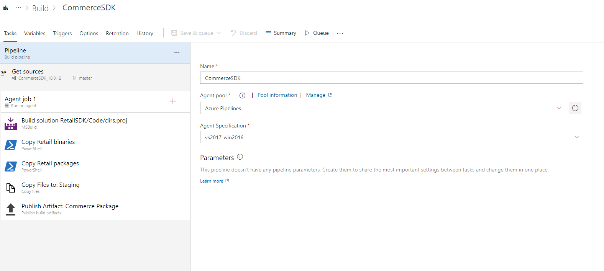
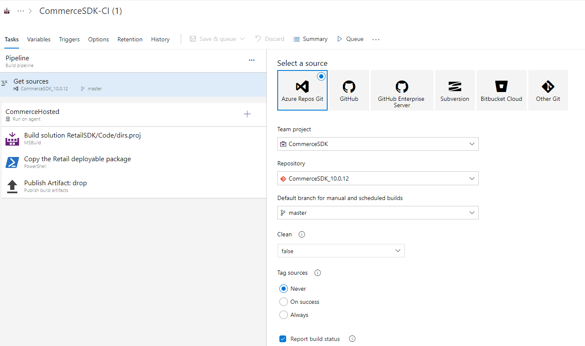
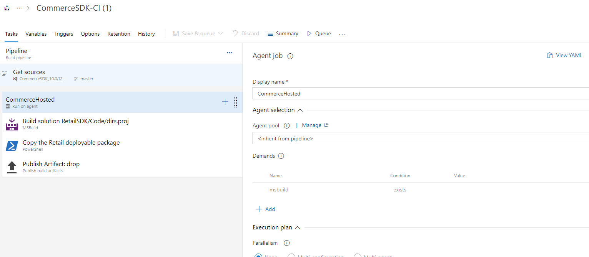
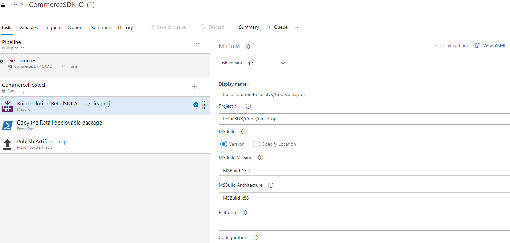
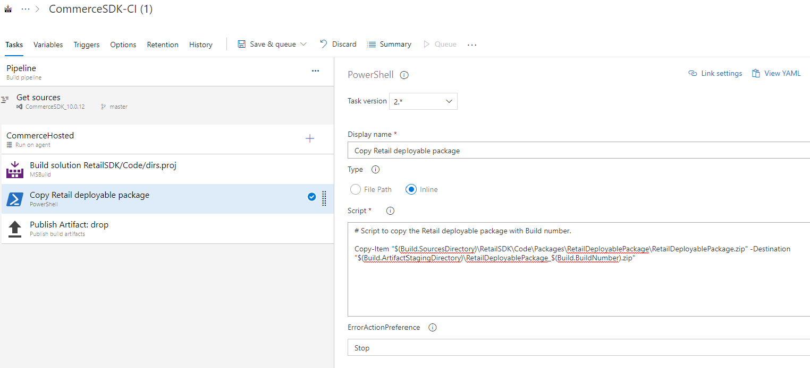
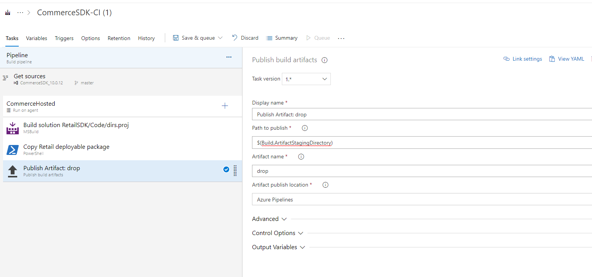
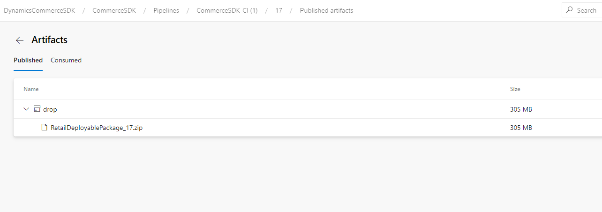

---
# required metadata

title: Setup Commerce SDK build pipeline.
description: This document walkthrough the steps required to setup the Azure DevOps build pipeline for the Retail SDK.
author: mugunthanm 
manager: AnnBe
ms.date: 06/10/2020
ms.topic: article
ms.prod: 
ms.service: dynamics-365-commerce
ms.technology: 

# optional metadata

# ms.search.form: 
# ROBOTS: 
audience: Developer
# ms.devlang: 
ms.reviewer: rhaertle
ms.search.scope: Operations, Retail 
# ms.tgt_pltfrm: 
ms.custom: 
ms.assetid: 
ms.search.region: global
ms.search.industry: Retail
ms.author: mumani
ms.search.validFrom: 2020-06-10
ms.dyn365.ops.version: 10.0.11
---

# Setup Commerce SDK build pipeline

[!include [banner](../../includes/banner.md)]

This document walkthrough the steps required to setup the Azure DevOps build pipeline for the Retail SDK using the Azure DevOps build agent (Microsoft hosted agent). 
For generating the build for Retail SDK, dedicated build machine is not required it will work with Azure DevOps build agent. This topic is applicable for Retail SDK version 10.0.11 or greater. 

## Prerequisite:

The Retail SDK must be added to Azure Repos Git, GitHub or VSTS. The Retail SDK is available in-Service volume drive of the LCS dev VM. Follow the steps mentioned in [this doc](https://docs.microsoft.com/en-us/dynamics365/fin-ops-core/dev-itpro/dev-tools/access-instances) to provision a development VM in LCS.

## Steps to setup a build pipeline in Azure DevOps:

1.	Select Pipeline in Azure DevOps and click New pipeline.
2.	Select your source repo.
3.	Click the Pipeline and provide a name for your pipeline. Choose the Agent pool as Azure pipeline and Agent specification as vs2017-win2016.



4. In the Get sources tab, select the RetailSDK Repo.



5. In the Agent job, provide some display name and in Agent pool select <inherit from pipeline>
    

    
6. In the task steps, add msbuild task and select the Project as RetailSDK\dirs.proj or RetailSDK\Code\dirs.proj depends on how the Retail SDK is structured. Set the MSBuild version as MSBuild 15.0 and MSBuild Architecture as MsBuild x86.



7.	Add PowerShell (Run PowerShell script on Linux, macOS or Windows) task and give some name and select the Type as Inline.
8.	In the PowerShell script section, copy and paste the below script:

```Powershell
    # Script to copy the Retail deployable package with Build number.

    Copy-Item "$(Build.SourcesDirectory)\RetailSDK\Code\Packages\RetailDeployablePackage\RetailDeployablePackage.zip" -Destination
    "$(Build.ArtifactStagingDirectory)\RetailDeployablePackage_$(Build.BuildNumber).zip"
```



9. Add Publish build artifact task, provide the display name, drop name, and set the Path to publish field value as $(Build.ArtifactStagingDirectory)



10.	Save the changes and queue the build.
11.	Once the build is completed, the Retail deployable package will be available for download in the Published Artifacts.



## Sample Yaml script for the pipeline:

```Powershell
pool:
  name: Azure Pipelines
  demands: msbuild

steps:
- task: MSBuild@1
  displayName: 'Build solution RetailSDK/Code/dirs.proj'
  inputs:
    solution: RetailSDK/Code/dirs.proj
    msbuildVersion: 15.0

- powershell: |
   # Script to copy the Retail deployable package with Build number.
   
   Copy-Item "$(Build.SourcesDirectory)\RetailSDK\Code\Packages\RetailDeployablePackage\RetailDeployablePackage.zip" -Destination
   "$(Build.ArtifactStagingDirectory)\RetailDeployablePackage_$(Build.BuildNumber).zip"
   
  displayName: 'Copy the Retail deployable package'

- task: PublishBuildArtifacts@1
  displayName: 'Publish Artifact: drop'
```
    
    
