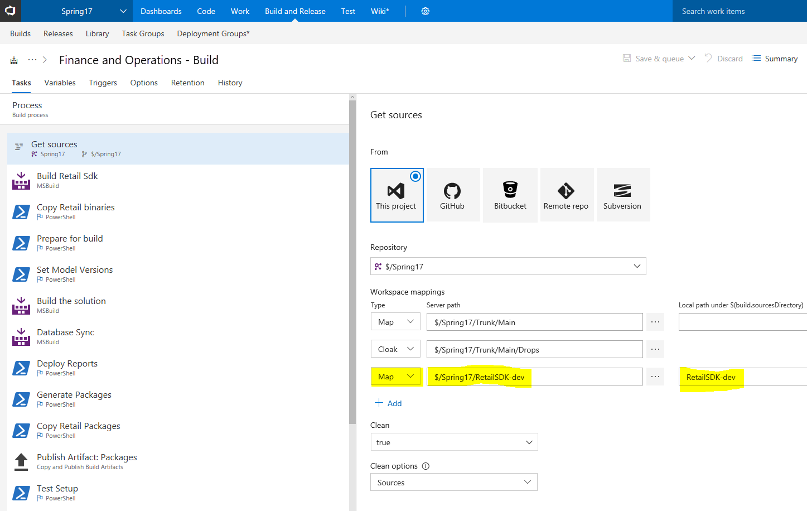
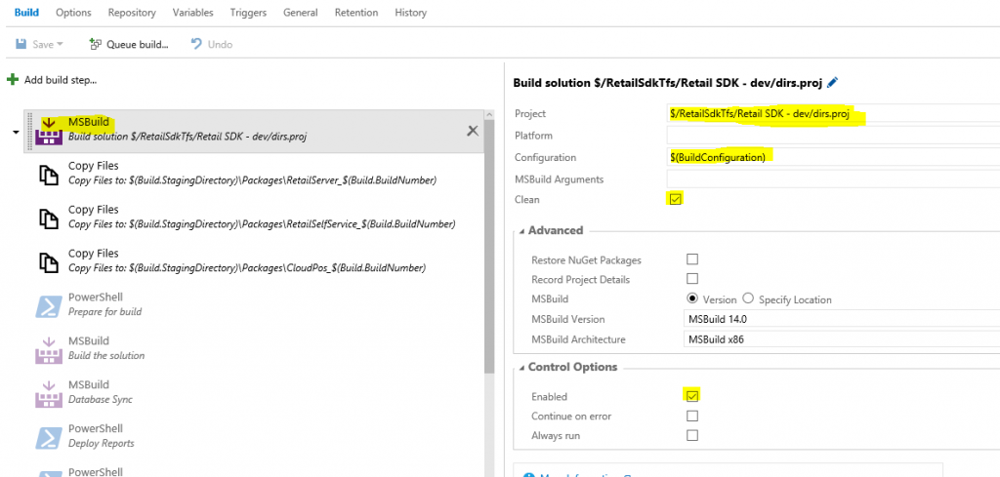
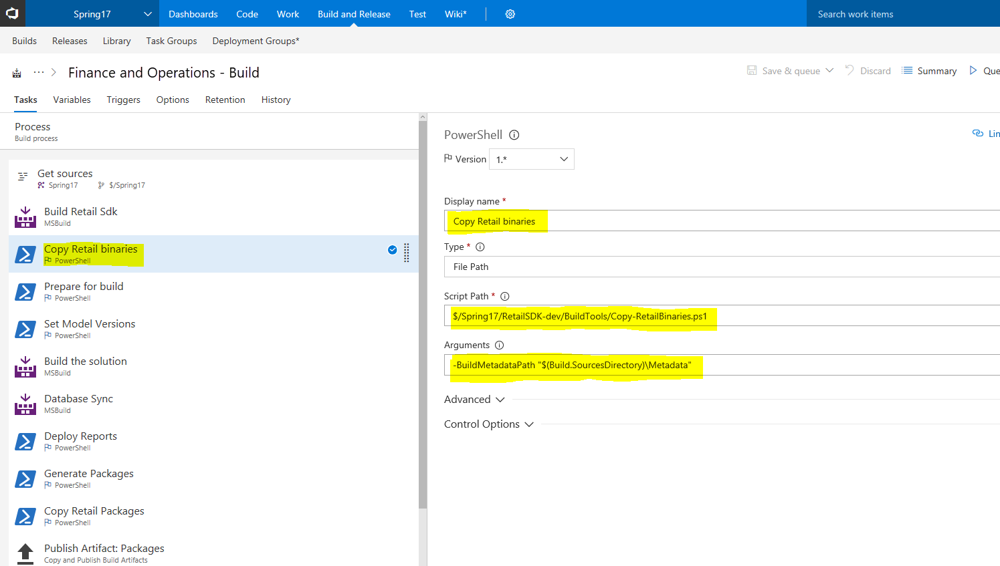
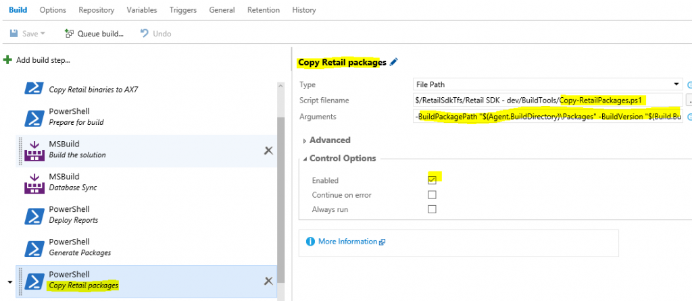

---
# required metadata

title: Merge the build systems for Commerce and Finance
description: This topic describes the steps for merging the build systems for both Dynamics 365 Commerce and Dynamics 365 Finance using Azure DevOps.  
author: andreash1
manager: AnnBe
ms.date: 02/06/2019
ms.topic: article
ms.prod: 
ms.service: dynamics-365-retail
ms.technology: 

# optional metadata

# ms.search.form: 
# ROBOTS: 
audience: Developer
# ms.devlang: 
ms.reviewer: rhaertle
ms.search.scope: Operations, Retail
# ms.tgt_pltfrm: 
ms.search.region: Global
# ms.search.industry: 
ms.author: andreash
ms.search.validFrom: 2016-02-28
ms.dyn365.ops.version: AX 7.0.0, Retail July 2017 update

---

# Merge the build systems for Commerce and Finance

[!include [banner](../../includes/banner.md)]


This topic describes the steps for merging the build systems for Dynamics 365 Commerce and Dynamics 365 Finance. The Lifecycle Services (LCS)-integrated build experience supports both code upgrades and new projects. The Commerce software development kit (SDK) is a self-contained MSBuild-based build system. Many customizers want to make productive changes in both Microsoft Commerce and Finance components. This topic outlines the manual steps for merging both build systems using Azure DevOps. 


## Enable the build system

To get started, you must follow all the steps to get a full continuous build system up and running. For information, see [Developer topology deployment with continuous build and test automation](../../../dev-itpro/perf-test/continuous-build-test-automation.md). After deployment, you create the build definition and build steps. Build at least one time, so that you become familiar with it and are sure that you can build without errors. Then move to the next step.

## Prepare the Retail SDK

### Getting the Retail SDK

If you don't already have the Retail SDK in the same Microsoft Azure DevOps project, add it now. You will find the SDK in any developer or build topology. Follow the branching documentation in [Retail software development kit (SDK) architecture](retail-sdk-overview.md). We recommend that you create your Retail SDK mirror and your SDK customization branch at this time. After your SDK customization branch is ready, and it has been submitted in the same Azure DevOps project as Commerce, you can start.

## Install NuGet.exe 

Some of the dependency packages and references have moved to NuGet packages to minimize the file merge and the size of the SDK. These are available for download from the NuGet.org. When you build the Retail SDK these dependencies are automatically pulled from the NuGet.org based on the packages.config file. For this to work, you need to install the [NuGet command line interface](https://docs.microsoft.com/nuget/tools/nuget-exe-cli-reference#installing-nugetexe) and add the nuget to the Windows path after downloading nuget.exe from NuGet.org. The following steps show how to add the nuget to the Windows path:

1. Open the Windows menu and type **Path**. The **Edit the system environment variables** will be available. 
2. In that menu, click **Environment variables** on the lower right.
3. In the next window, under **System variables**, select **Path** and click **Edit**.
4. Add an entry for the folder where you would like to store the nuget.exe file or store the nuget.exe file in a folder that is already listed.

## Add a repository mapping for the Retail SDK

Edit the build definition so that it includes the location of the Retail SDK. (In other words, add a map.)

[](./media/build-map-addition.png)

## Add a new build step to build the Retail SDK

Add a new step at the beginning of the build pipeline, as shown in the following screen shot.

[](./media/new-build-step.png)

## Add a copy step for binaries from the Retail SDK to the Commerce build

This build step enables Microsoft to copy the latest built Commerce binaries to the Commerce bin folder, if Microsoft shares files/binaries. Make sure that you complete this step immediately after you add a build step for the Retail SDK, as described in the previous section.

[](./media/binary-drop-to-ax.png)

## Add a copy step for all Commerce packages

Make sure that this step occurs after the "PowerShell: Generate packages" step (see image below). Here are the arguments.

```
-BuildPackagePath "$(Agent.BuildDirectory)\Packages" -BuildVersion "$(Build.BuildNumber)"
```

[](./media/package-drop.png)

## Optional: Referencing a Commerce DLL

You must complete this task only if you must add built Retail binaries to the Retail package. In this case, you must follow these three steps:

1. Use a normal AXReference in your Commerce project.
2. Add the corresponding AXReference folder and the XML file inside it to Azure DevOps.
3. Update the Copy-RetailBinaries.ps1 file with the appropriate file commands to get the binary file from the Retail SDK to the Retail bin folder. The Microsoft Windows PowerShell file includes a sample that copies the PricingEngine.dll file into the ApplicationSuite bin folder. Depending on the modules that you're building, the files and folders must be changed so that they are in a different location.
