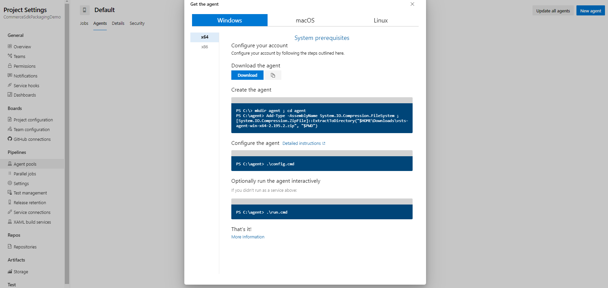
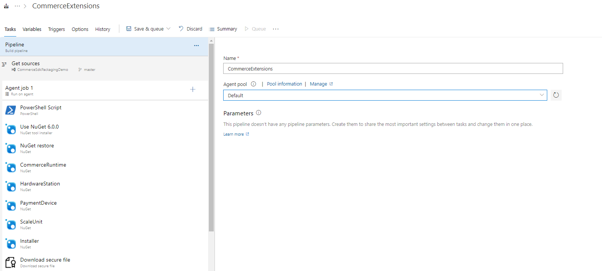

# Set up a Visual Studio 2017 build agent to build Modern POS

[!include [banner](../../includes/banner.md)]
[!include [banner](../../includes/retail-sdk-deprecation-banner.md)]

This article explains how to set up a self-hosted Microsoft Visual Studio build agent to build Dynamics 365 Commerce Modern POS (MPOS) in an Azure DevOps pipeline.

## Create and configure the self-hosted Visual Studio build agent to build MPOS extensions in an Azure DevOps build pipeline

To create and configure the self-hosted Visual Studio build agent to build MPOS extensions in an Azure DevOps build pipeline, follow these steps.

1. In the Azure portal, [create a new virtual machine (VM)](/azure/virtual-machines/windows/quick-create-portal) that uses the Windows Server 2022 Datacenter image.

    > [!NOTE]
    > You don't have to provision a new VM. You can use the existing VMs or build VMs that have been provisioned in Microsoft Dynamics Lifecycle Services (LCS).

1. On the VM, install Visual Studio 2017 and other prerequisites. For more information, see [Retail software development kit (SDK)](retail-sdk-overview.md#prerequisites).
1. In the Azure DevOps project, create a personal access token to authenticate the agent. For more information, see [Authenticate with a personal access token (PAT)](/azure/devops/pipelines/agents/v2-windows?view=azure-devops#authenticate-with-a-personal-access-token-pat&preserve-view=true).
1. Download the build agent, and install it on the VM that you created. For detailed information about how to download and configure the agent, see [Download and configure the agent](/azure/devops/pipelines/agents/v2-windows?view=azure-devops#download-and-configure-the-agent&preserve-view=true).

    

1. Update the Azure DevOps pipeline so that it uses the new build agent pool. In the pipeline, in the **Agent pool** field, select the agent pool where you added the build agent that you configured earlier.

    

    > [!NOTE]
    > The same build agent can be used to build other Dynamics 365 Commerce extensions.

1. Save the pipeline, and validate the changes by queuing a new build.

## Frequently asked questions

### Why can't I use an Azure DevOps hosted agent?

Only Visual Studio 2017 can be used to compile MPOS. If you're using an Azure DevOps build pipeline, the build agent specification must be **vs2017-win2016**. As of March 2022, the Windows Server 2016 image that includes Visual Studio 2017 will be deprecated. This deprecation will affect Azure DevOps pipelines that use that build agent. You will no longer be able to build and package MPOS extensions.

To mitigate this issue, use a [self-hosted build agent in the Azure DevOps build pipeline](/azure/devops/pipelines/agents/v2-windows?view=azure-devops&preserve-view=true) to build MPOS extensions.
