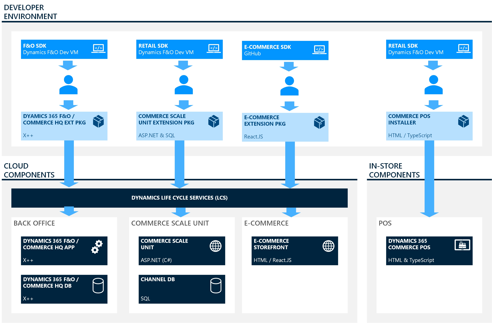
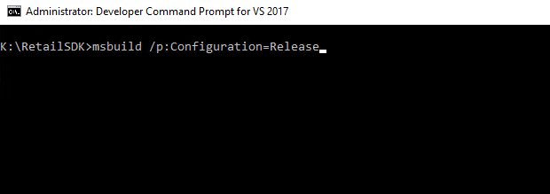
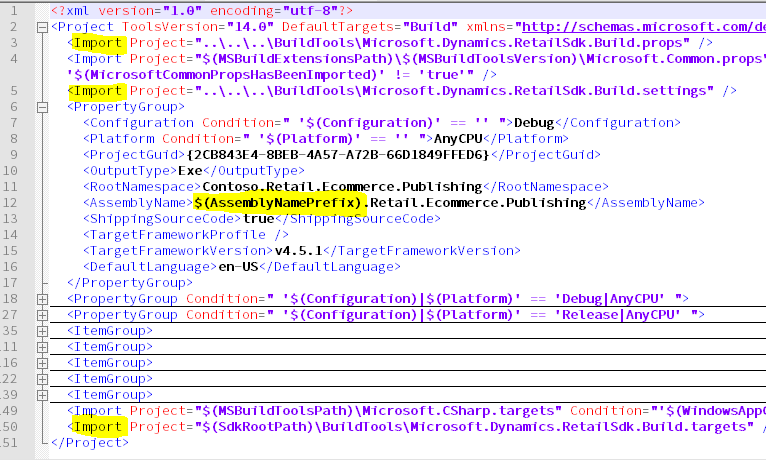
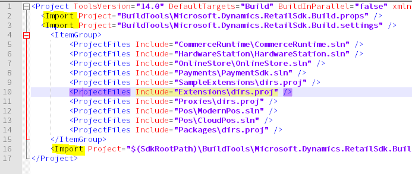
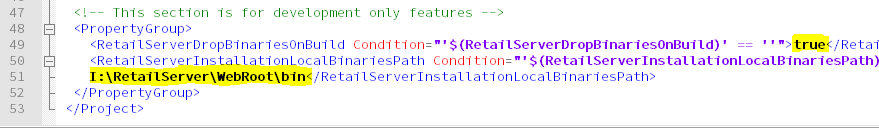
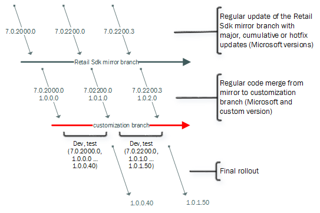

# Retail software development kit (SDK)

[!include [banner](../../includes/banner.md)]
[!include [banner](../../includes/retail-sdk-deprecation-banner.md)]

This article provides an overview of the Retail software development kit (SDK). Microsoft Dynamics 365 Commerce provides a rich SDK that developers can use to customize and add new features to the product. The multi-tier architecture of the Dynamics 365 Commerce provides simplified options for customizing and extending the client, business logic, and data layers independently of each other. The Retail SDK includes libraries, NuGet packages, a point of sale (POS) application, code samples, templates, and tools. You can use it to create extensions apps, add features, and change existing functionality of Commerce.

## Retail SDK overview

The Retail SDK includes the code, code samples, templates, and tools that are required to extend or customize existing Commerce functionality. The SDK supports rapid development, full MSBuild integration, and package generation. The following image shows the relationship between the development environment and the cloud components.



> [!NOTE]
> The Retail SDK supports the Transport Layer Security (TLS) 1.2 standard. Any customization that you build by using the Retail SDK should follow the TLS 1.2 standard.

## Download the Retail SDK

> [!NOTE]
> If you are using Dynamics 365 Commerce application version 10.0.18 or later, use the SDK reference packages from the [public feed](https://pkgs.dev.azure.com/commerce-partner/Registry/_packaging/dynamics365-commerce/nuget/v3/index.json). Also use the sample templates from the following GitHub repository (this is not required to use the SDK from the LCS Development machine). 
> 
> [Commerce Scale unit Sample repo](https://github.com/microsoft/Dynamics365Commerce.ScaleUnit)
> 
> [Commerce Instore components Sample repro](https://github.com/microsoft/Dynamics365Commerce.InStore)
> 
> [Public feed for reference package](https://pkgs.dev.azure.com/commerce-partner/Registry/_packaging/dynamics365-commerce/nuget/v3/index.json)

The Retail SDK is available in development environments that are provisioned via Microsoft Dynamics Lifecycle Services (LCS), in the virtual hard disks (VHDs) that are downloaded from LCS, and in hotfix packages that are deployed to the LCS environment. For more information, see [Deploy and access development environments](../../../fin-ops-core/dev-itpro/dev-tools/access-instances.md) and [Apply updates to cloud environments](../../../fin-ops-core/dev-itpro/deployment/apply-deployable-package-system.md).

> [!NOTE]
> In release 10.0.21, the development VM in LCS will not include Visual Studio 2017 and other dependencies that are required for Commerce development. Install the prerequisites manually or by running MSBuild from the Retail SDK. Use the developer command prompt for Visual Studio 2019 to run the MSBuild command if Visual Studio 2017 tools are not installed in the VM. This will install all the prerequisites but POS build will not work with Visual Studio 2019 developer command prompt, it will fail with error saying POS doesn’t support Visual Studio 2019 .To fix this issue, after the prerequisites installation is complete, open the developer command prompt for Visual Studio 2017 and run MSBuild.  Or, you can use PowerShell to run the checkVS2017Installed.ps1 script in RetailSDK\BuildTools to install the Visual studio tools for 2017 and then use the developer command prompt for Visual Studio 2017 to install the prerequisites and build the SDK.

To access the Retail SDK, sign in to the development virtual machine (VM), and go to the K:\\RetailSDK folder. You can obtain new versions of the Retail SDK by applying any Commerce binary hotfix from LCS to the development environment. After hotfix deployment is completed, you can find the new version of the SDK inside the K:\\RetailSDK\\Update folder.

If the current version of the Retail SDK contains extensions, the configuration files and extension projects must be merged from the previous version of the SDK to the new version after an upgrade. This merge is required only if your previous version of the SDK includes extensions, and those extensions must be migrated to the new version. For more information and detailed instructions, see [Upgrade the Retail channel extension to the latest Retail SDK](../RetailSDK-update.md). We recommend that you integrate the SDK with a source control system such as Git or Azure.

## Full MSBuild integration

The Retail SDK is a build system. A simple MSBuild command from the root of the SDK folder builds everything. This functionality eliminates questions about how you should build and where you should build from. It also ensures consistency and reproducibility. Therefore, the Retail SDK can easily be integrated with a build pipeline such as Azure Pipelines. For more information, see [Set up Commerce SDK build pipeline](SDK-build-pipeline.md).

## Prerequisites

To develop or build extensions by using the Retail SDK, you must have the following components:

- Visual Studio 2017 Community, Professional, or Enterprise edition (VM) that has the following components:

    - .NET Desktop development
    - Universal Windows Platform development
    - ASP.NET and web development
    - Azure development
    - Node.js development
    - .NET Core cross-platform development
    - Mobile development with .NET (required for hybrid app development)

- The following SDK and runtimes:

    + [sdk-2.1.202-windows-x64-installer](https://dotnet.microsoft.com/download/dotnet-core/thank-you/sdk-2.1.202-windows-x64-installer)
    + [sdk-2.1.513-windows-x64-installer](https://dotnet.microsoft.com/download/dotnet-core/thank-you/sdk-2.1.513-windows-x64-installer)
    + [runtime-2.0.9-windows-x64-installer](https://dotnet.microsoft.com/download/dotnet-core/thank-you/runtime-2.0.9-windows-x64-installer)
    + [runtime-2.1.17-windows-x64-installer](https://dotnet.microsoft.com/download/dotnet-core/thank-you/runtime-2.1.17-windows-x64-installer)
    + [.NET Core 3.1 SDK](https://dotnet.microsoft.com/download/dotnet/thank-you/sdk-3.1.412-windows-x64-installer)
    + [Windows SDK (10.0.10586.0)](https://go.microsoft.com/fwlink/p/?LinkID=698771)
    + TypeScript version 2.2.2

Visual Studio 2017 has TypeScript 3.1 as the default version. You must install version 2.2.2 because the POS app is based on that version. In Visual Studio, select **Tools \> Get Tools and Features**. On the **Individual components** tab, select the **TypeScript 2.2 SDK from SDKs, libraries, and frameworks** section, and install it.

- .NET Developer Pack:
    +  [.NET Framework 4.5.1](https://dotnet.microsoft.com/download/dotnet-framework/thank-you/net451-developer-pack-offline-installer)
    +  [.NET Framework 4.6.2](https://dotnet.microsoft.com/download/dotnet-framework/thank-you/net462-developer-pack-offline-installer)
    +  [.NET Framework 4.7.2](https://dotnet.microsoft.com/download/dotnet-framework/thank-you/net472-developer-pack-offline-installer)
    
- [Web Deploy v3.6 ](https://www.microsoft.com/download/confirmation.aspx?id=43717)


If the SDK compilation fails with the following error message, "The current .NET SDK does not support targeting .NET Standard 2.0", try installing the x86 version of the .NET 2.1 SDK and runtime.
+ [.NET Core 2.1 SDK](https://dotnet.microsoft.com/download/dotnet/thank-you/sdk-2.1.524-windows-x86-installer)
+ [.NET Core 2.1 Runtime](https://dotnet.microsoft.com/download/dotnet/thank-you/runtime-2.1.28-windows-x86-installer)

## Build the Retail SDK

Before you start development via the Retail SDK, you must restore all the packages by using MSBuild to do a full build from the root of the SDK folder.

1. Open the developer Command Prompt window for Visual Studio 2017 or the MSBuild 15.0 Command Prompt window.
2. In the Command Prompt window, go to the Retail SDK folder.
3. Run the **msbuild /t:rebuild** command from the root of the SDK folder. The dirs.proj file in the root of the SDK folder (RetailSDK\\dirs.proj or RetailSDK\\Code\\dirs.proj) contains all the details that are required to build the full SDK.

### MSBuild arguments to skip the prerequisites check

MSBuild will check whether the required dependencies are installed for Commerce development. If the dependencies are not found, then the MSBuild scripts will try to install the missing dependencies. This check will occur every time MSBuild runs. To skip this check, pass the following arguments as false:

MSBuild /p:CheckVS2017Installed=false /p:CheckVSDependencies=false – Build argument added in release 10.0.18

MSBuild /p:InstallDotNetRuntimeSdkdependencies=False – Build argument added in release 10.0.22

 

## Retail SDK components

The following table shows the folders that the Retail SDK contains to help with extension development. The folder structure and descriptions in this table are based on Retail SDK version 10.0.13.

<table>
<thead>
<tr>
<th>Folder or file</th>
<th>Description</th>
</tr>
</thead>
<tbody>
<tr>
<td>Assets</td>
<td>This folder contains scripts and configuration files that are required for packaging. Only these configuration files (HardwareStation.Extension.config, RetailProxy.MPOSOffline.ext.config, CommerceRuntime.Ext.config, and CommerceRuntime.MPOSOffline.Ext.config) can be edited so that they include extension binary details for packaging.
<ul>
<li><strong>manifest.json</strong> – The SDK binary version.</li>
</ul>
</td>
</tr>
<tr>
<td>BuildTools</td>
<td>This folder contains scripts, sample certificates, and a Customization.settings (packaging metadata) file. Don't change any files in this folder, except Customization.settings.
</td>
</tr>
<tr>
<td>Database</td>
<td>This folder contains shared database scripts. Extensions must copy the extension scripts to the Database\Upgrade\Custom folder.</td>
</tr>
<tr>
<td>Documents</td>
<td>This folder contains instructions for running some of the samples.</td>
</tr>
<tr>
<td>OnlineStore</td>
<td>This folder contains the end-to-end sample e-Commerce storefront solution that was built by using the Retail proxy.</td>
</tr>
<tr>
<td>Packages</td>
<td>The Retail deployable package that is generated after the SDK build for packaging will be copied to this folder (Packages\RetailDeployablePackage). The Retail deployable package is deployed to different environments (test, sandbox, and production) by using LCS.</td>
</tr>
<td>PaymentExternals</td>
<td>Extension payment assemblies must be copied. The following three subfolders hold various payment files:
<ul>
<li><strong>IPaymentProcessor Assemblies</strong> – This folder contains the assembly that implements the <strong>IPaymentProcessor</strong> interface and its dependent assemblies.</li>
<li><strong>Payment Web Files</strong> – This folder contains the callback HTML, JavaScript, or Cascading Style Sheets (CSS) files that are required to make the payment accepting page available. Payment connector developers will provide these web files if their payment accepting page requires them.</li>
<li><strong>IPaymentDevice Assemblies</strong> – This folder contains the assembly that implements the <strong>IPaymentDevice</strong> interface and payment request handlers, and the interface's dependent assemblies. These assemblies are used in Retail Hardware station and Retail Modern POS to communicate with payment terminal devices.
<p>Additionally, all extensions that are related to payment connectors should be put in this folder before you create the deployment packages.</p></li>
</ul>
</td>
</tr>
<tr>
<td>Payments</td>
<td>The folder contains the sample Payment Connector project for E-Commerce Add-in for Dynamics 365 Commerce.</td>
</tr>
<tr>
<td>pkgs</td>
<td>This folder contains all the NuGet packages (reference libraries) that are required to build the extension projects and tools for packaging and Retail proxy generation.</td>
</tr>
<tr>
<td>POS</td>
<td>This folder contains the POS app and extension project:
<ul>
<li><strong>App</strong> – Modern POS–specific views and other items.</li>
<li><strong>Contracts</strong> – Public contracts for POS extensions. Extension can consume only these contracts for POS extensions.</li>
<li><strong>Extensions</strong> – Sample Extension projects and POS.Extension project that extension can consume.</li>
<li><strong>Folder SharedApp</strong> – POS views that are shared between Cloud POS and Modern POS.</li>
<li><strong>Folder Web</strong> – Cloud POS–specific views and other items.</li>
<li><strong>CloudPos.sln</strong> – The Cloud POS solution file.</li>
<li><strong>ModernPos.sln</strong> – The Modern POS solution file.</li></li>
</ul>
</td>
</tr>
<tr>
<td>References</td>
<td>This folder serves as the single location where all binaries are stored. It's used to resolve every project's binary references. The list of files includes external non-Commerce binaries and also Microsoft Commerce binaries. Additionally, this folder serves as the global drop location for any binaries that are built from the Retail SDK.</td>
</tr>
<tr>
<td>SampleExtensions</td>
<td>This folder contains the sample projects and templates for extensions:
<ul>
<li><strong>CommerceRuntime</strong> – Sample extension projects for business logic extensions (Commerce runtime [CRT] triggers, handlers, and new service extension).</li>
<li><strong>HardwareStation</strong> – Sample Hardware station extension projects.</li>
<li><strong>HybridApp</strong> – Android and iOS shell apps for the POS. Extension can build these apps and deploy them to the Android and iOS platforms.</li>
<li><strong>OnlineStore</strong> – The sample online storefront app.</li>
<li><strong>RetailProxy</strong> – The sample C# proxy project for POS offline mode. As of version 10.0.11, the C# proxy is obsolete (deprecated). The Headless Commerce  extension libraries can be used directly in offline mode. You don't have to have separate proxy libraries.</li>
<li><strong>RetailServer</strong> – Sample Headless Commerce extension projects.</li>
<li><strong>SampleExtensionsTest</strong> – The sample project for creating an extension test project.</li>
<li><strong>ShoppingApp</strong> – The sample mobile app (Retailer shopping app) for users in Android and iOS.</li>
<li><strong>TypeScriptProxy</strong> – Sample proxy projects that show how to generate TypeScript for the POS.</li>
</ul>
</td>
</tr>
<tr>
<td>dirs.proj</td>
<td>This project file directs the build order.</td>
</tr>
<tr>
<td>Microsoft-version.txt</td>
<td>This file includes the Microsoft application version of the Retail SDK.</td>
</tr>
</tbody>
</table>

## Extension components in the Retail SDK

The following tables provide information about the components in the Retail SDK that must be customized for different scenarios. Only the sample projects inside the RetailSDK\\SampleExtensions folder can be changed for extension purposes. No other files or projects/scripts in the Retail SDK should be changed.

### Client (POS)

<table>
<tbody>
<tr>
<th>Scenario</th>
<td>Extend the POS for user experience (UX) changes, client logic, workflows, and simple validations.</td>
</tr>
<tr>
<th>Commerce SDK reference</th>
<td>\RetailSDK\POS
<p>Open the ModernPos.sln or CloudPos.sln file, and add an extension to the POS.Extension project. Don't change anything in the core POS app/web projects.</p>
</td>
</tr>
<tr>
<th>Technology</th>
<td>TypeScript, HTML, and CSS</td>
</tr>
<tr>
<th>Documentation</th>
<td><a href="../pos-run-samples.md">Run the point of sale (POS) samples</a></td>
</tr>
</tbody>
</table>

### CRT

<table>
<tbody>
<tr>
<th>Scenario</th>
<td>Extend CRT to add or change business logic (for example, logic for calculating tax, prices, or discounts).</td>
</tr>
<tr>
<th>Commerce SDK reference</th>
<td>\RetailSDK\SampleExtensions\CommerceRuntime
<p>Open the CommerceRuntimeSamples.sln file.</p>
</td>
</tr>
<tr>
<th>Technology</th>
<td>C#</td>
</tr>
<tr>
<th>Documentation</th>
<td><a href="../commerce-runtime-extensibility.md">Commerce runtime (CRT) and Retail Server extensibility</a></td>
</tr>
</tbody>
</table>

### Headless Commerce APIs

<table>
<tbody>
<tr>
<th>Scenario</th>
<td>Create a Headless Commerce API extension to expose new Commerce APIs to the client.</td>
</tr>
<tr>
<th>Commerce SDK reference</th>
<td>\RetailSDK\SampleExtensions\RetailServer
<p>Open any of the sample extensions inside the RetailServer folder.</p>
</td>
</tr>
<tr>
<th>Technology</th>
<td>Open Data Protocol (OData) and C#</td>
</tr>
<tr>
<th>Documentation</th>
<td><a href="../retail-server-icontroller-extension.md">Create a new Retail Server extension API (Retail SDK version 10.0.11 and later)</a>
</td>
</tr>
</tbody>
</table>

### TypeScript proxy

<table>
<tbody>
<tr>
<th>Scenario</th>
<td>A TypeScript proxy is required if new Headless Commerce API extensions must be consumed in the POS or E-Commerce clients.</td>
</tr>
<tr>
<th>Commerce SDK reference</th>
<td>\RetailSDK\SampleExtensions\RetailServer
<p>Open any of the sample extensions inside the RetailServer folder.</p>
</td>
</tr>
<tr>
<th>Technology</th>
<td>OData and C#</td>
</tr>
<tr>
<th>Documentation</th>
<td><a href="../retail-server-icontroller-extension.md">Create a new Retail Server extension API (Retail SDK version 10.0.11 and later)</a>
</td>
</tr>
</tbody>
</table>

### Hardware station

<table>
<tbody>
<tr>
<th>Scenario</th>
<td>A Hardware station is required to add or change logic that is related to peripherals.</td>
</tr>
<tr>
<th>Commerce SDK reference</th>
<td>\RetailSDK\SampleExtensions\HardwareStation
<p>Open the HardwareStationSamples.sln file.</p>
</td>
</tr>
<tr>
<th>Technology</th>
<td>C#</td>
</tr>
<tr>
<th>Documentation</th>
<td><a href="../hardware-device-extension.md">Integrate POS with a new hardware device</a></td>
</tr>
</tbody>
</table>

### Payment connector

<table>
<tbody>
<tr>
<th>Scenario</th>
<td>Integrate the POS with a new payment connector.</td>
</tr>
<tr>
<th>Commerce SDK reference</th>
<td>\RetailSDK\SampleExtensions\HardwareStation\\Extension.PaymentSample
<p>Open the HardwareStation.Extension.PaymentSample.sln file.</p>
</td>
</tr>
<tr>
<th>Technology</th>
<td>C#</td>
</tr>
<tr>
<th>Documentation</th>
<td><a href="../end-to-end-payment-extension.md">Create an end-to-end payment integration for a payment terminal</a></td>
</tr>
</tbody>
</table>

## Best practices for naming

The C\# source code in the Retail SDK uses the Contoso namespace. Therefore, it's easier to distinguish Microsoft types and extension types. If your extension code references a type from the Microsoft binary, use **Microsoft.Dynamics** for the reference, to distinguish between Microsoft libraries and the libraries from the extension. The extension libraries must not begin with the **Microsoft.Dynamics** name.

## Deployment packages

After extension development (CRT, Retail Server, database scripts, POS, and Hardware station), you can use the Retail SDK to generate deployment packages. Packages can be deployed to test, sandbox, and production environments. For more information, see [Create deployable packages](retail-sdk-packaging.md).

## Dependencies, build order, and full builds

You should build all the extensions and required out-of-box projects. ([Use MSBuild to do a full build from the root of the SDK folder](#build-the-retail-sdk).)

- You should build your extension, POS, and packaging projects, but you don't have to build the sample projects that are included in the Retail SDK. You can edit the dirs.proj file in the Retail SDK to remove unwanted sample projects, but don't remove the packaging and POS projects from the list.
- Include the extension project in the dirs.proj file of the appropriate folder. In that way, when you run MSBuild from the root of the SDK folder, all the extension and required out-of-box projects are built.
- The dirs.proj file in the root of the SDK folder is sequenced in the correct order to build all the required projects and then the packaging project. The sequence must be correct. Otherwise, the project and dependencies won't be built correctly.

## Regular configuration/code signing

For Modern POS, create an app package signing certificate to build correctly, or use Cloud POS. For information about how to create a PFX file, see [Create a certificate for package signing](/windows/msix/package/create-certificate-package-signing). Then copy the PFX file to the BuildTools folder, and update the BuildTools\\Customization.settings file with the correct name by using the **ModernPOSPackageCertificateKeyFile** element.

The BuildTools\\Customization.settings file holds most of the configuration values for the Retail SDK. 

```xml
<!-- This section is for global settings and code signing. Any build file will inherit these values if applicable.
also use these values during package generation. -->
<AssemblyNamePrefix>MyCompany</AssemblyNamePrefix>
<CustomAssemblyVersion Condition="'$(CustomAssemblyVersion)' == ''">1.0.0.0</CustomAssemblyVersion>
<CustomVersion Condition="'$(CustomVersion)' == ''">1.0.0.1</CustomVersion>
<CustomName Condition="'$(CustomName)' == ''">MyCompany Retail Customization</CustomName>
<CustomDescription Condition="'$(CustomDescription)' == ''">MyCompany Retail Customization</CustomDescription>
<CustomPublisher Condition="'$(CustomPublisher)' == ''">MyCompany Ltd.</CustomPublisher>
<CustomCopyright Condition="'$(CustomCopyright)' == ''">MyCompany (c) 2015</CustomCopyright>

<SignAssembly Condition="'$(SignAssembly)' == ''">true</SignAssembly>
<DelaySign Condition="'$(DelaySign)' == ''">false</DelaySign>
<AssemblyOriginatorKeyFile Condition="'$(AssemblyOriginatorKeyFile)' == '' and '$(SignAssembly)' == 'true'">
    $(MSBuildThisFileDirectory)\StrongNameSigningCert-Contoso.snk</AssemblyOriginatorKeyFile>

<ModernPOSPackageCertificateKeyFile Condition="'$(ModernPOSPackageCertificateKeyFile)' == ''">
    $(MSBuildThisFileDirectory)\ModernPOSAppxSigningCert-Contoso.pfx</ModernPOSPackageCertificateKeyFile>

<RetailServerLibraryPathForProxyGeneration Condition="'$(RetailServerLibraryPathForProxyGeneration)' == ''">
    $(SdkReferencesPath)\Microsoft.Dynamics.Retail.RetailServerLibrary.dll</RetailServerLibraryPathForProxyGeneration>
```

The following values are the global values. These values control how the build manages binaries, components, and how packages are named, versioned, and code-signed.

+ **AssemblyNamePrefix**
+ **CustomAssemblyVersion**
+ **CustomVersion**
+ **CustomName**
+ **CustomDescription**
+ **CustomPublisher**
+ **CustomCopyright**
+ **SignAssembly**
+ **AssemblyOriginatorKeyFile**
+ **ModernPOSPackageCertificateKeyFile**
+ **RetailServerLibraryPathForProxyGeneration**

It's a good practice to sign your assemblies by using a strong name, even though a strong name isn't required. For information about how to create your own key file if you don't already have one, see [How to: Create a public-private key pair](/dotnet/standard/assembly/create-public-private-key-pair).

The installer files that are generated for self-service components such as Modern POS, Hardware station, and Store scale unit can be signed by using [SignTool.exe](/windows/win32/seccrypto/signtool).

Both the key file for the strong name and the app package signing certificate can be stored inside the BuildTools folder or in Azure Key Vault. For a password-protected or secured certificate, use Azure Key Vault.

## Customizing the build

### Adding new projects

It's easy to add new projects to the Retail SDK's build system. You can either clone one of the many existing projects or start a new project. You just have to make some adjustments in a text editor, as shown in the following illustration. The relative path of the **Import** elements should be adjusted, and the **AssemblyName** element should use the predefined **AssemblyNamePrefix** property. These adjustments are required to get various tasks for free, such as versioning, code signing, uniform assembly naming, and automatic dropping to the References folder.



### Changing the build order or adding to the build

MSBuild traversal files (dirs.proj files) are used to build the whole directory tree of the Retail SDK. The following illustration shows the main traversal file of the Retail SDK. Similar files might also exist in subdirectories. Notice that Visual Studio solution files (.sln files) are similar to traversal files. Both types of file direct the MSBuild engine to process other build scripts.



After new code is added, most of it should be put in a new folder. You must also add it to the traversal structure by adding it to one or more dirs.proj files. In the previous illustration, the Extensions folder is highlighted on line 10. The quickest way to get started with a new dirs.proj file is to copy an existing file, correct the paths in the **Import** elements, and update the **ProjectFiles** elements in the **ItemGroup** element.

### Customizing build scripts

When you must implement new build steps, remember that the existing scripts might be updated by a Retail SDK update later. The best practice is to minimize edits to any file, or to add new files instead. If you require new global MSBuild properties, the BuildTools\\Microsoft.Dynamics.RetailSDK.Build.props file is a good place to add them. Likewise, the BuildTools\\Microsoft.Dynamics.RetailSDK.Build.targets file can be used to add new build processing targets.

If only one project requires special handling, it's better to explicitly make the change there. If you require new local MSBuild properties, add a local.props file in the same directory. Alternatively, if you require local build processing targets, add a local.targets file.

## Developer productivity

The **CommerceRuntime** and **RetailServer** extension dynamic-link libraries (DLLs) must be copied into the bin folder of the locally installed RetailServer web application. Users can configure the Customization.setting file so that the DLLs are automatically copied into the bin folder of the local RetailServer web application whenever new versions of these files are built from the extension project.



## Application Lifecycle Management

A good Application Lifecycle Management (ALM) solution provides version control, builds, automated builds, planning tools, tracking tools, dashboards, customization, and more. The organization of the Retail SDK supports these tasks.

### Branching and versioning

To work efficiently in a team, or even just to be able to go back and look at some changes that were made earlier, you must have a good branching strategy and versioning discipline. The following illustration shows a simple branching strategy that might work well for most teams. The version numbers are fictitious. For more information, see, [Adopt a Git branching strategy](/azure/devops/repos/git/git-branching-guidance).



### Retail SDK mirror branch

It's important to emphasize that the non-customized Retail SDK should be stored in your source control. You don't have to store every version, but the versions that your team wants to snap to should be added. (Those versions might be cumulative updates or hotfixes.) Only a simple merge of all changes (that is, additions, changes, and deletions) should be done. No other development work should occur in this branch. The Retail SDK has its own version. All Commerce binaries and packages that are included have the same version. The version can also be found in the root of the SDK folder, in a file that is named Microsoft-version.txt.

### Customization branch

For development, a new customization branch should be created. At the beginning of the initial branch-out, this branch will be an exact copy of the Retail SDK mirror branch. It's the branch that will be used for the team's development. The version of the customization branch must be incremented at least every time that a build is created for testing. It can even be incremented every day. The file version to increment is defined by using the **CustomVersion** property in the Customization.setting file. If you update the version and rebuild, all binaries, packages, and manifest files are updated accordingly.

The **CustomAssemblyVersion** property should be updated only when the update isn't backward-compatible and/or for major new releases. In other words, you should rarely update this property. In the previous illustration, the current file version of the customization branch is 1.0.2.\* (based on Microsoft version 7.0.2200.3). The file version of the first rolled-out release was 1.0.0.40 (based on Microsoft version 7.0.2000.0). When a testing phase is completed, and the final packages are being deployed with that version, it's important that you either increment the version or create a source control label.


[!INCLUDE[footer-include](../../../includes/footer-banner.md)]
