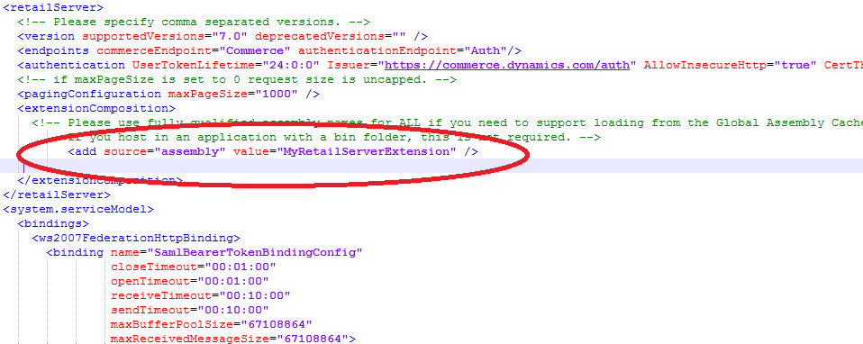

# Create deployable packages

[!include [banner](../../includes/banner.md)]

This article explains how to create a Commerce deployable package (which is a package that contain all the extensions) for the following components and deploy the package to your environment by using Microsoft Dynamics Lifecycle Services (LCS):

- Commerce runtime (CRT)
- Commerce proxy
- Commerce Scale Unit
- Modern POS
- Cloud POS
- Hardware station
- Channel database scripts
- Payment connector
- Hybrid app (IOS and Android POS app)

## Deployable package types

The following table lists Commerce package types for deployment:

| Package type                              | Description                            | Applies to                  |
|-------------------------------------------|----------------------------------------|--------------------------|
| Retail deployable package             | Combined package that contains Commerce scale unit (CRT, RS, DB) extension, CPOS, and self-service packages.     |   Commerce scale unit environment  |
| Commerce cloud scale unit package | Commerce scale unit (CRT, RS, DB) extension.  |  Commerce scale unit environment  |
| All in one deployable package                 | Payment extension for finance and operations. | Finance and operations environment  |

## Retail deployable package

Retail deployable package is one combined package that contains all your customizations together with all the metadata that is required for deployment. You can use this deployable package to deploy your customizations to various environments. You can do the deployment by using the automated flow in LCS, or you can do it manually by using the scripts that are provided inside the package. This article guides you through the process of generating the deployable package.

> [!IMPORTANT]
> All customizations for the Commerce components are packaged as a single deployable package. Separate packages for individual components, such as Modern POS, Cloud POS, Commerce Scale Unit, CRT are not supported. You must package all extensions as a single deployable package, even if you must merge or combine extensions from independent software vendors (ISVs) or various partners.
>
> If your customizations were built and packaged as individual component packages by using a version of the Retail software development kit (SDK) that is older than application version 7.1.1541.3036, the packages are no longer supported for deployment in LCS. You must uptake the hotfix in [KB 4015062](https://fix.lcs.dynamics.com/Home/Index/0/kb/4015062?permission=Download), and then rebuild and repackage your customizations.

For detailed information about the Retail SDK, see [Retail software development kit (SDK) architecture](retail-sdk-overview.md).

## Generate a separate package for Commerce Cloud Scale Unit (CSU)

If you have only CSU extension (CRT, RS, and channel database) then you can generate the separate CSU package instead of generating the full Retail Deployable package, which includes both CSU and self-service packages (MPOS, CPOS, RSSU and HWS). 

Retail SDK version 10.0.16 or later supports generating a separate package for Commerce Cloud Scale Unit. This package can be uploaded to **LCS > Asset library > Commerce Cloud Scale Unit Extensions** and deployed to CSU. 

### Steps to generate a CSU package

### Option 1

1.	Clone or download the Scale unit packaging project from [Dynamics365 Commerce ScaleUnit Samples](https://github.com/microsoft/Dynamics365Commerce.ScaleUnit).

Select the correct release branch version according to your SDK/application release. Detailed steps to clone can be in [Download Retail SDK samples and reference packages from GitHub and NuGet](sdk-github.md).

2.	Add the extension Commerce runtime, Retail server, and channel database extension project as a Project reference to the scale unit packaging project.
3.	If the CRT or Retail Server extension depends on any assemblies to execute, include those assemblies as project reference in the extension project. The packaging will include these assemblies in the ext folder. Do not add the dependent assemblies in the CommerceRuntime.Ext.config file. Adding the dependent assembly in the config file may cause runtime errors.
4.	Build the scale unit project. This project will generate the **CloudScaleUnitExtensionPackage.zip** output package in the project bin output folder. CloudScaleUnitExtensionPackage.zip package can be uploaded to LCS and deployed to Cloud Scale Unit.

Select the correct version of the **Microsoft.Dynamics.Commerce.Sdk.ScaleUnit** NuGet version in the NuGet package manager in Visual Studio according to your SDK/application version.

### Option 2

1.	Create a new C# class library project with Target framework .NET Standard 2.0.
2.	Add the **Microsoft.Dynamics.Commerce.Sdk.ScaleUnit** NuGet package as a dependency to the project.

Select the correct version of the Microsoft.Dynamics.Commerce.Sdk.ScaleUnit NuGet version according to your SDK/application version.

Consume the Microsoft.Dynamics.Commerce.Sdk.ScaleUnit package from [https://pkgs.dev.azure.com/commerce-partner/Registry/_packaging/dynamics365-commerce/nuget/v3/index.json](https://pkgs.dev.azure.com/commerce-partner/Registry/_packaging/dynamics365-commerce/nuget/v3/index.json). You can add the package source location in the nuget.config file of your extension project file.

```xml
<packageSources>
    <add key="dynamics365-commerce" value="https://pkgs.dev.azure.com/commerce-partner/Registry/_packaging/dynamics365-commerce/nuget/v3/index.json" />
    <add key="nuget.org" value="https://api.nuget.org/v3/index.json" />
    </packageSources>
```

3.	Add the extension Commerce runtime, Retail server, and channel database extension projects as a Project reference to the scale unit packaging project.
4.	If the CRT or Retail server extension depends on any assemblies to execute, include those assemblies as project reference in the extension project. The packaging will include these assemblies in the ext folder. Do not add the dependent assemblies in the CommerceRuntime.Ext.config file. Adding the dependent assembly in the config file may cause runtime errors.
5.	Build the scale unit project. This project will generate the **CloudScaleUnitExtensionPackage.zip** output package in the project bin output folder. CloudScaleUnitExtensionPackage.zip package can be uploaded to LCS and deployed to Cloud Scale Unit.

The Commerce runtime extension config, Web.Config, will be generated by the scale unit packaging project. You do not have to create the extension config files manually.

### Deploy the package to CSU

1.	Go to https://lcs.dynamics.com/v2.
2.	Sign in to LCS and open a project. Then, on the hamburger menu, select Asset library.
3.	Select the Commerce **Cloud Scale Unit Extension** asset type, and then select the + button to upload the package. Provide a package name and description and then add the package file by selecting Add file.
4.	After the upload is complete, select Confirm to complete the upload process.
5.	The package will be validated by LCS in a few minutes. After validation is complete, mark the package as Release candidate.
6.	After upload, the package needs to be deployed to the environment. For more information, follow the steps outlined in Apply updates and extensions to Commerce Scale Unit (cloud).

## Finance and Operation payment package

To create a payment package, follow the steps in [Create Commerce payment packaging for finance and operations deployment](../payment-connector-package.md).

## Steps to create a combined Retail deployable package

There are two ways to generate a commerce deployable package. You can use the Commerce build automation, or you can generate the package manually by using the build tools in the Retail SDK. This article focuses on the manual method.

1. Customize or add functionality to the Commerce stack.
2. Use the build tools to identify the customized installation package, code-sign it, and specify the customized CRT, Commerce Scale Unit, and Hardware station assemblies, and customized database scripts.
3. After all the settings have been specified in the **Customization.settings** file in the **...\\Retail SDK\\BuildTools** folder, run **msbuild /t:rebuild** on the root of the Retail SDK folder. You can use either the MSBuild build tool or the Microsoft Visual Studio developer command-line tool to generate the deployable packages. Before you build the package, put all the customized assemblies in the **...\\Retail SDK\\References** folder. Additionally, put the modified configuration files, such as **CommerceRuntime.Ext.config**, **CommerceRuntime.MPOSOffline.Ext.config**, **HardwareStation.Extension.config**, and **RetailProxy.MPOSOffline.ext.config**, in the **...\\Retail SDK\\Assets** folder.

## Retail SDK build tools – Customization settings

Most of the configuration values that the Retail SDK uses to build and package customizations are set in the BuildTools\\Customization.settings files. These values define metadata that controls how binaries, components, and packages are named, versioned, and code-signed. After you define this metadata, the Retail SDK build system uses it to identify the customization assets and package them for all the Commerce components.

The following configuration settings are available in the Customization.settings file:

- **AssemblyNamePrefix** – Specify the prefix name for the assembly. When you build the Retail SDK, all the assemblies are prefixed with this name.
- **CustomAssemblyVersion** – Specify the custom assembly version for all assemblies that are built by using the Retail SDK.
- **CustomVersion** – Specify the custom file version for all assemblies that are built by using the Retail SDK.
- **CustomName** – Specify the custom name for the assembly.
- **CustomDescription** – Specify the description for the assembly.
- **CustomPublisher** – Specify the publisher for the assembly.
- **CustomPublisherDisplayName** – Specify the publisher display name.
- **SignAssembly** – Specify **True** to sign the assembly during the build.
- **DelaySign** – Specify **True** to delay signing of the assets during the build.
- **AssemblyOriginatorKeyFile** – Specify the strong name key to use to sign the assembly.
- **ModernPOSPackageCertificateKeyFile** – Specify the Personal Information Exchange (PFX) file to use to sign Modern POS and Hardware station.
- **RetailServerLibraryPathForProxyGeneration** – Specify the customized Commerce Scale Unit assembly to use for proxy generation (both TypeScript and C\# proxies).

    For Retail SDK version 7.1 and earlier versions, you must specify the name of the Retail Server assembly here.

    For Retail SDK version 7.2 and later versions, use the commerce generator tool for proxy generation. However, if you're using the proxy on the e-Commerce client side, specify the assembly name here.

- The **ItemGroup** section includes the following settings:

    - **ISV\_CommerceRuntime\_CustomizableFile** – Specify the details of all the customized CRT and dependent assemblies. You can have multiple entries, one for each assembly.
    
> [!NOTE]
> If the extension depends on Newtonsoft.Json.Portable or some other assemblies, then explicitly include it in Customization.settings. The packaging will include these assemblies in the ext folder. Do not add the dependent assemblies in the CommerceRuntime.Ext.config file. Adding the dependent assembly in the config file may cause runtime errors. Do not assume some assemblies will be included by default in the packaging or Commerce Scale Unit folder because the out-of-band (OOB) Commerce Scale Unit or CRT is using this. In the future, if the OOB functionalities don’t use these assemblies, these could be removed. As a result, you should always explicitly include all of the extension dependent assemblies in order to package and place them in the correct folder.

**Example**

```Text
ISV_CommerceRuntime_CustomizableFile Include="$(SdkReferencesPath)\MyCrtExtension.dll"
```

- **ISV\_RetailServer\_CustomizableFile** – Specify the details of all the customized Commerce Scale Unit assemblies. You can have multiple entries, one for each assembly.

**Example**

```Text
ISV_RetailServer_CustomizableFile Include="$(SdkReferencesPath)\MyRetailServerExtension.dll"
ISV_RetailServer_CustomizableFile Include="$(SdkReferencesPath)\MyRetailServerExtension2.dll"
```

- **ISV\_RetailProxy\_CustomizableFile** – Specify the details of all the customized Commerce proxy assemblies. You can have multiple entries, one for each proxy assembly. 

**Example**

```Text
ISV_RetailProxy_CustomizableFile Include="$(SdkReferencesPath)\MyRetailProxyExtension.dll"
```

- **ISV\_HardwareStation\_CustomizableFile** – Specify the details of all the customized Hardware station assemblies. You can have multiple entries, one for each customized Hardware station assembly.

**Example**

```Text
ISV_HardwareStation_CustomizableFile Include="$(SdkReferencesPath)\MyHardwareStationExtension.dll"
```

- **ISV\_CustomDatabaseFile\_Upgrade\_Custom** – Specify the details of all the customized database scripts.

 **Example**

```Text
ISV_CustomDatabaseFile_Upgrade_Custom Include="$(SdkRootPath)\Database\Upgrade\Custom\SqlUpdatev1.sql"
```

> [!IMPORTANT]
> Before you start the build process, you must put extension assemblies in ...\\Retail SDK\\References and custom database scripts under ...\\RetailSDK\\Database\Upgrade\\Custom.

### Database scripts

Database scripts are packaged together with the Commerce Scale Unit and Modern POS Offline packages, and are run when Commerce Scale Unit and Modern POS are installed. If there are multiple custom database scripts, they are run in alphabetical order. Therefore, to run the scripts in a specific order, you must name them accordingly. The CRT.RETAILUPGRADEHISTORY table tracks the scripts that are already applied to the database. Therefore, the next package upgrade runs only the upgrade scripts that don't have an entry in the CRT.RETAILUPGRADEHISTORY table.

For more details about Channel database extensions, see [Channel database extensions](../channel-db-extensions.md).

## Update the extension configuration files

If you have any new extensions in CRT, Commerce Scale Unit, Hardware station, or Retail proxies, you must register the details of the extension assemblies in the \<composition\> section of the relevant extension configuration file. You can find all the extension configuration files in the ...\\RetailSDK\\Assets folder. Because all extensions are loaded based on the information in the extension configuration files, you must register your assemblies there.

Before you generate the package, you must update the following configuration files if you have any customization in that area:


- **CommerceRuntime.Ext.config** – Register all your CRT extensions and dependent assemblies. Also this is where you need to include the Commerce Scale Unit extension dependent assemblies.

> [!NOTE]
> If the extension depends on Newtonsoft.Json.Portable or some other assemblies, then explicitly include it. Don’t assume that these assemblies will be included by default in the packaging or Commerce Scale Unit folder because the out-of-band (OOB) Commerce Scale Unit or CRT is using this. In the future, if the OOB functionalities don’t use these assemblies, it could be removed. As a result, you should always explicitly include all of the extension dependent assemblies in order to package and place them in the correct folder.

**Example - How to register extension assemblies and extension key value pair configurations**

 ```C#
<?xml version="1.0" encoding="utf-8"?>
<commerceRuntimeExtensions>
    <composition>
        <!-- Register your own assemblies here. -->
        <add source="assembly" value="my custom library" />
    </composition>
</commerceRuntimeExtensions>
    <?xml version="1.0" encoding="utf-8"?>
    <commerceRuntimeExtensions>
        <composition>
            <!-- Register your own assemblies here. -->
            <add source="assembly" value="my custom library" />
        </composition>
        
        <settings>
             <add name="ext.myCustomKey1" value="myCustomValue1" />
             <add name="ext.myCustomarea.myCustomKey2" value="myCustomValue2" />
        </settings>
    </commerceRuntimeExtensions>
```

- **CommerceRuntime.MPOSOffline.Ext.config** – Register all your CRT extensions, dependent assemblies and extension Key Value pair configurations. The key name for the extension configuration values must be prefixed with "ext." as the CommerceRuntime initialization will enforce this convention and will not load otherwise, additional prefixes can be added to represent the sub-area they control. Ex: "ext.CusomStorageConfig.CustomKeyCart"

**Example - How to register extension assemblies and extension key value pair configurations**

```C#

<?xml version="1.0" encoding="utf-8"?>
<commerceRuntimeExtensions>
    <composition>
        <!-- Register your own assemblies or types here. -->
        <add source="assembly" value=" my custom library" />
    </composition>
</commerceRuntimeExtensions>
    <?xml version="1.0" encoding="utf-8"?>
    <commerceRuntimeExtensions>
        <composition>
            <!-- Register your own assemblies or types here. -->
            <add source="assembly" value=" my custom library" />
        </composition>
        
        <settings>
             <add name="ext.myCustomKey1" value="myCustomValue1" />
             <add name="ext.myCustomarea.myCustomKey2" value="myCustomValue2" />
        </settings>
    </commerceRuntimeExtensions>
```

- **HardwareStation.Extension.config** – Register all your Hardware station extensions.

**Example**

```C#
<?xml version="1.0" encoding="utf-8"?>
<hardwareStationExtension>
    <composition>
        <! -- Register your own assemblies or types here. -->
        <add source="assembly" value=" my custom library" />
    </composition>
</hardwareStationExtension>
 ```

- **RetailProxy.MPOSOffline.ext.config** – Register all your commerce proxy extensions.

 **Example**

```C#
<?xml version="1.0" encoding="utf-8"?>
<retailProxyExtensions>
    <composition>
        <!-- Register your own proxy extension assemblies. -->
        <add source="assembly" value=" my custom library" />
    </composition>
</retailProxyExtensions>
```

### Commerce Scale Unit extension assemblies

Before you start the package, you must add an entry for the Commerce Scale Unit extension assemblies in the \<extensionComposition\> of the Commerce Scale Unit web.config file, so that the assemblies are loaded and used. You can find the web.config file in the Retail SDK\\Packages\\RetailServer\\Code folder.

The following illustration shows an example of a web.config file.

[](./media/retail-server-web-config.png)

### Shared Hardware station web.config

> [!NOTE]
> The following steps are **not** applicable if you are using version 10.0.23 or later of Dynamics 365 Commerce. The legacy payment connector is not supported starting in version 10.0.23.

> If you are using version 10.0.23 or earlier, and not using the legacy payment connector, then comment the legacy payment connector and enable the non-legacy connector in the web.config file. By default, the legacy payment connector is enabled in the shared hardware station web.config for versions 10.0.22 and earlier.

> x.x.x.x in the web.config folder path (\RetailSDK\References\Microsoft.Dynamics.Retail.HardwareStation.WebHost.x.x.x.x\Pkg\bin) is the version number. This will vary based on your Retail SDK version number.

**Example** 

To disable the legacy connector, open the web.config file from \RetailSDK\References\Microsoft.Dynamics.Retail.HardwareStation.WebHost.x.x.x.x\Pkg\bin and comment the legacy connector. Enable the non-legacy connector under the composition section, as shown in the following sample code.

> [!NOTE]
> x.x.x.x in the web.config folder path (\RetailSDK\References\Microsoft.Dynamics.Retail.HardwareStation.WebHost.x.x.x.x\Pkg\bin) is the version number. This will vary based on your Retail SDK version number.

```C#
<composition>
  <!-- Defaulting to legacy payment devices.
 <add source="assembly" value="Microsoft.Dynamics.Commerce.HardwareStation.Peripherals.Legacy.PaymentDeviceAdapter"/>
      -->
  <add source="assembly" value="Microsoft.Dynamics.Commerce.HardwareStation.Peripherals.PaymentDeviceAdapter" />
</composition>
```

> [!NOTE]
> Do not add or change any custom settings in the above mentioned example or in any of the channel config files. The only supported modification is to add custom assemblies details in the composition section.
>
> As part of your extension or package, do not edit any of the following config files. These config files will be updated with the latest file from core Microsoft package during deployment and your changes will be lost.
>
> - CommerceRuntime.config
> - dllhost.exe.config
> - HardwareStation.Dedicated.config
> - HardwareStation.Shared.config
> - workflowFoundation.config
> - Hardware station - Web.config

## Install NuGet.exe 

Some of the dependency packages and references have moved to NuGet packages to minimize the file merge and the size of the SDK. These are available for download from the NuGet.org. When you build the Retail SDK these dependencies are automatically pulled from the NuGet.org based on the packages.config file. For this to work, you need to install the [NuGet command line interface](/nuget/tools/nuget-exe-cli-reference#installing-nugetexe) and add the nuget to the Windows path after downloading nuget.exe from NuGet.org. The following steps show how to add the nuget to the Windows path:

1. Open the Windows menu and type **Path**. The **Edit the system environment variables** will be available. 
2. In that menu, click **Environment variables** on the lower right.
3. In the next window, under **System variables**, select **Path** and click **Edit**.
4. Add an entry for the folder where you would like to store the nuget.exe file or store the nuget.exe file in a folder that is already listed.

## Generate a Retail deployable package

To generate the Retail deployable package, open the MSBuild command prompt or Developer command prompt for Visual Studio 2017 (for SDK version lower than 10.0.11 use MSBuild command prompt or Developer command prompt for Visual Studio 2015). On the developer virtual machine, search for **msbuild** or **Developer command prompt for VS 2017** on the **Start** menu and navigate to the root of the SDK folder. Run the following command. MSBuild will find the dirs.proj file in the SDK root folder and build all the projects included in the dirs.proj (remove the sample projects include in the dirs.proj file). If you want to build your extension project, then update the dirs.proj file with your extension projects.

```Console
msbuild /p:Configuration=Release
```


### Packages

After the build is completed, deployable packages are generated as a zip file (RetailDeployablePackage.zip) in the Retail SDK\\Packages\\RetailDeployablePackage folder.

> [!NOTE]
> There won't be separate packages the various Commerce components. All the packages will be combined into one bundle package that is named RetailDeployablePackage.

## Deploy the packages

1. Go to https://lcs.dynamics.com/v2.
2. Sign in to LCS, and open a project. Then, on the hamburger menu, select Asset library.
3. Select the **Software deployable package** asset type, and then select the **+** button to upload the package. Provide a package name and description and then add the package file by selecting **Add file**. 
4. After the upload is complete, select **Confirm** to complete the upload process.
5. The package will be validated by LCS in a few minutes. After validation is complete, mark the package as Release candidate.
6. After upload, the package needs to be deployed to the environment. For more information, follow the steps outlined in [Apply updates and extensions to Commerce Scale Unit (cloud)](../../../fin-ops-core/dev-itpro/deployment/update-retail-channel.md).

For information about how to deploy the packages either manually or by using the automated flow in LCS, see [Apply a deployable package](../../../fin-ops-core/dev-itpro/deployment/apply-deployable-package-system.md) and [Install a deployable package](../../../fin-ops-core/dev-itpro/deployment/install-deployable-package.md).

LCS has a 300 MB limitation on the package size. If the package size is greater than 300 MB, LCS will not allow deploy the package. To reduce the size and deploy to RCSU, remove any of the self-service exes (ModernPOSSetup, StoreSystemSetup, or HardwareStationSetup installers). Unzip the package and remove any of the self-service exes and zip the package again. The self-service packages are not deployed to Cloud Commerce scale unit. Sync the self-service package to AOS following the steps in [Synchronize self-service installers in Dynamics 365 Commerce](../synchronize-installers.md).

## Upload self-service installers to LCS and synchronize to Dynamics 365 Commerce

After the Retail deployable package is generated, go to the RetailSDK\Packages\RetailDeployablePackage\content.folder\RetailSelfService\Packages folder and upload all the self-service installers found in that folder to **LCS project > Asset library > Retail Self-service package**. Synchronize the package to Dynamics 365 Commerce by navigating to **Retail and Commerce > Headquarters setup > Parameters > Commerce parameters** and select the **Channel deployment** tab and then select **Check for package updates** to perform synchronization.

For detailed information, see [Synchronize self-service installers in Dynamics 365 Commerce doc](../synchronize-installers.md).


[!INCLUDE[footer-include](../../../includes/footer-banner.md)]

