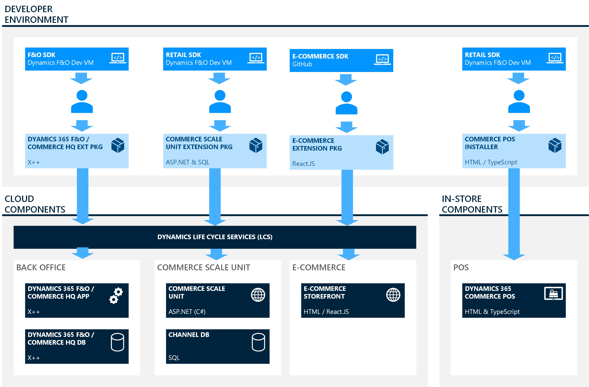

# Download Commerce SDK samples and reference packages from GitHub and NuGet

[!include [banner](../../includes/banner.md)]

This article describes to how to download Microsoft Dynamics 365 Commerce software development kit (SDK) samples from GitHub and reference packages. 

> [!NOTE]
> This article applies to Commerce SDK version 10.0.16 or later. For more information about how to download earlier versions of the Commerce SDK, see [Retail software development kit (SDK)](retail-sdk-overview.md).

The Commerce SDK includes the code, code samples, templates, and tools that are required to extend or customize Dynamics 365 Commerce functionality. The SDK is published in different repositories (repos) in GitHub, depending on the extension components.

The Commerce SDK supports rapid development, full MSBuild integration, and package generation. The following image shows the relationship between the development environment and the cloud components.



## Extension components in Dynamics 365 Commerce 

The following tables provide information about the components in the Commerce SDK that can be customized for different scenarios. 

### Client (Store Commerce)

<table>
<tbody>
<tr>
<th>Scenario</th>
<td>Extend the Store Commerce app for user experience (UX) changes, client logic, workflows, and simple validations.</td>
</tr>
<tr>
<th>Commerce SDK reference</th>
<td><a href="https://github.com/microsoft/Dynamics365Commerce.InStore">Store Commerce app samples</a>
</td>
</tr>
<tr>
<th>Technology</th>
<td>TypeScript, HTML, and CSS</td>
</tr>
<tr>
<th>Documentation</th>
<td><a href="../pos-run-samples.md">Run the point of sale (POS) samples</a></td>
</tr>
</tbody>
</table>

### Commerce Runtime (CRT)

<table>
<tbody>
<tr>
<th>Scenario</th>
<td>Extend CRT to add or change business logic (for example, logic for calculating tax, prices, or discounts).</td>
</tr>
<tr>
<th>Commerce SDK reference</th>
<td><a href="https://github.com/microsoft/Dynamics365Commerce.ScaleUnit">CRT samples</a>
</td>
</tr>
<tr>
<th>Technology</th>
<td>C#</td>
</tr>
<tr>
<th>Documentation</th>
<td><a href="../commerce-runtime-extensibility.md">Commerce runtime (CRT) and Retail Server extensibility</a></td>
</tr>
</tbody>
</table>

### Headless Commerce APIs

<table>
<tbody>
<tr>
<th>Scenario</th>
<td>Create a Headless Commerce API extension to expose new Commerce APIs to the client.</td>
</tr>
<tr>
<th>Commerce SDK reference</th>
<td><a href="https://github.com/microsoft/Dynamics365Commerce.ScaleUnit">Retail Server samples</a>
</td>
</tr>
<tr>
<th>Technology</th>
<td>Open Data Protocol (OData) and C#</td>
</tr>
<tr>
<th>Documentation</th>
<td><a href="../retail-server-icontroller-extension.md">Create a new Retail Server extension API (Retail SDK version 10.0.11 and later)</a>
</td>
</tr>
</tbody>
</table>

### TypeScript proxy

<table>
<tbody>
<tr>
<th>Scenario</th>
<td>A TypeScript proxy is required if new Headless Commerce API extensions must be consumed in the POS or E-Commerce clients.</td>
</tr>
<tr>
<th>Commerce SDK reference</th>
<td><a href="https://github.com/microsoft/Dynamics365Commerce.ScaleUnit">CommerceProxyGenerator</a>
</td>
</tr>
<tr>
<th>Technology</th>
<td>OData and C#</td>
</tr>
<tr>
<th>Documentation</th>
<td><a href="../retail-server-icontroller-extension.md">Create a new Retail Server extension API (Retail SDK version 10.0.11 and later)</a>
</td>
</tr>
</tbody>
</table>

### Hardware station

<table>
<tbody>
<tr>
<th>Scenario</th>
<td>A Hardware station is required to add or change logic that is related to peripherals.</td>
</tr>
<tr>
<th>Commerce SDK reference</th>
<td><a href="https://github.com/microsoft/Dynamics365Commerce.InStore">src\HardwareStationSample samples</a>
</td>
</tr>
<tr>
<th>Technology</th>
<td>C#</td>
</tr>
<tr>
<th>Documentation</th>
<td><a href="../hardware-device-extension.md">Integrate POS with a new hardware device</a></td>
</tr>
</tbody>
</table>

### Payment connector

<table>
<tbody>
<tr>
<th>Scenario</th>
<td>Integrate the POS with a new payment connector.</td>
</tr>
<tr>
<th>Commerce SDK reference</th>
<td><a href="https://github.com/microsoft/Dynamics365Commerce.InStore">src\HardwareStationSample\PaymentDevices</a>
</td>
</tr>
<tr>
<th>Technology</th>
<td>C#</td>
</tr>
<tr>
<th>Documentation</th>
<td><a href="../end-to-end-payment-extension.md">Create an end-to-end payment integration for a payment terminal</a></td>
</tr>
</tbody>
</table>

## Best practices for naming

The C\# source code in the Commerce SDK uses the Contoso namespace. Therefore, it's easier to distinguish Microsoft types and extension types. If your extension code references a type from the Microsoft binary, use **Microsoft.Dynamics** for the reference, to distinguish between Microsoft libraries and the libraries from the extension. The extension libraries must not begin with the **Microsoft.Dynamics** name.

## Deployment packages

After extension development (CRT, Retail Server, database scripts, POS, and Hardware station), you can generate deployment packages to deploy into test, sandbox, and production environments. For more information, see [Create deployable packages](../CSU-packaging.md).

The following sample repositories contain code samples, templates, and tools that are required to extend or customize existing Commerce functionality. Samples are published to repositories in GitHub based on the Commerce extension components. You don't have to close these repositories, instead, you can download and use the samples and template projects.

## Dynamics365Commerce.ScaleUnit repository

The [Dynamics365Commerce.ScaleUnit](https://github.com/microsoft/Dynamics365Commerce.ScaleUnit) repository contains the sample code for customizing the Commerce runtime (CRT), Retail Server, and channel database.

The samples in the repository are organized by Dynamics 365 Commerce application release. Each branch in the repository points to an application release of Dynamics 365 Commerce. Use the release branch that matches your go-live version. You don't have to clone this repository, instead, you can download and use the samples and template projects.

| Release branch name                                                                          | Version | Application release version |
| -------------------------------------------------------------------------------------------- | ------- | --------------------------- |
| [Release/9.38](https://github.com/microsoft/Dynamics365Commerce.ScaleUnit/tree/release/9.38) | 9.38.\* | 10.0.28                     |
| [Release/9.37](https://github.com/microsoft/Dynamics365Commerce.ScaleUnit/tree/release/9.37) | 9.37.\* | 10.0.27                     |
| [Release/9.38](https://github.com/microsoft/Dynamics365Commerce.ScaleUnit/tree/release/9.36) | 9.36.\* | 10.0.26                     |
                   |

### Extension repository (Dynamics365Commerce.ScaleUnit)

You can download and use the samples and templates from [microsoft/Dynamics365Commerce.ScaleUnit](https://github.com/microsoft/Dynamics365Commerce.ScaleUnit). The repository contains **nuget.config**, **repo.props**, **CustomizationPackage.props**, and a build pipelines script. Together they provide guidance on how the extension can set up the repository metadata files.

### Dynamics365Commerce.ScaleUnit repository folders and projects

| Folder | Project | Description |
|--------|---------|-------------|
| Channel Database (./src/ScaleUnitSample/ChannelDatabase) | ChannelDatabase.csproj (./src/ScaleUnitSample/ChannelDatabase/ChannelDatabase.csproj) | This project contains samples on how to create Commerce Runtime database extensions. |
| CommerceRuntime (./src/ScaleUnitSample/CommerceRuntime) | CommerceRuntime.csproj (./src/ScaleUnitSample/CommerceRuntime/CommerceRuntime.csproj) | Controller – Sample code for how to implement new RS APIs.<br>Entities, Messages, and RequestHandlers – Sample code for how to implement new CRT service. |
| ScaleUnit (./src/ScaleUnitSample/ScaleUnit) | ScaleUnit.csproj (./src/ScaleUnitSample/ScaleUnit/ScaleUnit.csproj) | Sample project on how to generate the Cloud Scale Unit (CSU). |
| ScaleUnit.Installer (./src/ScaleUnitSample/Installer) | ScaleUnit.csproj (./src/ScaleUnitSample/Installer/ScaleUnit.Installer.csproj) | Sample project on how to generate the CSU installer. |
|  POS (./src/ScaleUnitSample/POS) | POS.csproj (./src/ScaleUnitSample/POS/POS.csproj) | Contains samples on how to create Point Of Sale (POS) extensions. |
| E-CommerceProxyGenerator (./src/ScaleUnitSample/E-CommerceProxyGenerator) | E-CommerceProxyGenerator.csproj (./src/ScaleUnitSample/E-CommerceProxyGenerator/E-CommerceProxyGenerator.csproj) | Contains a sample on how to generate extension proxies for E-Commerce application. |

Samples for in-store components like the Store Commerce app, Store Commerce for web, Hardware station and Cloud scale unit – Self hosted are published in the [Dynamics365Commerce.InStore](https://github.com/microsoft/Dynamics365Commerce.InStore) repository.

The **readme.md** files in the **Commerce Runtime**, **ChannelDatabase** and **ScaleUnit** folders contain more details on how to run the samples.

## Dynamics365Commerce.InStore repository

The [Dynamics365Commerce.InStore](https://github.com/microsoft/Dynamics365Commerce.InStore) repository contains the sample code for how to customize POS, Hardware station, Commerce runtime (CRT), headless Commerce APIs, and the channel database.

The samples in the repository are organized by Dynamics 365 Commerce application release, each branch in the repository points to an application release of Dynamics 365 Commerce. Use the release branch that matches your go-live version. You don't have to clone this repository, instead, you can download and use the samples and template projects.

| Release branch name                                                                        | Version | Application release version |
|--------------------------------------------------------------------------------------------|---------|-----------------------------|
| [Release/9.38](https://github.com/microsoft/Dynamics365Commerce.InStore/tree/release/9.38) | 9.38.\* | 10.0.28                     |
| [Release/9.37](https://github.com/microsoft/Dynamics365Commerce.InStore/tree/release/9.37) | 9.37.\* | 10.0.27                     |
| [Release/9.36](https://github.com/microsoft/Dynamics365Commerce.InStore/tree/release/9.36) | 9.36.\* | 10.0.26                     |


### Extension repository (Dynamics365Commerce.InStore)

You can download and use the samples and templates from [microsoft/Dynamics365Commerce.InStore](https://github.com/microsoft/Dynamics365Commerce.InStore). The repository contains **nuget.config**, **repo.props**, **CustomizationPackage.props**, and a build pipelines script. Together they provide guidance on how the extension can set up the repository metadata files.

### Dynamics365Commerce.InStore repository folders and projects

| Folder           | Project              | Description                                   |
|----------------|---------------------|---------------------------------------------|
| HardwareStationSample | HardwareStation.Samples.sln| This project contains samples on how to create Hardware station, Payment extensions, and extension installers.|  
| POSSample  | Pos.sln | This folder and project contain POS, CRT, headless Commerce APIs, and Hardware station extension and installer samples. |

More samples for CSU – self hosted, Commerce Runtime, and headless Commerce APIs are published in the [Dynamics365Commerce.ScaleUnit](https://github.com/microsoft/Dynamics365Commerce.ScaleUnit) repository.

The **readme.md** files inside the project folder contain more details on how to run these samples.

## Dynamics365Commerce.Solutions repository

The [Dynamics365Commerce.Solutions](https://github.com/microsoft/Dynamics365Commerce.Solutions) repository contains a sample that demonstrates how to perform E2E business scenario customization in Commerce. There might be scenarios where you need to customize POS, e-Commerce, or the headless commerce engine.

## Download reference packages for creating APIs, and for consuming messages, request, entities, and contracts

Commerce contracts, messages, entities, and request packages are published in this public feed for Commerce extension code that consumes and customizes existing functionalities, or builds new functionalities for the Dynamics 365 Commerce application.

Use the packages from [index.json](https://pkgs.dev.azure.com/commerce-partner/Registry/_packaging/dynamics365-commerce/nuget/v3/index.json). You can add the package source location in the **nuget.config** file of your extension project file, as shown in the following code example:

```xml
<packageSources>
    <add key="dynamics365-commerce" value="https://pkgs.dev.azure.com/commerce-partner/Registry/_packaging/dynamics365-commerce/nuget/v3/index.json" />
    <add key="nuget.org" value="https://api.nuget.org/v3/index.json" />
    </packageSources>
```

## Reference packages that are available in the public feed

| Package name                            | Description |
|---------------------------------------|-----------|
| Microsoft.Dynamics.Commerce.Sdk.ChannelDatabase | This package is required to generate the DB packages with CSU.  |
| Microsoft.Dynamics.Commerce.Sdk.Runtime | This meta package contains all the required packages for implementing the CRT and Retail Server extensions. All the required contracts, messages, requests/responses, and entities are included in this package. |
| Microsoft.Dynamics.Commerce.Sdk.ScaleUnit | This package is required to generate the CSU package for deployment. |
| Microsoft.Dynamics.Commerce.Sdk.Installers.ScaleUnit|  This package is required to generate the ScaleUnit package for deployment. |
| Microsoft.Dynamics.Commerce.Sdk.HardwareAndPeripherals|  This package contains all commerce Hardware station and peripherals libraries. |
| Microsoft.Dynamics.Commerce.Sdk.Installers| This package contains all the installer libraries. |
| Microsoft.Dynamics.Commerce.Sdk.Installers.HardwareStation| This package is required to generate the Hardware station package for deployment. |
| Microsoft.Dynamics.Commerce.Sdk.Pos| This package contains all POS libraries. |
| Microsoft.Dynamics.Commerce.Sdk.Installers.ModernPos| This package is required to generate the POS extension installer for deployment. |
| Microsoft.Dynamics.Commerce.Diagnostics| This package contains all the diagnostic libraries. |
| Microsoft.Dynamics.Commerce.Runtime.Data| This package contains all the data contract libraries. |
| Microsoft.Dynamics.Commerce.Runtime.DataServices.Messages| This package contains all the data services message libraries. |
| Microsoft.Dynamics.Commerce.Runtime.Entities| This package contains all the entity definitions. |
| Microsoft.Dynamics.Commerce.Runtime.Framework| This package contains all the framework libraries. |
| Microsoft.Dynamics.Commerce.Runtime.Hosting.Contracts| This package contains all the controller libraries. |
| Microsoft.Dynamics.Commerce.Runtime.Messages| This package contains all the runtime messages libraries. |
| Microsoft.Dynamics.Commerce.Runtime.RealtimeServices.Messages| This package contains all the real runtime libraries. |
| Microsoft.Dynamics.Commerce.Runtime.Services.Messages| This package contains all the service messages libraries. |
| Microsoft.Dynamics.Commerce.HardwareStation.Core| This package contains all the Hardware station libraries. |
| Microsoft.Dynamics.Commerce.HardwareStation.PeripheralRequests| This package contains all the Hardware station peripherals request libraries. |
| Microsoft.Dynamics.Commerce.HardwareStation.Peripherals.Contracts| This package contains all the Hardware station peripherals contracts libraries. |
| Microsoft.Dynamics.Commerce.HardwareStation.Peripherals.Entities| This package contains all the Hardware station peripherals entities libraries. |
| Microsoft.Dynamics.Commerce.Installers.Framework|  This package contains all the installer framework libraries. |
| Microsoft.Dynamics.Commerce.KeyVault.Contracts| This package contains all the key vault contract libraries. |
| Microsoft.Dynamics.Commerce.PaymentSDK.Extensions.Portable| This package contains all the payment extension libraries. |
| Microsoft.Dynamics.Commerce.PaymentSDK.Portable| This package contains all the payment libraries. |
| Microsoft.Dynamics.Commerce.Runtime.FIF.Connector.Messages| This package contains all the FIF connector libraries. |
| Microsoft.Dynamics.Commerce.Runtime.FIF.DocumentProvider.Messages|  This package contains all the FIF document provider libraries. |
| Microsoft.Dynamics.Commerce.Installers.Framework.DatabaseExtensions| This package contains all the database installer framework libraries. |
| Microsoft.Dynamics.Commerce.Tools.DbUtilities| This package contains all the database utility libraries. |
| Microsoft.Dynamics.Commerce.Tools.ExtensionsProxyGenerator.AspNetCore | This package contains all the extensions proxy generator utilities. |
| Microsoft.Dynamics.Commerce.Proxy.ScaleUnit                           | This package contains all the proxies class for extension applications to consume the headless Commerce APIs in online mode (connected to headless Commerce). |

## Package versioning

| Package version  | Application release      |
| ---------------- | ------------------------ |
| 9.36.x.x-preview | 10.0.26 PEAP/Preview release     |
| 9.36.x.x         | 10.0.26 Customer preview |
| 9.36.x.x         | 10.0.26 GA               |
| 9.37.x.x-preview | 10.0.27 PEAP/Preview release     |
| 9.37.x.x         | 10.0.27 Customer preview |
| 9.37.x.x         | 10.0.27 GA               |
| 9.38.x.x-preview | 10.0.28 PEAP/Preview release     |
| 9.38.x.x         | 10.0.28 Customer preview |
| 9.38.x.x         | 10.0.28 GA               |

An extension project can consume the correct version if you add the package reference to the project and include the full version number. Alternatively, to make the extension project always get the latest version, use a wildcard character. We recommend that you use the full version number, and that you update the version, based on your go-live version. There are two options:

+ Without a wildcard character:

    ```xml
    <PackageReference Include="Microsoft.Dynamics.Commerce.Sdk.Runtime" Version="9.28" />;
    ```

+ With a wildcard character:

    ```xml
    <PackageReference Include="Microsoft.Dynamics.Commerce.Sdk.Runtime" Version="9.28.*" />;
    ```

For every hotfix and new application release, a version of the package will be published in the same public feed, consume the right package version based on the version required for your go-live version. Consuming the higher version of the package than your go-live application version may result in runtime and deployment failures.

## Set up an Azure pipeline for build automation and package generation

To set up an Azure pipeline, see [Set up a build pipeline for the independent-packaging SDK](../build-pipeline.md).

## Best practice and branching strategies

For detailed information about the Git branching strategy, see [Git branching strategy](/azure/devops/repos/git/git-branching-guidance).

The following branching strategies are based on the way that Microsoft uses Git. For more information, see [How we use Git at Microsoft](/azure/devops/learn/devops-at-microsoft/use-git-microsoft).

Keep your branch strategy simple. Build your strategy from these three concepts:

- Use feature branches for all new features and bug fixes.
- Merge feature branches into the main branch using pull requests.
- Keep a high quality, up-to-date main branch.

### Create a new feature branch for development and bug fixes

Create a new feature main branch for your extension, following the naming convention in [Git branching doc for sample naming convention](/azure/devops/repos/git/git-branching-guidance#name-your-feature-branches-by-convention).

### Create a new development branch

To create a new development branch, follow these steps:

1. Create a private branch for development.

    ```dos
    - git checkout -b private/{username}/{feature/description}
    ```

2. Add and commit the changes to the development branch. For example:

    ```dos
    git -add . 
    git commit -m "commit message"
    ```

3. After the development is completed, tested, and validated, push the changes to the main branch. For example:

    ```dos
    git push <remote> <branch>
    ```

    Or:

    ```dos
    git push origin {private branch name}
    ```

### Create a release branch after development

To create a release branch after development, follow these steps:

1. After the development changes are pushed into the main branch, create a new release branch, and create the deployable packages from the release branch.

    ```dos
    - Git checkout -b release/x.x.x
    ```

2. Merge the changes from the release branch back to main branch if any changes were made in the release branch. For example:

    ```dos
    - git checkout main git merge release/x.x.x
    ```

### Extension hotfix branch

1. Create a hotfix branch for extension from the main branch. For more information, see [Create a release branch after development](#create-a-release-branch-after-development).
2. Release the fix.
3. Merge the changes back to the main branch.

### Merge a new release branch to main and development branch

After a new version of the samples released, if necessary, merge your development branch with the new branch. The repository contains only samples, so it's not required to get the updated changes from the branch. For example:

```dos
- git checkout main git merge release/x.x.x
```

[!INCLUDE[footer-include](../../../includes/footer-banner.md)]
