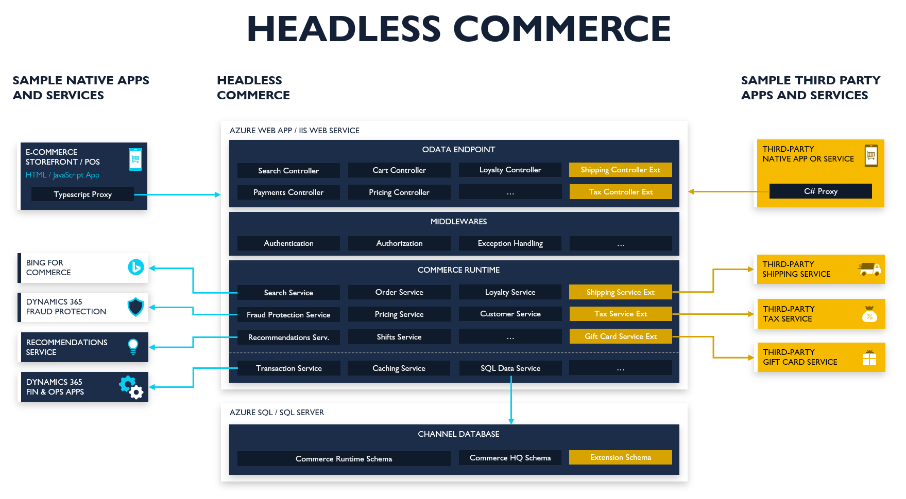

---
# required metadata

title: Headless Commerce Engine architecture
description: Overview of Headless Commerce Engine architecture.
author: RobinARH
ms.date: 06/20/2017
ms.topic: article
ms.prod: 
ms.technology: 

# optional metadata

# ms.search.form: 
# ROBOTS: 
audience: Developer, IT Pro
# ms.devlang: 
ms.reviewer: rhaertle
# ms.tgt_pltfrm: 
ms.custom: 31521
ms.assetid: 3a169648-592b-4616-9834-598c0244a852
ms.search.region: Global
# ms.search.industry: 
ms.author: meeram
ms.search.validFrom: 2021-02-28
ms.dyn365.ops.version: AX 10.0.16

---

# Headless Commerce Engine architecture

[!include [banner](../includes/banner.md)]

This article describes the architecture of Headless Commerce engine. Headless Commerce engine is API driven engine enabling extensible, personalized, friction-free commerce experiences and integrated, optimized back-office operations. 

 

## Omnichannel solution with Headless Commerce Engine

Headless Commerce Engine Commerce APIs which are consumed by Dynamics 365 Commerce back-office, in-store, call center and e-commerce to provide complete omnichannel solution. The APIs can be consumed by any third party application, power platform connectors etc.

 

## Headless Commerce Engine contains the below main components:

### Consumer APIs:

The Headless Commerce Engine exposes OData APIs for Dynamics 365 Commerce solution and third party applications to consume. The Headless Commerce Engine API layer is built using the ASP.NET core and provide different authentication options for the clients to consume the APIs. The APIs are wrapper which exposes the business logic, for more details on the APIs and extension, refer the below docs:

[Commerce Scale Unit customer and consumer APIs](https://docs.microsoft.com/en-us/dynamics365/commerce/dev-itpro/retail-server-customer-consumer-api)

[Consume APIs](https://docs.microsoft.com/en-us/dynamics365/commerce/dev-itpro/consume-retail-server-api)

[Custom APIs](https://docs.microsoft.com/en-us/dynamics365/commerce/dev-itpro/retail-server-icontroller-extension)

### Commerce Runtime (CRT):

Commerce runtime (CRT) is a collection of portable .NET libraries that contain the core commerce business logic and these business logic are exposed through the consumer APIs of the Headless Commerce Engine for the clients to consume. To add or modify business logic, customize CRT.

[Commerce runtime (CRT) services](https://docs.microsoft.com/en-us/dynamics365/commerce/dev-itpro/crt-services)
[CRT Extensions](https://docs.microsoft.com/en-us/dynamics365/commerce/dev-itpro/commerce-runtime-extensibility)

### Channel Database

The channel database (channel DB) holds transactional and master data from one or more commerce channels, such as an online store or a brick-and-mortar store. The master data is pushed down from the Headquarters (HQ) to the channel database using the commerce data exchange (CDX). The transactional data stored in the channel database is pulled back to the headquarters using the CDX.

[Channel database extensions](https://docs.microsoft.com/en-us/dynamics365/commerce/dev-itpro/channel-db-extensions)

[!INCLUDE[footer-include](../../includes/footer-banner.md)]
