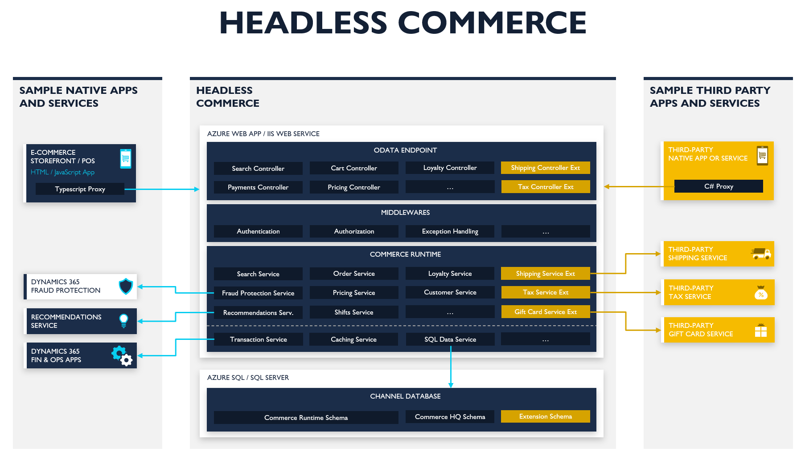
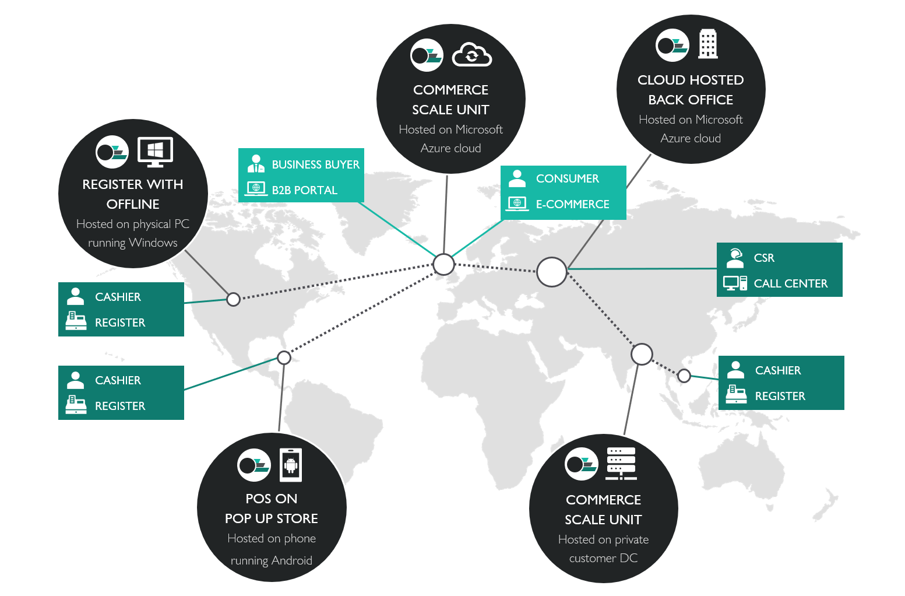

# Headless commerce architecture

[!include [banner](../includes/banner.md)]

This topic describes the architecture of the headless commerce (also known as Commerce Scale Unit). The headless commerce is an API-driven framework that enables extensible, personalized, friction-free commerce experiences, and integrated, optimized back-office operations.

## Omnichannel solution provided by the headless commerce

The commerce APIs of the headless commerce are consumed by Microsoft Dynamics 365 Commerce (back-office, in-store, call center, and e-commerce) and provide a complete omnichannel solution. The APIs can be consumed by third-party applications and Microsoft Power Platform connectors.

## Components

The headless commerce contains these components:

+ Consumer APIs
+ Commerce runtime (CRT)
+ Channel database

### Consumer APIs

The headless commerce exposes Open Data Protocol (OData) APIs for Dynamics 365 Commerce and third-party applications to consume. The API layer is built by using ASP.NET Core. It provides different authentication options so that the clients can consume the APIs. The APIs are a wrapper that exposes the business logic. For more information, see the following topics:

+ [Commerce Scale Unit customer and consumer APIs](retail-server-customer-consumer-api.md)
+ [Consume APIs](consume-retail-server-api.md)
+ [Custom APIs](retail-server-icontroller-extension.md)

### Commerce runtime

CRT is a collection of portable .NET libraries that contain the core commerce business logic. The consumer APIs expose the business logic for clients to consume. To add or modify business logic, customize CRT. For more information, see the following topics:

+ [Commerce runtime (CRT) services](crt-services.md)
+ [CRT Extensions](commerce-runtime-extensibility.md)

### Channel database

The channel database holds transactional data and master data from one or more commerce channels, such as an online store or a brick-and-mortar store. Master data is pushed down from Commerce headquarters to the channel database by using Commerce Data Exchange (CDX). Transactional data that is stored in the channel database is pulled back to Commerce headquarters by using CDX. For more information, see [Channel database extensions](channel-db-extensions.md).

[!INCLUDE[footer-include](../../includes/footer-banner.md)]

