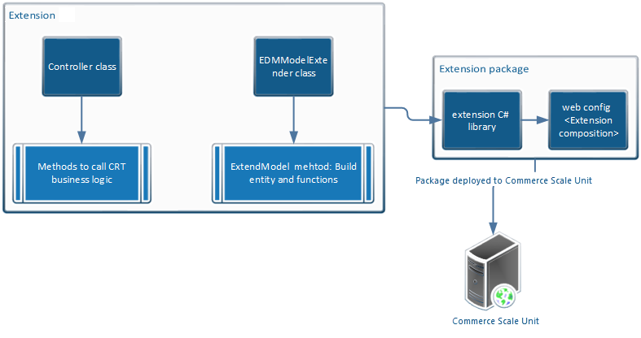
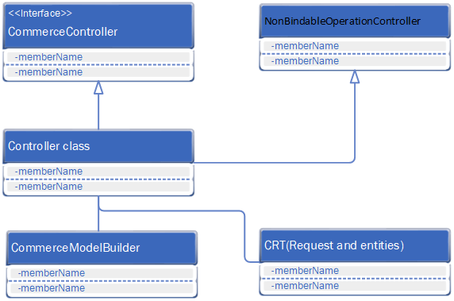

---
# required metadata

title: Create a new Retail Server extension
description: This topic explains how to create a new Commerce Scale Unit extension.
author: mugunthanm
manager: AnnBe
ms.date: 08/25/2019
ms.topic: article
ms.prod: 
ms.service: dynamics-365-retail
ms.technology: 

# optional metadata

# ms.search.form: 
# ROBOTS: 
audience: Developer
# ms.devlang: 
ms.reviewer: rhaertle
ms.search.scope: Operations, Retail
# ms.tgt_pltfrm: 
ms.custom: 28021
ms.assetid: 
ms.search.region: Global
# ms.search.industry: 
ms.author: mumani
ms.search.validFrom: 2019-08-2019
ms.dyn365.ops.version: AX 10.0.5

---

# Create a new Retail Server extension

[!include [banner](../includes/banner.md)]

This document explains how to create a new Commerce Scale Unit application programming interface (API), and how to expose it so that POS or other clients can consume it. Modification of the existing Commerce Scale Unit APIs isn't supported.

The Retail software development kit (SDK) includes only a few samples of end-to-end Commerce Scale Unit extensions that include the Commerce Runtime (CRT). You can use these samples as templates to start your extensions. You can find the sample extensions in the RetailSDK\\SampleExtensions\\RetailServer folder.

## End-to-end sample repository in the Retail SDK

| Sample extension<br>(RetailSDK\\SampleExtensions\\RetailServer) | CRT sample<br>(RetailSDK\\SampleExtensions\\CommerceRuntime) | POS sample<br>(RetailSDK\\POS\\Extensions) |
|---------------------------------------------|--------------------------------------------|----------------------------------------|
| Extensions.StoreHoursSample                 | Extensions.StoreHoursSample                | StoreHoursSample                       |
| Extensions.SalesTransactionSignatureSample  | Extensions.SalesTransactionSignatureSample | SalesTransactionSignatureSample        |
| Extensions.PrintPackingSlipSample           | Extensions.PrintPackingSlipSample          |                                        |
| Extensions.CrossLoyaltySample               | Extensions.CrossLoyaltySample              |                                        |

## Create a new extension

Follow the steps in this section to create a new Commerce Scale Unit extension.

### End-to-end flow

The following illustration shows the flow of the extension.



### Extension class diagram

The following illustration shows the class structure of the extension.



### Steps

1. Before you create the Commerce Scale Unit extension, create the CRT extension. Commerce Scale Unit APIs should have no logic except logic that calls the CRT with the parameters.
2. Create a new C\# class library project that uses the Microsoft .NET Framework version 4.6.1 or later as the target framework.
3. In the Commerce Scale Unit extension project, add a reference to your CRT extension library or project. This reference lets you call the CRT request and response. It also lets you use the entities from the Commerce Scale Unit extension project.
4. In the Commerce Scale Unit extension project, create a new controller class that extends **NonBindableOperationController** or **CommerceController**. The base class depends on your scenario. This controller class will contain the method that must be exposed by the Commerce Scale Unit API. Inside the controller class, add methods to call the CRT request.

    ```C#
    /// <summary>;
    /// The controller to retrieve a new entity.
    /// <summary>
    [ComVisible(false)]
    public class SampleController : CommerceController<SampleEntity, long>;
    {
        ///<summary>;
        /// Gets the controller name used to load extended controller.
        /// <summary>
        public override string ControllerName
        {
            get { return "SampleEntity"; }
        }
        /// <summary>;
        /// Gets the sample entity.
        /// <summary>;
        /// <param name="parameters">The parameters to this action.</param>
        /// <returns>The list of sample entity.</returns>
        [HttpPost]
        [CommerceAuthorization(CommerceRoles.Anonymous, CommerceRoles.Customer, CommerceRoles.Device, CommerceRoles.Employee)]
        public System.Web.OData.PageResult<SampleEntity> GetSampleEntity(ODataActionParameters parameters)
        {
            if (parameters == null)
            {
                throw new ArgumentNullException("parameters");
            }
            var runtime = CommerceRuntimeManager.CreateRuntime(this.CommercePrincipal);
            QueryResultSettings queryResultSettings = QueryResultSettings.SingleRecord;
            queryResultSettings.Paging = new PagingInfo(10);
            var request = new CRTDataRequest((string)parameters["key"]) { QueryResultSettings = queryResultSettings };
            PagedResult<SampleEntity> sample = runtime.Execute<CRTDataResponse>(request, null);
            return this.ProcessPagedResults(sample);
        }
    }
    ```

5. Create an **EdmModelExtender** (EDM) class that extends the **IEdmModelExtender** interface. This class contains the abstract data model that is used to describe the data that a Commerce Scale Unit API exposes. An Open Data Protocol (OData) Metadata Document is a representation of a service's data model that is exposed for client consumption. The central concepts in the EDM are entities, relationships, entity sets, actions, and functions.

    The **IEdmModelExtender** interface contains the abstract **ExtendModel** method. When you extend this interface, you must implement the **ExtendModel** method. Inside the **ExtendModel** method, you build the EDM entities and functions that will be exposed to the client by using the **CommerceModelBuilder** class.

    The **CommerceModelBuilder** class contains the build method that is used to build the entities and functions.

    | Method name                                                                 | Return type                              | Description |
    |-----------------------------------------------------------------------------|------------------------------------------|-------------|
    | BuildEntity\<TEntity\>() where TEntity : class                              | EntityTypeConfiguration\<TEntity\>       | This method builds an entity. |
    | BuildEntitySet\<TEntity\>(string entitySetName) where TEntity : class       | EntitySetConfiguration\<TEntity\>        | This method builds an entity set. |
    | BuildComplexType\<TComplexType\>() where TComplexType : class               | ComplexTypeConfiguration\<TComplexType\> | This method builds a complex entity type. |
    | BuildEnumType\<TEnumType\>()                                                | EnumTypeConfiguration\<TEnumType\>       | This method builds an enumeration type. |
    | BindAction(string actionName)                                               | ActionConfiguration                      | This method binds an action in the model builder. An action represents an HTTP POST request. |
    | BindEntityAction\<TEntity\>(string actionName) where TEntity : class        | ActionConfiguration                      | This method binds an entity action of the model. An action represents an HTTP POST request. |
    | BindEntitySetAction\<TEntity\>(string actionName) where TEntity : class     | ActionConfiguration                      | This method binds an entity set action. An action represents an HTTP POST request.             |
    | BindFunction(string functionName)                                           | FunctionConfiguration                    | This method binds a function in the model builder. A function represents a HTTP GET request. |
    | BindEntityFunction\<TEntity\>(string functionName) where TEntity : class    | FunctionConfiguration                    | This method binds an entity function of the model. A function represents an HTTP GET request. |
    | BindEntitySetFunction\<TEntity\>(string functionName) where TEntity : class | FunctionConfiguration                    | This method binds an entity set function. A function represents an HTTP GET request. |

    The following example shows how to extend the EDM model.

    ```C#
    /// <summary>;
    /// The class to extend the EDM model.
    /// <summary>;
    [Export(typeof(IEdmModelExtender))]
    [ComVisible(false)]
    public class EdmModelExtender : IEdmModelExtender
    {
        /// <summary>;
        /// Extends the EDM model.
        /// <summary>;
        /// <param name="builder">The builder to build the EDM model.</param>
        public void ExtendModel(CommerceModelBuilder builder)
        {
            ThrowIf.Null(builder, "builder");
            // Extends entity sets.
            builder.BuildEntitySet<SampleEntity>("SampleEntity");
            // Extends entity set actions.
            var action = builder.BindEntitySetAction<SampleDataModel.StoreDayHours>("GetSampleEntity");
            action.Parameter<string>("Key");
            action.ReturnsCollectionFromEntitySet<SampleEntity>("SampleEntity");
        }
    }
    ```

6. Build the extension project, and drop the binary into the **\\RetailServer\\webroot\\bin\\Ext** folder.
7. Update the Commerce Scale Unit web.config file in the **\\RetailServer\\webroot** folder by adding the new extension library name in the **extensionComposition** section.

    ```xml
    <extensionComposition>
    <!-- Please use fully qualified assembly names for ALL if you need to support loading from the Global Assembly Cache.
    If you host in an application with a bin folder, this is not required. -->
    <add source="assembly" value="SampleExtension" >;
    </extensionComposition>
    ```

8. In Microsoft Internet Information Services (IIS), restart Commerce Scale Unit to load the new extension.
9. To verify that the extension was successfully loaded, you can browse the Commerce Scale Unit metadata, and confirm that your entities and methods appear in the list.

    To browse the metadata, open a URL in the following format in a web browser:

    `https://Your Commerce Scale Unit URL/Commerce/$metadata`

10. To call the Commerce Scale Unit extension in your client, you must generate the Commerce proxy. You can then use the proxy to call your new Commerce Scale Unit APIs from the client.

    For information about how to generate the proxy, see [Typescript and C# proxies for Retail point of sale (POS)](typescript-proxy-retail-pos.md).
