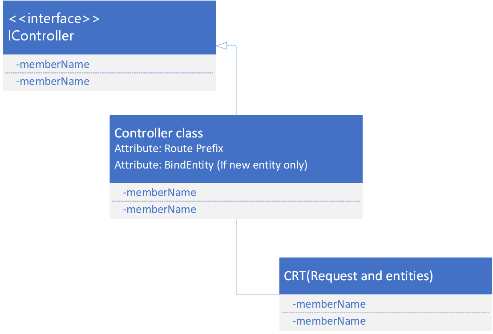

---
# required metadata

title: Create a new Retail Server API
description: This topic explains how to create a new Retail Server API with Retail SDK version 10.0.11 and later.
author: mugunthanm
manager: AnnBe
ms.date: 08/31/2020
ms.topic: article
ms.prod: 
ms.service: dynamics-365-commerce
ms.technology: 

# optional metadata

# ms.search.form: 
# ROBOTS: 
audience: Developer
# ms.devlang: 
ms.reviewer: rhaertle
ms.search.scope: Operations, Retail
# ms.tgt_pltfrm: 
ms.custom: 28021
ms.assetid: 
ms.search.region: Global
# ms.search.industry: 
ms.author: mumani
ms.search.validFrom: 2019-08-2019
ms.dyn365.ops.version: AX 10.0.11

---

# Create a new Retail Server extension API (Retail SDK version 10.0.11 and later)

[!include [banner](../includes/banner.md)]

This document explains how to create a new Retail Server application programming interface (API), and how to expose it so that POS or other clients can consume it. Modification of the existing Retail Server APIs isn't supported.

This topic applies to Retail SDK version 10.0.11 and later.

The Retail software development kit (SDK) includes only a few samples of end-to-end Retail Server extensions that include the Commerce Runtime (CRT). You can use these samples as templates to start your extensions. You can find the sample extensions in the **RetailSDK\\SampleExtensions\\RetailServer** folder.

## End-to-end sample repository in the Retail SDK

| Sample extension<br>(RetailSDK\\SampleExtensions\\RetailServer) | CRT sample<br>(RetailSDK\\SampleExtensions\\CommerceRuntime) | POS sample<br>(RetailSDK\\POS\\Extensions) |
|---------------------------------------------|--------------------------------------------|----------------------------------------|
| Extensions.StoreHoursSample                 | Extensions.StoreHoursSample                | StoreHoursSample                       |
| Extensions.SalesTransactionSignatureSample  | Extensions.SalesTransactionSignatureSample | SalesTransactionSignatureSample        |
| Extensions.PrintPackingSlipSample           | Extensions.PrintPackingSlipSample          |                                        |
| Extensions.CrossLoyaltySample               | Extensions.CrossLoyaltySample              |                                        |

## Extension class diagram

The following illustration shows the class structure of the extension.



## Create the new Retail Server API

1. Create the CRT extension. You must create the CRT extension before you create the Retail Server extension. A Retail Server API should have no logic except logic that calls the CRT with the parameters.
2. Create a new C# class library project that uses Microsoft .NET Framework version 4.6.1, or use any of the Retail Server samples in the Retail SDK as a template.
3. In the Retail Server extension project, add a reference to your CRT extension library or project. This reference lets you call the CRT request, response, and entities.
4. In the Retail Server extension project, add the **Microsoft.Dynamics.Commerce.Runtime.Hosting.Contracts** package using the NuGet package manager. The NuGet packages can be found in the **RetailSDK\\pkgs** folder.
5. Create a new controller class and extend it from **IController**. This controller class will contain the method that must be exposed by the Retail Server API. Inside the controller class, add methods to call the CRT request. Don’t extend the new controller class from existing controller classes like **CustomerController** and **ProductController**. Extension classes must extend only the **IController** class.
6. Add the **RoutePrefix** attribute on the controller class (Controller class name).

    ```csharp
    [RoutePrefix("SimpleExtension")]  
    ```

7. Add the **BindEntity** attribute. This is required on a controller class if you are creating a new controller and exposing an entity.

```csharp
    [BindEntity(typeof(SimpleEntity))]
```

> [!NOTE]
> Step 6 and 7 are required if the extension class is bound to an entity. These steps are not required for an unbounded controller class returning simple types, not any entity.

The following sample code creates a simple Retail Server API to return an entity, a string, and a bool value. The CRT request and response used in the sample is not included in this sample. For an example of the CRT request and response, see [Commerce runtime (CRT) extensibility and triggers](commerce-runtime-extensibility-trigger.md).

### Sample code for a controller class bounded to a custom entity

> [!NOTE]
> Extension code should not bound the existing OOB entity, such as Customer or Product.

```csharp
    /// <summary>
        /// New extended controller.
        /// </summary>
        [RoutePrefix("SimpleExtension")]  
        [BindEntity(typeof(SimpleEntity))]
        public class SimpleExtensionController : IController
        {
            /// <summary>
            /// The action to get the string value.
            /// </summary>
            /// <param name="context">The context parameters.</param>
            /// <param name="stringValue">The string value parameters.</param>
            /// <returns>The string value.</returns>
            [HttpPost]
            [Authorization(CommerceRoles.Customer, CommerceRoles.Employee)]
            public async Task<string> GetStringValue(IEndpointContext context, string stringValue)
            {
                GetStringValueResponse resp = await context.ExecuteAsync<GetStringValueResponse>
                                         (new GetStringValueRequest(stringValue)).ConfigureAwait(false);
                return resp.StringValue;
            }

            /// <summary>
            /// The action to get the bool value.
            /// </summary>
            /// <param name="context">The context parameters.</param>
            /// <param name="boolValue">The string value parameters.</param>
            /// <returns>The bool value.</returns>
            [HttpPost]
            [Authorization(CommerceRoles.Customer, CommerceRoles.Employee)]
            public async Task<bool> GetBoolValue(IEndpointContext context, string boolValue)
            {
                GetBoolValueResponse resp = await context.ExecuteAsync<GetBoolValueResponse>
                                           (new GetBoolValueRequest(boolValue)).ConfigureAwait(false);
                return resp.BoolValue;
            }

            /// <summary>
            /// The action to get the simple entity.
            /// </summary>
            /// <param name="context">The context parameters.</param>
            /// <param name="name">The name parameters.</param>
            /// <returns>The simple entity.</returns>
            [HttpPost]
            [Authorization(CommerceRoles.Customer, CommerceRoles.Employee)]
            public async Task<SimpleEntity> GetSimpleEntity(IEndpointContext context, string name)
            {
                GetSimpleEntityResponse resp = await context.ExecuteAsync<GetSimpleEntityResponse>
                                               (new GetSimpleEntityRequest(name)).ConfigureAwait(false);
                return resp.SimpleEntityObj;
            }
        }
```

### Sample code for a controller class not bounded to a custom entity

```csharp
namespace Contoso.UnboundController.Sample
{
    using System.Threading.Tasks;
    using Microsoft.Dynamics.Commerce.Runtime.DataModel;
    using Microsoft.Dynamics.Commerce.Runtime.Hosting.Contracts;

    /// <summary>
    /// An extension unbounded controller sample.
    /// </summary>
    public class UnboundController : IController
    {
        /// <summary>
        /// A simple GET endpoint to demonstrate GET endpoints on an unbound controller.
        /// </summary>
        /// <returns>A simple true value to indicate the endpoint was reached.</returns>
        [HttpGet]
        [Authorization(CommerceRoles.Anonymous, CommerceRoles.Application, CommerceRoles.Customer, CommerceRoles.Device, CommerceRoles.Employee, CommerceRoles.Storefront)]
        public Task<bool> SampleGet()
        {
            return Task.FromResult(true);
        }

        /// <summary>
        /// A simple POST endpoint to demonstrate POST endpoints on an unbound controller.
        /// </summary>
        /// <returns>A simple true value to indicate the endpoint was reached.</returns>
        [HttpPost]
        [Authorization(CommerceRoles.Customer, CommerceRoles.Device, CommerceRoles.Employee)]
        public Task<bool> SamplePost()
        {
            return Task.FromResult(true);
        }
    }
}

```

The Retail Server APIs support different authorization roles. Access to the controller method is permitted based on the authorization roles specified in the controller method **Authorizations** attribute. The supported authorization roles are shown in the following code example.

```csharp
    // Summary:
    // Represents the type of logon type.
    [DataContract]
    public static class CommerceRoles
    {
        //
        // Summary:
        //     Anonymous Role.
        [DataMember]
        public const string Anonymous = "Anonymous";
        //
        // Summary:
        //     SharePoint Role used by Connector.
        [DataMember]
        public const string Storefront = "Storefront";
        //
        // Summary:
        //     Employee Role.
        [DataMember]
        public const string Employee = "Employee";
        //
        // Summary:
        //     Customer Role.
        [DataMember]
        public const string Customer = "Customer";
        //
        // Summary:
        //     Represents the Device level of authentication.
        [DataMember]
        public const string Device = "Device";
        //
        // Summary:
        //     Represents Application level of authentication.
        [DataMember]
        public const string Application = "Application";
        //
        // Summary:
        //     The list of all possible Microsoft.Dynamics.Commerce.Runtime.DataModel.CommerceRoles
        //     values.
        public static readonly string[] All;
    }
 ```
###  Register the extension

1. Build the extension project, and copy the binary to the **\\RetailServer\\webroot\\bin\\Ext** folder.
2. Update the Commerce Scale Unit **web.config** file in the **\\RetailServer\\webroot** folder by adding the new extension library name in the **extensionComposition** section.

```xml
    <extensionComposition>
    <!-- Use fully qualified assembly names for ALL if you need to support loading from the Global Assembly Cache.
    If you host in an application with a bin folder, this is not required. -->
    <add source="assembly" value="SimpleExtensionSample" >
    </extensionComposition>
```

3. In Microsoft Internet Information Services (IIS), restart the Commerce Scale Unit to load the new extension.

### Validate the extension

1. To verify that the extension loaded successfully, you can browse the Retail Server metadata. Confirm that your entities and methods appear in the list. To browse the metadata, open a URL in the following format in a web browser:

    **https://RS-URL/Commerce/$metadata**

2. To call the Retail Server extension in your client, you must generate the client Typescript proxy. You can then use the proxy to call your new Retail Server APIs from the client.

You don't need to add or include any **EdmModelExtender** files in the extension with the Retail Server extensions APIs. The files are required only if you are using Retail SDK version 10.0.10 or earlier.


## Generate the Typescript proxy for POS
The POS uses the Typescript proxy to access the Retail Server APIs and CRT entities. The proxy class acts as manger class or wrapper to access the Retail server APIs without the proxy extension manually finding the Retail server API and entities metadata.

**Steps to generate the proxy files**

1. Open the sample proxy template project from **\\RetailSDK\\Code\\SampleExtensions\\TypeScriptProxy\\TypeScriptProxy.Extensions.StoreHoursSample\\Proxies.TypeScriptProxy.Extensions.StoreHoursSample.csproj** in Visual Studio 2017. Rename it if required.
2. Add the Retail Server extension project as a project reference project to this proxy template project. Remove the existing **StoreHoursSample** project reference.
3. Right-click the **Proxies.TypeScriptProxy.Extensions.StoreHoursSample.csproj** and select **Edit Proxies.TypeScriptProxy.Extensions.StoreHoursSample.csproj**.
4. Under the **\<RetailServerExtensionAssemblies\>** node, specify your extension Retail Server assembly name. The following example shows how to add the assembly name.

    ```xml
      <ItemGroup>
        <RetailServerExtensionAssemblies Include="..\..\RetailServer\Extensions.Sample\bin\$(Configuration)\net461\$(AssemblyNamePrefix).RetailServer.Extension.Sample.dll" />
      </ItemGroup>
    ```

5.  Under the **Copy** node, update the **DestinationFolder** path to your POS extension folder, so that generated proxy files are copied to the POS Extension folder automatically. The generated proxy files will also be copied to **\\RetailSDK\\Code\\SampleExtensions\\TypeScriptProxy\\TypeScriptProxy.Extensions.StoreHoursSample\\DataService**. The following example shows how to update the path.

    ```xml
    <Copy SourceFiles="@(GeneratedDataServiceContracts)" DestinationFolder="$(SdkRootPath)\POS\Extensions\Sample\DataService" SkipUnchangedFiles="true" />
    ```

6. After the changes are complete, build the proxy project to generate the typescript proxy files. When the build is completed the proxy files are available in the **\\RetailSDK\\Code\\SampleExtensions\\TypeScriptProxy\\TypeScriptProxy.Extensions.StoreHoursSample\\DataService** folder and the folder specified in the **Copy** command. The path and folder path can vary based on the folder structure.

## Retail server extension in offline

A Retail Server extension built using the **Microsoft.Dynamics.Commerce.Runtime.Hosting.Contracts** API can be used in an offline implementation. You don't need to generate a separate C# proxy library. Copy the Retail Server extension library in the **\\Microsoft Dynamics 365\\70\\Retail Modern POS\\ClientBroker\\ext** folder and update the **RetailProxy.MPOSOffline.ext** config file to include the this library. This extension must only generate the Typescript proxy. SDK samples can be found in the  **\\RetailSDK\\SampleExtensions\\TypeScriptProxy)** folder.

The following example shows how to update the **add** element in the **RetailProxy.MPOSOffline.ext** config file.

```xml
    <?xml version="1.0" encoding="utf-8"?> 
    <retailProxyExtensions> 
        <composition> 
            <add source="assembly" value="Contoso.RetailServer.StoreHoursSample" /> 
        </composition> 
    </retailProxyExtensions> 
```

