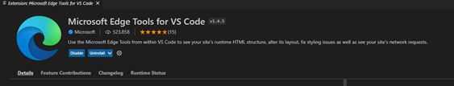
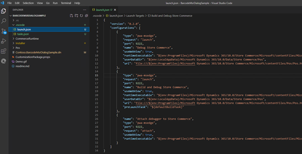
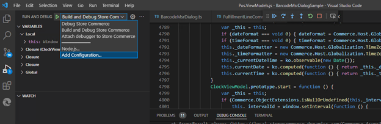

# Debug Store Commerce extensions using VS Code

[!include [banner](../includes/banner.md)]

This topic describes how to debug Microsoft Dynamics 365 Commerce Store Commerce extensions using VSCode.

> [!NOTE]
> To debug offline Commerce runtime (CRT)/Hardware station (HWS) code in Store Commerce you must use Visual Studio 2019 or later. VS Code only supports debugging 64-bit .NET Framework apps. Launch the Store Commence app and then open the CRT or HWS code in Visual Studio, select **Debug \> Attach to Process** from the menu, and then select **Microsoft.Dynamics.Commerce.StoreCommerce.exe**. 

To debug Store Commerce extensions, follow these steps.

1. Install [Visual Studio Code](https://code.visualstudio.com/).
1. Launch Visual Studio Code and install the [Microsoft Edge Tools for VS Code - Visual Studio Marketplace](https://marketplace.visualstudio.com/items?itemName=ms-edgedevtools.vscode-edge-devtools).

    

1. Before deploying the extensions, install the [Store Commerce app](store-commerce.md#device-installation). During the install process, enable the debug option by passing the parameter **--enablewebviewdevtools** as shown in the following example.
    ```ps
    .\StoreCommerce.Installer.exe install --enablewebviewdevtools
    ```
1. Download the Store Commerce extension sample code from the InStore GitHub Repo or use your own extension code.

    > [!NOTE]
    > Don't run VS code in administrator mode.

1. Open the VS developer command prompt and type **code** to open VS code.
1. In VSCode, select **File \> Open Folder** and then open your Extension Code root folder.
1. In VSCode, right-click the root folder of your solution directory and create a new folder called **.vscode**. 
1. Inside the **.vscode** folder, create a new file and name it **launch.json**.

1. Inside the launch.json file, add the following configurations to build and debug the Store Commerce extensions. 

    - **Debug Store Commerce** – This configuration will launch the Store Commerce app and attach the extension code to the Store Commerce app for debugging.
    - **Build and Debug Store Commerce** - This configuration will build the extension code, deploy the extension, launch the Store Commerce app, and attach the extension code to the Store Commerce app for debugging.
    - **Attach debugger to Store Commerce** - This configuration will attach the extension code to the Store Commerce app for debugging, but will not start the Store Commerce app.

    

1. Copy the following configuration code to the **launch.json** file and then save it.

    ```json
    {
        "version": "0.2.0",
        "configurations": [
            {
                "type": "pwa-msedge",
                "request": "launch",
                "port": 9222,
                "name": "Debug Store Commerce",
                "useWebView": true,
                "runtimeExecutable": "${env:ProgramFiles}/Microsoft Dynamics 365/10.0/Store Commerce/Microsoft/contentFiles/Microsoft.Dynamics.Commerce.StoreCommerce.exe",
                "userDataDir": "${env:LocalAppData}/Microsoft Dynamics 365/10.0/Data/Store Commerce/Pos",
                "url": "file:///${env:ProgramFiles}/Microsoft Dynamics 365/10.0/Store Commerce/Microsoft/contentFiles/Pos/Pos.html"
            },
            {
                "type": "pwa-msedge",
                "request": "launch",
                "port": 9222,
                "name": "Build and Debug Store Commerce",
                "useWebView": true,
                "runtimeExecutable": "${env:ProgramFiles}/Microsoft Dynamics 365/10.0/Store Commerce/Microsoft/contentFiles/Microsoft.Dynamics.Commerce.StoreCommerce.exe",
                "userDataDir": "${env:LocalAppData}/Microsoft Dynamics 365/10.0/Data/Store Commerce/Pos",
                "url": "file:///${env:ProgramFiles}/Microsoft Dynamics 365/10.0/Store Commerce/Microsoft/contentFiles/Pos/Pos.html",
                "preLaunchTask": "${defaultBuildTask}"
            },
            {
                "name": "Attach debugger to Store Commerce",
                "type": "pwa-msedge",
                "port": 9222,
                "request": "attach",
                "useWebView": true,
                "runtimeExecutable": "${env:ProgramFiles}/Microsoft Dynamics 365/10.0/Store Commerce/Microsoft/contentFiles/Microsoft.Dynamics.Commerce.StoreCommerce.exe"
            }
        ]
    }
    ```

1. Inside the **.vscode** folder, create a new file and name it **tasks.json** to create the configurations to build and install the Store Commerce app.

1. Inside the **tasks.json** file, copy the following configurations:
    ```json
		    {
        "version": "2.0.0",
        "tasks": [
            {
                "label": "Build & Install Store Commerce Extension",
                "type": "shell",
                "command": "msbuild",
                "args": [
                    "/p:Configuration=debug",
                    "/p:InstallStoreCommerceExtensionsAfterBuild=true",
                    "/t:build",
                    "/m",
                    "/consoleloggerparameters:NoSummary",
                    "${workspaceFolder}"
                ],
                "group": {
                    "kind": "build",
                    "isDefault": true
                },
            }
        ]
    }
    ```
1. Select the **Debug** button in VS, select the appropriate option based on your scenario, and then start debugging by placing a breakpoint in your extension code.

    

### Troubleshoot debug issues

#### msbuild error

If you get the error `msbuild : The term 'msbuild' is not recognized as the name of a cmdlet, function, script file, or operable program`,
close VS Code, open the Visual Studio Developer command prompt, navigate to the solution directory, and then type **code**. This will open VS Code and set the right msbuild version.

#### JSON file comment extension

If you get any errors related to .json file comments, close the .json file and try the debug command again, or delete all the comments in the .json file.


