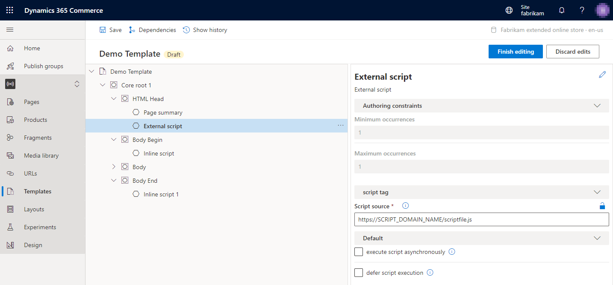
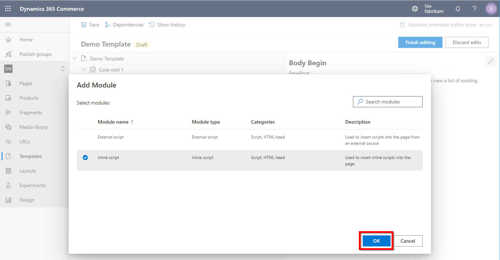
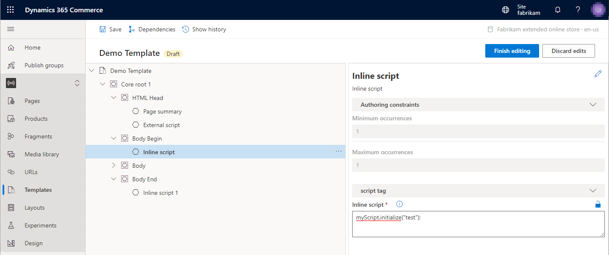

# External and inline script modules

[!include [banner](../includes/banner.md)]

This article covers external and inline script modules and describes how to add them to templates in Microsoft Dynamics 365 Commerce.

External and inline script modules let you add client-side JavaScript scripts to site pages. The scripts can be inline, or they can be called from an external file. External and inline script modules can be added to a template's **HTML Head**, **Body Begin**, or **Body End** slot.

The following illustration shows an example where external and inline script modules have been added to the various supported slots in a template.

## External script module properties

| Property name | Values | Description |
|---------------|--------|-------------|
| Script source | Text | The URL of the script file location. |
| Execute script asynchronously | **True** or **False** | If this property is set to **True**, the script will run asynchronously. |
| Defer script execution | **True** or **False** | If this property is set to **True**, the script will run when the page has finished running. |

## Inline script module properties

| Property name | Values | Description |
|---------------|--------|-------------|
| Inline script | Text | The collection of scripting statements that will be inserted inline into **\<script\>** tags on the HTML page. |

## Content security policy

If content security policy (CSP) is enabled, external scripts might not run. To enable external scripts to run, you must first add their domain URLs to the **script-src** CSP directive in Commerce site builder. For more information, see [Manage Content Security Policy](manage-csp.md).

## Add a script module to a template

To add a script module to a template, follow these steps.

1. In Commerce site builder for your site, select **Templates**.
1. Select a template, and then select **Edit**.
1. In the **Body Begin** slot, select the ellipsis (**...**), and then select **Add module**.

    

1. In the **Select modules** dialog box, select either the **External script** module or the **Inline script** module, and then select **OK**.

    

After the script module is added, it should resemble the example in the following illustration. The module can now be configured, and the template can be saved and published.

## Additional resources

[Module library overview](../starter-kit-overview.md)

[Default page module](default-page-module.md)

[Page summary modules](page-summary-module.md)

[Metatags module](metatags-module.md)

[!INCLUDE[footer-include](../../includes/footer-banner.md)]
