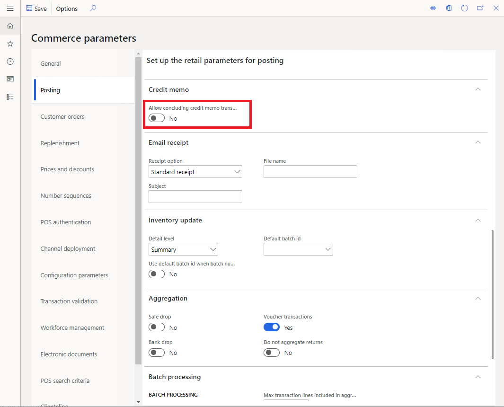

---
# required metadata

title: Seamless offline switch for gift card and credit memo operations
description: This topic provides an overview of improvements made to seamless offline switch for certain payment types. 
author: rubendel
manager: AnnBe
ms.date: 02/06/2020
ms.topic: article
ms.prod: 
ms.service: dynamics-365-retail
ms.technology: 

# optional metadata

# ms.search.form: 
# ROBOTS: 
audience: Application user
# ms.devlang: 
ms.reviewer: josaw
ms.search.scope: Operations, Retail
# ms.tgt_pltfrm: 
ms.custom: 141393
ms.assetid: 
ms.search.region: Global
ms.search.industry: Retail
ms.author: rubendel
ms.search.validFrom: 20120-02-28
ms.dyn365.ops.version: 10.0.8

---

# Seamless offline switch for gift card and credit memo operations

[!include [banner](../includes/banner.md)]

When a point of sale (POS) device loses connection with the channel database, most POS operations and transactions that are in progress may proceed after the cashier receives a warning that the channel database connection was lost. In certain cases, transactions may have elements that rely on the real-time service, and those elements may not be supported when offline. This topic describes some functionality that helps to reduce the impact when such scenarios occur. 

## Conclude gift card transactions in offline mode

Internal gift cards carry a dependency on the real-time service because the balance for the gift card must be maintained centrally within Dynamics 365 Commerce Headquarters. To prevent fraud or other sync issues, gift cards are locked as soon as they are added to a transaction. The locking function ensures that the gift card can't be used on multiple terminals at the same time. When a transaction concludes, the gift card is then updated and unlocked. 

To prevent a gift card from getting into an unusable state in scenarios where the gift card is added to a transaction and the POS then loses connectivity, Commerce has a configurable parameter which allows the transaction with a gift card line to be concluded while offline. When this parameter is enabled, gift card transactions that are forced offline will be saved with offline transactions and synchronize to Commerce Headquarters when the offline transactions are synchronized. The synchronization will also unlock the gift card so it may be used at another terminal. 

Commerce parameters are typically cached, so once this parameter is updated and the distribution schedule is initiated to synchronize it to the channel, the change make take up to 24 hours to take effect. Resetting Internet Information Services (IIS) can make the changes effective immediately. 

## Conclude credit memo transaction in offline mode

Like internal gift cards, credit memos also are centrally managed in Commerce Headquarters. Commerce has a parameter that supports concluding credit memo transactions while offline. This parameter functions the same as the gift card parameter mentioned above. If the parameter is enabled and a credit memo is forced offline, it will synchronize back to the channel database along with other transactions that were performed while offline. 

Commerce parameters are typically cached, so once this parameter is updated and the distribution schedule is initiated to synchronize it to the channel, the change make take up to 24 hours to take effect. Resetting IIS can make the changes effective immediately. 

## Related topics

- [Offline point of sale (POS) functionality](https://docs.microsoft.com/en-us/dynamics365/retail/pos-offline-functionality)
- [Online and offline point of sale (POS) operations](https://docs.microsoft.com/en-us/dynamics365/retail/pos-operations)
