# Set up a Microsoft Entra External ID in Commerce

[!include [banner](../includes/banner.md)]

This article explains how to set up your Microsoft Entra External ID tenant for user site authentication in Microsoft Dynamics 365 Commerce.

Dynamics 365 Commerce now supports Microsoft Entra External ID, Microsoft’s next-generation Customer Identity and Access Management (CIAM) solution from release 10.0.45 onwards. This enhancement ensures a modern, secure, and scalable identity experience for business-to-consumer (B2C) and business-to-business (B2B) scenarios.

> [!NOTE] 
> Following the end of sale for Azure AD B2C, existing Azure AD B2C tenants continue to be supported until May 2030, with no new feature development. New deployments must be provisioned using Microsoft Entra External ID, because Azure AD B2C is no longer available for new tenants.

## Prerequisites to enable Microsoft Entra External Id in eCommerce

Before you begin, please ensure to create an ICM with eCommerce team to enable the feature flight and follow the steps below to create & enable Microsoft Entra External Id tenant user authentication. 

## Create Microsoft Entra external tenant on Azure 

This section describes how to create a Microsoft Entra External tenant in the Microsoft Azure portal. Learn more in [Create a new tenant with external configurations](/entra/external-id/customers/quickstart-tenant-setup#create-a-new-tenant-with-external-configurations).

To create a Microsoft Entra External ID tenant in the Azure portal, follow these steps.

- Sign in to the [Azure portal](https://portal.azure.com/)
- From the Azure portal menu, select **Create a resource**. Be sure to use the subscription and directory that you'll connect with your Commerce environment.
  
    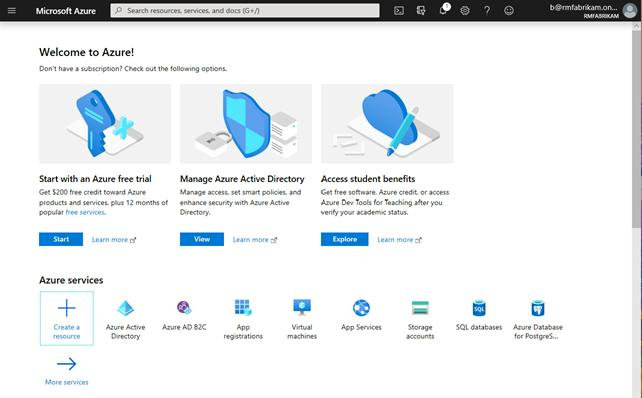
  
- Go to Identity > Microsoft Entra External ID.  
    On the **Basics** tab, in the **Create a tenant** page, enter the following information:
  
    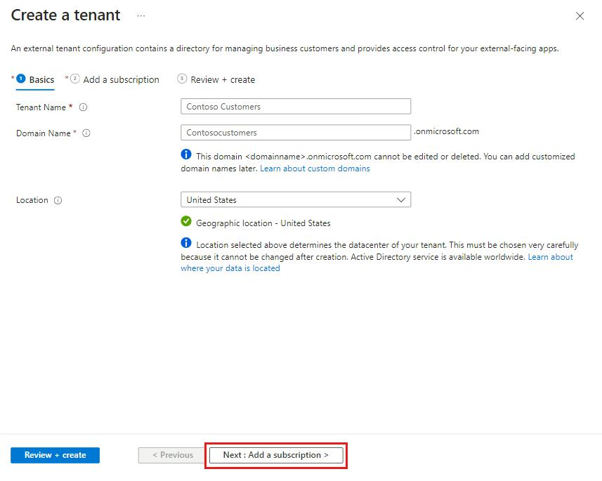

- Type your desired Tenant Name (for example Contoso Customers).
- Type your desired Domain Name (for example Contosocustomers).
- Select your desired Location. This selection can't be changed later.  

- Select Next: Add a subscription.  
    On the **Add a subscription** tab, enter the following information:
  
    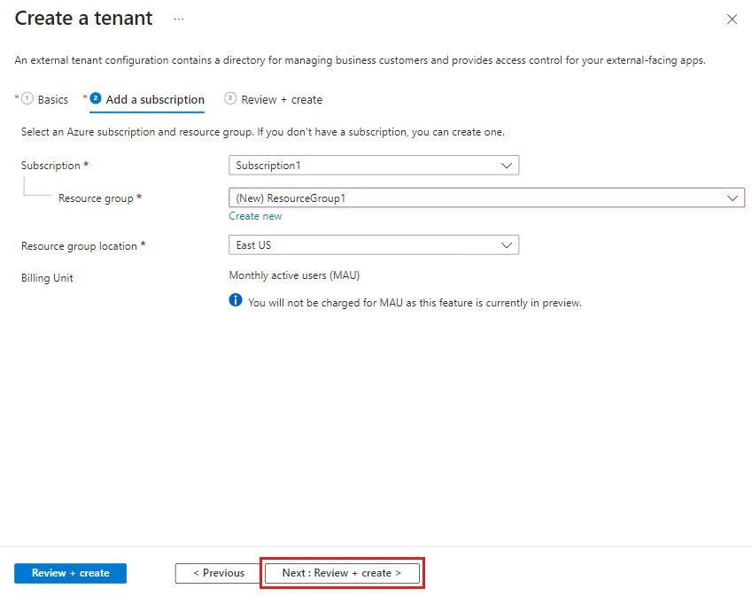
  
  - Next to Subscription, select your subscription from the menu.
  - Next to Resource group, select a resource group from the menu. If there are no available resource groups, select Create new, add a name, and then select OK.
  - If Resource group location appears, select the geographic location of the resource group from the menu.
- Select **Next: Review + create**. If the information that you entered is correct, select **Create**. The tenant creation process can take up to 30 minutes. You can monitor the progress of the tenant creation process in the **Notifications** pane. Once the tenant is created, you can access it in both the Microsoft Entra admin center and the Azure portal.
  
    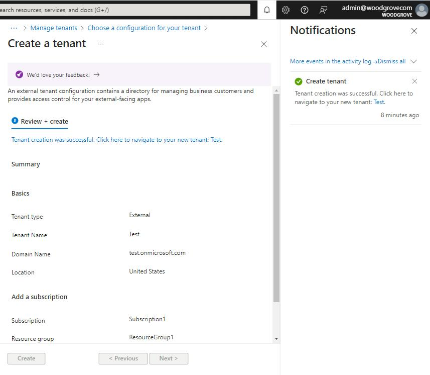

  
## Create a Entra External Id application

Once you create your External ID tenant, you'll create an application within your new Microsoft Entra tenant to interact with Commerce.

To create the application, follow these steps.

- In the Azure portal, navigate to the tenant you just created.
- Select **App registrations**, and then select **New registration**.
- Under **Name**, enter the name to give this application.
- Under **Supported account types**, select **Accounts in this organizational directory only (&lt;Tenant Name&gt; only - Single tenant).**
- For **Redirect URI**, enter your dedicated reply URLs as type **Web**. For information on reply URLs and how to format them, refer [Reply Urls](https://microsoftapc-my.sharepoint.com/:w:/g/personal/keshav_microsoft_com/EW4oCtEbyfREufMDcgYfvS8BzKX3gjMjiLdDuSU26IZ9Tw?e=0ZcweA&nav=eyJoIjoiMTc1MjM5Nzg3OCJ9) section. A redirect URI/reply URL must be entered to enable redirections from Microsoft Entra External ID back to your site when a user authenticates. The reply URLs can be added during the registration process, or can be added later by selecting the **Add URI** link from the **Web Redirect URIs** section in the External ID application's **App Registration -> Manage -> Authentication**  menu.
- Select **Register**.
- Select the newly created application and navigate to the **Authentication** menu.
- If a reply URL is entered, select both the **Access tokens** and **ID tokens** options to enable them for the application, and then select **Save**. You are now able to select both the **Access tokens** and **ID tokens** options. If a reply URL wasn't entered during registration, it can also be added on this page by selecting **Add a platform**, selecting **Web**, and then entering the redirect URI of the application.
  
    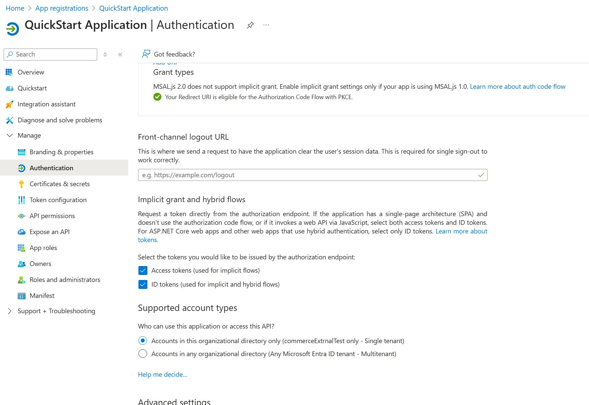
  
- Navigate to **API Permissions** menu and **add all the microsoft graph permissions shown in image below and select** "**Grant admin consent for &lt;TenantName&gt;"**.
  
    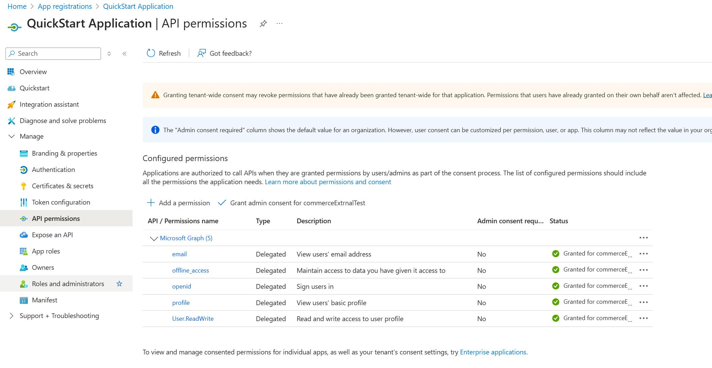
  
- Next go to **Token Configuration** menu, select **Add optional claim** button. A sidebar will open, select **ID** in the token type and then select **Family_name** and **Given_name** in claims and click add.  
    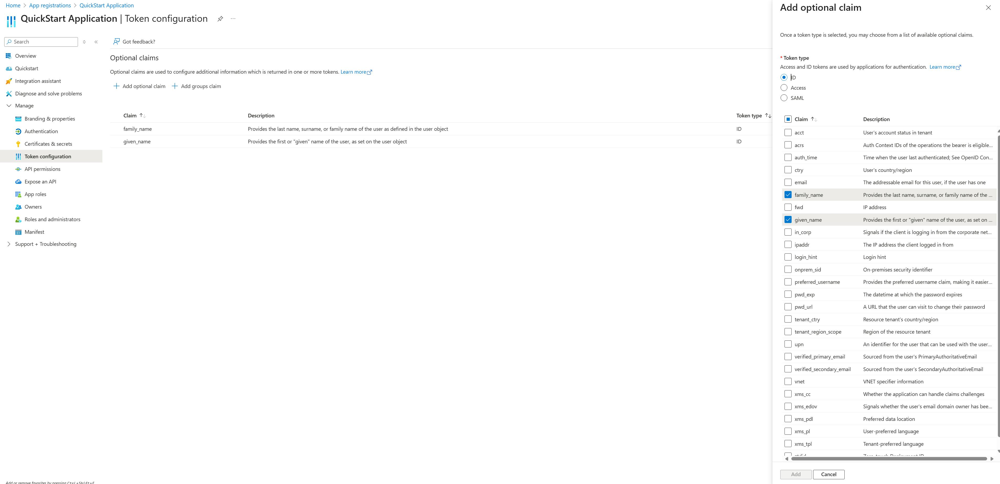
- Go to the **Overview** menu of the Azure portal and copy the **Application (client) ID**. Note this ID for later setup steps (referenced later as the **Client GUID**).

## Reply URLs

Reply URLs are important as they provide an allow list of the return domains when your site calls Microsoft Entra External ID to authenticate a user. This permits the return of the authenticated user back to the domain from which they're signing into (your site domain).

In the **Reply URL** box on the **Microsoft Entra External ID - Applications > New application** screen, you need to add separate lines for both your site domain and (once your environment is provisioned) the Commerce-generated URL. These URLs must always use a valid URL format and must be base URLs only (no trailing forward slashes or paths). The string /\_msdyn365/authresp then needs to be appended to the base URLs, as in the following examples.

- `https://www.fabrikam.com/_msdyn365/authresp` (The domain should match the e-commerce domain exactly. If you have multiple domains, you must add this URL for each domain.)
- `https://fabrikam-prod.commerce.dynamics.com/_msdyn365/authresp`

## Create user flow

User flows are the policies Microsoft Entra External ID uses to provide secure sign in, sign up and forget password user experiences. Dynamics 365 Commerce uses these flows to perform the actions to interact with the Microsoft Entra External ID tenant. When a user interacts with these flows, they're redirected to the Microsoft Entra external id tenant to perform the actions.

Microsoft Entra External supports only one type of flow as of now, which is used for sign in, sign up and password reset.

For information on customizing the default branding in user flows, see [Customize the neutral branding in your external tenant](/entra/external-id/customers/how-to-customize-branding-customers).

To create user flow in External ID, follow these steps:

- Navigate to **Microsoft Entra Id** in this External ID tenant.
- Select **External Identities** menu from the left navigation bar.
- Next select **User flows** in Self-service signup section as shown in image below:  
    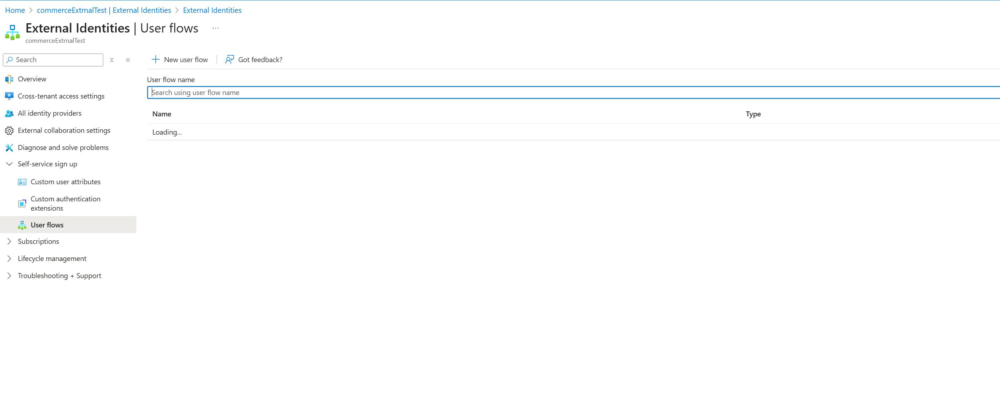

- Select **New User Flow.**
- Under Name, enter a policy name. Then select any Identity provider. And finally select the User attributes to be collected on signup.  
    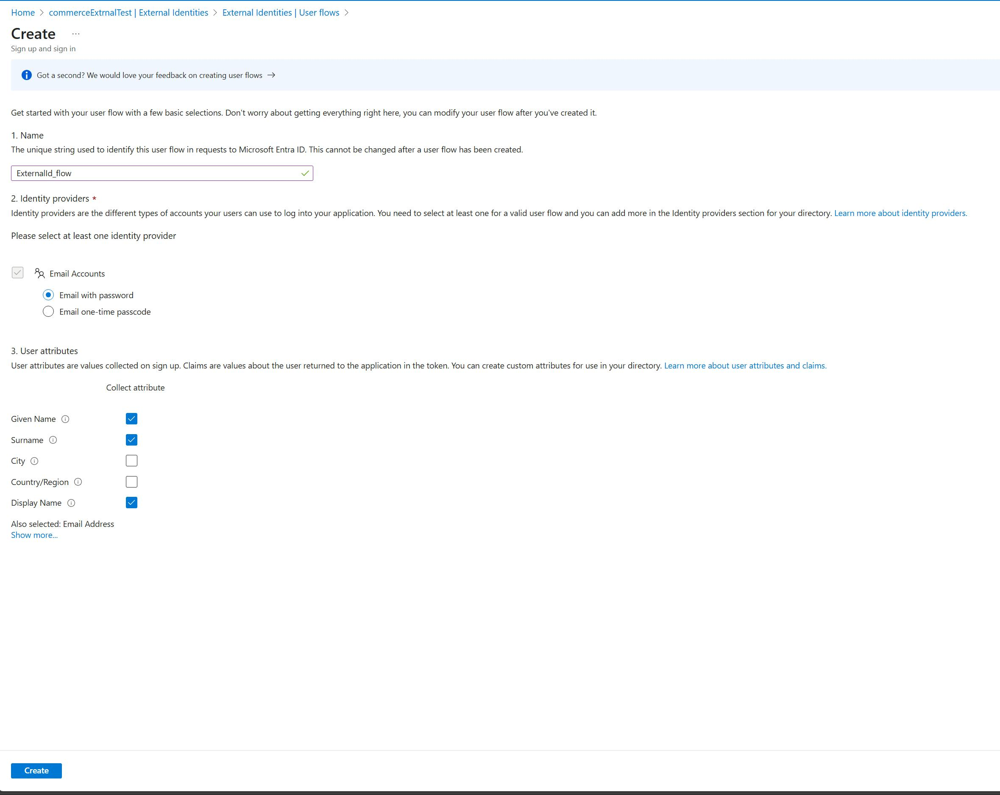
    (**Note:** The **Email address**, **Given Name**, and **Surname** attributes are mandatory for correct implementation and functionality of the policies.)
- Select **Create**.

## Update Commerce Headquarters with the new Microsoft Entra External Id information

To update headquarters with the new Microsoft Entra External id information, follow these steps.

- In Commerce, go to Commerce Shared Parameters and select Identity Providers in the left menu.
- Under Identity Providers, do the following:  
    In the Issuer box, enter the identity provider issuer string. To find your issuer string, see [Obtain issuer string for headquarters setup](https://microsoftapc-my.sharepoint.com/:w:/g/personal/keshav_microsoft_com/EW4oCtEbyfREufMDcgYfvS8BzKX3gjMjiLdDuSU26IZ9Tw?e=vbN2iz&nav=eyJoIjoiOTQwMDI0MDk1In0%3D) below.
- In the Name box, enter a name for your issuer record.
- In the Type box, enter **Open ID Connect**.
- Under Relying Parties, with the above external id identity provider item selected, do the following:
- In the ClientID box, enter your Entra external id application ID, which you created in [Create a Entra External Id appliction](https://microsoftapc-my.sharepoint.com/:w:/g/personal/keshav_microsoft_com/EW4oCtEbyfREufMDcgYfvS8BzKX3gjMjiLdDuSU26IZ9Tw?e=vEOQyB&nav=eyJoIjoiNDA4NjAxMjgifQ%3D%3D).
- In the Type box, enter Public.
- In the User Type box, enter Customer.
- On the action pane, select Save.
- In the Commerce search box, search for Distribution schedule
- In the left navigation menu of the Distribution schedules page, select job 1110 Global configuration.
- On the action pane, select Run Now.

### Obtain issuer string for headquarters setup

To obtain your identity provider issuer string, follow these steps.

- On the Microsoft Entra external id page of the Azure portal, navigate to your user flow.
- In **overview section**, select **Run user flow**.
- Ensure that your application is set to your intended Microsoft Entra external id application created above, and then select the user flow link that appears under the Run user flow header that includes .../.well-known/openid-configuration?appid=&lt;Application_id&gt;. (Don't select Run user flow.) A new tab will open displaying metadata for the policy to collect the issuer string.
- On the metadata page displayed in your browser tab, copy the identity provider issuer string (the value for issuer starting with "https://" and ending with "/v2.0/") that looks similar to the following example:

`https://ab12cd34ef56-9999-4bbb-846d-ed4b0283d8d7.ciamlogin.com/ab12cd34ef56-9999-4bbb-846d-ed4b0283d8d7/v2.0`.

Setting Up an Authentication Profile in Site Builder

Create **Site Authentication Profile**

- Navigate to **Tenant Settings** > **Site Authentication Setup**.

2\. Add a New Authentication Profile

- Click **Manage**.
- Select **Add Site Authentication Profile**.

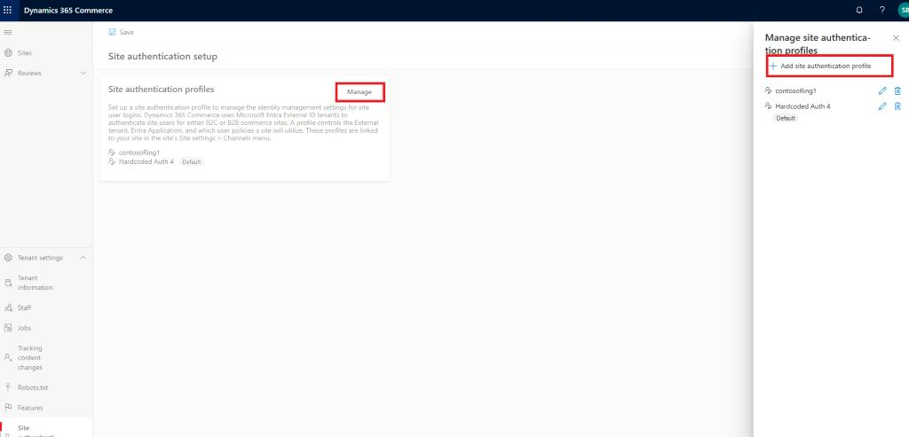

3\. Fill in Mandatory Fields

- **Application Name**: Provide name for the authentication profile.
- **Tenant Name**: Specify the name of the EEID tenant as created in the Azure Portal.
- **Client GUID**: Provide the GUID of the app registration associated with the sign-in/sign-up user flow.

Apply the Authentication Profile to Your Site

- Once the authentication profile is created, it becomes available for use.
- Go to **Site Settings** and then **Channels**.
- Select the channel where you want to update your authentication.
- Choose the newly created authentication profile.
- Save and publish your changes.

**Result**: **EEID** authentication setup is now complete and active for your site.

## Edit Profile Page Configuration

EEID does not support custom HTML pages. By default, For EEID, only supports the edit profile page if it is associated with the **/editprofile** URL endpoint. Create a new URL for the edit profile page with the **/editprofile** endpoint using below steps.

- Go to **URLs** > **Create New URL** with endpoint '**/editprofile**'.

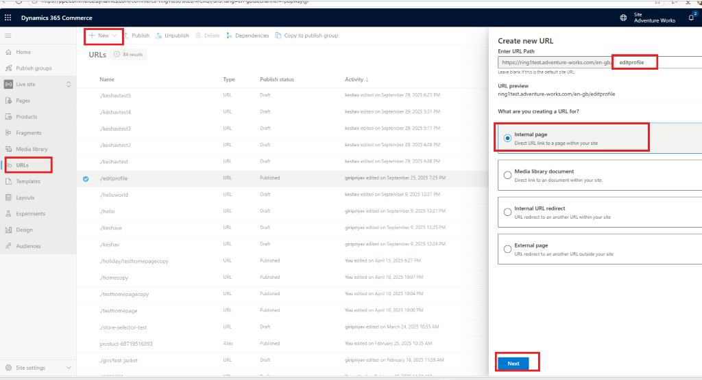

- Click **Next**, select the profile page, and click **Create**.

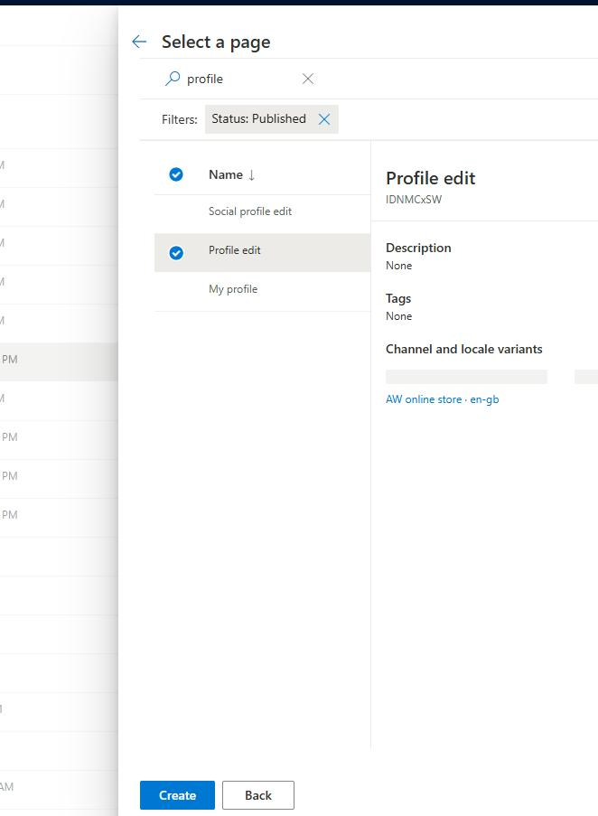

- Publish changes

## Updates to the Account-Profile-Edit Module (Online SDK)

With **AADB2C**, implementing profile editing required only an HTML page that followed a specific contract-AADB2C itself handled the actual rendering of the edit profile page.

With **EEID**, this approach is not supported. To address this, the account-profile-edit module has been enhanced to provide edit profile functionality directly within the commerce environment, removing the dependency on EEID for rendering. As a result, the module now supports profile updates for both **AADB2C** and **EEID** environments.

Below are the changes done to allow profile update via onerf API in account-profile-edit module, when External Entra ID is enabled.

- **account-profile-edit.tsx**: Introduced new state variables and methods (e.g., useEntraExternalId, \_renderEntraExternalIdAccount, \_handleOneRFSave) to manage External Entra ID logic and OneRF API calls.
- **account-profile-edit.view.tsx**: Added conditional rendering using a dedicated entraContainer for External Entra ID scenarios.
- **account-profile-edit-input.tsx**: Updated the input component to include a disabled parameter.
- **update-profile-onerf.ts and retail-actions/index.ts**: Added a new OneRF profile update action and exported its associated classes to support the API integration.
