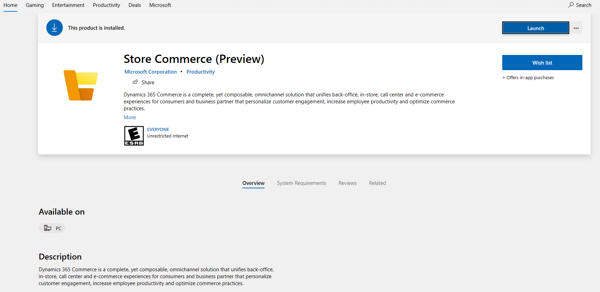

# Store Commerce app in Microsoft Dynamics 365 Commerce (Preview)

[!include [banner](../includes/banner.md)]

[!include [banner](../includes/preview-banner.md)]

This topic applies to Dynamics 365 Commerce version 10.0.20 and later.

The Store Commerce app in Microsoft Dynamics 365 Commerce provides rich commerce functionality for first-line workers such as cashiers, sales associates, inventory associates, stock clerks, and store managers. It lets these workers perform commerce operations such cash-and-carry transactions, cash/shift management, customer engagement, assisted selling, clienteling, endless aisle, order processing/fulfillment, inventory management, and reporting.

Store Commerce provides the benefits of both MPOS and CPOS.

> [!NOTE]
> Store Commerce is released as a preview app. It uses the [Microsoft Edge WebView2](/microsoft-edge/webview2/) control, which is also in preview. Therefore, do **not** use Store Commerce in production until it's generally available (GA).

Store Commerce is a shell app for Windows that uses the [Microsoft Edge WebView2](/microsoft-edge/webview2/) control to render the Cloud Point of Sale (CPOS) app. Although CPOS can run only in a web browser, Store Commerce can run as a native Windows app such as [Modern Point of Sale (MPOS)](retail-modern-pos-architecture.md).

Store Commerce supports local hardware station, and can be directly integrated with a payment terminal, printer, and cash drawer. You don't have to set up a shared hardware station to use hardware devices.

To render the user interface (UI), Store Commerce uses the Chromium engine instead of the Universal Windows Platform (UWP) app rendering framework. The Chromium engine has better rendering performance than the native JavaScript UWP app in Windows. The main difference between MPOS and Store Commerce is that Store Commerce uses the Chromium engine to render the app.

## Benefits of Store Commerce app:

+ Simplified Application lifecycle management (ALM) using Microsoft Store.
+ Extension or ISV code developed for MPOS or CPOS can be reused in Store Commerce.
+ Store Commerce provides the benefits of both MPOS and CPOS.
+ Better performance.
+ Easier POS and extension upgrades.
+ Support for dedicated hardware station (HWS).
+ Support for offline, in the future.

## Application lifecycle management

Store Commerce is an app that runs on Windows devices. It will be available from [Windows Apps - Microsoft Store](https://aka.ms/StoreCommerceApp) so that it's easier to find, download, and deploy. Therefore, the overall lifecycle of deployment and servicing will be simplified.

Store Commerce is both forward compatible and backward compatible. It can easily be updated, either by setting up the Windows policy or by using any update and deployment tool that Microsoft Store apps support, such as Intune. It can be updated independently of the Cloud Scale Unit (CSU) and extensions.

For MPOS, more manual management is required to get the app and package it with extensions. However, because Store Commerce is deployed through Microsoft Store, application lifecycle management (ALM) is greatly simplified.

Store Commerce is a shell that renders CPOS. Therefore, to get the updated CPOS functionality, you should also update CPOS. CPOS can be updated from the CSU. For more information about how to update the CSU, see [Apply updates and extensions to Commerce Scale Unit (cloud)](../../fin-ops-core/dev-itpro/deployment/update-retail-channel.md).

## Store Commerce and MPOS parity

Store Commerce will have full functional parity with MPOS in the future. Currently, Store Commerce doesn't support running offline (when there is no connectivity to Headless Commerce). For more information about the different POS apps and topology, see [Choose between Modern POS (MPOS) and Cloud POS](../mpos-or-cpos.md)

## Store Commerce and CPOS parity

Store Commerce renders CPOS and have full functional parity with CPOS, Store Commerce  in addition supports dedicated hardware station and supports offline in the future.

## Choosing between Store Commerce and MPOS

Store Commerce renders CPOS but has full parity with MPOS. Both Store Commerce and MPOS are Universal Windows Platform (UWP) apps and they support local hardware station. Store Commerce doesn't currently support offline, but it will in the future. 

Because Store Commerce uses the Chromium engine to render the UI, it provides better rendering performance than MPOS. Additionally, because Store Commerce is deployed through Microsoft Store, ALM is greatly simplified. By contrast, MPOS is self-serviced by using Microsoft Dynamics Lifecycle Service (LCS) and Commerce headquarters.

Eventually, MPOS will be deprecated and replaced by Store Commerce.

If you don't require offline support in your store, you should choose Store Commerce instead of MPOS.

<table>
<thead>
<tr>
<th></th>
<th>Store Commerce (Preview)</th>
<th>MPOS</th>
</tr>
</thead>
<tbody>
<tr>
<th scope="row">Operating environment</th>
<td>Windows</td>
<td>Windows</td>
</tr>
<tr>
<th scope="row">ALM</th>
<td>Store Commerce is deployed through Microsoft Store, and CPOS is deployed through CSU.</td>
<td>MPOS is self-serviced by using LCS and Commerce headquarters. It's packaged and installed by using the MPOS installer.</td>
</tr>
<tr>
<th scope="row">Extensions</th>
<td>Extensions are deployed to CPOS.</td>
<td>Extensions are packaged with MPOS, or an independent extension package is used.</td>
</tr>
<tr>
<th scope="row">Support for offline mode</th>
<td>No (but it will be added in the future)</td>
<td>Yes</td>
</tr>
<tr>
<th scope="row">Support for local hardware station</th>
<td>Yes</td>
<td>Yes</td>
</tr>
<tr>
<th scope="row">UI rendering engine</th>
<td>The Chromium engine is used to render the UI.</td>
<td>The UWP app rendering framework is used to render the UI.</td>
</tr>
</tbody>
</table>

## Setup and installation

### Prerequisite

+ Windows 10 version 17763.0 or higher or Windows Server 2019.
+ Microsoft Edge, because the app uses the Microsoft Edge WebView2 control.
+ Dynamics 365 Commerce (Back office and CPOS).

### Device setup in Commerce headquarters

For Store Commerce, a new application type that is named **Store Commerce** has been added on the **Devices** page (**Retail and Commerce \> Channel setup \> POS setup \> Devices**). Select this application type when you create a device for Store Commerce.

If you are not able to see the Store Commerce application type in the drop down menu, try running the **Initialize** from the Retail and Commerce > Headquarters setup > Parameters> Commerce parameters > General  > **Initializer** and refresh the page.

You must create a [register](../tasks/create-associate-registers.md) and a [device](../tasks/create-associate-device.md) for Store Commerce. Then, before you activate the app, run the register job from the distribution schedule in Commerce headquarters. During device creation, set the **Application type** field to **Store Commerce**.

Store Commerce is available in Microsoft Store. To download and install the app, follow these steps.

1. Open [Windows Apps - Microsoft Store](https://aka.ms/StoreCommerceApp), and search for **Store Commerce**.
2. Select **Get** to install the app.
3. On the Windows **Start** menu, search for **Store Commerce**, and open the app.

After the app is opened, follow these steps to configure and activate it.

1. On the app's start page, enter the CPOS URL. You can find this URL on the environment details page in LCS or on the **Channel profiles** page in Commerce (**Dynamics 365 Commerce \> Channel setup \> Channel profiles**).
2. Select **Save**.
3. Activate Store Commerce be following the steps in [POS activation guide](retail-device-activation.md#activate-a-modern-pos-or-cloud-pos-device-by-using-guided-activation).
4. Sign in by using an employee account.

You can now complete your commerce operations.

### Troubleshooting setup issues

#### Reset the app

If the CPOS URL that you entered isn't valid and you want to change it, or if the app is in an error state during activation, you can restart the process by resetting the app.

1. On the Windows **Start** menu, select and hold (or right-click) the app, and then select **More \> App settings**.
2. Scroll down the app settings page until you find the **Reset** button.
3. Select **Reset**, and then, when you're prompted, confirm that you want to reset the app.

## Customizing the app

You can customize Store Commerce by using the POS extension support that the Retail software development kit (SDK) provides. You can modify and create the POS user experience, enhance or modify out-of-box functionality, add validations, and add custom features. For more information, see [Point of Sale (POS) extension overview](pos-extension/pos-extension-overview.md).

Extensions that are developed by using the Retail SDK will work for CPOS, MPOS, and Store Commerce. However, the way that the extension is packaged and deployed by MPOS and CPOS differs.

Because Store Commerce renders CPOS, you must follow the CPOS packaging and deployment options to deploy Store Commerce extensions.

### Hardware station extension

Store Commerce can be extended so that it's integrated with hardware devices. You can use the [sample extension code](https://github.com/microsoft/Dynamics365Commerce.InStore/tree/release/9.28/src/PosSample) that has been added in GitHub to generate Store Commerce hardware station extension (HWS) packages. For more information, see [Integrate the POS with a new hardware device](hardware-device-extension.md).

## Known issues with the Microsoft Edge WebView2 control

+ During activation, when prompted for entering the AAD password with multiple options, choose password. The other options might not work.
+ Tabbing inside the app by pressing the Tab key may not work. Instead, click or select items.
+ Using the mouse for drop-down selection might not work. Instead, use the keyboard to make a selection.

[!INCLUDE[footer-include](../../includes/footer-banner.md)]
