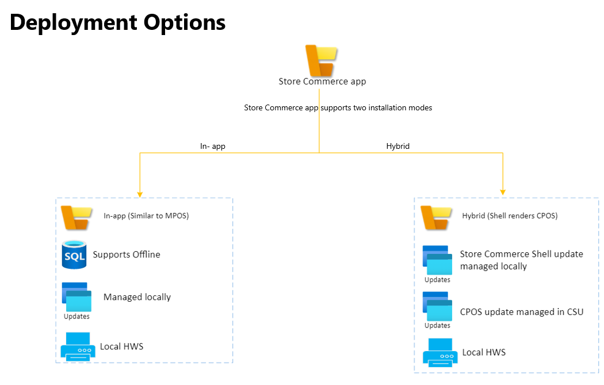
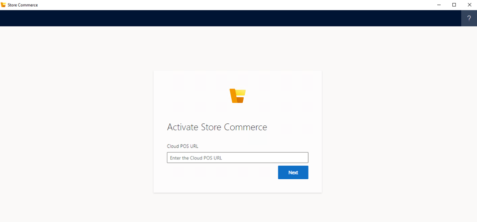

# Store Commerce app

[!include [banner](../includes/banner.md)]

This article explains how to set up and configure the Microsoft Dynamics 365 Commerce Store Commerce app for Windows. It applies to Dynamics 365 Commerce versions 10.0.25 and later.

The Dynamics 365 Commerce Store Commerce app is the next-generation offering for physical stores. It unifies Modern point of sale (MPOS) and Cloud point of sale (CPOS) into a single application, providing deployment choices to retailers, helping improve performance, and offering superior application lifecycle management (ALM) while retaining all the functionality of MPOS and CPOS, including extensibility.

The Store Commerce app provides rich commerce functionality for first-line workers such as cashiers, sales associates, inventory associates, stock clerks, and store managers. It lets these workers perform commerce operations such cash-and-carry transactions, cash/shift management, customer engagement, assisted selling, clienteling, endless aisle, order processing/fulfillment, inventory management, and reporting.

The Store Commerce app is a [Windows Presentation Foundation (WPF)](/dotnet/desktop/wpf/?view=netdesktop-6.0&preserve-view=true) shell application for Windows that uses the [Microsoft Edge WebView2](/microsoft-edge/webview2/) control to render the CPOS application. Although CPOS can run only in a web browser, Store Commerce can run as a native Windows application like [MPOS](retail-modern-pos-architecture.md) does, providing the benefits of both MPOS and CPOS.

Store Commerce supports local hardware station and offline usage, and can be directly integrated with a payment terminal, printer, and cash drawer. It can use hardware devices without requiring that a shared hardware station be set up.

To render the user interface (UI), Store Commerce uses the Chromium engine instead of the Universal Windows Platform (UWP) app rendering framework. The Chromium engine has better rendering performance than the native JavaScript UWP app in Windows. The main difference between MPOS and Store Commerce is that Store Commerce uses the Chromium engine to render the app.

The Store Commerce app is also available for the Android and iOS platforms. For more information, see [Store Commerce for mobile](store-commerce-mobile.md). 

## Benefits of Store Commerce

- Application lifecycle management is simplified.
- Extension or independent software vendor (ISV) code that is developed for MPOS or CPOS by using the Commerce software development kit (SDK) can be reused in Store Commerce with minimal changes.
- The industry-standard developer experience uses Microsoft Visual Studio Code and GitHub.
- Store Commerce provides the benefits of both MPOS and CPOS.
- Performance is significantly improved.
- POS and extension upgrades are simplified through the Commerce sealed installer framework.
- Dedicated hardware station is supported.
- Offline deployment is supported.

To review the capabilities of the Store Commerce app, see [Store Commerce app capabilities](../store-commerce-capabilities.md).

## Application lifecycle management

The Store Commerce app runs on Windows devices and can be downloaded from the [Shared asset library in Microsoft Lifecycle Services (LCS)](https://lcs.dynamics.com/V2/SharedAssetLibrary). On the **Shared asset library** page, select **Retail Self-service package** as the asset type, and then find the file that ends with "Store Commerce." Be sure to select the version for the Commerce release that you're using (for example, 10.0.25 or 10.0.26).

### Store Commerce deployment options

Store Commerce supports two types of deployment topologies:

- **In-app** – All the components, such as Modern Point of Sale (MPOS), are deployed locally. Offline mode and local Hardware Station (HWS) are supported.
- **Hybrid** – Store Commerce renders the Cloud POS that is deployed in Commerce Scale Unit (CSU) and supports local Hardware Station. However, offline isn't supported.

There are no separate installers for the hybrid and in-app topologies. The deployment options are determined by the parameters that are passed during installation.

### In-app deployment

For the in-app deployment option, the application content is locally deployed in Store Commerce, just as for MPOS. Store Commerce then renders the application content from its local deployment. It doesn't connect to CPOS that is hosted in CSU to get the application content.

To update the application content, run the latest version of the Store Commerce installer. The application content won't be updated if you update the CSU. Therefore, you can manage the updates at individual registers.

In-app deployment supports offline mode. During installation, pass the **--installoffline** parameter to deploy the offline database. In offline mode, the application won't be able to connect to CSU or Commerce headquarters, and will use the locally deployed CRT.

> [!NOTE]
> During the installation of Store Commerce, users can pass parameters to select either the hybrid option or the in-app option. The default option is in-app deployment.

### Hybrid deployment

Store Commerce is a shell that renders CPOS and connects to Headless Commerce and Commerce headquarters by using CSU in online mode. In hybrid mode, Store Commerce app content is rendered from CPOS that is hosted in CSU. When the Store Commerce app is opened, it will prompt for the CPOS URL.

To update Store Commerce, just update the CSU. Store Commerce will then automatically receive the update. Because updates are centrally managed in CSU, they don't have to be managed at individual registers. The Store Commerce application shell must still be updated separately by using the installer. For more information about how to update the CSU, see [Apply updates and extensions to Commerce Scale Unit (cloud)](../../fin-ops-core/dev-itpro/deployment/update-retail-channel.md). 

## Store Commerce and MPOS parity

Store Commerce has full functional parity with MPOS. For more information about the different POS applications and topologies, see [Choose between Modern POS (MPOS) and Cloud POS](../mpos-or-cpos.md).

## Hardware parity between MPOS and Store Commerce

The Store Commerce app does not support Universal Windows Platform (UWP) peripherals that are [Point of Service devices](/windows/uwp/devices-sensors/pos-get-started.md). If you are currently using a Universal Serial Bus (USB) scanner or magnetic stripe reader in plug-and-play mode, you will need to install OLE for Retail POS (OPOS) drivers and configure these devices in your hardware profile so they work with the Store Commerce app. For more information about Store Commerce peripheral support, refer to the [Commerce peripherals](../retail-peripherals-overview.md) article.

To migrate from MPOS to Store Commerce, refer the [Migrate Modern POS to Store Commerce](pos-extension/migrate-mpos-store-commerce.md) article.

## Store Commerce and CPOS parity

Store Commerce has full functional parity with CPOS. In addition, Store Commerce supports dedicated hardware station and offline deployment.

## Store Commerce and MPOS/CPOS

The Store Commerce apps for Windows and mobile platforms are the next generation of POS applications for Dynamics 365 Commerce. Microsoft will deprecate MPOS and the [Retail hybrid apps](hybridapp.md) in October 2023, and recommends that you use Store Commerce or CPOS for all new deployments. Existing customers should plan to migrate MPOS to Store Commerce. 

### Comparison between Store Commerce and MPOS

<table>
<thead>
<tr>
<th></th>
<th>Store Commerce</th>
<th>MPOS</th>
</tr>
</thead>
<tbody>
<tr>
<th scope="row">Operating environment</th>
<td>Windows</td>
<td>Windows</td>
</tr>
<tr>
<th scope="row">ALM</th>
<td>Store Commerce is self-serviced by using LCS and Commerce headquarters. It's packaged and installed by using the Store Commerce installer, and CPOS is deployed through CSU.</td>
<td>MPOS is self-serviced by using LCS and Commerce headquarters. It's packaged and installed by using the MPOS installer.</td>
</tr>
<tr>
<th scope="row">Extensions</th>
<td>Extensions are deployed to CPOS or installed by using the extension installer.</td>
<td>Extensions are packaged with MPOS, or an independent extension package is used.</td>
</tr>
<tr>
<th scope="row">Support for offline mode</th>
<td>Yes</td>
<td>Yes</td>
</tr>
<tr>
<th scope="row">Support for local hardware station</th>
<td>Yes, but does not support UWP peripherals that are Point of Service devices. For more information about Store Commerce peripheral support, refer the [Commerce peripherals](../retail-peripherals-overview.md) article.</td>
<td>Yes</td>
</tr>
<tr>
<th scope="row">UI rendering engine</th>
<td>The Chromium engine is used to render the UI.</td>
<td>The UWP app rendering framework is used to render the UI.</td>
</tr>
</tbody>
</table>

## Setup and installation

### Prerequisites

- Store Commerce is supported on the following operating systems:
  - Windows 11 (Pro, Enterprise, Enterprise LTSC, and IoT Enterprise LTSC.)
  - Windows 10 (Pro, Enterprise, Enterprise LTSC, and IoT Enterprise LTSC) with the latest available updates.
  - Windows Server 2022 (Standard, Essentials.) 
  - Windows Server 2019 (Standard, Essentials) with the latest available updates.

- [Microsoft Edge WebView2](https://developer.microsoft.com/microsoft-edge/webview2/) (Use the Evergreen Standalone Installer.)
- SQL Server Express, SQL Server Standard, or SQL Server Enterprise (required only for offline mode). For information on which SQL Server edition to use, see [Commerce offline implementation and troubleshooting](implementation-considerations-offline.md).
- Dynamics 365 Commerce (Commerce headquarters and Cloud Scale Unit)
- The .NET Framework version 4.7.2 or later. See [Install the .NET Framework](https://dotnet.microsoft.com/download/dotnet-framework)

### Device setup in Commerce headquarters

For Store Commerce, a new application type that is named **Store Commerce** has been added on the **Devices** page (**Retail and Commerce \> Channel setup \> POS setup \> Devices**). Select this application type when you create a device for Store Commerce.

If the **Store Commerce** application type doesn't appear on the drop-down menu, try to run the **Initialize** function from the **General** tab of the **Commerce parameters** page (**Retail and Commerce \> Headquarters setup \> Parameters \> Commerce parameters**). Then refresh the page.

You must create a [register](../tasks/create-associate-registers.md) and a [device](../tasks/create-associate-device.md) for Store Commerce. Then, before you activate the app, run the register job from the distribution schedule in Commerce headquarters. During device creation, set the **Application type** field to **Store Commerce**.

### Device installation

Store Commerce can be downloaded from the [LCS Shared asset library](https://lcs.dynamics.com/V2/SharedAssetLibrary). On the **Shared asset library** page, select **Retail Self-service package** as the asset type, and then find the file that ends with **Store Commerce**. After the file has been downloaded, follow these steps to install the app.

1. Go to the folder where you downloaded Store Commerce, and open PowerShell in administrator mode.
1. In PowerShell, find the Store Commerce installer, and pass the **install** parameter to install the app. To install offline components, pass the **--installoffline** parameter. (For example, enter `Store_Commerce Installer_exe_name install --installoffline`.) If you want to enable debugging mode during installation, pass the **--enablewebviewdevtools** parameter. 

### Store Commerce installation parameters

You can also use the **help** command in PowerShell to find information about all the parameters. In PowerShell, find the Store Commerce installer, and then enter `Store_Commerce Installer_exe_name help install`.

| Parameter | Description |
|---|---|
| installoffline | Deploy the offline database. |
| sqlservername | Specify the name of the SQL Server instance that Store Commerce uses in offline mode. If you don't specify this parameter, the installer will use a default instance. |
| skipsqlfulltextcheck | Skip validation of the SQL Full-Text Search that is required for offline deployment. |
| trustsqlservercertificate | Trust the SQL Server certificate when a connection is established to SQL Server. To help avoid security risks, you should never use this argument for production deployments. By default, the SQL Server certificate isn't trusted. |
| enablewebviewdevtools | Enable developer tools for Store Commerce. If you don't specify this parameter, developer tools will be enabled only if Windows Developer Mode is enabled. |
| retailserverurl | Specify the default Retail Server URL to use for Store Commerce. If you don't specify this parameter, the user will be prompted to enter the Retail Server URL during device activation. |
| useremoteappcontent | Use the remote application content to download the Store Commerce app content from CPOS that is hosted in CSU. By default, the local application content that is deployed with Store Commerce is used. |
| skipversioncheck | Skip the validation during downgrade. |
| skipurlcheck | Skip the validation of URLs that are passed to the installer. |
| logdirectorypath | Specify the path of the log's directory. |
| config | Specify the path of the configuration file that will be used as part of the installation. |
| verbosity | Deploy the offline database. |
| help | Show parameter information.|
| version | Show information about the app version. |

### Activate Store Commerce

To activate Store Commerce after installation, follow these steps.

1. On the Windows **Start** menu, search for **Store Commerce**, and then open the application.
1. On the application's start page, if you select **Remote app content** as the deployment option, enter the CPOS URL, and then select **Save**. You can find the CPOS URL on the environment details page in LCS or on the **Channel profiles** page in Commerce (**Dynamics 365 Commerce \> Channel setup \> Channel profiles**).
1. Activate Store Commerce by following the steps in the [POS activation guide](retail-device-activation.md#activate-a-modern-pos-or-cloud-pos-device-by-using-guided-activation).
1. After activation is completed, sign in to the application by using an employee account.

### Troubleshoot setup issues

For troubleshooting information, see [Troubleshoot Store Commerce setup and installation issues](../troubleshoot/store-commerce-setup-installation.md).

## Customize the app

Store Commerce can be customized by using the Commerce SDK. You can modify and create the POS user experience, enhance or modify out-of-box functionality, add validations, and add custom features. For more information, see [Point of Sale (POS) extension overview](pos-extension/pos-extension-overview.md), or review the samples on [GitHub](https://github.com/microsoft/Dynamics365Commerce.InStore).

### Hardware station extension

Store Commerce can be extended so that it's integrated with hardware devices. You can use the [sample extension code](https://github.com/microsoft/Dynamics365Commerce.InStore) that has been added in GitHub to generate Store Commerce hardware station extension packages. For more information, see [Integrate the POS with a new hardware device](hardware-device-extension.md).

## Known issues with the Microsoft Edge WebView2 control

+ During activation, when prompted for entering the AAD password with multiple options, choose password. The other options might not work.

## Additional Resources
[Store Commerce app capabilities](../store-commerce-capabilities.md)

[Modernizing the Dynamics 365 Commerce in-store technology stack](https://www.microsoft.com/download/details.aspx?id=103896)

[Commerce SDK Tech Talk Series](https://community.dynamics.com/365/dynamics-365-fasttrack/b/techtalks/posts/techtalk-series-commerce-extensions)

[Store Commerce Extensions Overview](pos-extension/pos-extension-overview.md)

[!INCLUDE[footer-include](../../includes/footer-banner.md)]
