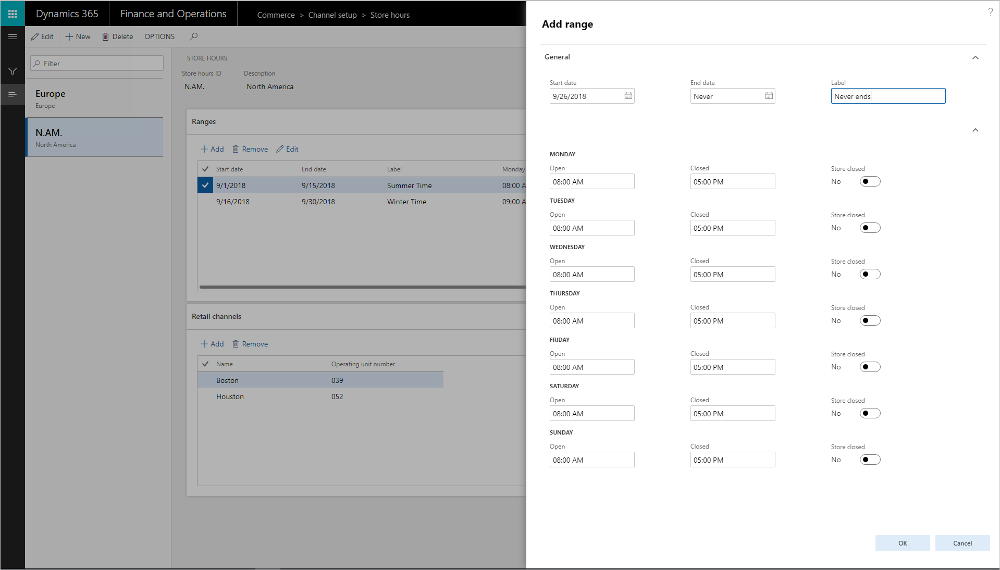
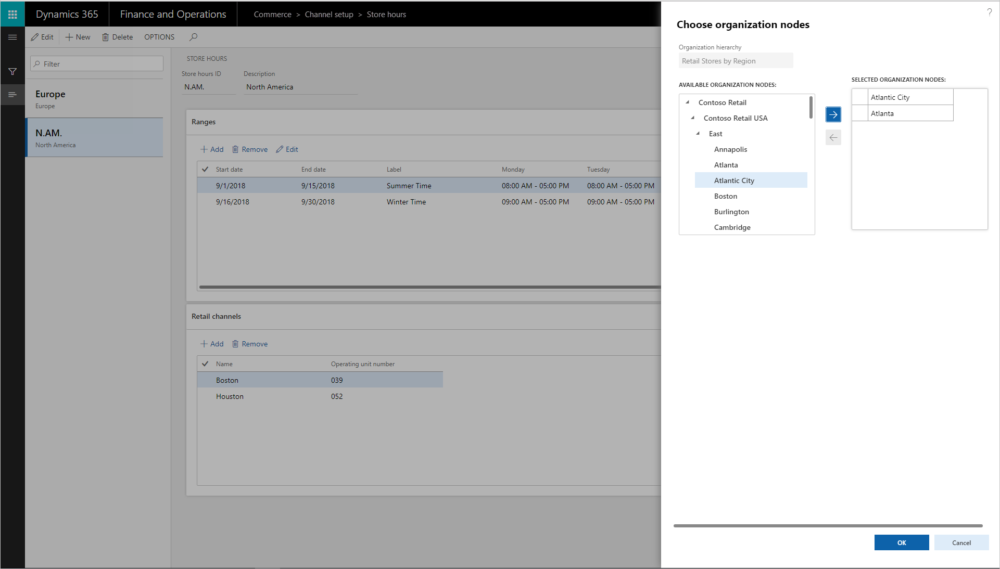
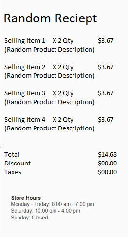

---
# required metadata

title: Create and update store hours
description: This topic describes how to create and update store hours in Commerce Headquarters.
author: josaw1
ms.date: 7/30/2019
ms.topic: article
ms.prod: 
ms.technology: 

# optional metadata

# ms.search.form: 
# ROBOTS: 
audience: Application User
# ms.devlang: 
ms.reviewer: josaw
# ms.tgt_pltfrm: 
ms.custom: 
ms.search.region: Global
ms.search.industry: Retail
ms.author: rapraj
ms.search.validFrom: 2019-07-30
ms.dyn365.ops.version: Retail 10.0.1 update

---

# Create and update store hours

[!include [banner](../../includes/banner.md)]

## Overview

From a single place, retailers can create, maintain, and manage the store hours for different stores across geographic regions. The store hours can then be shown on point of sale (POS) terminals. In this way, cashiers can share store hours with customers and better help shoppers who are interested in inventory in other stores. The store hours can also be printed on receipts, in case customers want to return to the store later.

Multiple store hours can be configured across different channels. These channels include brick-and-mortar stores, call centers, mobile devices, and e-Commerce sites.

If a customer has a pickup order for a different store, the cashier can select dates when the pickup will be available in that store. The store lookup will provide a reference to the dates and store times. The cashier can select a date and location, and can also print a pickup receipt that includes the store hours.

This functionality is available in Microsoft Dynamics 365 Retail versions 8.1.2 and later.

## Configure store hours

Follow these steps to configure store hours.

1. Go to **Retail and Commerce** \> **Channel Setup** \> **Store hours**.
2. Select **New** to create a new store hours template. To use an existing template, select the template in the left pane.
3. In the **Add range** dialog box, define the date range, the store hours, and any holidays that are required.

    - If store hours don't change, select **Never ends** in the **End date** field.
    - If the store hours are for a specific month, week, or day, set the appropriate dates in the **Start Date** and **End date** fields.

    > [!NOTE]
    > You can create multiple templates that have overlapping start and end dates. Therefore, you can, for example, define store hours for stores in different time zones.

    

4. Associate the store hours template with the stores where it will be used. In the **Choose organization nodes** dialog box, select the stores, regions, and organizations that the template should be associated with.

    - Only one store hours template can be associated with each store.
    - Use the arrow buttons to select stores, regions, or organizations. The calendar will be available to the stores or store groups, and it will be visible at the POS for reference.

    

5. On the **Distribution schedule** page, run the **1070** and **1090** jobs to make the store hours available to the POS.

## Add store hours to printed receipts

Follow these steps to add store hours to the printed POS receipts.

1. Open the receipt designer.
2. Select **Footer** in the lower-left corner.
3. Drag the **Store hours** element from the left pane to the footer at the bottom of the receipt template.
4. You can edit the default label on the **Store hours** element as you require.
5. Save the receipt, and close the receipt designer.
6. On the **Distribution schedule** page, run the **1070** and **1090** jobs.
7. Sign in to the POS.
8. Complete a sale, and select to print a receipt.

POS receipts now include the store hours. If any holidays were included in the template, they are shown on the receipt.

[!INCLUDE[footer-include](../../includes/footer-banner.md)]