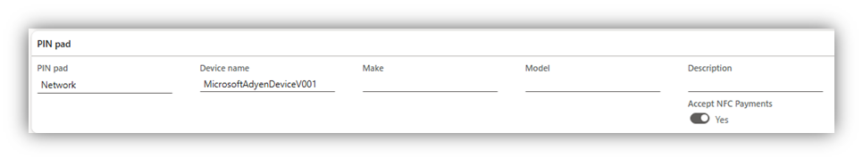
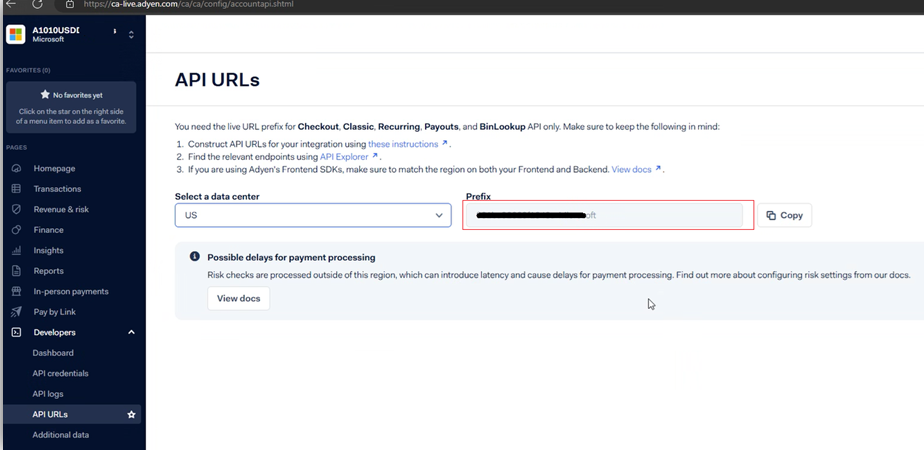
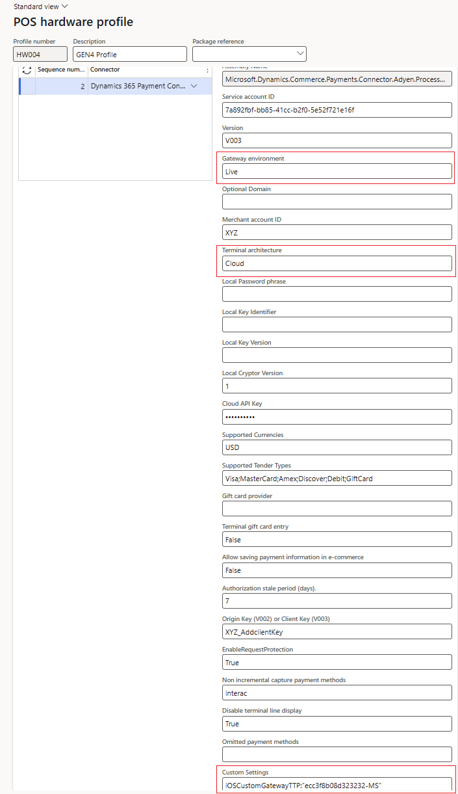
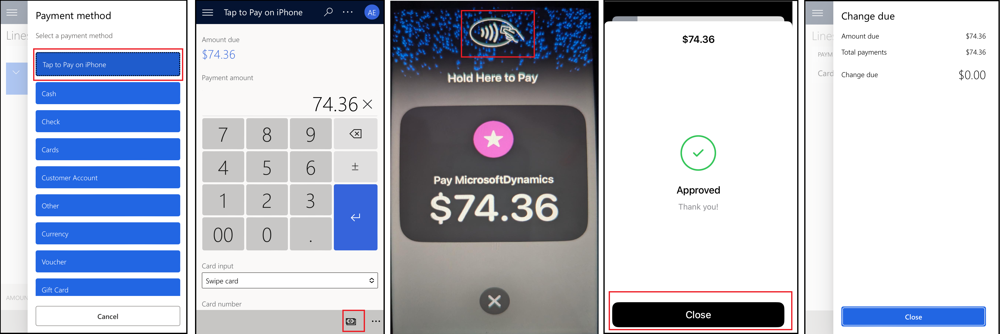

# Enable Tap to Pay on iPhone to run the Store Commerce App

[!include [banner](../includes/banner.md)]

This article describes how to set up and enable Tap to Pay on iPhone to run the Microsoft Dynamics 365 Commerce Store Commerce app.

Merchants who use the Store Commerce app with Adyen payment connector on iPhones can now enable their store associates to accept various types of in-person payments on the iPhones by using the Tap to Pay on iPhone capability. This capability prevents the need to use external payment terminals and hence reduces the cost and maintenance of the hardware peripherals.

## Prerequisites

This feature requires onboarding from both Adyen and Microsoft. Contact your Adyen representative to complete the onboarding with Adyen and then contact Microsoft support to enable this feature in your environment. 

This feature is available starting 10.0.40 monthly update and the minimum versions for various components are as follows:

- Dynamics 365 Commerce headquarters: 10.0.1935.73
- Commerce Scale Unit (CSU): 9.50.24201.4+
- Store Commerce app on iPhone from App Store: 9.51.24320

This feature requires the dedicated hardware station that gets deployed on the iPhone with the Store Commerce app. 

Also, for testing Tap to Pay on iPhone, it's mandatory to sign in on iPhone using the Sandbox Apple Account. For more information on the Sandbox Apple Account, see [Learn about Sandbox Apple Account](https://developer.apple.com/help/app-store-connect/test-in-app-purchases/create-a-sandbox-apple-account/).

> [!NOTE]
> Tap to Pay on iPhone isn't available in all regions. View [Tap to Pay on iPhone regions](https://developer.apple.com/tap-to-pay/regions/) for the available regions

## Steps to enable Tap to Pay on iPhone

Once both Adyen and Microsoft complete the onboarding process, implement the following steps to enable and test Tap to Pay on iPhone.

### Install the Store Commerce app on iPhone

This feature works on those iPhones which are running the Store Commerce app. For information on how to download and enable the Store Commerce app on iPhones, see [Store Commerce app for mobile platforms](store-commerce-mobile.md#install-the-app).

### Enable Tap to Pay on the hardware profile

Navigate to the **Registers** form (**Retail and commerce \> Channel setup \> POS setup**) and open the register which is used to run the Store Commerce app on iPhone. 
Open the associated Hardware profile and ensure the Adyen connector is configured to accept the cards such as Visa, MasterCard, and American Express that you want to accept via Tap to Pay on iPhone. If the Adyen connector isn't yet set up, for information on configuring the Adyen connector see [Set up Dynamics 365 Payment Connector for Adyen](adyen-connector-setup.md).

> [!NOTE]
> Only the **Cloud** architecture for Adyen connector is supported for Tap To Pay, so  make sure to set the **Terminal architecture** property of the Adyen connector to **Cloud** instead of **Local**.

Expand the **PIN pad** FastTab and add the following properties:
1.	For **PIN pad**, select **Network**.
2.	For **Device name**, enter **MicrosoftAdyenDeviceV001.**
3.	Turn on the **Accept NFC Payments** field added by the Tap to Pay on iPhone feature. If you don't see this field, then contact Microsoft to enable the Tap to Pay on iPhone feature in your environment.

The following example image shows the **Accept NFC payments** property on the Hardware Profile if the Tap to Pay on iPhone capability is enabled.

### Associate a payment method with the store

Tap to Pay on iPhone doesn't need a new payment method to be added to the store. It relies on the existing payment method which is mapped to the “Pay card” operation. Inavigate to the **All stores** form (**Retail and commerce \> Channels \> Stores**) and verify there's a payment method defined which is associated to the **Pay card** operation. If such a payment method isn't defined for the store, then create a new payment method to capture credit or debit cards.

### Enable a hardware station for the store

For information on enabling a dedicated Hardware station for the store, see [Connect peripherals to the point of sale (POS)](../define-maintain-channel-clients-registers-hw-stations.md#store-commerce-app-with-connected-peripheral-devices).

> [!NOTE]
> The Tap to Pay on iPhone requires a dedicated hardware station. Shared hardware station doesn't support Tap to Pay on iPhone.

### (Optional) Enable a Pin pad terminal along with Tap To Pay

This optional step is for testing Tap to Pay on iPhone. There are scenarios where the Near Field Communication (NFC)-based tap capability isn't sufficient. For example, the customer doesn't have an NFC enabled card, or the customer wants to use a gift card, or a wallet. In such cases, it's useful to pair the iPhone running the Store Commerce App, with a PIN pad device to enable these additional use cases. To do so, navigate to the register used with the iPhone and select the **Configure IP address** button under the Hardware section at the top toolbar and add the details under the PIN pad FastTab. For information about PIN pad onboarding, see [Set up Dynamics 365 Payment Connector for Adyen](adyen-connector-setup.md#onboard-and-configure-an-adyen-payment-terminal).

### Test with test and live environments

For Test environments, the **Gateway environment** property of the Adyen connector in Hardware profile must be set to **Test**. 
For Live environments, the **Gateway environment** property of the Adyen connector depends on whether you want to pair the iPhone with the external PIN pad terminal or not. 
- If you don't want to pair an external PIN pad terminal, then you can set the **Gateway environment** property to **Custom**. In addition, you must set the **Optional Domain** property of the Adyen connector in Hardware profile to the prefix value found in the Adyen customer portal. To find this value, sign in to the Live environment of Adyen customer portal and select the **API URLs** section under the **Developers** section. Select the appropriate data center, based on your region and copy the **Prefix** value shown on the portal. This Prefix value should be pasted in the **Optional Domain** property of the Adyen connector. The following example image shows the **Prefix** property value.

- If you want to pair an external PIN pad terminal you can set the **Gateway environment** property to **Live** and instead of pasting the Prefix value on the **Optional Domain**, paste it as a key value pair on the **Custom Settings** property on the Adyen connector in Hardware profile as **iOSCustomGatewayTTP:<"_paste prefix here_">**. For example, if the prefix value is "ecc3f8b08d323232-MS" the **Custom Settings** property value should be **iOSCustomGatewayTTP:"ecc3f8b08d323232-MS"**

The following example image shows the screenshot of the Hardware Profile with sample data if the Gateway environment property is set to Live. 

> [!NOTE]
> The prefix value should be passed within the double quotes
 
Navigate to the Distribution schedule form and run 9999 job to update the channel components with these changes.

## User experience with Tap to Pay on iPhone

- When the store associate is ready to take a payment for the transaction, they can touch the Subtotal amount of the transaction which opens the list of supported payment methods.
- If the Tap to Pay on iPhone is enabled, then a new **Tap to Pay on iPhone** button is displayed as the first payment method.
- Selecting **Tap to Pay on iPhone** displays a screen for the store associate to choose the amount that should be captured via Tap to Pay. This screen displays a **Tender payment** button on the bottom toolbar.
- 	If the optional PIN pad isn't configured with the Store Commerce app, selecting **Pay card** also triggers the Tap to Pay on iPhone experience. However, if an external PIN pad is configured, when you select **Pay card** the PIN pad gets activated instead of the Tap to Pay experience.
- Selecting **Tender payment** activates the Tap to Pay screen on iPhone displaying the selected amount.
- The store associate can now request the customer to tap their physical card or mobile phone with a digital wallet on the iPhone.
- Once the payment is successful, the user sees an approved message and a payment line is added to the transaction.
- Optionally, the change due dialog displays unless it's configured to be hidden when there's no balance due. This step concludes the transaction.

  The following example image shows the screenshots of the user experience of Store Commerce App along with Tap to pay on iPhone.
  

## Limitations of Tap to Pay on iPhone

Tap to Pay on iPhone has a limitation related to customer orders. Tap to Pay on iPhone can't be used to authorize the remaining balance for a customer order. Thus, the merchant can either capture the full order amount as deposit via Tap to Pay on iPhone or use the “Pay the balance later” option for the customer order. Alternatively, the merchant can pair the iPhone with a physical PIN pad device and use that device for balance authorizations. 

[!INCLUDE [footer-include](../../includes/footer-banner.md)]
