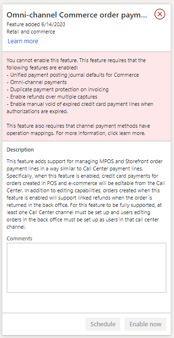

---
# required metadata

title: Tipping support in the Payments SDK
description: This topic describes SDK-level support for accepting tips on payment terminals
author: rubendel
manager: annbe
ms.date: 10/27/2020
ms.topic: article
ms.prod: 
ms.service: dynamics-365-retail
ms.technology: 

# optional metadata

# ms.search.form: 
# ROBOTS: 
audience: IT Pro
# ms.devlang: 
ms.reviewer: josaw
ms.search.scope: Operations, Retail
# ms.tgt_pltfrm: 
ms.custom: 141393
ms.assetid: e23e944c-15de-459d-bcc5-ea03615ebf4c
ms.search.region: Global
ms.search.industry: Retail
ms.author: rubendel
ms.search.validFrom: 2019-01-01
ms.dyn365.ops.version: AX 7.0.1

---

# Tipping support in the POS payments SDK

[!include [banner](../includes/banner.md)]

This topic describes payments SDK support for tipping through the payment terminal. The new **TipAmount** property is provided to support scenarios where a payment terminal can be configured to present the customer with predefined tip amounts or percentages, selectable at the time of payment. This feature does not add support for tipping or tip reporting at the point of sale. To build full tipping capabilities, POS extensions will be needed. 

## Key terms

| Term | Description |
|---|---|
| Tips | Also known as a gratuities, tips are common in quick service and hospitalities to provide a payment directly to the store or restaurant employee who is providing services |
| Header level charge | A charge that can be applied to a purchase that is not for a specific line item. |

## Overview

Tipping is very common in certain locales and industries. For example, in quick service and hospitality tipping has become nearly ubiquitous in the United States. For many businesses, the ability to support tipping through payment terminals is becoming a differentiator when attracting employees. This feature adds a discrete **TipAmount** field to the payments SDK so tips selected at the payment terminal can flow back to the point of sale as part of the authorization response. 

While this feature adds support for tipping at the payments SDK level, it does not include support for other critical aspects of tipping support. Those may include reporting to indicate tip payouts at the end of shifts, the ability to pool tips, and the ability to report tips for payroll. To enable full tipping support, those capabilities will need to be implemented via extensions. 

### Prerequisites

| Tip on device | Customer must be able to select tip amount on the payment terminal itself. |
| **isTippingEnabled** support | Payment connectors must support the **isTippingEnabled** variable for payment initialization. |
| **TipAmount** | The tip amount must be returned from the payment connector in the **TipAmount** authorization response field. |
| POS tip support | The tip returned from the payment connector should be added to the sale as a header level charge. In addition, tip reporting an management is not provided out of box. |

### Tipping support by payment processor

This feature adds a new variable called **isTippingEnabled** to the **AuthorizePaymentTermianlDeviceRequest**. This variable indicates at the time a payment is requested if the payment connector can support tips that are returned in a discrete field as part of the authorization response. 

If **isTippingEnabled** is set to **True** and the cutomer chooses a tip on the payment terminal, that amount will be returned in **TipAmount** property of the **AuthorizePaymentCardPaymentResponse** returned from the payment connector. The tip amount is also included in the **ApprovedAmoutn** property of the authorization response. 

### Suggested implementation

It is recommended that a header-level charge is used to add the tip amount to the transaction after the authorization response is returned from the payment connector. To support this, an extension should be created for the **PaymentTerminalAuthorizePaymentRequestHandler**. That extension should add logic to add the header level charge line to the transaction if a **TipAmount** is returned in the authorization response. This extension

The following illustration shows an order that was created at the POS. Notice that the **Payments** button is unavailable when the row for this order is selected.

In Commerce version 10.0.13 and later, you can access the **Payments** page for orders that were created in e-commerce and the POS. Additionally, when the omni-channel Commerce order payments feature is turned on, the orders can be edited by using the order completion function that was previously available only for call center orders.

With this feature enabled, the **Sales order summary** dialog can be used to edit payments for orders originating in POS and e-commerce.  

## Prerequisites

To turn on the omni-channel Commerce order payments feature, you must first turn on several other features and complete other configurations. Aside from being requirements for enabling **Omni-channel Commerce order payments**, these features should be turned on as a best practice because they address functional gaps that are related to orders. 

If any of the prerequisites are missing when you try to turn on the omni-channel Commerce order payments feature, you receive a message that states that you can't continue until the prerequisite features and configurations are in place.

### Prerequisite features

The following features are required for omni-channel Commerce order payments to work correctly.

| Feature name | Description |
|---|---|---|
| Unified payment posting journal defaults for Commerce | This feature changes the way that business logic creates customer payment and customer refund payment journals for orders that are created through the call center, POS, or e-commerce channel. |
| Omni-channel payments | This feature enables omni-channel payment scenarios, such as buy online, pick up in store. For more information, see [Omni-channel payments overview](https://docs.microsoft.com/dynamics365/commerce/omni-channel-payments). |  
| Duplicate payment protection on invoicing | This feature enables duplicate payment protection for invoicing scenarios. Commerce payments functionality might affect customizations in invoicing scenarios. If your organization has invoicing customizations, make sure that they are refactored before you turn on Commerce payments functionality in production environments. | 
| Enable refunds over multiple captures | This functionality improves that capability to do multiple linked refunds against an order. |
| Enable manual void of expired credit card payment lines when authorizations are expired | This feature adds support for manual deletion of payment lines if they expire and the authorization cannot be refreshed. |

### Configure prerequisites

#### Map payment methods to operations

You must map payment methods in all channels to corresponding operations, so that the management of order payments is supported in Commerce headquarters. Map payment methods before you turn on the omni-channel Commerce order payments feature, to avoid receiving warnings for each payment method that doesn't have an equivalent operation mapping.

The following illustration shows the mapping of a payment method to an operation in call center.

#### Configure a call center

To manage POS and e-commerce order payments through Commerce headquarters, you must configure at least one call center channel. For more information about how to create a call center channel, see [Set up a call center channel](https://docs.microsoft.com/dynamics365/commerce/channel-setup-callcenter#overview).

#### Set up users as call center users

Users who will edit Commerce payments in Commerce headquarters must be set up as users of the call center channel. For more information about how to set up call center users, see [Set up a call center channel user](https://docs.microsoft.com/dynamics365/commerce/channel-setup-callcenter#set-up-channel-users).

#### Turn on order completion for call centers

The order completion function must be turned on for call centers. Order completion enforces business logic that makes sure that orders can be paid during fulfillment. For more information about order completion, see [Enable order completion](https://docs.microsoft.com/dynamics365/commerce/set-up-order-processing-options#enable-order-completion).

#### Remove the Pay later option from the POS

When customer orders are created at the POS, the store associate can either collect a card payment for fulfillment or select **Pay later** to skip collection of card details. When the omni-channel Commerce order payments feature is turned on, the **Pay later** option should be removed from the POS. To remove it, search for **Functionality profiles** to open the **Functionality profiles** page. Select the relevant functionality provide and click **Edit**. On the **General** FastTab for the functionality profile, change the value of the **Require payment for fulfillment** field to **Card required**. This change must be synced to the channel database before it takes effect at the POS.

## Turn on the omni-channel Commerce order payments feature

After the prerequisites that are described in the previous section are in place, you can turn on the omni-channel Commerce order payments feature.

1. In the **Feature management** workspace, select the **All** tab to view the list of all features, and then search for **Omni-channel Commerce order payments**.

    

2. Select the feature, and then select **Enable now**.

> [!IMPORTANT]
> The omni-channel Commerce order payments feature includes many changes to payments and order management workflows. You should do exhaustive testing before you turn on this feature in a production environment.

To distinguish channel orders that are created while the omni-channel Commerce order payments feature is turned on from other orders, the system shows a **Payments type** field on the order header when the feature is turned on. For POS and e-commerce orders, this field is set to **Commerce**.

For call center orders, the **Payments type** field is set to **Call Center**. For sales orders that are created in Accounts receivable, the field isn't shown.

## Fulfill orders after the omni-channel Commerce order payments feature is turned off

POS and e-commerce orders that are created while the omni-channel Commerce order payments feature is turned on must be fulfilled while the feature is turned on. If the feature is later turned off, further processing of the orders will be prevented until the feature is turned back on.

## Manage orders that were created before the omni-channel Commerce order payments feature is turned on

Orders that were created before the omni-channel Commerce order payments feature is turned on can be processed after the feature is turned on. The editing experience for those orders won't change after the feature is turned on, and the orders won't be changed to accommodate omni-channel Commerce order payment workflows. Additionally, sales orders that non–call center users create in Accounts receivable will continue behave as they did before the feature was turned on.

## Key scenarios

When the omni-channel Commerce order payments feature is turned on, credit card payments for e-commerce and POS orders can be managed through order completion. For example, a customer places an online order and then calls into the call center to request a change to the order. In this case, the order completion function enables the payments on that order to be adjusted to support the new balance due.

The following properties on an order line can be edited before payment capture:

- Card type
- Card number
- Payment amount
- Percent amount

### Edit order payments

The following scenarios in call center order completion apply to order payments that were created at the POS or in the e-commerce storefront.

#### Uncaptured card payments

For any card payment line on an order that hasn't yet been partially invoiced, the following properties can be edited before payment capture:

- Card type
- Card number
- Payment amount
- Percent amount

After the payments are edited, the order submission process corrects any changes that are required for edited payment lines.

| Scenario | Description | Supported |
|---|---|---|
| Edit to specify a higher amount. | For card payments that have been authorized but haven't yet been captured, the payment amount can be increased. When the amount on a payment line is increased, a new authorization is created for the new amount, and the old authorization is voided. | Yes |
| Edit to specify a lower amount. | For card payments that have been authorized but haven't yet been captured, the payment amount can be reduced. When the amount on a payment line is reduced, a new authorization is created for the new amount, and the old authorization is voided. | Yes |
| Remove an old card, and add a new card. | Uncaptured card payment authorizations can be removed from orders and replaced by a payment on a different card. The authorization for the first card is canceled, and an authorization for the new card will be obtained when the order is submitted. | Yes |

#### Partially and fully captured card payments

| Scenario | Description | Supported |
|---|---|---|
| Edit a payment that was used to invoice part of the order. | When an order that has omni-channel Commerce payments has been partially invoiced, the card payment amount for the existing card can be edited through call center order completion, down to the amount that has already been captured. A new card can then be applied to cover the balance due for the order. | Yes |
| Edit fully captured card payment lines to specify a higher amount. | If a card payment was fully captured, but the amount for that card payment is increased through call center order completion, a new authorization for the card is created for the increased amount when the order is submitted. | Yes |

### Remove order payments

| Scenario | Description | Supported |
|---|---|---|
| Authorized payments | Omni-channel Commerce order card payments can be removed from an order through order completion, but only if they weren't partially captured. | Yes |
| Prepayments | Prepayments can't be removed through order completion. Prepayments can't be removed from an order after they are applied. Payment vouchers are already associated with them. | No |
| Partially captured payments | If the payment is in a **Paid** state but hasn't been fully captured, it can't be removed. However, the payment amount can be reduced to the amount that was already posted. When this happens, the a request is sent to the payment provider to reduce the authorization amount to equal the new payment amount. | No |
| Fully captured credit card payments and prepayments | Fully captured credit card payments and prepayments can't be removed from the order. | No |

### Cancel order and sales lines

| Scenario | Description | Supported |
|---|---|---|
| Order cancellation for credit card payments that aren't captured | If an order is canceled, card payment authorizations that haven't yet been captured are canceled. | Yes |
| Order cancellation for credit card payments that are captured but aren't invoiced | If an order is created at the POS, and a card payment is used to capture a deposit, the order is canceled before invoicing. The card payment is automatically refunded as part of order cancellation. | Yes |
| Order cancellation for orders that are partially shipped and invoiced | For orders that have been partially shipped and invoiced, cancellation will cancel the fulfillment of lines that haven't been invoiced. Open credit card authorizations for the remaining balance on the order aren't automatically canceled. | Manual refund is required. |
| Order cancellation for orders that are invoiced but aren't shipped | If an order is fully invoiced, but some of the items haven't been shipped, the order can be canceled. However, payments that are captured for that order won't automatically be refunded. Open authorizations for items that haven't been invoiced won't be canceled but will expire according to the authorization expiration policies of the bank that issued the card. | Manual refund is required. |
| Line cancellation for items that aren't fulfilled or invoiced | If an order line that hasn't been fulfilled or invoiced is canceled, the order completion process will require that payments are reduced to equal the new order total. |

### Refunds

| Scenario | Description | Supported |
|---|---|---|
| Linked refunds for POS and e-commerce orders | Return orders that are generated from orders that originate from the POS and e-commerce channels can issue linked refunds against the cards that were charged during invoicing. | Yes |
| Linked refunds for AR sales orders | Although the payments can't be edited through order completion, returns that are issued for AR sales orders can be subject to a linked refund to the original card that was charged during invoicing. | 
| Unlinked refunds | If the merchant's return policies and the payment processor allow this approach, unlinked refunds can be specified for return orders in cases where the order was originally paid in cash, for example, or in cases where the original card that was used for payment is no longer active. | Yes |
| Refunds to non-card prepayments | Return orders that were originally paid through non-card prepayments, such as cash or credit memo payments, won't be subject to linked refund. An appropriate payment method, such as **Check**, must be specified for the refund payment. Organizations that allow unlinked refunds can refund non-card prepayments to credit cards that weren't previously used for the order, if the payment processor allows this approach. | Yes |

### Edit and remove orders that have prepayments

| Scenario | Description | Supported |
|---|---|---|
| Edit prepayment tender lines. | Payment vouchers are associated with prepayment tender lines. Therefore, prepayment tender lines can't be edited or removed. | No |

## Related changes

To support omni-channel Commerce order payments, changes to existing functionality were introduced in Commerce version 10.0.13.

### Consistent selection of payment journals when sales orders and refund payments are posted

In Commerce version 10.0.12 and earlier, payment journal assignment is inconsistent across channels. In Commerce version 10.0.13 and later, if the omni-channel Commerce order payments feature is turned on, all channels use the payment vouchers that are specified on the **Posting** tab of the **Commerce parameters** page.

### Check payment method

Orders that are created at the POS don't include a check number when they're created in Commerce headquarters. When the omni-channel Commerce order payments feature is turned on, **9999** will be entered as the check number for orders that are created at the POS and paid for by check.

Additionally, the check number won't be required when **Check** is specified as the refund method of payment.
