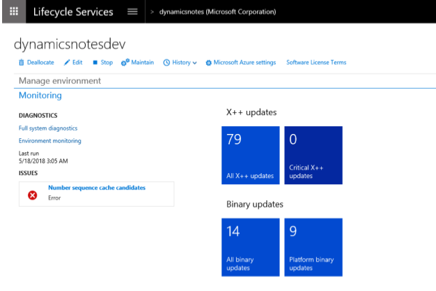
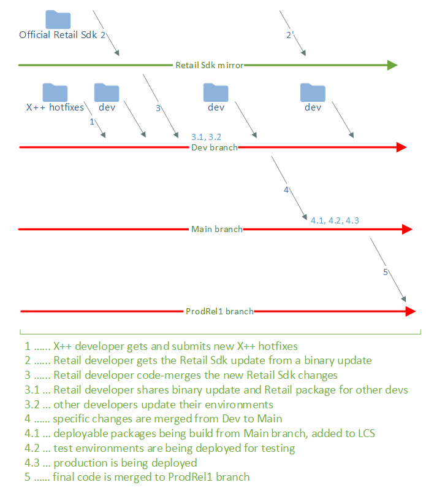
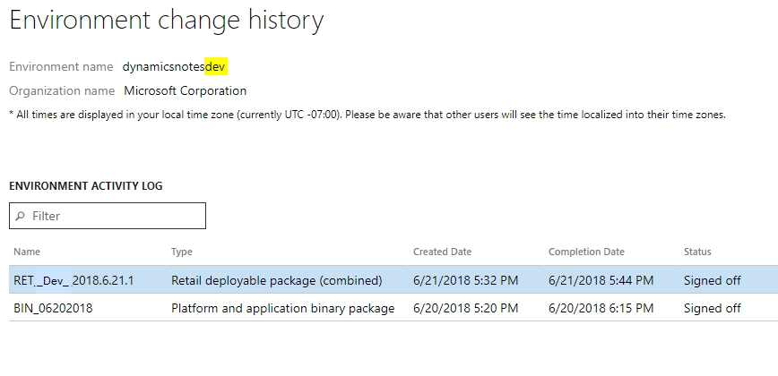
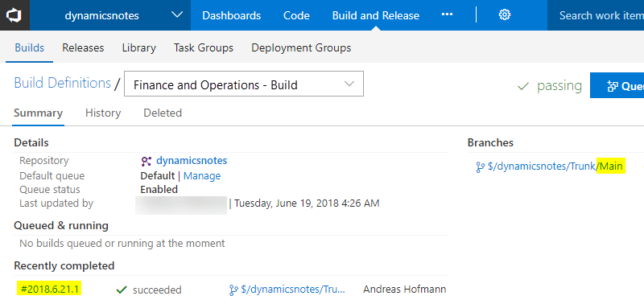
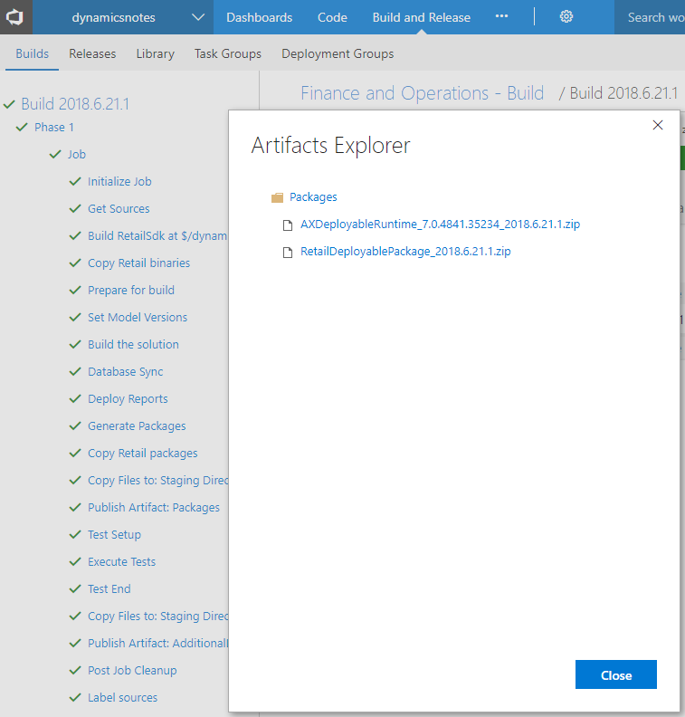
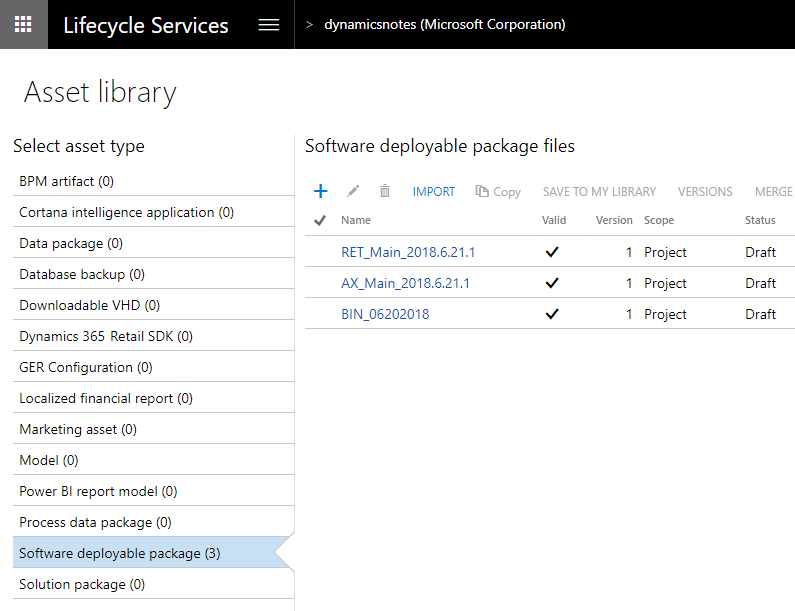
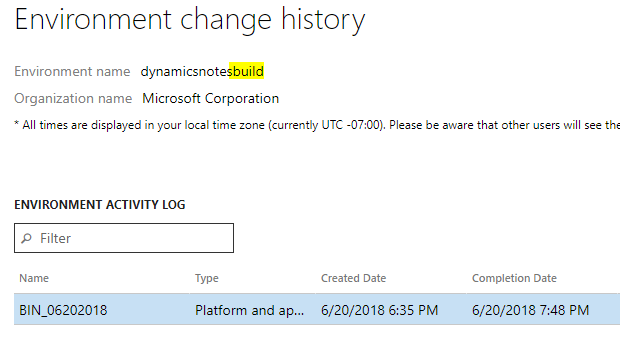
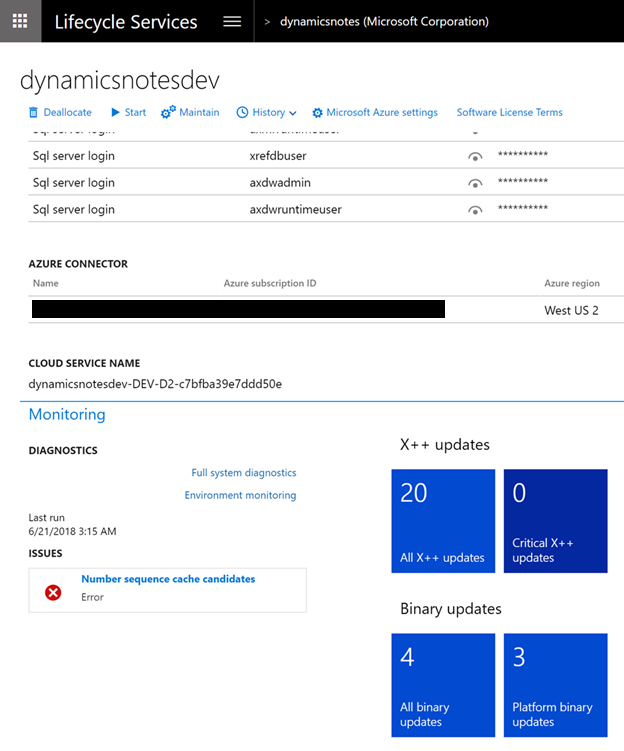

# Update code and environments for Commerce projects

[!include [banner](../../includes/banner.md)]

An environment can be updated by updating either its data or its code.

There are multiple ways to update the data. For examples that show how to get data into an environment, see [Integration between finance and operations apps and third-party services](/dynamics365/fin-ops-core/dev-itpro/data-entities/integration-overview).

When you update an environment, you should also consider moving the whole database. This approach lets you quickly and easily duplicate the data from one environment to another.

Other updates are code updates. The environment page in Microsoft Dynamics Lifecycle Services (LCS) tracks the updates that have been applied and the updates that must be applied. The following illustration shows an environment that has 79 outstanding X++ fixes, 14 outstanding binary updates, and nine outstanding platform binary updates.

Platform code is at a very low level, and no Microsoft Dynamics 365 Commerce features are implemented in the platform. Therefore, stand-alone platform binary updates don't require that you retest any Commerce-specific code. Examples of features that are implemented in the platform are the Data Import/Export Framework (DIXF) and the batch framework.

Binary updates or hotfixes include dynamic-link libraries (DLLs), scripts, and channel SQL schema changes. All channel-side hotfixes are released together as a binary update/hotfix. Because binary updates are DLLs, they are cumulative. For example, if you download a binary update on Friday, you automatically receive all binary hotfixes from Monday through Thursday.

If the code merge is done correctly, the version of a binary hotfix that you take matches the version of the Microsoft-version.txt file in the Retail software development kit (SDK). Typically, binary updates are also linked to the latest platform. Therefore, when you take binary updates, you must stay up to date with the platform. Platform updates help increase the stability of the platform, and they affect build environments and test efforts to some extent.

Application updates or hotfixes are delivered in X++ source code. Therefore, they aren't for the channel side but for the Microsoft Dynamics 365 side (they are either Commerce-related or not Commerce-related).

Note that some updates require both an application update and a binary update. For hotfix recommendations, see the next section.

Third-party packages resemble application packages, but they are developed by other people. For more information about how to use independent software vendor (ISV) packages, see [Manage Runtime Packages](../../fin-ops-core/dev-itpro/dev-tools/manage-runtime-packages.md).

## Updating data by restoring the database

In one useful and typical operation, the whole database is moved from one environment to another. For example, you might move the production database to development environments when you're preparing to develop additional features. Alternatively, you might move the golden setup database to the production database as part of the go-live process.

For more details, see [Copy Database From Azure SQL to SQL Server](/dynamics365/fin-ops-core/dev-itpro/database/dbmovement-operations). If source and destination environments don't have the same binary version, you should also do either a build and a database synchronization (for a development environment), or a deployment (for a sandbox or production environment).

Every time that a database that has been moved from a different environment is restored, specific links in the database can be broken. The Environment reprovisioning tool fixes all these broken links for the default database group, regardless of type of environment that is used. The general guideline is that if the database comes from a different environment, the Environment reprovisioning tool must be run.

In many cases, you should reset the Commerce scheduler after you update the database.

After you've restored the database, follow these steps.

1. Either do a build and a database synchronization, or deploy the deployable package.

    > [!NOTE]
    > If you have table extensions that include data, you must have the metadata for those extensions in the environment. Otherwise, you can lose data, because columns and tables might be dropped.

2. Make sure that the batch service is running.
3. Run the Environment reprovisioning tool. (Find the latest version in the global Shared asset library in LCS, and then deploy it by using the **Maintain** function.)
4. Verify that the tool succeeded, the Commerce channel profile is up to date with the correct URLs, and the data synchronization jobs for the Default data group succeeded.
5. In Commerce, run the **Initialize Commerce scheduler** job (select to delete old data). This step assumes that all Commerce Data Exchange (CDX) configuration changes are automated by using a resource file. If CDX configuration changes aren't automated, and if tables, subjobs, and jobs are manually created in the Commerce channel schema, don't select the option to delete the existing configuration. We recommend that you automate CDX configuration changes. 

## Taking updates frequently

If your project is more than a few weeks from go-live or the final user acceptance testing (UAT), we recommend that you take all hotfixes (binary, X++, and platform) on a regular schedule. Specifically, we recommend that you take all hotfixes one time per month. The more often you perform this task, the fewer issues you should experience, because the code churn of the hotfixes is smaller. If you perform this task often, it will take significantly less than eight hours.

We recommend that you not pick and choose hotfixes, because this approach is more likely to cause errors and probably isn't worth your time. If you have 500 or 1,000 outstanding hotfixes, you should consider whether you're really ready to go-live. The quality of the product will be higher if the count on the update tiles in LCS is very low (fewer than 100 application fixes and fewer than ten binary fixes).

After you take new hotfixes, the results of a previous round of UAT become less meaningful. Therefore, it's crucial to retest again. The number of files that changed determines how extensive the testing must be. If hotfixes are frequently taken, especially during the implementation phase, the number of new files isn't very large, and the retesting effort is manageable.

Another approach is to take all hotfixes frequently and run only part of the UAT. Then, the next time that new hotfixes are taken, run a different part of the UAT. Run the different parts of the UAT in a circular manner. Before go-live, you should do a full UAT run.

## The flow of code changes through branches and environments

Just as the branching strategy is dictated by project, team, or other constraints, your project has flexibility about how the changes are propagated through the branches. The following illustration shows an example of the process. However, this example might be too simple for some projects and too complex for other projects. The important point is that a project should have a plan. Different persons in the team will have different responsibilities (development, deployment, code merges, sign-off, and so on), and the role ownership should be clearly defined.

### Steps 1–3: Obtain and apply updates

For full details about steps 1 through 3 (taking updates), see the [hotfix and deployment cheat sheet](https://dynamicsnotes.com/dynamics-365-for-finance-and-operations-hotfix-and-deployment-cheat-sheet/). If the branches are set up in the same manner that is shown in the preceding illustration, you should do this work in the Dev branch.

### Steps 3.1–3.2: Keep development environments up to date

You don't have to have a build environment for the Dev branch. In fact, a build environment for the Dev branch isn't usually required. You just have to coordinate the packages that should be deployed to keep the version correct.

After you download binary updates and platform updates, you can deploy them via LCS package deployment.

For the X++ code, developers just synchronize the Metadata folder and do a full build and database synchronization.

If major new changes have been checked in by other members of the team (for example new files, configuration changes, or a new Retail SDK), it isn't enough to synchronize and build the new files. Remember that a few web applications that are installed on the developer machine won't be updated through a compilation. Those web applications must be deployed. Use the LCS package deployment to deploy the commerce package that can be produced at an MSBuild command prompt. For smaller code changes, new package deployments aren't required in order to keep the dev environments in sync if the incremental changes are dropped to the install locations. 

### Step 4: Move changes from the Dev branch to the Main branch

In this example, the Dev and Main branches have been separated to provide an opportunity to "leave some unwanted changes behind." Although this approach isn't required, it's a good option to have. Microsoft Visual Studio makes the process of moving the code from Dev to Main easy. You can select a range of changes, select all or individual changes, and merge those changes. To keep the process simple, you can have some type of a code freeze in the Dev branch. Then, when you're satisfied with the quality, you can merge all changes. There is no reason to treat X++ differently than the Retail SDK. They reside next together in each branch, because they are dependent on each other.

### Steps 4.1–4.2: Update test environments

Use your build environment to produce officially built packages from the code in the Main branch.

When the build is completed, find the packages that were built, download them, and rename them according to your naming conventions.

Then upload the packages to the LCS Asset library.

Finally, deploy the packages to your test environments.

### Step 4.3: Deploy packages to the production environment

When all the required tests are passed, you're ready to deploy the same packages to production. After the packages have been deployed and validated in a Tier 2 or higher environment, you must mark them as Release Candidates in the LCS Asset library. You must then plan the deployment and submit it via the LCS environment page.

There are many considerations when you update a production environment, such as downtime, downtime mitigation, data migration, store updates, and mass deployment. It's very important that you have a plan of all the steps that are required for an update, because Commerce projects usually require more than just deployment. For some additional considerations, see the "Tips" section of this article.

It's assumed that the planning for go-live was started much earlier. For more details, see [Implementation lifecycle](../../fin-ops-core/fin-ops/imp-lifecycle/implementation-lifecycle.md).

### Step 5: Merge the code from the Main branch to the ProdRel1 branch

Immediately after deployment to production, and before any new feature work is added to the Main branch, you should take a snapshot and move it to the ProdRel1 branch. The steps are the same as in step 4. You don't have to select individual changes. Instead, just merge all changes up to the last code change set that was submitted to the Main branch.

## Update build environments

You should always deploy binary updates and platform updates by using LCS package deployment.

Finance and Commerce customization packages should not be deployed to a build environment.

## Compare LCS tile counts

Environments that are used for work of the same release should also have the same LCS tile counts. Here are some reasons why the tile counts might differ:

- The same deployable packages haven't been deployed and applied. You can troubleshoot this issue by inspecting and comparing the LCS deployment history.
- The scheduled task that collects the version information from an environment hasn't been run yet. For development environments, you can force the "LCSDiagnosticsCollector" schedule task to run.
- The counts for the build environment's application updates don't match because X++ packages aren't deployed on build environments. Binary and platform counts should be correct.
- The difference might be intentional. For example, a developer might work with the next version, whereas the rest of the team is still working with a different release. Alternatively, one development environment might be kept on an older version in case a production hotfix must be developed, and that production environment uses an older version than current development environments.

Notice that after you've finished updating an environment, the tile counts for the available updates are significantly lower than they were when you started.

## Move to a new version

To upgrade to a new version (such as 7.2 to 7.3 or 7.3 to 8.0), you must deploy a new environment. You must also run a code upgrade and a database upgrade, if these upgrades are applicable. For more details, see [Code migration home page](../../fin-ops-core/dev-itpro/migration-upgrade/code-migration-home-page.md).

## Tips
- Decide on a good package naming convention for names in the LCS Asset library and for the names of zip packages that are downloaded. In this way, you can more easily determine what package you've deployed and where it came from. Avoid spaces in package names. Here is an example of a naming convention:

    - **Platform update packages:** PUXX_MMDDYY, where XX is the number of the platform update
    - **Binary update packages:** BIN_MMDDYY
    - **X++ update packages:** APP_MMDDYY
    - **Built X++ deployable packages:** AX_BRANCH_VERSION, where BRANCH is an appropriate branch name, and VERSION is the Microsoft Azure DevOps version string
    - **Built Retail combined package:** RET_BRANCH_VERSION, where BRANCH is an appropriate branch name, and VERSION is the Azure DevOps version string

- Whenever you start a new item of work, use the **Get latest** option in the Visual Studio source code explorer.
- Any code submissions should use correct and detailed comments that describe the change sets.
- Production go-live procedures are important. You should consider including the following items on your Go-live checklist. Verify your Go-live checklist in a mock go-live or UAT environment. This list isn't exhaustive.

    - After deployment, does LCS show the expected deployment history together with the correct package names?
    - After deployment, do the LCS environment page and Commerce show the correct and expected version numbers?
    - Can Store Commerce app offline mode be used during downtime of Commerce? Package deployments will cause downtime. If Store Commerce app offline mode can be used, have you tested the procedure? (To test the procedure, go offline, deploy, go online, synchronize offline transactions, and update the Store Commerce app.)
    - Does the Environment reprovisioning tool have to be run (if a database has been moved)?
    - Batch jobs for CDX synchronization must be reenabled by setting them to **Waiting**.
    - The "Initialize Commerce scheduler" job should be run.
    - Does other data have to be set up in addition to the deployable packages (for example, screens, buttons, receipt layouts, the Microsoft Azure Active Directory setup, Commerce shared parameters, the tax configuration, other batch processes, and DIXF recurring jobs)?
    - Is a synchronization of the CDX data jobs required?
    - Is a full synchronization of CDX data jobs required?
    - Does a deployment require that store components also be updated?
    - If the store components had to be updated, do they show the new version numbers?
    - Are the correct experts available during the deployment (for example, partners, ISVs, and customers)?

## Additional resources

[Set up new environments, Azure DevOps, and branches for Commerce projects](./new-environments-visual-studio-teams-branch-retail-projects.md)

[Testing and performance issues](./retail-implementation-testing-performance.md)

[!INCLUDE[footer-include](../../includes/footer-banner.md)]

