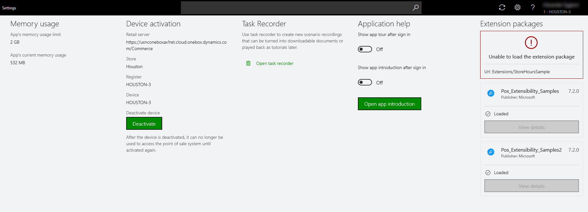

# View POS extension package information

[!include [banner](../includes/banner.md)]

In the **Settings** view in the point of sale (POS), the **Extension packages** section shows the list of POS extension packages that are included as part of the core POS. The tile for each package shows the status of that package. The package status indicates whether the extension was loaded, could not be loaded, or was skipped.

## Extension package status

This section describes what each package status means.

- **Loaded** – The extension package was successfully loaded.
- **Failed** – The extension package wasn't successfully loaded.
- **Skipped** – The package was skipped and wasn't loaded. In the extension manifest, you can specify that a package should be loaded for a specific locale, such as **en-fr**, but skipped for all the other locales.

> [!NOTE]
> Store Commerce for web will not display the extension version in the Customization.settings file under the **About** section on the **Settings** page, it will only show the Microsoft app package version. Extension package versions can only be viewed from the **Extension details** section.

## Extension package details

If an issue occurs when an extension is loaded, or if there is a conflicting extension, you can use the details that are provided for each extension package to determine which extension file is causing the issue. In this way, you can troubleshoot the issue.

To view the details of an extension package, select **View details** on the tile for that package. The POS opens a new view, where you can see the details of all the individual extensions in the package. If any extensions weren't successfully loaded or were skipped, the details appear in the right pane.

The **Status** column shows the status of each extension in the package, the **Name** column shows the name of the extension type, and the **Path** column shows the path of the implementation file in the package. When you select a specific line item, the right pane also shows a description of the extension.

The information in this view is based on the manifest file that is included in the extension package. The POS extension loader loads all the extension packages and updates the status. The status information includes any errors that have been logged.

> [!NOTE]
> Dual display custom control and other extension details information related to dual display will not be shown in the extension details view.

[!INCLUDE[footer-include](../../includes/footer-banner.md)]
