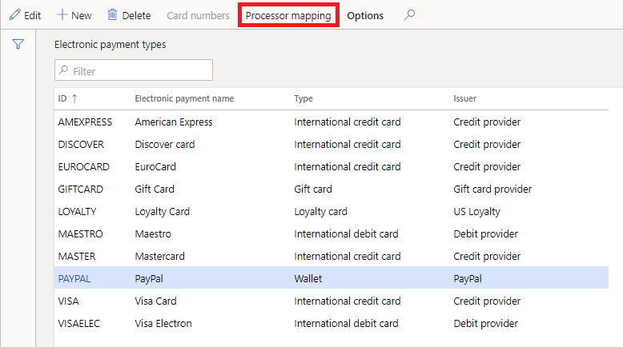
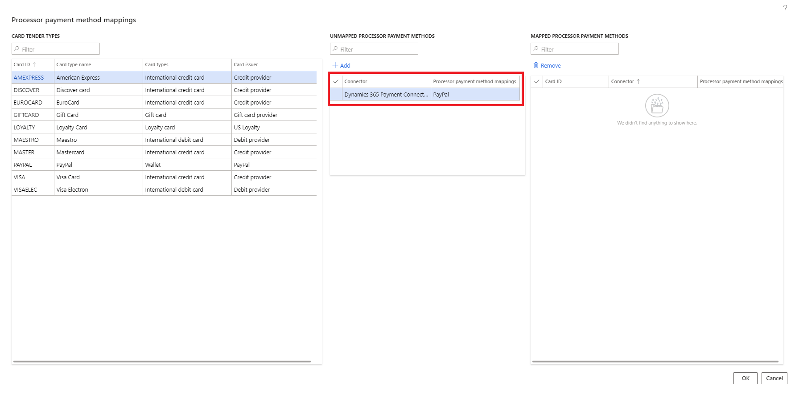
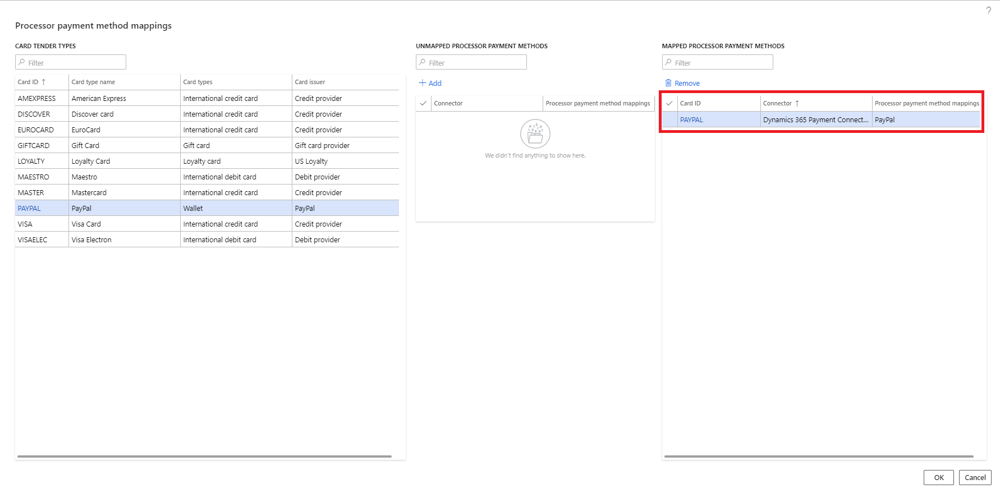
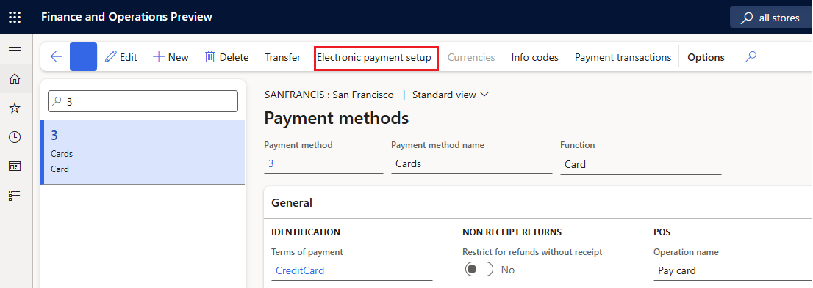
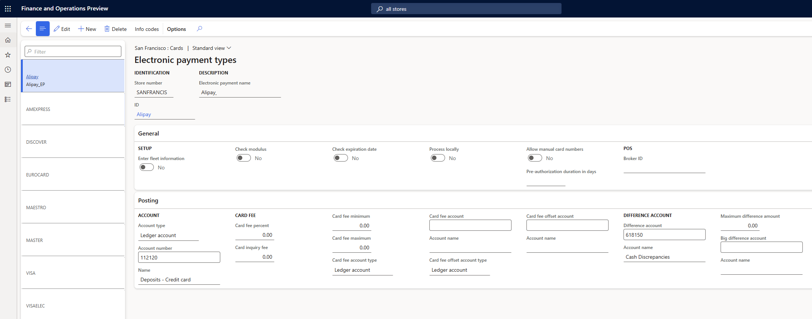
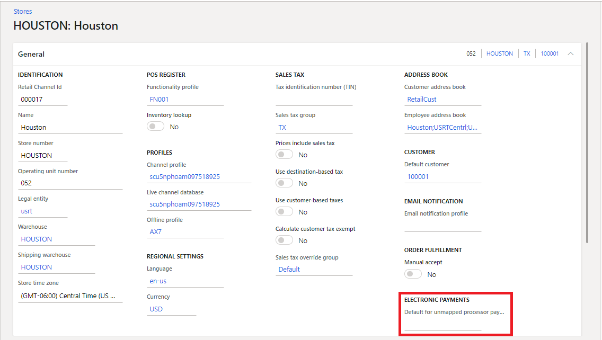

# Wallet payment support

[!include [banner](../../finance/includes/banner.md)]

This article provides an overview of wallet payment support for Microsoft Dynamics 365 Commerce.  

## Key terms

| Term | Description |
|---|---|
| Wallet | A payment type that doesn't include traditional payment characteristics, such as the Bank Identification Number (BIN) range and expiration date, that are used to differentiate credit and debit card types. |
| Processor payment method | A property payment card property in the payments SDK. When this property is added to supported payment methods within a connector, those payment methods can be mapped to cards or wallets configured in Commerce headquarters to avoid the traditional BIN range mapping. 
| Payment service provider (PSP) reference | The key that Adyen uses to identify payment transactions. This feature enables the PSP reference to be shown on the retail store transactions and call center authorization details pages.

Unlike traditional credit and debit cards, wallet payment authorization responses don't include BIN ranges. BIN ranges are customarily used to match payment authorization responses to predefined card types that have BIN ranges. The wallet payment support feature adds support for processor payment methods and the mapping of those variants to card types set up in Commerce headquarters.

**Processor payment method** is a property for the payments SDK that can be applied to payment methods supported for a particular payment connector. When an authorization response is received that includes the processor payment method, a lookup is performed to determine if that processor payment method is mapped to a card or wallet type. If a mapping is found, that payment is mapped to the matching card or wallet type. If a match can't be found, a BIN lookup is performed following the traditional BIN range settings for Commerce. 

Because wallet payments don't include BIN range, if a payment connector such as PayPal supports wallet payments, the payment connector should be updated to the latest payments SDK. Also, the processor payment method property should be populated at least for all supported wallet payments. 

Processor payment method mappings are also useful for traditional debit and credit card payments. Mapping processor payment methods to cards is more straightforward than BIN range mapping and less prone to errors because it's easy to ensure that all possible payment methods supported by a connector are mapped to a card or wallet type. 

## Enable wallet payment support

To enable the wallet payment support feature in Commerce headquarters, go to **Workspaces \> Feature management**, and then search for the **Enhanced wallet support and payment improvements** feature. Select the feature, and then select **Enable**. After you enable the feature, run the **1110** distribution schedule job to make it available in all channels. 

The wallet payment support feature supports a new payment method and card type called **Wallet**. The primary characteristic of a wallet payment is that it doesn't have a BIN range. Wallet payment methods may not return expiration dates and some properties that have customarily been considered mandatory. Wallet payment methods must be mapped to processor payment methods as an alternative to BIN range mapping. 

### Adding support of processor payment methods

To support processor payment methods, payment connectors need to populate the **PaymentMethodVariant** property in **PaymentCardProperties**. If the payments SDK in use doesn't include this property, it should be updated. 

### Processor payment method mapping

The **Processor payment method mapping** page can be used to map processor payment methods to configured card or wallet types. To access this page, select the **Processor mapping** link on the **Card types** page.

When this page opens, it queries available payment connectors to collect a set or payment methods with the **PaymentMethodVariant** field populated. It then checks to determine if those payment methods have an existing mapping to a card or wallet. Payment methods that don't have a mapping are listed in the center column of the page. 

To map a processor payment method to a card or wallet, select the card or wallet, select the processor payment method, and then select **Add**. The processor payment method moves to the **Mapped** column. When a matching payment authorization is received, it's mapped to the chosen card or wallet.

> [!NOTE]
> The **Processor payment method mapping** capability adds a new table that must be synchronized to the channel database. To add this data to the Commerce scheduler, you need to initialize the Commerce scheduler. For details, please refer to documentation related to [updating commerce scheduler configurations](cdx-best-practices.md#update-configurations). 

### Set up wallet payment methods and the wallet user experience  

This section uses Alipay as an example to demonstrate the setup and user experience, but the following steps are applicable to all the supported wallet payment methods listed in [Digital wallet support status](adyen-connector.md?tabs=10-0-36#digital-wallet-support-status).

Setting up wallet payment methods and the wallet user experience is a four-step process.

#### Step 1: Create a new electronic payment type (card type)

To create a new electronic payment type, follow these steps.

1. In Commerce headquarters, go to the **Card types** form (**Retail and Commerce \> Channel step \> Payment methods \> Card types**).
1. Create a new card type for Alipay. For **Type**, select **Wallet**.

#### Step 2: Map the newly created card type to a processor payment method

To map the newly created card type to a processor payment method, follow these steps.

1. In headquarters for the card type you created, on the Action Pane select **Processor mapping**. 
1. In the **CARD TENDER TYPES** section, select the newly created card type ID.
1. In the **UNMAPPED PROCESSOR PAYMENT METHODS** section, select the row where the **Processor payment** column value is **Alipay** for the desired payment connector (for example, Adyen).
1. Select **Add**. This action maps the newly created card type with the process payment method. 

The following table maps processor payment values to their respective wallet payment method for the Dynamics 365 Commerce Adyen connector.

| Processor payment value | Wallet payment method |
| ------------- |-------------|
| alipay | Alipay |
| alipay_hk | AlipayHK |
| affirm_pos | Affirm |
| wechatpay_pos | WeChat Pay |
     
#### Step 3: Add the card type to a payment method of the brick-and-mortar store

To add the card type to a payment method of a brick-and-mortar store, follow these steps.

1. In headquarters, go to the **All stores** form (**Retail and Commerce \> Channels \> Stores \> All stores**).
1. Open the payment methods form associated with the store where the wallet need to be enabled.
1. Create a new payment method, or select an existing payment method for cards, and then on the Action Pane, select **Electronic payment setup**. 

    

1. On the **Electronic payment types** form, on the Action Pane, select **New**, and then select the card type that was created for the wallet (for example, Alipay).

    >[!NOTE]
    > Alternatively, you can create a new payment method for **Wallets** and associate the newly created card types to that payment method. 

In the following example image, the newly created card type is associated with the card type payment method.

#### Step 4: Enable the payment method with the payment service provider

To enable the payment method with the payment service provider, contact the representative from your payment service provider and ask them to enable the wallet for your account.

Once a wallet is enabled, if a customer wants to use any of the wallet payments, cashiers can select the payment method associated with cards as usual, but on the PIN Pad the cashier must select **Scan** to display the list of support wallet payments. The cashier can then select the desired wallet that the customer wants to use, which display a quick response (QR) code on the PIN pad. The customer can then scan this QR code from their wallet app and proceed with the payment. 
 
> [!NOTE]
> When you test the Adyen connector, the PIN pad shows the payment as approved after 15 seconds without scanning the QR code.
 
> [!WARNING]
> User experience variations where a customer initiates a QR code from the wallet app and the cashier scans it aren't yet supported.

### Known limitations with the wallet payment methods

The following section describes the current limitations with wallet payment methods. Some of these limitations will be fixed in future releases, but others don't yet have a planned fix date. 

#### Limitations that will be fixed in future releases

The following limitations will be fixed in future releases.

- If the **Enable use of non-recurring tokens in Commerce** feature is enabled and the wallet is used for authorization of the remaining balance for a customer order in POS, then during order pickup in POS, the authorization isn't found and the customer needs to present the payment again.
- If the wallet is used for customer order deposit, the customer order can't be returned via the call center, but can be returned in POS.
- The standard customer receipt doesn't show the card type information (for example, Alipay or WeChat Pay) on the receipt.
   
#### Limitations without a planned fix date

The following limitations don't have a planned fix date.

- If the **Enable use of non-recurring tokens in Commerce** feature isn't enabled, then the wallet can only be used for customer order deposits. The wallet can't be used to authorize the remaining balance on the customer order.
- Cashiers can't map a button on POS to a specific wallet payment method (for example, Alipay) which would display the Alipay specific QR code on payment terminal, which prevents the customer having to manually select the wallet from the list of supported wallets on the PIN pad.

## Other payment enhancements enabled by the wallet payment support feature

In addition to enabling wallet payment support, the wallet payment support feature enhances the payment details that are available in Commerce headquarters for payments created using the Dynamics 365 Payment Connector for Adyen. 

In the call center, the wallet payment support feature adds two fields to the default view for payment authorization details:
- The existing **Processor reference** column is filled with the PSP reference that Adyen provides. The PSP reference is the key that Adyen uses to look up payments.
- The existing **Approval code** column is filled with the approval code value that Adyen provides in their authorization. 

For retail store transactions, the wallet payment support feature adds the following additional enhancements to the payment transactions view for payments that are created using the Adyen connector: 
-The **Approval code** field shows the approval code from the processor
-The **Processor payment** field shows the processor payment method.
-The **Processor reference** field shows the PSP reference from Adyen. 

These three fields aren't discrete fields in the database, and are only shown in the user interface when a specific payment is viewed. A payment processed using the Dynamics 365 Payment Connector for PayPal also provides the **Approval code**, **Processor payment**, and **Processor reference** field values. Before the fields can be shown, the point of sale (POS) client must be updated with Commerce version 10.0.20 or later, and the **Enabled** status for the **Enhanced wallet support and payment improvements** feature must be synchronized to the channel.

> [!NOTE]
> The Dynamics 365 Payment Connector for PayPal doesn't provide the three field values (**Approval code**, **Processor payment**, and **Processor reference**) for payment void requests due to a limitation of the PayPal [API](https://developer.paypal.com/api/payments/v2/#authorizations_void). The three fields are blank in the user interface. 

### Support for unidentified card types

In some scenarios, a payment connector may return a card that doesn't have a BIN range or processor payment method mapping. If this issue occurs, the payment terminal authorizes the payment but the payment authorization is reversed when the point of sale (POS) can't map the authorization response to a specific card type. To address this issue, a capability is provided to map unknown authorization responses to a default card type. 

This capability ensures that the payment is never authorized by the terminal and then reversed by the POS, which helps avoid confusion for customers and store associates. When this setting is used, the default card for unknown authorizations should be checked periodically to ensure that wanted card types aren't accidentally being mapped to the default for unknown card types. If a card type is truly unwanted for processing, it should be turned off at the processor level.

## When not to use processor payment method mapping

In certain cases, processor payment method mapping may not be granular enough for reporting needs. For example, some retailers differentiate external gift cards from the same provider by their BIN range. In this scenario, the gift cards should continue to use traditional BIN range mapping. 

## Additional resources

[Payments FAQ](payments-retail.md)

[Dynamics 365 Payment Connector for PayPal](paypal.md)

[Dynamics 365 Payment Connector for Adyen](adyen-connector.md)

[!INCLUDE[footer-include](../../includes/footer-banner.md)]
