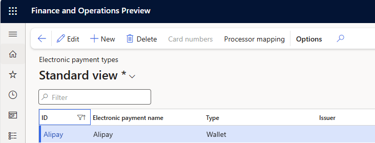
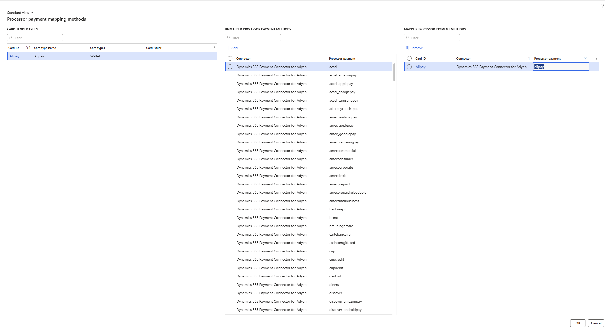

# Wallet payment support

[!include [banner](../../finance/includes/banner.md)]

This article provides an overview of wallet payment support for Microsoft Dynamics 365 Commerce.  

## Key terms

| Term | Description |
|---|---|
| Wallet | A payment type that doesn't include traditional payment characteristics, such as the Bank Identification Number (BIN) range and expiration date, that are used to differentiate credit and debit card types. |
| Processor payment method | A property payment card property in the payments SDK. When this property is added to supported payment methods within a connector, those payment methods can be mapped to cards or wallets configured in Commerce headquarters to avoid the traditional BIN range mapping. 
| Payment service provider (PSP) reference | The key that Adyen uses to identify payment transactions. This feature enables the PSP reference to be shown on the retail store transactions and call center authorization details pages.

Unlike traditional credit and debit cards, wallet payment authorization responses don't include BIN ranges. Traditionally, BIN ranges have been used to match payment authorization responses to predefined card types that have BIN ranges. The wallet payment support feature adds support for processor payment methods and mapping of those variants to card types that are set up in Commerce headquarters.

**Processor payment method** is a property for the payments SDK that can be applied to payment methods supported for a particular payment connector. When an authorization response is received that includes the processor payment method, a lookup is performed to determine if that processor payment method has been mapped to a card or wallet type. If a mapping is found, that payment is mapped to the matching card or wallet type. If a match can't be found, a BIN lookup is performed following the traditional BIN range settings for Commerce. 

Because wallet payments don't include BIN range, if a payment connector such as PayPal supports wallet payments, the payment connector should be updated to the latest payments SDK and the processor payment method property should be populated at least for all supported wallet payments. 

Processor payment method mappings are also useful for traditional debit and credit card payments. Mapping processor payment methods to cards is more straightforward than BIN range mapping and less prone to errors because it is easy to ensure all possible payment methods supported by a connector are mapped to a card or wallet type. 

## Enable wallet payment support

To enable wallet payment support in Commerce headquarters, go to **Workspaces \> Feature management**, and then search for the **Enhanced wallet support and payment improvements** feature. Select the feature, and then select **Enable**. After you enable the feature, run the **1110** distribution schedule to make it available in all channels. This feature supports a new payment method and card type called **Wallet**. The primary characteristic of a wallet payment is that it does not have a BIN range. However, wallet payment methods may not return expiration dates and some properties that have traditionally been considered mandatory. Wallet payment methods must be mapped to processor payment methods as an alternative to the traditional BIN range mapping. 

### Adding support of processor payment methods

To support processor payment methods, payment connectors need to populate the **PaymentMethodVariant** property in **PaymentCardProperties**. If the payments SDK in use does not include this property, it should be updated. 

### Processor payment method mapping

The **Processor payment method mapping** page can be used to map processor payment methods to configured card or wallet types. To access this page, select the **Processor mapping** link on the **Card types** page.

When this page opens, it queries available payment connectors to collect a set or payment methods with the **PaymentMethodVariant** field populated. It then checks to determine if those payment methods have an existing mapping to a card or wallet. Payment methods that do not have a mapping are listed in the center column of the page. 

To map a processor payment method to a card or wallet, select the card or wallet, select the processor payment method, and then select **Add**. The processor payment method moves to the **Mapped** column. When a matching payment authorization is received, it will be mapped to the chosen card or wallet.

> [!NOTE]
> The **Processor payment method mapping** capability adds a new table that must be synchronized to the channel database. To add this data to the Commerce scheduler, you need to initialize the Commerce scheduler. For details, please refer to documentation related to [updating commerce scheduler configurations](cdx-best-practices.md#update-configurations). 

### Setup for wallet payment methods and user experience

This section uses the example of **Alipay** to demonstrate the setup and user experience. However, these steps are applicable to all the supported wallet payment methods which are marked as supported in this article: https://learn.microsoft.com/en-us/dynamics365/commerce/dev-itpro/adyen-connector?tabs=10-0-36#digital-wallet-support-status.

The setup for a wallet is a four-step process:
**Step 1: Create a new electronic payment type aka Card type**
 
  Navigate to “Card types” form via “**Retail and commerce** > **Channel step** > **Payment methods** > **Card types**” and create a new card type for Alipay. Make sure to choose the “Type” as “Wallet”. Refer the below image.

   

**Step 2: Map the newly created card type to a processor payment method**

  For the newly created card type above, click on the “Processor mapping” button at the top toolbar. 
  Referring to the below image, select the newly created card type ID in the “CARD TENDER TYPES” section. 

   
   
  Next, select the row where the “Processor payment” column shows “Alipay” for the desired payment connector e.g. Adyen and press the “Add” button. This should map the newly created card type with the process payment method. The below list shows the processor payment values corresponding to their respective Wallet payment method for Dynamics 365 Commerce Adyen connector:
  1. alipay: Alipay
  2. alipay_hk: AlipayHK
  3. affirm_pos: Affirm
  4. wechatpay_pos: WeChat Pay
     
**Step 3: Add the card type to a payment method of the brick-and-mortar store**

  Navigate to the “All stores” form and open the payment methods form associated with the store where these wallets need to be enabled.
  These wallets can be associated with the card type payment methods or create a new payment method for Wallets and associate the newly created card types to this payment method. Referring to the the below images, the newly created card type is associated with the Card type payment method.

  
  
  

**Step 4: Enable the payment method in payment service provider e.g., Adyen**

  Contact the representative from your Payment service provider e.g., Adyen and enable these wallets for your account
  This completes the minimum required setup for enabling the wallet payments. Once enabled, if the customer wants to use any of the wallet payments, then the cashier can select the payment method associated with Cards as usual, but on the Pin Pad, the cashier will need to select the “Scan” button on the pin pad which will display the list of support wallet payments. The cashier or the consumer can select the desired wallet that the customer wants to use, and this will display a QR code on the Pin pad. The customer can then scan this QR code from their wallet app and proceed with the payment. 
 
  > [!NOTE]
  > For testing with the Adyen connector, the Pin pad shows the payment as approved after 15 seconds, without scanning the QR code

  > [!WARNING]
  > There are other variations of user experience where the customer initiates a QR code from the wallet app and the cashier scans it, are not yet supported

#### Known limitations with the Wallet payment methods

The following section describes the current limitations with the Wallet methods. Some of these will be fixed with a bug fix, while some do not have a timeline. 

**Limitations which are planned to be rectified as a bug fix:**
1. If the feature **“Enable use of non-recurring tokens in Commerce”** is enabled and these wallets are used for authorization of the remaining balance for a customer order in POS, then during order pickup in POS, the authorization is not found and hence the customer needs to present the payment again.
2. If these wallets are used for customer order deposit, then the customer order cannot be returned via call center but can be returned in POS.
3. The standard customer receipt does not show the Card type information i.e., Alipay, WeChat Pay etc. on the receipt.
   
**Limitations which do not have a planned fix date:**
1. If the feature **“Enable use of non-recurring tokens in Commerce”** is NOT enabled, then these wallets can only be used for customer order deposits but not to authorize the remaining balance on the customer order
2. Ability for cashier to map a button on POS to a specific wallet payment method e.g., Alipay which would display the Alipay specific QR code on payment terminal, hence, preventing the need for the customer to manually select the wallet from the list of supported wallets on Pin pad

## Other payment enhancements that are enabled by the wallet payment support feature

In addition to enabling wallet payment support, the wallet payment support feature enhances the payment details that are available in Commerce headquarters for payments that are created by using the Dynamics 365 Payment Connector for Adyen. 

In the call center, the wallet payment support feature adds two fields to the default view for payment authorization details. First, the existing **Processor reference** column is filled with the PSP reference that is provided by Adyen. The PSP reference is the key that Adyen uses to look up payments. Second, the existing **Approval code** column is filled with the approval code value that is provided in the authorization from Adyen. 

For retail store transactions, additional enhancements have been added to the payment transactions view for payments that are created using the Adyen connector. The **Approval code** field shows the approval code from the processor, the **Processor payment** field shows the processor payment method, and the **Processor reference** field shows the PSP reference from Adyen. These three fields aren't discrete fields in the database, and are only shown in the user interface when a specific payment is viewed. A payment processed using the Dynamics 365 Payment Connector for PayPal also provides the **Approval code**, **Processor payment** and **Processor reference** field values. Before the fields can be shown, the point of sale (POS) client must be updated with Commerce version 10.0.20 or later, and the **Enabled** status for the **Enhanced wallet support and payment improvements** feature must be synchronized to the channel.

> [!NOTE]
> The Dynamics 365 Payment Connector for PayPal does not provide the three field values (**Approval code**, **Processor payment**, **Processor reference**) for payment void requests due to a limitation of the PayPal [API](https://developer.paypal.com/api/payments/v2/#authorizations_void). The three fields will be blank in the user interface. 
### Support for unidentified card types

In some scenarios, a payment connector may return a card that does not have a BIN range or processor payment method mapping. If this occurs, the payment is authorized by the payment terminal, but is then reversed when the point of sale (POS) can't map the authorization response to a specific card type. To address this, a capability is provided to map unknown authorization responses to a default card type. 

This capability ensures that the payment is never authorized by the terminal and then reversed by the POS. This helps avoid confusion for customers and store associates. When this setting is used, the default card for unknown authorizations should be checked periodically to ensure that wanted card types are not accidentally being mapped to the default for unknown card types. If a card type is truly unwanted for processing, it should be turned off at the processor level.

## When not to use processor payment method mapping

In certain cases, processor payment method mapping may not be granular enough for reporting needs. For example, some retailers differentiate external gift cards from the same provider by their BIN range. In this scenario, the gift cards should not be mapped using the above scenario. Instead, they should continue to use traditional BIN range mapping. 

## Additional resources

- [Payments FAQ](payments-retail.md)
- [Dynamics 365 Payment Connector for PayPal](paypal.md)
- [Dynamics 365 Payment Connector for Adyen](adyen-connector.md?tabs=8-1-3)

[!INCLUDE[footer-include](../../includes/footer-banner.md)]
