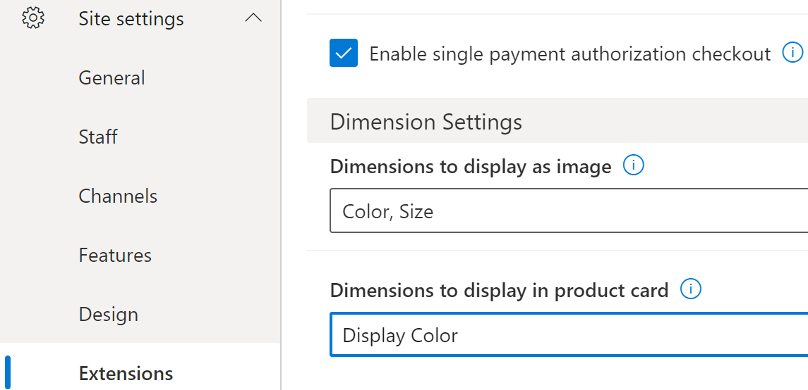
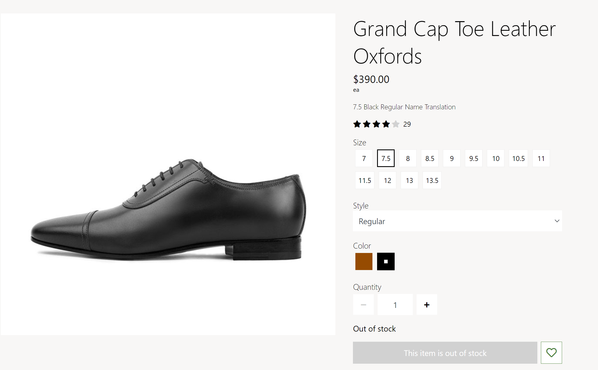
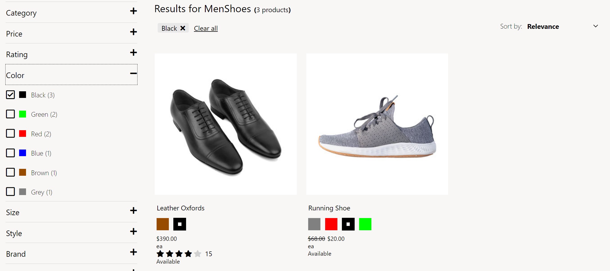

---
# required metadata

title: Apply display settings for product dimensions
description: This topic covers the display settings for product dimensions and describes how to apply them in Microsoft Dynamics 365 Commerce.
author:  anupamar-ms
ms.date: 05/28/2021
ms.topic: article
ms.prod: 
ms.technology: 

# optional metadata

# ms.search.form: 
# ROBOTS: 
audience: Application User
# ms.devlang: 
ms.reviewer: v-chgri
# ms.tgt_pltfrm: 
ms.custom: 
ms.assetid: 
ms.search.region: Global
ms.search.industry: 
ms.author: anupamar
ms.search.validFrom: 2019-10-31
ms.dyn365.ops.version: 
---

# Apply display settings for product dimensions

[!include [banner](includes/banner.md)]

This topic covers the display settings for product dimensions and describes how to apply them in Microsoft Dynamics 365 Commerce.

Dynamics 365 Commerce supports size, style, and color dimensions to distinguish product variants. Dimensions are typically shown as text values, such as "Small," "Medium," and "Large" for sizes, and "Black" and "Brown" for colors. However, if a product supports many variations, it can be difficult to browse product variants, because multiple selections are required to view the image for each variant. To make it easier to browse product variants, the version 10.0.20 release of Commerce can use images and hexadecimal (hex) codes to show dimensions as swatches.

In Commerce site builder, dimension settings are defined at **Site Settings \> Extensions \> Dimension Settings**. The following illustration shows an example of dimension settings in site builder.

Two dimension settings are available:

- **Dimensions to display as image** – Specify which dimensions should appear as swatches on e-commerce site pages such as product details pages (PDPs) and search result list pages. Any combination of color, size, and style dimensions can be shown as a swatch. If a dimension is selected for display as a swatch, Commerce module rendering will look for an available configuration of a hex code swatch. If no hex code is configured, system logic will look for a configuration of an image URL swatch. If neither a hex code nor an image URL is configured, text will be shown.

    The following illustration shows an example where a PDP on an e-commerce site includes color and size swatches. In this example, a hex code is configured for the color dimension. Therefore, swatches are shown as colors. However, neither a hex code nor an image URL is configured for the size dimension. Therefore, text is shown.

    

- **Dimensions to display in product card** – Specify which dimensions should appear on product cards that are shown in lists and on list pages. Before a dimension can appear on a product card, this setting must be enabled for that dimension. The **Dimensions to display as image** setting should also be enabled. The swatch selection behavior on product cards is optimized for the color dimension. For other dimensions, a view extension might be required to customize swatch selection behavior.

    The following illustration shows an example where a list page on an e-commerce site contains product cards that include color swatches.

    

For information about how to configure product dimensions so that they are shown as swatches on site pages, see [Configure product dimension values to appear as swatches](./dev-itpro/dimensions-swatch.md).

## Additional resources

[Module library overview](starter-kit-overview.md)

[Search results module](search-result-module.md)

[Buy box module](add-buy-box.md)

[Configure product dimension values to appear as swatches](./dev-itpro/dimensions-swatch.md)

[!INCLUDE[footer-include](../includes/footer-banner.md)]
