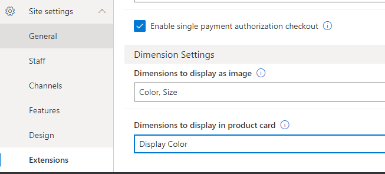
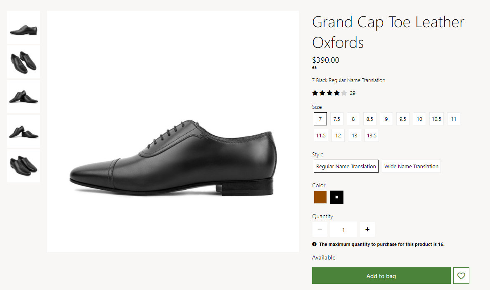

---
# required metadata

title: Apply display settings for product dimensions
description: This topic covers the display settings for product dimensions and describes how to apply them in Microsoft Dynamics 365 Commerce.
author:  anupamar-ms
ms.date: 05/28/2021
ms.topic: article
ms.prod: 
ms.technology: 

# optional metadata

# ms.search.form: 
# ROBOTS: 
audience: Application User
# ms.devlang: 
ms.reviewer: v-chgri
# ms.tgt_pltfrm: 
ms.custom: 
ms.assetid: 
ms.search.region: Global
ms.search.industry: 
ms.author: anupamar
ms.search.validFrom: 2019-10-31
ms.dyn365.ops.version: 
---

# Apply display settings for product dimensions

[!include [banner](includes/banner.md)]
[!include [banner](includes/preview-banner.md)]

This topic covers the display settings for product dimensions and describes how to apply them in Microsoft Dynamics 365 Commerce.

Dynamics 365 Commerce supports size, style, and color dimensions to distinguish between product variants. Dimensions are typically displayed as text values, for example "Small," "Medium," and "Large" for sizes, and "Black" and "Brown" for colors. However, for a product that supports many variations, browsing through these variants requires multiple selections to view each product variant image, which can make the selection process slow and tedious. To make browsing product variants easier, with the Commerce version 10.0.20 release Commerce has the capability to display dimensions as swatches using images and hexadecimal (hex) codes.  

In Commerce site builder, dimensions settings are defined at **Site Settings \> Extensions \> Dimension Settings**. The following example image shows dimension settings in Commerce site builder. 

There are two dimension settings available:

- **Dimensions to display as swatch** - This setting defines which dimensions should appear as a swatch on e-commerce site pages such as product details pages (PDPs) and search result list pages. Any combination of color, size, and style dimensions can be displayed as a swatch. If a dimension is selected to be displayed as a swatch, Commerce module rendering will look for an available hex code swatch configuration. If there is no hex code configured, system logic will fallback and check for an image URL swatch configuration. If both the hex code and image URL are missing, text will be displayed. 

    The following example image shows an e-commerce site PDP displaying color and size swatches, where the color dimension has a hex code configured and displays swatches as colors, but the size dimension has neither a hex code nor image URL configured and so displays text. 

    

- **Dimensions to display in Product card** - This setting allows dimensions to be displayed on product cards that are shown on lists and list pages. If a dimension must be displayed on a product card, this setting must be enabled for that dimension and it should also be enabled as a swatch. For example, to display Color on the product cards, the following should be configured. In addition, the swatch selection behavior on product cards along with the refiner experience is most optimized for Color dimension. For other dimensions, a view extension may be needed to provide an optimal experience. 

    The following example image shows color swatches displayed on product cards on an e-commerce site list page. 

    

For information on how to configure dimensions to display as swatches on site pages, see [Configure product dimension to be represented as swatch](./dev_itpro/media/dimensions_ swatch.md). 

## Additional resources

[Module library overview](starter-kit-overview.md)

[Search results module](search-result-module.md)

[Buy box module](add-buy-box.md)

[!INCLUDE[footer-include](../includes/footer-banner.md)]
