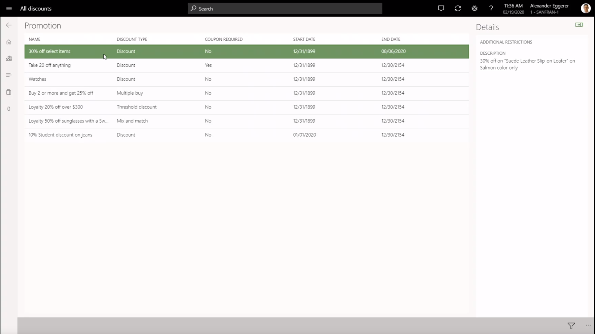
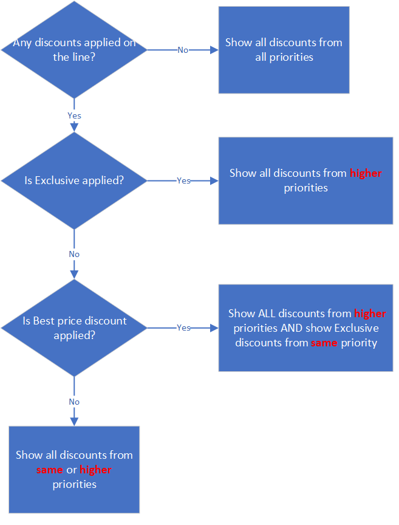
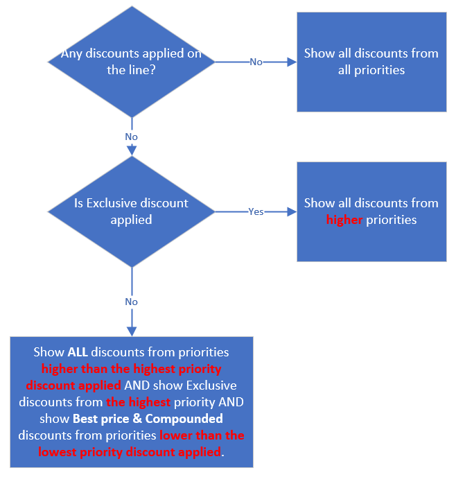

---
# required metadata

title: Show discounts in POS 
description: This topic explains how Microsoft Dynamics 365 Commerce helps sales associates learn about promotions and how they can be used for cross-sell and upsell motions.
author: ShalabhjainMSFT
ms.date: 07/29/2020
ms.topic: article
ms.prod: 
ms.technology: 

# optional metadata

ms.search.form: 
# ROBOTS: 
audience: Application User
# ms.devlang: 
ms.reviewer: josaw
# ms.tgt_pltfrm: 
ms.custom: 
ms.assetid: 
ms.search.region: global
ms.search.industry: Retail, Commerce
ms.author: asharchw
ms.search.validFrom: 2020-02-28
ms.dyn365.ops.version: Application update 10.0.10

---

# Show discounts in POS

[!include [banner](includes/banner.md)]

Promotions play an important role in motivating customers who are making purchasing decisions. For example, holidays can produce the highest number of sales for retailers, because the whole retail market is flooded with enticing promotions and discounts. If store associates know about and understand the promotions that are available, they can easily take advantage of those promotions to cross-sell and upsell items. This topic explains how Microsoft Dynamics 365 Commerce helps sales associates learn about promotions and how they can be used for cross-sell and upsell motions.

## Learn about store discounts

Commerce includes an operation that is named "View all discounts." This operation shows all the discounts that are currently running in a store. The "View all discounts" operation can be mapped to a button in the point of sale (POS), and that button can be added to the **Welcome** page or the **Transaction** page. The following illustration shows an example of the **All discounts** page that is opened.

To show discounts, the system looks for all the discounts that match one or more of the following conditions:

- The price group of the discount matches the price group of the store.
- The price group of the discount is mapped to an affiliation or loyalty program.
- The price group of the discount is mapped to a catalog that is associated with the store.

The **All discounts** page shows only some coupon-based discounts, because retailers typically create thousands of coupons and corresponding discounts for unique customers, and this page isn't intended to show customer-specific discounts. Coupon-based discounts are shown only if the **Apply without a coupon code** option is turned on in each coupon header. In that case, cashiers can apply the coupon without having to enter or scan any coupon code or bar code.

When the **Apply without a coupon code** option is turned on, various scenarios become available. For example, cashiers can give additional discounts to customers for customer appeasement purposes or because of product defects. Printed coupon codes or bar codes don't have to be distributed to cashiers. Instead, cashiers can select the **Apply coupon** button. The coupon is then automatically applied to the transaction. If multiple coupons exist for a coupon header, the system automatically selects the first active coupon on the transaction.

On the **All discounts** page, sales associates can also search discounts by keywords. The keyword search looks in the fields that hold the discount name and discount description. Sales associates can also filter discounts based on whether a discount requires a coupon code.

## Cross-sell and upsell by using discounts

Multiline discounts, such as quantity discounts, mix-and-match discounts, and threshold discounts, are a great way to motivate customers to buy more products to get larger discounts. Therefore, they also help increase the size of a customer's cart and retailer revenue. These discounts can be publicized on e-commerce websites, on social media, and on banners in the store.

However, even when all these publicity methods are used, customers might miss the opportunity to take advantage of promotions. To make it easy for sales associates to learn what promotions are applicable to a selected line, or even to the whole cart, retailers can add the button for the **"View available discounts"** operation to the button grid on the **Transaction** page. As a result, sales associate can select a transaction line and then select the button to show all the discounts that are available for the selected line. The sales associate can also select another tab to show discounts that apply to the whole transaction. It is important to note that **View available discounts** does not show the discounts that are already applied on the sales line because the discount information is already shown on the sales line. The purpose of this scenario is to only show the discounts that are not yet applied. The exception to this is the discounts that are applied based on a coupon marked as "Apply without a coupon code". This makes it easy for the sales associate to easily remove the coupon they have applied.

The **All discounts** page shows only discounts that don't compete with any of the applied discounts. This behavior helps ensure that, if a sales associate informs a customer about a discount, and the customer takes the required action (for example, the customer buys one more item to get 10 percent off), the discount is applied to the transaction. The coupon-based discounts are shown only when the **Apply without a coupon code** option is turned on.

In a simple scenario where all discounts have the same priority, the discount concurrency mode is **Compounded**, and the discount concurrency control is set to **Best price and compound within priority, never compound across priorities**, the **All discounts** page shows all available discounts for a product, because all the discounts are compounded and don't compete with each other.

The following illustrations show the logic that determines which discounts are shown in advanced scenarios, such as a scenario where the discount concurrency mode is **Best price** or **Exclusive**, and two or more priorities are used. In these scenarios, the discounts that are shown are further affected based on whether the discount concurrency control is set to **Best price and compound within priority, never compound across priorities** or **Best price only within priority, always compound across priority**.

The following illustration shows the logic that is used when the discount concurrency control is set to **Best price and compound within priority, never compound across priorities**.

.

The following illustration shows the logic that is used when the discount concurrency control is set to **Best price only within priority, always compound across priority**.

.

[!INCLUDE[footer-include](../includes/footer-banner.md)]