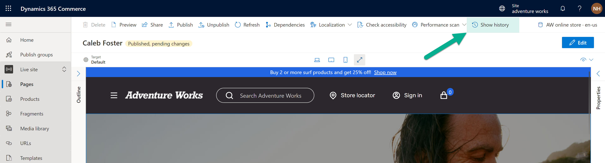

---
 # required metadata

title: View version history to restore pages, fragments, and templates
description: This article describes how to view version history for a page, fragment, or template and roll back to an older version in Microsoft Dynamics 365 Commerce site builder.
author: phinneyridge
ms.date: 08/01/2022
ms.topic: article
audience: Application User, Developer, IT Pro
ms.reviewer: v-chgriffin
ms.search.region: Global
ms.author: niholman
ms.search.validFrom: 2017-06-20

---

# View version history to restore pages, fragments, and templates

[!include [banner](includes/banner.md)]
[!include [banner](includes/preview-banner.md)]

This article describes how to view version history for a page, fragment, or template and roll back to an older version in Microsoft Dynamics 365 Commerce site builder.

Site builder's visual page builder interface for pages and fragments contains a button in the action bar, **Show history**, that will display a history of all versions and save activities for the page or fragment.  Authors can use this to view historical versions and restore a previous version of the document being edited.  To use this feature, follow these steps:

1. Navigate to the **visual page builder** editing interface for a page or fragment by clicking on it in the **pages** or **fragments** list view in site builder.
1. On the command bar, select **Show history**. The **Version history** flyout menu appears.  

    

1. This will display a version history interface for the page or fragment.  

    

    > [!NOTE]
    > Versions are created each time an editor makes changes and selects **Finished editing** for the page or fragment. Activity events are created for all save, publish, unpublish events.

1. You can also view a full save history for the document here by selecting the **Activity** tab at the top of the window.
1. On the **Versions** tab, select a previous version of the page or fragment.
1. You can view a thumbnail preview of this previous version in the right property panel and information on who and when the version was modified.
1. To view a full preview of a past version, click the **Preview** button at the top of the **Version history** interface.  This will display a rendered preview of the selected page or framgent version for inspection by the author.
1. To close the preview, select the **X** in the upper right corner or **Exit preview** on the lower left.
1. If you find a version that you would like to restore, select it in the list view and select **Restore** on the command bar. This will bring up a confirmation dialog. To confirm and proceed with the action, select **Restore**.

    

1. The visual page builder will refresh with the restored version of the page or fragment.
1. To publish the restored version, select **Finish editing**, and then select **Publish**.
