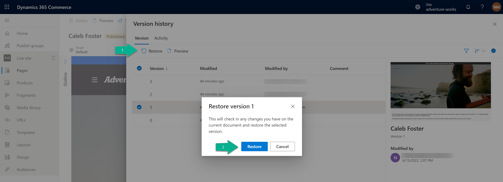

---
 # required metadata

title: Page version history and restore
description: This article describes how to view version history for a page or fragment and restore to older versions in Microsoft Dynamics 365 Commerce site builder.
author: phinneyridge
ms.date: 06/14/2022
ms.topic: article
ms.prod: 
ms.technology: 

# optional metadata

ms.search.form:  
audience: Application User
# ms.devlang: 
ms.reviewer: v-chgri
# ms.tgt_pltfrm: 
# ms.custom: 
ms.search.region: Global
ms.search.industry: 
ms.author: niholman
ms.search.validFrom: 2022-06-14
ms.dyn365.ops.version: Release 10.0.5

---

# Page version history and restore

[!include [banner](includes/banner.md)]

This article describes how to view version history for a page or fragment and restore to older versions in Microsoft Dynamics 365 Commerce site builder.

Site builder's **visual page builder** interface for pages and fragments contains a button in the action bar, **Show history**, that will display a history of all versions and save activities for the page or fragment.  Authors can use this to view historical versions and restore a previous version of the document being edited.  To use this feature, follow these steps:

1. Navigate to the **visual page builder** editing interface for a page or fragment by clicking on it in the **pages** or **fragments** list view in site builder.
2. Click on the **Show history** button in the top action bar.  

4. This will display a version history interface for the page or fragment.  

> [!NOTE]
> Versions are created each time an editor makes changes and clicks on **Finished editing** for the page or fragment. Activity events are created for all save, publish, unpublish events.
4. You can also view a full save history for the document here by clicking on the **Activity** tab at the top of the window.
5. In the **Versions** tab, select a previous version of the page or fragment in the list view by clicking on it.
6. You can view a thumbnail preview of this previous version in the right property panel and information on who and when the version was modified.
7. To view a full preview of a past version, click the **Preview** button at the top of the **Version history** interface.  This will display a rendered preview of the selected page or framgent version for inspection by the author.
8. To close the preview, click the **X** in the upper right corner or the **Exit preview** button in the lower left.
9. If you find a version that you would like to restore, select it in the list view and click the **Restore** button in the command bar.  This will bring up a confirmation dialog.  To confirm and proceed with the action click **Restore**.

11.  The visual page builder will refresh with the restored version of the page or fragment.
12.  To publish the restored version, click the **Finish editing** and then **Publish** actions, just as you would to publish any other page or fragment changes.
