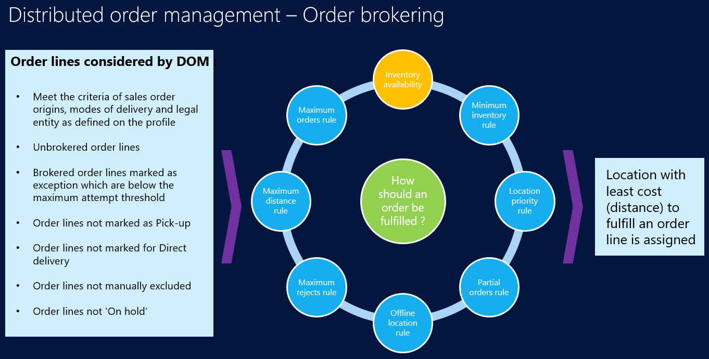

# DOM processing

[!include [banner](includes/banner.md)]

This article describes how distributed order management (DOM) processes sales orders in Microsoft Dynamics 365 Commerce.

## Configure DOM processor batch job

DOM will run only in a batch job.

To configure the DOM processor batch job for DOM runs, follow these steps.

1. Go to **Retail and Commerce \> Distributed order management \> Batch processing \> DOM processor job setup**.
1. On the **Parameters** FastTab, for **Fulfillment profile**, select a profile for which DOM must be run.
1. On the **Run in the background** FastTab, for **Batch group**, select a configured batch group.
1. For **Task description**, enter a name for the batch job.
1. Select **Recurrence**, and then specify the recurrence of the batch job.
1. Select **OK**.

## Search sales orders and lines

At the time of processing, DOM considers the following order and order lines:

- Order lines that meet the criteria for sales order origins, modes of delivery, and legal entity as defined in the DOM profile, and that also meet any of the following criteria:
    - The order lines are created from Commerce channels. Sales orders are identified as being from Commerce channels when the **Commerce sale** option is set to **Yes**.
    - The order lines have never been brokered by DOM.
    - The order lines have been brokered by DOM before, but they are marked as exceptions and are below the maximum attempt threshold.
    - The mode of delivery isn't pickup or electronic delivery.
    - The order lines aren't marked for delivery.
    - The order lines aren't manually excluded.
    - If **Do not process accepted store orders during order optimization** is enabled, the order lines aren't assigned to retail store warehouses with the fulfillment status as **Accepted** .
- Orders that aren't on hold.

To manually exclude a sales line, in Commerce headquarters, go to **Retail and Commerce \> Customers \> All sales orders** and select a sales line. On the **General** FastTab of the sales line, set the **Exclude from DOM processing** option to **Yes**.

## Partition sales lines

During each DOM processor job, DOM breaks orders into batches, depending on the **Maximum number of order lines per optimization** parameter value defined in the fulfillment profile. DOM ensures that all sales lines of a sales order are in the same batch.

For example, if 10,000 order lines are being optimized in a run, and the **Maximum number of order lines per optimization** parameter is set to **2000**, DOM creates five batches that are processed simultaneously.

If the **Maximum number of order lines per optimization** value is 0:
- For the Simplified Solver type, DOM creates a batch for every 100 sales lines.
- For the Production Solver type, DOM creates a batch for every 1500 sales lines.

> [!NOTE]
> If you set a large value for **Maximum number of order lines per optimization**, the DOM processor job takes a longer time to complete because it runs on a batch server. To improve performance, set an appropriate value to ensure that DOM can use more batch servers.

## Inventory lookup

DOM looks up available inventory by viewing on-hand inventory in warehouse V2 entities (for example, `InventWarehouseOnHandAggregatedView`). The on-hand inventory supports product dimensions such as color, size, style, and configuration, and storage dimensions such as site and warehouse. Other dimensions such as location, inventory status, license plate are not supported. 

To view the on-hand inventory used by DOM, enter the following URL in your browser's address bar, replacing `<DomainName>` with the domain name of your environment and `<CompanyName>` with the name of your legal entity.

`https://<DomainName>/?cmp=<CompanyName>&mi=SysTableBrowser&TableName=InventWarehouseOnHandAggregatedView`

DOM also looks up reserved inventory on the sales lines to be processed. Similar to on-hand inventory, DOM only supports product dimensions such as color, size, style, and configuration, and storage dimensions such as site and warehouse. If the reserved inventory uses other dimensions such as location, inventory status, license plate, it won't be considered by DOM.

To support on-hand or reserved inventory on other dimensions or custom dimensions, you must build customizations. For more information, see [DOM extensibility](./dom-extensibility.md).

## Calculate distance

DOM converts addresses of the **Delivery** type to latitude and longitude values. DOM then converts the delivery address on the sales order to latitude and longitude values, and updates the latitude and longitude values of the address for future use. DOM depends on Bing Maps to determine accurate latitude and longitude values based on address, city, and postal code information. To allow DOM to use Bing Maps functionality, enable the **Confirm Bing Maps usage for DOM** setting. For more information, see [Set up DOM](dom-set-up.md).

DOM uses the Bing Maps API to calculate aerial or road distance, depending on the value of the **Disable road distance calculation** setting. DOM then uses this information to determine the cost of shipping. The optimization model prioritizes fulfillment of a complete order from one location. Even if part of an order is available in the same city or postal code, the model has been optimized to reduce the number of shipments. For more information, see [Set up DOM](dom-set-up.md).

## Generate fulfillment plans

After DOM applies the rules, inventory constraints, and optimization, it picks the location that is closest to the customer's delivery address. Fulfillment plans are then obtained from the optimizer. Whether fulfillment plans are applied on the sales lines or not depends on the value of the **Auto apply result** setting. For more information, see [Results of DOM runs](dom-runs-results.md).

## Additional resources

[DOM overview](dom.md)

[Set up DOM](dom-set-up.md)

[DOM rules](dom-rules.md)

[DOM cost configuration](dom-costs.md)

[Results of DOM runs](dom-runs-results.md)

[Clean up DOM fulfillment plans and logs](dom-clean-up.md)

[DOM extensibility](dom-extensibility.md)

[DOM limitations](dom-limitations.md)

[!INCLUDE[footer-include](../includes/footer-banner.md)]
