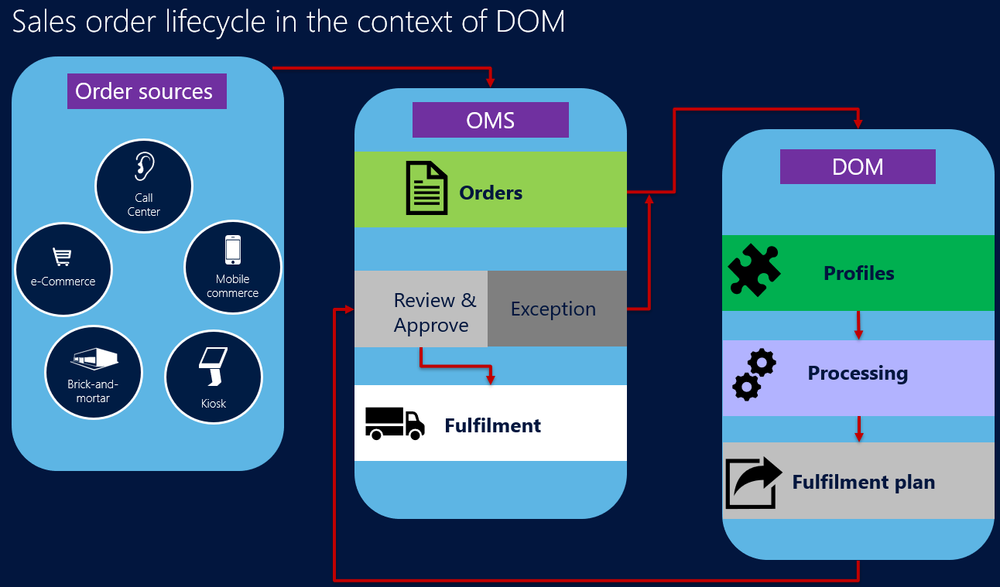

---
# required metadata

title: Distributed order management (DOM)
description: This article provides an overview of the distributed order management (DOM) functionality in Microsoft Dynamics 365 Commerce.
author: josaw1
ms.date: 11/17/2023
ms.topic: overview
audience: Application User
ms.reviewer: josaw
ms.assetid: ed0f77f7-3609-4330-bebd-ca3134575216
ms.search.region: Global
ms.author: josaw
ms.search.validFrom: 2018-11-15

---
# Distributed order management (DOM)

[!include [banner](includes/banner.md)]

This article provides an overview of the distributed order management (DOM) functionality in Microsoft Dynamics 365 Commerce.

DOM is an omnichannel order fulfillment optimization solution that helps maximize order fulfillment in a supply chain network. DOM helps you ensure that products are delivered to your customers in the correct quantities, from the correct sources, at the correct times. DOM can also help you maximize profits, minimize costs, and meet service-level requirements.

DOM uses mixed integer programming (MIP) and predictive analysis models to perform optimizations at both the batch level and the level of individual orders. This capability enables retailers to use defined rules to balance many conflicting order fulfillment needs. In a modern supply network, where product fulfillment can come from multiple channels, organizations must quickly adapt to order changes, supplier availability issues, and spikes in demand. DOM helps you maximize order fulfillment and find the correct sources for product delivery, based on business constraints and objectives such as minimizing costs by fulfilling orders from the closest sources. DOM uses the distance between product fulfillment sources and the shipping destinations, cost factors that are defined as optimization objectives, and rules that are defined as constraints such as inventory at fulfillment nodes to optimize order fulfillment. DOM allows for the definition of multiple profiles that enable businesses to run different optimization strategies, depending on the type of business or consumer segment. 

The following illustration shows the lifecycle of a sales order in a DOM system.

The following video provides an overview of DOM capabilities in Dynamics 365 Commerce.

> [!VIDEO https://www.microsoft.com/videoplayer/embed/RE5bRYl]

## Additional resources

[Set up DOM](dom-set-up.md)

[DOM rules](dom-rules.md)

[DOM cost configuration](dom-costs.md)

[DOM processing](dom-processing.md)

[Results of DOM runs](dom-runs-results.md)

[Clean up DOM fulfillment plans and logs](dom-clean-up.md)

[DOM extensibility](dom-extensibility.md)

[DOM limitations](dom-limitations.md)

[!INCLUDE[footer-include](../includes/footer-banner.md)]
