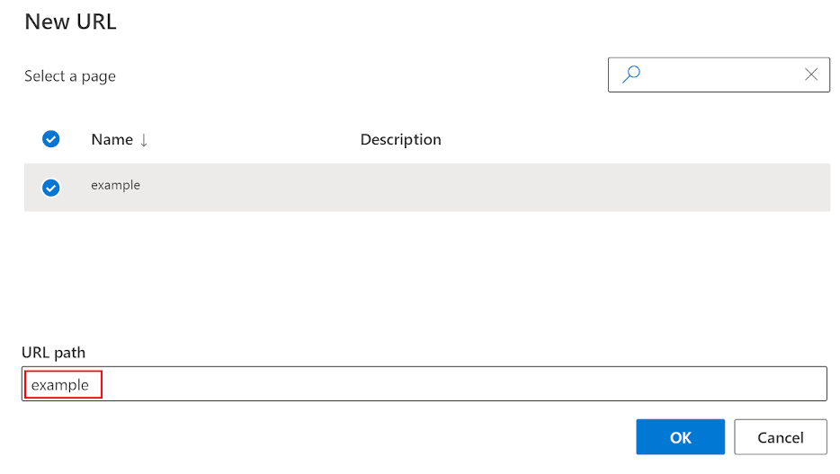
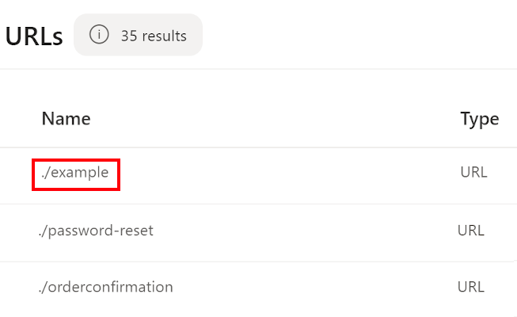

---
# required metadata

title: Domains in Dynamics 365 Commerce
description: This topic describes how domains are handled in Microsoft Dynamics 365 Commerce.
author: BrShoo
manager: AnnBe
ms.date: 08/25/2020
ms.topic: article
ms.prod: 
ms.service: dynamics-365-commerce
ms.technology: 

# optional metadata

ms.search.form:  
audience: Application User
# ms.devlang: 
ms.reviewer: v-chgri
ms.search.scope: 
# ms.tgt_pltfrm: 
# ms.custom: 
ms.search.region: Global
ms.search.industry: retail
ms.author: BrShoo
ms.search.validFrom: 
ms.dyn365.ops.version: 
---

# Domains in Dynamics 365 Commerce

[!include [banner](includes/banner.md)]

This topic describes how domains are handled in Microsoft Dynamics 365 Commerce.

## Overview

Domains are web addresses used to navigate to Dynamics 365 Commerce sites in a web browser. You control management of your domain with a chosen Domain Name Server (DNS) provider. Domains are referenced throughout Commerce site builder to coordinate how a site will be accessed when published. This topic reviews how domains are handled and referenced throughout the lifecycle of the Commerce site development and launch.

## Provisioning and supported host names

When provisioning an e-Commerce environment in [Microsoft Dynamics Lifecycle Services (LCS)](https://lcs.dynamics.com/), the **Supported host names** field on the e-Commerce provisioning screen is used to enter the domain(s) that will be associated with the deployed Commerce environment. Multiple supported host names can be entered by separating them with semi-colons. Domains entered here will be the customer-facing DNS names where e-Commerce websites will be hosted. Entering domains at this stage does not start diverting traffic for those domains to Dynamics 365 Commerce. Traffic for the domain will only be routed to the Commerce endpoint when you update your Domain Name Server (DNS) to use the Commerce endpoint with the domain.

The following illustration shows the LCS e-Commerce provisioning screen with the **Supported host names** field highlighted. 

You can create a service request to add additional domains to the environment if provisioning has already occurred. To create a service request in LCS, within your environment go to **Support \> Support issues** and select **+ Submit an incident**.

When provisioning an e-Commerce environment, Commerce will generate a URL that will be the working address for the environment. This URL is referenced in the "e-Commerce site" link shown in LCS after the environment is provisioned. A Commerce-generated URL is in the format `https://<e-Commerce tenant name>.commerce.dynamics.com`, where the e-Commerce tenant name is the domain you entered in the LCS "supported host names" field for the Commerce environment.

You can use production site host names in a sandbox environment as well. This option is ideal when you will be copying a site from sandbox to production. The domain information will be copied into production, ready to work.

Non-production environments will show a suffix reflecting the environment type within the Commerce generated URL (for example, format of a sandbox environment: `https://<e-Commerce tenant name>-sandbox.commerce.dynamics.com`). Note that in the future, the "-sandbox" suffix will be removed.

## Site setup and generated URLs

Once your e-Commerce environment is provisioned, you must perform an initiate site setup in Commerce site builder to associate your site to the working URL.

When you first set up a site in site builder, the **Setup your Site** dialog box will appear.

The following illustration shows an example of the **Setup your Site** dialog box for a site named "default" in site builder:

The **Select a domain** field allows you to associate one of the supported host names provided for your site in LCS to your site in site builder.

The **Path** field can be left blank, or an additional path string can be added which will be reflected in your working URL. Leaving the **Path** field blank associates the base Commerce-generated URL with the site being set up in site builder. Paths must be unique for each site/domain combination. Within the site and domain selected, only one site in the environment can use the blank path or be associated with a unique path string. Any string added to the **Path** field during site setup will be become a sub-path of the base Commerce-generated URL used to access the site in a web browser. The **Path** is also known as the **Match path** when adding a channel in the **Site Settings \> Channels** configuration section of site builder.

For example, if you have a site in site builder called "fabrikam" in an environment named "xyz," and if you set up the site with a blank **Path**, then you would access the published site content in a web browser by going directly to the base Commerce-generated URL:

- `https://xyz.commerce.dynamics.com`

Alternately, if you had added a path of "fabrikam" during this same site's setup, you would access the published site content in a web browser by going to:

- `https://xyz.commerce.dynamics.com/fabrikam`

## Pages and URLs

Once your site is set up with a path, all URLs associated with pages in site builder will build on the working URL (in other words, the Commerce-generated URL, or the Commerce-generated URL plus the path) for the site. Creating a new URL in site builder (**URLS /> +New**) by selecting a page and entering the desired URL path for that page will associate that URL with the page. This URL path value appends to the site's working URL to access the page, and is labeled as `./<URL path>` in the URL list of the **URLs** page in site builder.

The following illustration shows the **New URL** dialog box in site builder. 

The following illustration shows the **URLs** page in site builder.

## Domains in site builder

The supported host names values are available to be associated as a domain when setting up a site. When selecting a supported host name value as the domain, you will see the chosen domain referenced throughout site builder. This domain is a reference only within the Commerce environment, live traffic for that domain is not yet forwarded to Dynamics 365 Commerce.

When working with sites in site builder, if you have two sites set up with two different domains, you can append the **?domain=** attribute to your working URL to access the published site content in a browser.

For example, environment "xyz" has been provisioned, and two sites have been created and associated in site builder: one with the domain `www.fabrikam.com` and the other with the domain `www.constoso.com`. Each site was set up using a blank path. These two sites could then be accessed in a web browser as follows using the **?domain=** attribute:
- `https://xyz.commerce.dynamics.com?domain=www.fabrikam.com`
- `https://xyz.commerce.dynamics.com?domain=www.contoso.com`

When a domain query string is not given in an environment with multiple domains provided, Commerce uses the first domain you provided. If the path "fabrikam" was added during site setup, the URL `https://xyz.commerce.dynamics.com` could be used to access the published site content site for `www.fabrikam.com`.

## DNS and Go-Live

You can simulate multiple domains using domain query string parameters on the commerce.dynamics.com endpoint itself. But when you need to go live in production, you need to forward the traffic for your custom domain to the `<e-Commerce tenant name>`.commerce.dynamics.com endpoint.

The `<e-Commerce tenant name>.commerce.dynamics.com` endpoint does not support custom domain Secure Sockets Layers (SSLs). This means that you must set up custom domains using a front door service or CDN. For this you have two options:

- Set up a front door service like Azure Front Door to handle front-end traffic and connect to your Commerce environment.
  - This provides greater control over domain and certificate management and more granular security policies.
- Use the Commerce-supplied Azure Front Door instance.
  - This requires coordinating action with the Dynamics 365 Commerce team for domain verification and obtaining SSL certificates for your production domain.

To set up a content delivery network (CDN) service directly, see [Add support for a content delivery network (CDN)](add-cdn-support.md).

To use the Commerce-supplied Azure Front Door instance, create a service request for CDN setup assistance from the Commerce onboarding team. 

- You will need to provide your company name, the production domain, environment ID, and production e-Commerce tenant name. 
- You will need to confirm if this is an existing domain (used for a currently active site ) or a brand new domain. 
- For a brand new domain, the domain verification and SSL certificate can be achieved in a single step. 
- For a domain serving an existing website, there is a multi-step process required to establish the domain verification and SSL certificate. This process has a 7-working-day service level agreement (SLA) for a domain to go live, since it includes multiple sequential steps (detailed below).

>[!NOTE]
>Custom domains with SSL are only supported on production environments. For lower environments (for example, sandbox and user acceptance testing [UAT]), use the Commerce- generated URL to access published content in a web browser.

## SSL certificate process

Once a service request is filed, the Commerce team will coordinate the following steps with you:

- For new domains:
  - Commerce will setup the Azure Front Door instance (Commerce-hosted).
  - Commerce will then provide the CNAME record to point your custom domain.
  - After the CNAME record is updated, the Commerce-hosted Azure Front Door instance will be able to verify the domain ownership and get the SSL certificate.
  
- For existing/active domains:
  - Commerce will instruct you to add an `afdverify.<custom-domain>` CNAME record to provide to your domain DNS provider.
  - Once completed, Commerce will add the domain to the Azure Front Door instance and provide additional DNS TXT records to be added to the DNS for the domain.
  - After the TXT records are completed, Commerce will complete the Azure Front Door updates for the domain that will set up the SSL certificate.

## Apex domains

The Commerce-supplied Azure Front Door instance does not support apex domains (also known as naked domains). Apex domains require an IP address to resolve, and the Commerce Azure Front Door instance exists with virtual endpoints only. To use an apex domain, you have two options:

- **Option 1:** Use your DNS provider to redirect the apex domain to a "www" domain (e.g. fabrikam.com redirects to `www.fabrikam.com` where `www.fabrikam.com` is CNAME to the Commerce-hosted Azure front door instance.)

- **Option 2:** Set up a CDN/front door instance on your own to host the apex domain.

>[!NOTE]
>If you are using Azure front door, you must also set up an Azure DNS in the same subscription. The apex domain hosted on Azure DNS can point to your Azure front door as an alias record. This is the only work around as apex domains must always point to an IP Address.

## Additional resources

[Deploy a new e-Commerce site](deploy-ecommerce-site.md)

[Set up an online store channel](online-stores.md)

[Create an e-Commerce site](create-ecommerce-site.md)

[Associate an online site with a channel](associate-site-online-store.md)

[Manage robots.txt files](manage-robots-txt-files.md)

[Upload URL redirects in bulk](upload-bulk-redirects.md)

[Set up a B2C tenant in Commerce](set-up-B2C-tenant.md)

[Set up custom pages for user logins](custom-pages-user-logins.md)

[Configure multiple B2C tenants in a Commerce environment](configure-multi-B2C-tenants.md)

[Add support for a content delivery network (CDN)](add-cdn-support.md)

[Enable location-based store detection](enable-store-detection.md)
