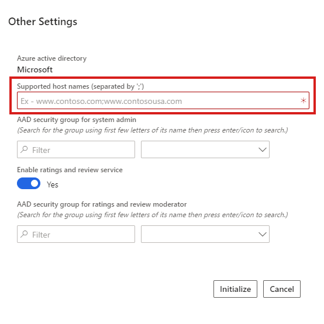

---

title: Domains in Dynamics 365 Commerce
description: This article describes how domains are handled in Microsoft Dynamics 365 Commerce.
author: BrianShook
ms.date: 03/21/2023
ms.topic: article
audience: Application User, Developer, IT Pro
ms.reviewer: v-chgriffin
ms.search.region: Global
ms.author: BrShoo
ms.search.validFrom: 2017-06-20

---

# Domains in Dynamics 365 Commerce

[!include [banner](includes/banner.md)]

This article describes how domains are handled in Microsoft Dynamics 365 Commerce.

Domains are web addresses used to navigate to Dynamics 365 Commerce sites in a web browser. You control management of your domain with a chosen Domain Name Server (DNS) provider. Domains are referenced throughout Dynamics 365 Commerce site builder to coordinate how a site will be accessed when published. This article reviews how domains are handled and referenced throughout the lifecycle of the Commerce site development and launch.

> [!NOTE]
> As of May 6th, 2022, all environments created in Dynamics 365 Commerce will be provisioned with the `.dynamics365commerce.ms` domain, replacing the earlier pattern of `.commerce.dynamics.com`. Existing environments provisioned with the `.commerce.dynamics.com` domain will continue to work.

## Provisioning and supported host names

When provisioning an e-commerce environment in [Microsoft Dynamics Lifecycle Services (LCS)](https://lcs.dynamics.com/), the **Supported host names** box on the e-commerce provisioning screen is used to enter domains that will be associated with the deployed Commerce environment. These domains will be the customer-facing Domain Name Server (DNS) names where e-commerce websites will be hosted. Entering a domain at this stage doesn't start diverting traffic for the domain to Dynamics 365 Commerce. Traffic for a domain will only be routed to the Commerce endpoint when the DNS CNAME record is updated to use the Commerce endpoint with the domain.

> [!NOTE]
> Multiple domains can be entered into the **Supported host names** box by separating them with semi-colons.

The following illustration shows the LCS e-commerce provisioning screen with the **Supported host names** box highlighted. 

You can create a service request to add additional domains to an environment if provisioning has already occurred. To create a service request in LCS, within your environment go to **Support \> Support issues** and select **Submit an incident**.

## Commerce-generated URLs

When provisioning a Dynamics 365 Commerce e-commerce environment, Commerce will generate a URL that will be the working address for the environment. This URL is referenced in the e-commerce site link shown in LCS after the environment is provisioned. A Commerce-generated URL is in the format `https://<e-commerce tenant name>.dynamics365commerce.ms`, where the e-commerce tenant name is the name entered in LCS for the Commerce environment.

You can use production site host names in a sandbox environment as well. This option is ideal when you'll be copying a site from a sandbox environment to production.

## Site setup

After your e-commerce environment is provisioned, you must set up your site in Commerce site builder to associate your site to the working URL.

When you first set up a site in site builder, the **Setup your Site** dialog box will appear.

The following illustration shows the **Setup your Site** dialog box for a site named "default" when you access the site for the first time in site builder.

The **Select a domain** box allows you to associate one of the supported host names provided for your site in LCS to your site in site builder.

The **Path** box can be left blank, or an additional path string can be added that will be reflected in your working URL. Leaving the **Path** box blank associates the base Commerce-generated URL with the site being set up in site builder. Paths must be unique for each site/domain pair. Within the site and domain selected, only one site in the environment can use the blank path or be associated with a unique path string. Any string added to the **Path** field during site setup will become a subpath of the base Commerce-generated URL used to access the site in a web browser.

> [!NOTE]
> The path is also known as the **Match path** when adding a channel in the **Site Settings \> Channels** configuration section of site builder.

For example, if you have a site in site builder called "fabrikam" in an e-commerce tenant named "xyz," and if you set up the site with a blank path, then you would access the published site content in a web browser by going directly to the base Commerce-generated URL:

`https://xyz.dynamics365commerce.ms`

Alternately, if you had added a path of "fabrikam" during this same site's setup, you would access the published site content in a web browser using the following URL:

`https://xyz.dynamics365commerce.ms/fabrikam`

## Pages and URLs

After your site is set up with a path, all URLs associated with pages in site builder will build on the working URL (the Commerce-generated URL, or the Commerce-generated URL plus the path) for the site. Creating a new URL in site builder (**URLS /> +New**) by selecting a page from the list in the **New URL** dialog box and entering the URL path for that page will associate that URL with the selected page. The URL path value then appends to the site's working URL to access the page, and is labeled as `./<URL path>` in the URL list of the **URLs** page in site builder.

The following illustration shows the **New URL** dialog box in site builder with an example URL path highlighted. 

The following illustration shows the **URLs** page in site builder with an example URL highlighted in the list.

## Domains in site builder

The supported host names values are available to be associated as a domain when setting up a site. When selecting a supported host name value as the domain, you'll see the chosen domain referenced throughout site builder. This domain is only a reference within the Commerce environment, live traffic for that domain won't yet be forwarded to Dynamics 365 Commerce.

When working with sites in site builder, if you have two sites set up with two different domains, you can append the **?domain=** attribute to your working URL to access the published site content in a browser.

For example, environment "xyz" has been provisioned, and two sites have been created and associated in site builder: one with the domain `www.fabrikam.com` and the other with the domain `www.constoso.com`. Each site was set up using a blank path. These two sites could then be accessed in a web browser as follows using the **?domain=** attribute:
- `https://xyz.dynamics365commerce.ms?domain=www.fabrikam.com`
- `https://xyz.dynamics365commerce.ms?domain=www.contoso.com`

When a domain query string isn't given in an environment with multiple domains provided, Commerce uses the first domain you provided. For example, if the path "fabrikam" was provided first during site setup, the URL `https://xyz.dynamics365commerce.ms` could be used to access the published site content site for `www.fabrikam.com`.

You can also add custom domains. To do so, on the environment Commerce management page for the project, under the **e-Commerce** subheading, select **+ Add custom domain**. The slider shows the existing custom domains and provides the option to add a new custom domain.

## Update which Commerce Scale Unit is used

The Commerce Scale Unit (CSU) used by Commerce is typically selected when an environment is initially created. Commerce lets you change which CSU instance your environment uses, allowing you to better maintain your architecture through self-service functionality, and reducing the need to contact support. To update your CSU instance, go to your environment's Commerce management page for the project, and then select **Update scale unit**. Use the **New commerce scale unit** slider to select a new CSU instance from the list of CSUs available for your environment.

## Traffic forwarding in production

You can simulate multiple domains using domain query string parameters on the commerce.dynamics.com endpoint itself. But when you need to go live in production, you must forward the traffic for your custom domain to the `<e-commerce tenant name>.dynamics365commerce.ms` endpoint.

The `<e-commerce tenant name>.dynamics365commerce.ms` endpoint doesn't support custom domain Secure Sockets Layers (SSLs), so you must set up custom domains using a front door service or content delivery network (CDN). 

To set up custom domains using a front door service or CDN, you have two options:

- Set up a front door service like Azure Front Door to handle front-end traffic and connect to your Commerce environment, which provides greater control over domain and certificate management and more granular security policies.

- Use the Commerce-supplied Azure Front Door instance, which requires coordinating action with the Dynamics 365 Commerce team for domain verification and obtaining SSL certificates for your production domain.

> [!NOTE]
> If you are using an external CDN or front door service, ensure that the request is landing at the Commerce platform with the Commerce-provided hostname, but with the X-Forwarded-Host (XFH) header \<custom-domain\>. For example, if your Commerce endpoint is `xyz.dynamics365commerce.ms` and the custom domain is `www.fabrikam.com`, the host header of the forwarded request should be `xyz.dynamics365commerce.ms` and the XFH header should be `www.fabrikam.com`.

For information about how to set up a CDN service directly, see [Add support for a content delivery network (CDN)](add-cdn-support.md).

To use the Commerce-supplied Azure Front Door instance, you must create a service request for CDN setup assistance from the Commerce onboarding team. 

- You'll need to provide your company name, the production domain, environment ID, and production e-commerce tenant name. 
- You'll need to confirm if this service request is for an existing domain (used for a currently active site) or a new domain. 
- For a new domain, the domain verification and SSL certificate can be achieved in a single step. 
- For a domain serving an existing website, there's a multistep process required to establish the domain verification and SSL certificate. This process has a 7-working-day service level agreement (SLA) for a domain to go live, because it includes multiple sequential steps.

To create a service request in LCS, within your environment go to **Support \> Support issues** and select **Submit an incident**.

> [!NOTE]
> Custom domains with SSL are only supported on production environments. For non-production environments such as sandbox and user acceptance testing (UAT), use the Commerce-generated URL to access published content in a web browser.

## SSL certificate process

When a service request is filed, the Commerce team will coordinate the following steps with you.

For new domains:
- The Commerce team will set up the Azure Front Door instance (Commerce-hosted).
- The Commerce team will then provide the CNAME record to point your custom domain.
- After the CNAME record is updated, the Commerce-hosted Azure Front Door instance will be able to verify the domain ownership and get the SSL certificate.

For existing/active domains:
- The Commerce team will instruct you to add an `afdverify.<custom-domain>` CNAME record to provide to your domain DNS provider.
- When complete, the Commerce team will add the domain to the Azure Front Door instance and provide additional DNS TXT records to be added to the DNS for the domain.
- After the TXT records are completed, the Commerce team will complete the Azure Front Door updates for the domain that will set up the SSL certificate.

## Apex domains

The Commerce-supplied Azure Front Door instance doesn't support apex domains (root domains that don't contain subdomains). Apex domains require an IP address to resolve, and the Commerce Azure Front Door instance only exists with virtual endpoints. To use an apex domain, you have the following options:

- **Option 1** - Use your DNS provider to redirect the apex domain to a "www" domain. For example, fabrikam.com redirects to `www.fabrikam.com` where `www.fabrikam.com` is the CNAME record that points to the Commerce-hosted Azure Front Door instance.

- **Option 2** - If your DNS provider supports ALIAS records, you can point the apex domain to the Azure Front Door endpoint, which ensures that the IP change by the endpoint is reflected.
  
- **Option 3** - If your DNS provider doesn't support ALIAS records, then you must change your DNS provider to Azure DNS and host both Azure DNS and the Azure Front Door instance yourself.

> [!NOTE]
> If you are using Azure Front Door, you must also set up an Azure DNS in the same subscription. The apex domain hosted on Azure DNS can point to your Azure Front Door as an alias record. This is the only work around, as apex domains must always point to an IP address.
  
If you have any questions regarding Apex domains, please reach out to [Microsoft Support](https://support.microsoft.com/).

  ## Additional resources

  [Deploy a new e-commerce tenant](deploy-ecommerce-site.md)

  [Set up an online store channel](./channel-setup-online.md)

  [Create an e-commerce site](create-ecommerce-site.md)

  [Associate a Dynamics 365 Commerce site with an online channel](associate-site-online-store.md)

  [Manage robots.txt files](manage-robots-txt-files.md)

  [Upload URL redirects in bulk](upload-bulk-redirects.md)

  [Set up a B2C tenant in Commerce](set-up-B2C-tenant.md)

  [Set up custom pages for user logins](custom-pages-user-logins.md)

  [Configure multiple B2C tenants in a Commerce environment](configure-multi-B2C-tenants.md)

  [Add support for a content delivery network (CDN)](add-cdn-support.md)

  [Enable location-based store detection](enable-store-detection.md)

[!INCLUDE[footer-include](../includes/footer-banner.md)]
