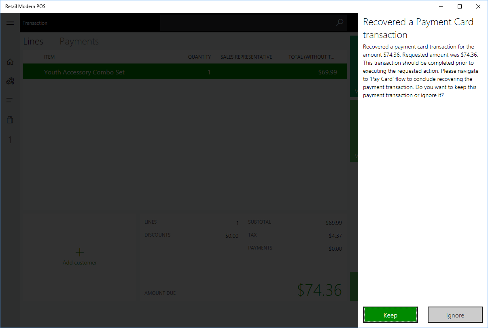

---
# required metadata

title: Duplicate payments prevention
description: This article describes how Microsoft Dynamics 365 Commerce helps to prevent duplicate payments in Store Commerce.
author: BrianShook
ms.date: 05/18/2023
ms.topic: article
ms.prod: 
ms.technology: 

# optional metadata

# ms.search.form: 
# ROBOTS: 
audience: IT Pro
# ms.devlang: 
ms.reviewer: josaw
# ms.tgt_pltfrm: 
ms.custom: 141393
ms.assetid: e23e944c-15de-459d-bcc5-ea03615ebf4c
ms.search.region: Global
ms.search.industry: Retail
ms.author: brshoo
ms.search.validFrom: 2018-11-01
ms.dyn365.ops.version: AX 7.0.1

---

# Duplicate payments prevention

[!include [banner](includes/banner.md)]

This article describes how Microsoft Dynamics 365 Commerce helps to prevent duplicate payments in Store Commerce.

## Overview

This article describes the user experience when the point of sale (POS) recovers from a loss of communication with the payment terminal, which causes the POS and the payment terminal to be out of sync.

The duplicate payment protection feature ensures that the Store Commerce app can seamlessly recover from a loss of communication without requiring the shopper to process another payment through the payment terminal, which can lead to duplicate payments.

> [!NOTE]
> The duplicate payments protection feature is only supported for payments made using payment terminals.

This article covers the following aspects of the duplicate payment protection feature:

- [Prerequisites](#prerequisites) – Set of prerequisites to use this feature in the Store Commerce app.
- [Scenario details](#scenario-details) – Detailed description of the scenarios covered by the duplicate payment protection feature.
- [Troubleshooting](#troubleshooting) – Steps to take when encountering issues with the duplicate payment protection feature.
- [Additional resources](#additional-resources) – List of related articles you might find useful when using the duplicate payment protection feature.

## Prerequisites

- The payment connector and corresponding payment gateway or processor must support this feature. The *payment connector* is an extension that facilitates communication between Commerce (and associated components) and a payment service. The connector described in this article was implemented using the standard payments SDK.
- If a connector implements the corresponding duplicate payment protection interfaces, the feature is automatically enabled in the Store Commerce app. Otherwise, it is automatically turned off.

<!---
The [Implement Duplicate Payment Protection](TODO) article describes in detail how to implement support for the duplicate payment protection feature for a given payment connector.
The [Dynamics 365 Payment Connector for Adyen](TODO) has built in support for the duplicate payment protection feature.
-->

## Scenario details

The duplicate payment protection feature is applicable to any payment authorization scenario where a payment is initiated and completed on a payment terminal, but the Store Commerce app is unable to receive the corresponding response. As a result, the customer's card (such as a credit card) is charged but the payment line is not added to the POS. In most cases, the cashier will trigger a subsequent payment on the payment terminal, which results in a duplicate payment for the customer.

> [!NOTE]
> Refund or return payment scenarios are not supported for duplicate payment protection in POS.

### How duplicate payments scenarios are triggered

1. **Cashier initiates payment**

    The cashier initiates a card payment by clicking **Pay card**, navigates to the **Payment** page, and clicks **Tender**.

2. **Customer interacts with payment terminal**

    After the payment is initiated, the payment terminal prompts the customer for payment. The customer initiates the payment process on the payment terminal. 

3. **Store Commerce app loses connectivity to the payment terminal**

    - While the customer is running a payment on the payment terminal, the Store Commerce app loses connectivity to the payment terminal because it either crashes, loses network connectivity, is closed, or the terminal is rebooted.
    - The cashier will relaunch the Store Commerce app and address any connectivity issues.

4. **Customer completes payment on the payment terminal**

    As the Store Commerce app is being reset, the customer completes the payment on the payment terminal and is charged.

5. **Store Commerce app is launched**

    The cashier completes the reset/launch of the Store Commerce app but the payment is not added to the cart.

### Payment recovery scenarios

Once the POS or network communications have been recovered, there are several scenarios that will result in the cashier being prompted to use the previous payment. Here are a few scenarios that can trigger payment recovery:

If there is an unrecovered payment and the cashier takes one of the following actions, the cashier is shown a dialog box indicating that a payment has already been made.

- Invokes another payment for any amount using a card payment.
- Invokes another payment for any amount using a cash payment.
- Attempts to void a line on the cart.
- Attempts to void the transaction.
- Attempts to suspend the transaction.

When the cashier clicks **OK**, the payment is recovered and added as a payment line to the cart.

The primary function of the duplicate payment protection feature is to put the Store Commerce app back into the same state it would be if the original payment would have been successfully processed and the corresponding payment line was added to the cart.

### How to skip payment recovery

In some cases, the cashier might explicitly choose to skip the duplicate payment protection and opt not to recover a previous payment. In those cases, the cashier can use the following steps described to void the transaction without recovering the payment.

1. **Relaunch Store Commerce app**

    After the Store Commerce app has lost connectivity to the payment terminal, relaunch the POS.

2. **Void the transaction**

    Navigate to the cart page and click **Void Transaction**.

3. **Ignore the recovered payment**

    A new dialog box will appear indicating that a recovered payment is available. Click **Ignore** to skip the payment recovery.

### What to do if the customer leaves the store

In some cases, the customer might leave the store before the cashier can finalize the transaction. In those cases, follow the steps described in the [How to skip payment recovery](#how-to-skip-payment-recovery) section to void the transaction and manually void the payment on the portal of the payment gateway/processor.

## Troubleshooting

### General issues

For all general issues, you should always consult the Store Commerce app or IIS Hardware Station event logs first. The logs can be found under these nodes in the Windows event log:

- Application and Services Logs \> Microsoft \> Dynamics \> Commerce-ModernPOS
- Application and Services Logs \> Microsoft \> Dynamics \> Commerce-Hardware Station

### Validate that the customer is not double charged

Even if the duplicate payment protection feature is enabled, it is generally recommended that the merchant verifies that no double charge has occurred. To do this, check all transactions on the corresponding payment gateway/processor portal.

### Payment recovery fails

An error may occur while a previous payment is being recovered on the Store Commerce app. This error can happen if there is an issue in the payment connector or payment gateway/processor that does not allow the previous payment to be recovered. To resolve this issue, because the previous payment cannot be recovered, the cashier must skip the recovery as described in the [How to skip Payment Recovery](#how-to-skip-payment-recovery) section.

## Additional resources

- [Payments FAQ](/dynamics365/unified-operations/retail/dev-itpro/payments-retail)

[!INCLUDE[footer-include](../includes/footer-banner.md)]
