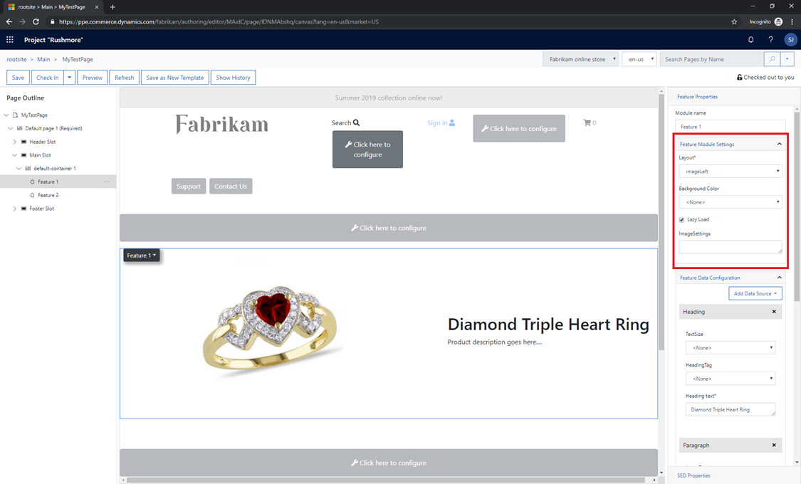

# Add module configuration fields

[!include [banner](../includes/banner.md)]

This article describes how to add module configuration fields in Microsoft Dynamics 365 Commerce.

Configuration fields can be added to a module to expose them to page authors and give them control of various module features. Examples of these features include different views, alignment properties, Boolean switches to turn features on or off, module titles or headings, rich text descriptions, call-to-action links, image URLs, and Commerce product data.

The following illustration shows how configuration fields for a selected module appear in Commerce site builder.



## Add new module configuration fields

To add configuration fields, you add an entry in the **config** section of the module definition file, **MODULE\_NAME.definition.json**.

### Example

In the following example of a module definition file, an **imageAlignment** configuration field is added so that page authors can configure the alignment of an image inside a module. There are two enumeration (enum) options: **"Left"** (the default option) and **"Right"**. 

```json
{
    "$type": "contentModule",
    "friendlyName": "Product Feature",
    "name": "product-feature",
    "description": "Feature module used to highlight a product.",
    "categories": [
        "storytelling"
    ],
    "tags": [
        ""
    ],
    "dataActions": {
        "products": {
            "path": "@msdyn365-commerce-modules/retail-actions/dist/lib/get-simple-products",
            "runOn": "server"
        }
    },
    "config": {
        "imageAlignment": {
            "friendlyName": "Image Alignment",
            "description": "Sets the desired alignment of the image, either left or right on the text.",
            "type": "string",
            "enum": {
                "left": "Left",
                "right": "Right"
            },
            "default": "left",
            "scope": "module",
            "group": "Layout Properties"
        },
        "productTitle": {
            "type": "string",
            "friendlyName": "Title",
            "description": "Example config value",
            "default": "",
            "scope": "module"
        },
        "productDetails": {
            "type": "richText",
            "friendlyName": "SubTitle",
            "description": "Sub title rich text field"
        },
        "productImage": {
            "type": "image",
            "friendlyName": "Background image",
            "description": "Background image"
        },
        "buttonText": {
            "type": "string",
            "friendlyName": "Button text",
            "description": "Example config value",
            "default": "",
            "scope": "module"
        }
    }
}
```

## Module configuration schema

The **config** section of the module definition file contains a list of all the module's configuration fields to be exposed in the authoring tools.

* **configuration name** – The local name that is used to access the configuration values from your React source code. This name is case-insensitive.
* **"friendlyName"** – The friendly name that is shown as the configuration name in the authoring tools.
* **"description"** – The description that is shown as the configuration description in the authoring tools.
* **"type"** – The type of the configuration. The possible values are **"string"**, **"bool"**, **"number"**, **"integer"**, **"richText"**, **"image"**, **"imageSettings"**, **"css"**, **"video"**, and **"array"**.
* **"enum"** – For an enumerator type, the value must be set to **"string"**.
* **"default"** – The default value that is set if no value is set in the authoring tools.
* **"scope"** – This field is used to scope the configuration to either a specific module instance or all modules on the site. Possible values are **"module"** and **"siteOnly"**. If the value is set to **"siteOnly"**, the module configuration doesn't appear on a page and can't be configured there. It can be viewed and configured only at the site level in site builder, at **Site settings \> Extensions**. In this way, the value can be set one time for the entire site. If you don't set this field, the default value is **"module"**.
* **"group"** – Groups are used to organize the configurations into organized groups in the authoring tools.
* **"required"** – A Boolean flag that specifies whether a property must be set on the module. If the value is set to **true**, the authoring tools show an error if the required property isn't set, and an error appears when the module is rendered.
* **"resources"** – This field is used for localization resources.
* **"definitions"** - This field can contain complex config type definitions, which can be referenced in the config sections as extended types.

The following example shows how the various supported data types are used.

```json
{
    "$type": "contentModule",
    "friendlyName": "Sample Configurations",
    "name": "sample-config",
    "description": "Provides various configuration property samples",
    "categories": [""],
    "tags": [""],
    "dataActions": {},
    "config": {
        "title": {
            "type": "string",
            "friendlyName": "Title",
            "description": "Example config value",
            "default": "",
            "scope": "module"
        },
        "subTitle": {
            "type": "richText",
            "friendlyName": "SubTitle",
            "description": "Sub title rich text field"
        },
        "bgImage": {
            "type": "image",
            "friendlyName": "Background image",
            "description": "Background image"
        },
        "images": {
            "type": "array",
            "friendlyName": "Images",
            "description": "Image array",
            "items": {
                "type": "image"
            }
        },
        "backgroundImageSettings": {
            "type": "imageSettings",
            "friendlyName": "Background image settings",
            "description": "Image settings for background image settings"
        },
        "ambientVideo": {
            "type": "video",
            "friendlyName": "Ambient video",
            "description": "Ambient video",
        },
        "headingArray":{
            "type": "array",
            "friendlyName": "Headings",
            "description": "Heading array",
            "items": {
                "$ref": "#/definitions/heading"
            }
        },
        "heading":{
            "$ref": "#/definitions/heading"
        },
        "heading2":{
            "type": "object",
            "friendlyName": "Heading2",
            "description": "Heading2 property with its own enum",
            "properties": {
                "style": {
                    "type": "string",
                    "enum": {
                        "bold": "Bold",
                        "underline": "Underline",
                        "italics": "Italics",
                        "strong": "Strong",
                        "emphasized": "Emphasized",
                        "none": "None"
                    },
                    "friendlyName": "Style",
                    "description": "Heading style"
                }
            }
        },
        "textPlacement":{
            "friendlyName": "Text placement",
                "description": "Placement of the text",
            "type": "object",
            "enum":{
                "left": "Left",
            "right": "Right",
            "center": "Center"
            },
            "default": "left"
        }
    },
    "definitions": {
        "heading": {
            "type": "object",
            "friendlyName": "Heading",
            "description": "Heading property",
            "properties": {
                "text": {
                    "type": "string",
                    "friendlyName": "Text",
                    "description": "Heading Text"
                },
                "style": {
                    "type": "string",
                    "enum": {
                        "bold": "Bold",
                        "underline": "Underline",
                        "none": "None"
                    },
                    "friendlyName": "Style",
                    "description": "Heading style"
                },
                "showImage":{
                    "type":"boolean",
                    "friendlyName": "Show image?",
                    "description": "Should Show Image"
                },
                "bgImage": {
                    "type": "image",
                    "friendlyName": "Background image",
                    "description": "Background image"
                },
                "imageArray":{
                    "type": "array",
                    "friendlyName": "Images",
                    "description": "Image Array",
                    "items": {
                        "type": "image"
                    }
                }
            }
        }
    }
}
```

### css configuration type

The configuration type of module configuration properties can also be declared as **"type": "css"**. Module configuration properties declared as the **css** type must specify a set of string enums of the classes that can be applied to a module. Only one of the enum options can be selected for a given module configuration property. When an enum option is selected, the selected class is appended to the list of classes that is passed down to the module in the format *propertyName\_\_propertyValue* via the **this.props.config.className** property. Properties declared **css** configuration types can't be accessed directly from the **this.props.config** property, because they're merged into the **this.props.config.className** property. 

### className property

Every content module includes a built-in **className** configuration field. This configuration field can be accessed inside the module's view via the **this.props.config.className** property, and appears in the site authoring tools. Page authors can add a string of space-separated Cascading Style Sheets (CSS) class names that should be appended to the module root class.

### \_\_cssClassName\_\_ property

**\_\_cssClassName\_\_** is another special property that is declared inside a module definition file. It provides a way for the module creator to specify a nonauthorable, noneditable, read-only **className** property that is always applied to the module. Its **editable** property must be set to **false**, and a default value must be specified. 

In the following example, the module creator gives this field a default value of **hero** so that every instance of this module always has the **hero** class as part of the **this.props.config.className** property. 

```json
...
    "__cssClassName__": {
        "default": "hero",
        "editable": false,
        "friendlyName": "Readonly CSS Class Name(s)",
        "description": "Provides a way to set constant, unchangeable default css class(es) to apply to your module.",
        "type": "string"
    },
...
```

### Use mock data in configuration fields for local testing 

The following example shows how to set a mock value for a new configuration field in the **mocks/MODULE\_NAME.json** file. Mock data is useful when a module is rendered in a local development environment.

```json
{
    "id": "R1Module1",
    "config": {
        "imageAlignment": "left",
        "productTitle": "Retro Horn Rimmed Keyhole Nose Bridge Round Sunglasses",
        "productDetails": "High-quality and pioneered with the perfect blend of timeless classic and modern technology with hint of old school glamor.",
        "productImage": {
            "src": "https://bit.ly/33cMGxr",
            "altText": "Retro Horn Rimmed Keyhole Nose Bridge Round Sunglasses"
        },
        "buttonText": "Buy Now"
    },
    "data": {
        "actionResponse": {
            "text": "Sample Action Response"
        }
    },
    "typeName": "product-feature"
} 
```

### Access configuration fields in the module React component

To access configuration fields in the React component, use the **props.config** application programming interface (API).

The following example creates a **props** property that has configuration values that are sent to the module view file to render the appropriate HTML.

```typescript
import * as React from 'react';

import { IProductFeatureData } from './product-feature.data';
import { imageAlignment, IProductFeatureProps } from './product-feature.props.autogenerated';

export interface IProductFeatureViewProps extends IProductFeatureProps<IProductFeatureData> {
    productName: string;
    productInfo: string;
    productImageUrl: string;
    productPrice: string;
    buttonInfo: string;
    alignment: imageAlignment;
}

/**
 *
 * ProductFeature component
 * @extends {React.PureComponent<IProductFeatureProps<IProductFeatureData>>}
 */
class ProductFeature extends React.PureComponent<IProductFeatureProps<IProductFeatureData>> {
    public render(): JSX.Element | null {
        const { config } = this.props;

        // set default product info values
        const ProductName = config.productTitle ? config.productTitle : 'No product name defined';
        const ProductInfo = config.productDetails ? config.productDetails.toString() : 'No product details defined';
        const ProductImageUrl = config.productImage ? config.productImage.src : '';
        const ButtonInfo = config.buttonText ? config.buttonText : 'No button text defined';
        const ProductPrice = '129';

        const ProductFeatureViewProps = {
            ...this.props,
            productName: ProductName,
            productInfo: ProductInfo,
            productImageUrl: ProductImageUrl,
            productPrice: ProductPrice,
            buttonInfo: ButtonInfo,
            alignment: config.imageAlignment
        };

        return this.props.renderView(ProductFeatureViewProps);
    }
}

export default ProductFeature;
```

The following example shows the corresponding module view file that handles the HTML layout by using the configuration values that are passed in from the preceding React component.

```typescript
import * as React from 'react';
import { IProductFeatureViewProps } from './product-feature';
import { imageAlignment } from './product-feature.props.autogenerated';

const _renderImage=(productImageUrl: string, productName: string): JSX.Element => {
    return ;
};

const _renderInfo=(productName: string, productInfo: string, productPrice: string, buttonInfo: string): JSX.Element => {
    return (
        <div className='container'>
            <h2>{productName}</h2>
            <p>{productInfo}</p>
            <p>{productPrice}</p>
            <button type='button' className='btn btn-primary'>{buttonInfo}</button>
        </div>
    );
};

export default (props: IProductFeatureViewProps) => {
    const { productName, productInfo, productImageUrl, productPrice, buttonInfo, alignment } = props;

    let left;
    let right;

    if (alignment === imageAlignment.left) {
        left = _renderImage(productImageUrl, productName);
        right = _renderInfo(productName, productInfo, productPrice, buttonInfo);
    } else {
        right = _renderImage(productImageUrl, productName);
        left = _renderInfo(productName, productInfo, productPrice, buttonInfo);
    }

    return (
        <div className='row align-items-center'>
            <div className='col-sm-6'>
                {left}
            </div>
            <div className='col-sm-6'>
                {right}
            </div>
        </div>
    );
};
```

## Additional resources

[Create a new module](create-new-module.md)

[Clone a module library module](clone-starter-module.md)

[Preview and debug a module](test-module.md)

[Test modules by using module mocks](test-module-mock.md)

[Test modules by using page mocks](test-page-mock.md)

[Container modules](container-modules.md)

[Create a layout container module](create-layout-container.md)

[Create a page container module](create-page-containers.md)

[Localize a module](localize-module.md)


[!INCLUDE[footer-include](../../includes/footer-banner.md)]
