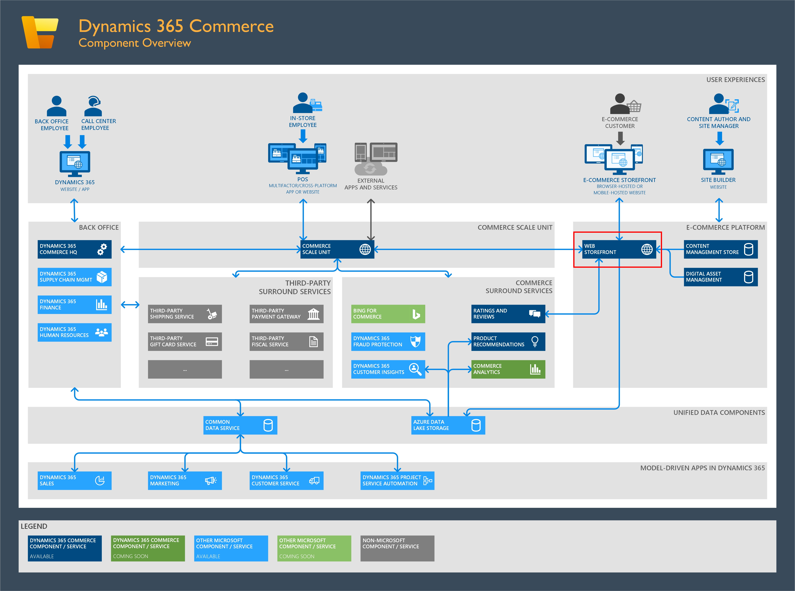
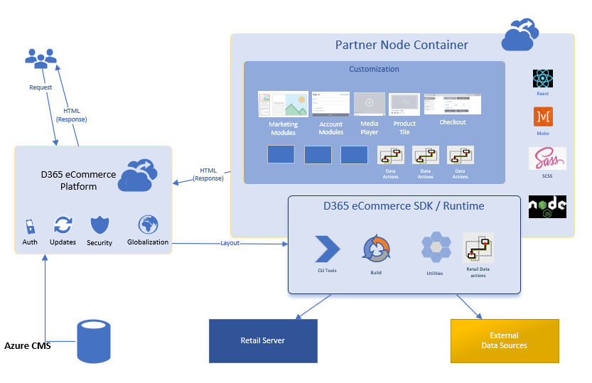
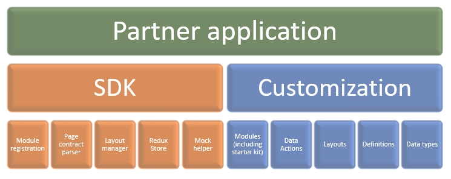

# E-commerce architectural overview

[!include [banner](../includes/banner.md)]

This article presents an architectural overview of Microsoft Dynamics 365 Commerce.

The Dynamics 365 Commerce online extensibility software development kit (SDK) lets partners easily extend their website so that it includes additional business logic and user experience (UX) logic. Partners can do this extension by using open-source technologies that are freely available.

This architectural overview will focus on the "Web Storefront" box highlighted in the following [Commerce architecture](../commerce-architecture.md) illustration.

## Web storefront component-based architecture

The architecture of the platform takes advantage of a reuse-based approach to define, implement, and compose loosely coupled independent components. In this approach, the emphasis is on separation of concerns.

## High-level design

The extensibility design avoids dependency between the platform and the application by running the application as a microservice that is built on Node.js and that uses React as an underlying UX framework. The platform is run as a separate service, and handles all routing, integration with the content management system (CMS), and security.

## Request flow

Here is a typical architectural flow when a customer requests a page from an online store that uses the Dynamics 365 Commerce platform.

1. The platform gets a request, and does authentication, routing, and locale detection.
1. The platform generates a hydrated page object that contains page configuration data and data from external services that use data actions.
1. Data actions allow for batching, aggregation, and chaining of multiple service calls, including deduplication.
1. The platform provides a set of core data actions that provide connections to Dynamics 365 Commerce services (for example, the catalog and ratings).
1. After the hydrated page object is generated, the platform calls the React application that is running on a node express server.
1. The React application parses the view model, runs the React views on the server side, and generates HTML.
1. The React application consists of core SDK modules, module library modules, and custom modules.
1. The platform sends back the HTML together with the appropriate cookies, headers, and so on.
1. The React script initializes the components, takes over client-side execution on the browser, and renders the modules.
1. Node.js supports tool pages and other developer productivity tools that are provided by the platform.

## Partner application

The compiled partner package contains both the SDK and a module library. The SDK isn't extensible, but module library modules can be cloned and completely customized. Partner customizations (modules, data actions, and themes) can be packaged by using a command-line interface (CLI) command. The package can then be uploaded by using Microsoft Dynamics Lifecycle Services (LCS). In this way, the customizations are incorporated into the partner's e-Commerce site.

## Additional resources

[E-commerce components](ecommerce-components.md)

[CLI command reference](cli-command-reference.md)

[!INCLUDE[footer-include](../../includes/footer-banner.md)]
