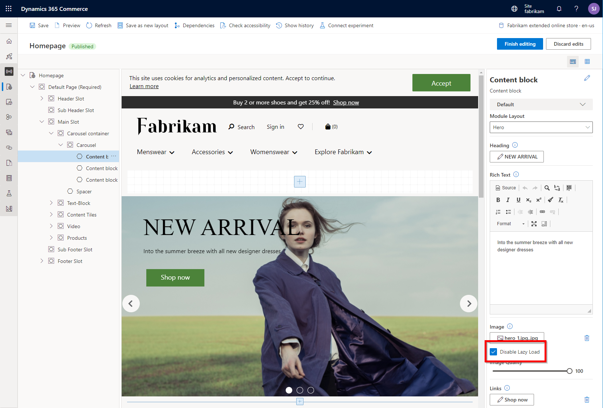
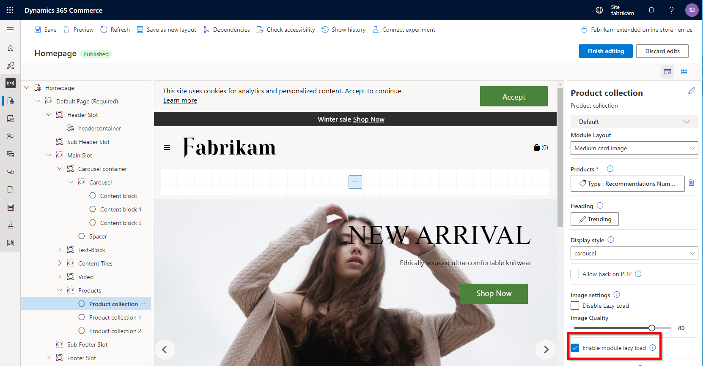

---
# required metadata

title: Best practices for Dynamics 365 Commerce development 
description: This topic describes some best practices to follow when developing Dynamics 365 Commerce customizations. 
author: samjarawan
ms.date: 09/07/2021
ms.topic: article
ms.prod: 
ms.technology: 

# optional metadata

# ms.search.form: 
audience: Developer
# ms.devlang: 
ms.reviewer: v-chgri
# ms.tgt_pltfrm: 
ms.custom: 
ms.assetid: 
ms.search.region: Global
# ms.search.industry: 
ms.author: samjar
ms.search.validFrom: 2019-10-31
ms.dyn365.ops.version: Release 10.0.5

---
# Best practices for Dynamics 365 Commerce development 

[!include [banner](../includes/banner.md)]
[!include [banner](../includes/preview-banner.md)]

This topic describes some best practices to follow when developing Dynamics 365 Commerce customizations.

The Dynamics 365 Commerce platform provides a rich online software development kit (SDK) for developer extensibility. Custom modules, data actions, and themes can be created, or modules from the Commerce [module library](../starter-kit-overview.md) can be extended. It is important to consider web site performance when building Commerce customizations. Standard best practices used for website development are applicable including minimizing HTML, JavaScript, and CSS files, and optimizing images.

## Infrastructure setup

The [Dynamics 365 Commerce ecosystem](../commerce-architecture.md) comprises various subsystems including Commerce headquarters, Commerce Scale Unit, the web storefront that includes the Node rendering service, Commerce site builder, and the product recommendations services. For best performance, the various components should all be deployed to the same region. The specific region decision should be made in accordance with the customer's regional location.

> [!NOTE]
> Commerce Scale Unit allows you to select a specific region during setup.

## Minimize HTML, CSS, and JavaScript file sizes

The Dynamics 365 Commerce online SDK provides development extensions that use TypeScript and Sassy Cascading Style Sheets (SCSS) files. When a configuration package is built by using the [yarn msdyn365 pack](cli-command-reference.md#pack) command, or when the Node server is started in a local development environment by using the [yarn start](setup-dev-environment.md#run-your-node-app) command, the TypeScript files are compiled down to JavaScript files, and the SCSS files are compiled down to Cascading Style Sheets (CSS) files. These files are also minified to help reduce network bandwidth. You should make sure that extra, unused JavaScript and CSS files aren't included in your extension package.

### Reduce JavaScript by excluding unused modules

Dynamics 365 Commerce comes with a large set of modules referred to as the Commerce [module library](../starter-kit-overview.md). If there are modules that won't be used on an e-Commerce site, they can be excluded to reduce the JavaScript chunk size. The excluded modules will not be rendered on the live e-Commerce site or available within Commerce site builder when authoring pages.

Modules can be excluded by adding the module name to the **excludeModules** property in the SDK's "/src/settings/platform.settings.json" file, as shown in the following example.

```JSON
{
    "excludedModules": ["<EXCLUDED_MODULE_NAME1>","<EXCLUDED_MODULE_NAME2>"]
}
```

You can verify that the module was successfully excluded by comparing the chunk size displayed after a build, or by testing the module in a development environment. For the latter method, you can confirm that the excluded module is not rendered by using the URL `http://localhost:4000/modules?type=<your-module-name>` (after running the Node server by using the "yarn start" command).

## Optimize images

One of the biggest performance hits to a web page can be the downloading of images. You should use CSS whenever possible to generate images for items such as buttons, but in cases where you need marketing or product images you should upload images to the Commerce site builder [Media Library](../dam-overview.md). Images uploaded to the Media Library should be of high quality and resolution to cover all web site usage scenarios. Images served from the Media Library will automatically be resized using an image resizer service.

### Image resizer service

When rendered inside of a module, served images are processed by an image resizer service included in the Commerce rendering engine. This is important for responsive design because as the screen size gets smaller, images will automatically be scaled down to the optimum size for each particular module.

It's important to follow some guidelines to ensure that images are resized correctly. Modules can specify images sizes for particular view ports in the **theme.settings.json** file. For more information, see [Configure theme settings](configure-theme-settings.md).

When building modules with images, the HTML should always include the width and height parameters. If the width and height are not provided, image caching will not be optimized through the image resizer.

### Image types and file sizes

There are three aspects that are important when determining the file size of an image:

- The resolution of the image (width and height).
- How the image is encoded (JPEG, GIF, or PNG).
- The quality parameter (JPEG only).

JPEG uses lossy compression that decreases the file size by discarding image detail. The amount of detail discarded is controlled by the quality parameter, which is a number between 0 and 100, with 100 being the best quality. A lower-quality parameter number results in a lower-quality image, but also a smaller file size.

PNG is a lossless format, so no image detail is lost but the image file size will be larger. For images with text, sharp lines, or color gradients, PNG may be a better choice because the JPEG format may show undesirable artifacts as a result of the lossy compression.

GIF is also a lossless format, but it only supports 256 colors in a single image. For images with text or sharp lines that also don't have many colors, GIF may be a better format choice over PNG or JPEG. GIF also has support for simple animations.

Ultimately, the goal is to find the right balance to maintain image quality while keeping the image size as small as possible.

## Lazy load images and modules

Lazy loading defers the initialization of resources until they are needed and can make web pages load faster. Most module library modules that display images or video have a configuration property to enable or disable lazy loading. A good practice is to ensure that images needing to appear immediately when loading a web page have lazy loading disabled so that they appear quickly. Images such as those appearing lower on a page should have lazy loading enabled.

### Disable lazy loading for images

Modules that show images, such as the [content block module](../add-hero-module.md), generally don't load the images until they are needed. This "lazy loading" behavior might cause a perception of performance issues, because an image isn't loaded when the user is ready to view it. For example, when a user selects the "next" arrow in a carousel module, the next image might take a second or two to be loaded if lazy loading is enabled. Therefore, these types of modules that show images have a configuration setting that lets you disable lazy loading. Images are then loaded before they are needed, and users might perceive improved performance in some scenarios.

The following illustration image shows an example where the **Disable Lazy Load** option is selected for a content block module in Commerce site builder.



### Enable lazy loading for a product collection module

The data action calls for the [product collection module](../product-collection-module-overview.md) can cause a small increase in page load times. Therefore, the product collection module has an **Enable module lazy load** configuration setting that enables the module to be rendered on the client side after the page has been rendered. In this way, the page is available for user interaction sooner. However, if a product collection module is placed near the top of the page it is recommended to have lazy loading disabled so that the images appear immediately when the web page loads.

The following illustration shows an example where the **Enable module lazy load** option is selected for a product collection module in Commerce site builder.



### Modules that don't support lazy loading but rely on user context

Some module library modules don't include the **Enable module lazy load** configuration setting since they require user context data and have been designed to automatically render on the client. For custom modules that require user context (for example, custom cookie compliance modules), you should ensure that the modules are rendered on the client side.

## Cache configuration

Caching is often used on static content that doesn't often change, such as images, product content, and JavaScript and CSS files. Some scenarios may require custom cache settings to achieve the best performance results.

### Image caching

The default content delivery network (CDN) cache time for images is set to 5 minutes. This means that after 5 minutes the next request to get a specific image will need to be retrieved from the origin, and so will be slower. Increasing the cache time setting is possible, but it must be done by opening a support ticket.

### Data caching

Product-specific data is cached in the e-Commerce rendering Node layer. Caching times are different for each entity type and can be configured inside of the **cache.settings.json** file in the SDK "/src/settings/" directory. For more information, see [Data cache settings](data-action-cache-settings.md).

### Page caching

Page caching enables e-commerce site pages to be cached on the server from which they can then be served to site users, significantly improving performance time.
Page caching and caching duration can be enabled and configured in Commerce site builder for site pages, or alternatively can be configured for templates that are applied across multiple site pages. For more information, see [Configure page caching](page-caching.md).

## Browser hint meta tags

Browser hint meta tags such as **preconnect** and **dns-prefetch** can be used to tell browsers what resources are needed ahead of time to render a page. Such tags will cause a browser to initiate network connections before it typically would, to make time-expensive network calls earlier. This is useful for adding additional rendering of image, font, or file endpoints used within a page.

The **preconnect** browser hint meta tag can be used if a page relies on resources coming from external origins or domains to initiate a TCP connection. This will cause DNS lookup, TCP handshake, and TLS negotiation to happen before the reference in the HTML document.

The following is an example of a **preconnect** meta tag hint used in HTML.

```html
<link rel="preconnect" href="https://<DOMAIN_TO_PRECONNECT>">
```

The **dns-prefetch** browser hint meta tag can be used if a resource is likely to be navigated to or used on a page. DNS prefetching can resolve a domain's address earlier than usual to avoid this time-expensive step later.

The following is an example of a **dns-prefetch** browser hint meta tag used in HTML.

```html
<link rel="dns-prefetch" href="https://<DOMAIN_TO_PREFETCH>">
```

Adding meta tags to a page can be done in Commerce site builder using the **Metatags** module. The **Metatags** module should be added to a page template's "HTML Head" section. For more information, see [Work with templates](../work-with-templates.md).

## Performance analysis

It's very important that e-commerce site pages be performance tested before they go live. You can use a wide range of existing webpage performance testing tools for this purpose. At a minimum, you can use your web browser's F12 Developer Tools to examine the network loads for individual parts of a page. This approach can help identify any performance bottlenecks so that you can investigate them further.

## Restrict your e-commerce website from loading inside external website HTML iframe elements

The **frame-ancestors** directive can be used to restrict the loading of your e-commerce site inside external website HTML iframe elements. For more information on how to configure this feature in Commerce site builder, see [Manage Content Security Policy](../manage-csp.md).

## Additional resources

[Dynamics 365 Commerce architecture overview](../commerce-architecture.md)

[Online channel extensibility overview](overview.md)

[System requirements](system-requirements.md)

[Set up a development environment](setup-dev-environment.md)

[Module library overview](../starter-kit-overview.md)

[Configure theme settings](configure-theme-settings.md)

[Data cache settings](data-action-cache-settings.md)

[Work with templates](../work-with-templates.md)

[Manage Content Security Policy](../manage-csp.md)

[Platform settings file](platform-settings.md)


[!INCLUDE[footer-include](../../includes/footer-banner.md)]
