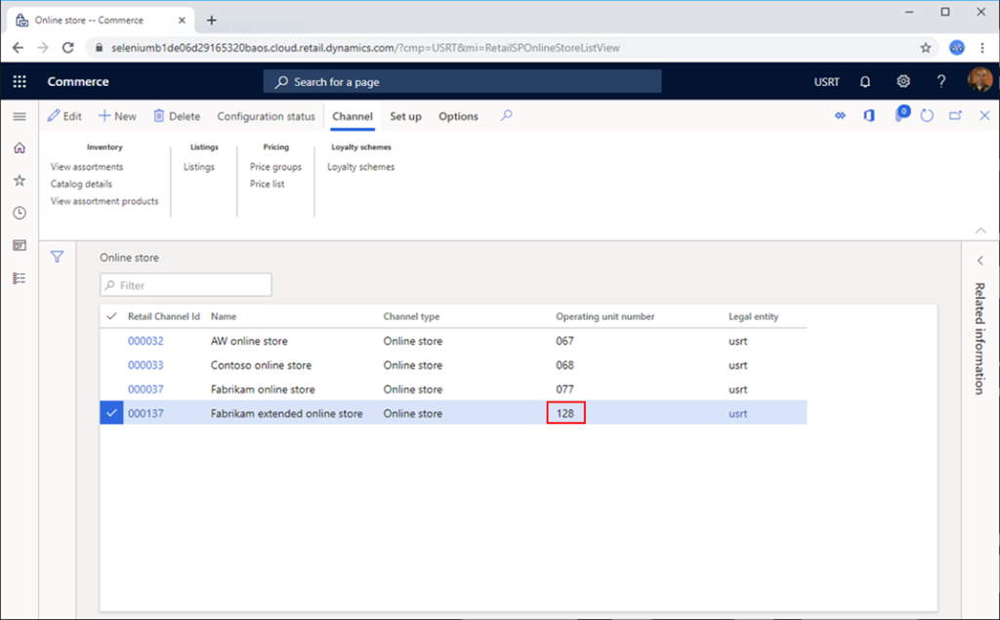
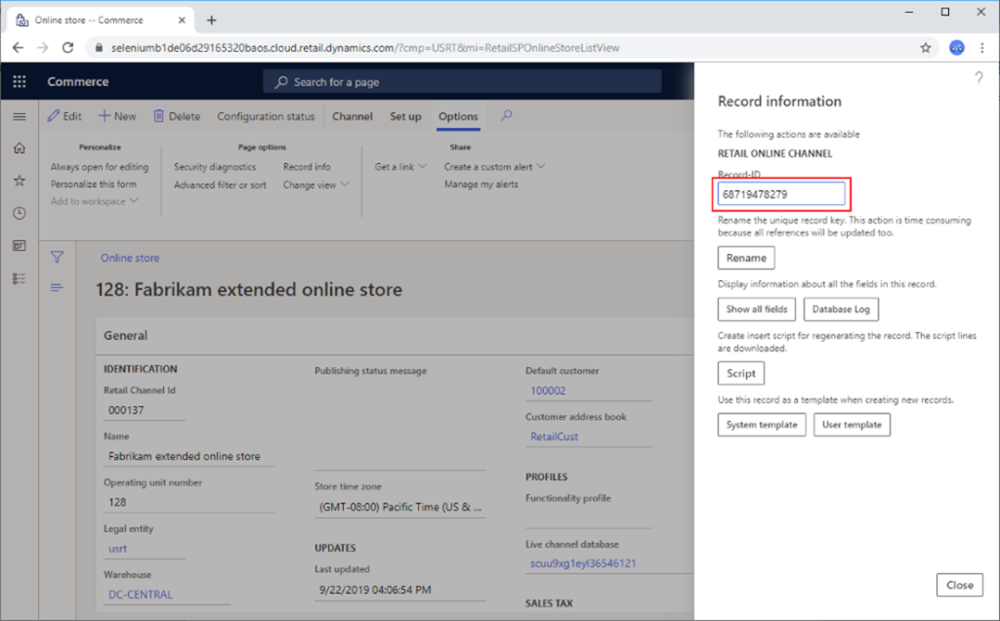
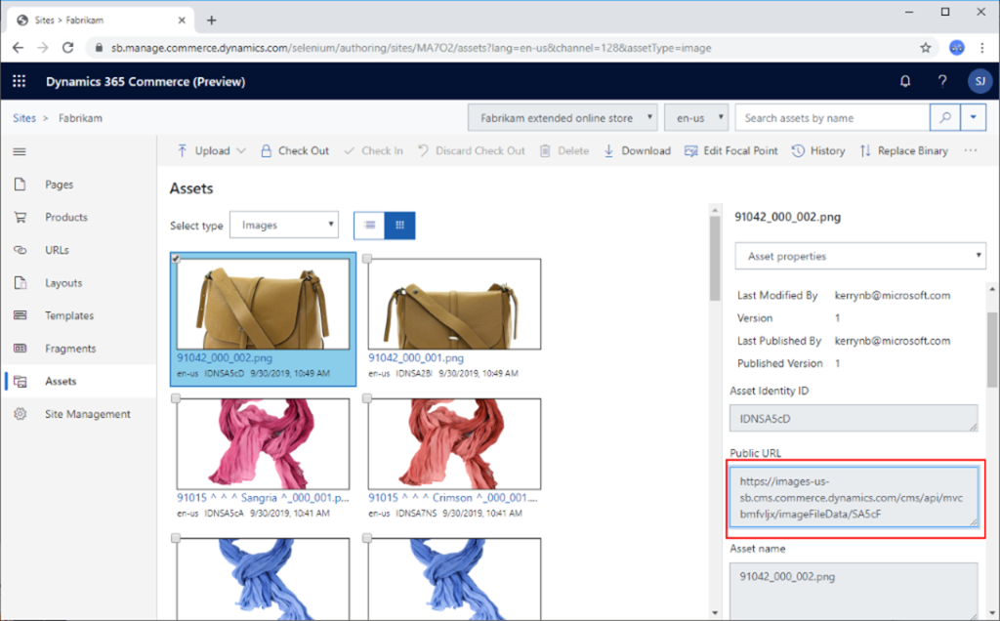

# Configure a development environment (.env) file

[!include [banner](../includes/banner.md)]

This article describes how to configure the .env file that is used for the development environment in Microsoft Dynamics 365 Commerce.

The .env file that is provided as part of the Dynamics 365 Commerce online software development kit (SDK) is a simple configuration text file. It defines a set of variables that is used by a Node app that runs in the development environment.

## Default .env file

The default .env file that is provided with the online SDK should resemble the following example.

```dos
### Environment File ##################################################################
# This is a simple configuration 
# Online documentation for this file is available at 
# https://learn.microsoft.com/dynamics365/commerce/e-commerce-extensibility/configure-env-file
########################################################################################

# MSDyn365_APP_TYPE variable is required. It can be set only to the value partner.

MSDyn365_APP_TYPE=partner

# PORT variable is required. It defines the port number that is used to preview your Node 
#   application when the Node server is started by using the yarn start command. The default value is 4000

PORT=4000

# MSDyn365_HOST variable defines the domain name of your customer-facing e-Commerce site. 
#   When this variable is set, if the URL https://localhost:4000/ is opened in a development environment, 
#   your e-Commerce site will be rendered locally. If your site is protected through Microsoft Entra ID 
#   (Microsoft Entra ID) credentials, a prompt for a user name and password will appear.

MSDyn365_HOST=

# MSDyn365Commerce_BASEURL variable defines the URL of the Microsoft Dynamics 365 Retail Server. 
#   When this variable is set, local development and testing can be done against Dynamics 365 Retail Server
#   application programming interfaces (APIs). If you set this variable, you must also set the 
#   MSDyn365Commerce_CHANNELID, MSDyn365Commerce_OUN, and MSDyn365Commerce_CATALOGID variables.
# MSDyn365Commerce_OUN variable defines the operating unit number for the channel.
# MSDyn365Commerce_CATALOGID variable defines the catalog ID for the online store that you're connecting to. 
#   Currently, only the value 0 (zero) is supported.
# MSDyn365Commerce_CHANNELID variable defines the online channel that you're connecting to.

MSDyn365Commerce_BASEURL=
MSDyn365Commerce_CHANNELID=
MSDyn365Commerce_CATALOGID=
MSDyn365Commerce_OUN=

# MSDyn365Commerce_BASEIMAGEURL variable defines the URL for a website's image assets. 
#   The URL follows a pattern and must be manually generated. For more information, 
#   see online product documentation.

MSDyn365Commerce_BASEIMAGEURL=

```

Two of the variables in the .env file, **MSDyn365\_APP\_TYPE** and **PORT**, are required and have preset values. All the other variables are optional. The optional variables enable your development environment to get data from live environments. This data is then rendered in the local development Node server.

The following sections describe the variables in the .env file.

## MSDyn365\_APP\_TYPE

The **MSDyn365\_APP\_TYPE** variable is required. It can be set only to the value **partner**.

## PORT

The **PORT** variable is required. It defines the port number that is used to preview your Node application when the Node server is started by using the **yarn start** command. The default value is **4000**.

The following example shows the syntax for this variable.

```text
PORT=4000
```

Here is an example of a development environment URL that includes the port number:

`https://localhost:4000/version`

## MSDyn365\_HOST

The **MSDyn365\_HOST** variable defines the domain name of your customer-facing e-Commerce site. When this variable is set, if the URL `https://localhost:4000/` is opened in a development environment, your e-Commerce site will be rendered locally. If your site is protected through Microsoft Entra credentials, a prompt for a user name and password will appear.

The following example shows the syntax for this variable.

```text
MSDyn365_HOST=demo.fabrikam.com
```

## MSDyn365Commerce_BASEURL

The **MSDyn365Commerce\_BASEURL** variable defines the URL of the Microsoft Dynamics 365 Commerce Scale Unit. When this variable is set, local development and testing can be done against application programming interfaces (APIs). If you set this variable, you must also set the **MSDyn365Commerce\_CHANNELID**, **MSDyn365Commerce\_OUN**, and **MSDyn365Commerce\_CATALOGID** variables.

The following example shows the syntax for this variable.

```text
MSDyn365Commerce_BASEURL=https://fabrikamb1de06d29165320bret.cloud.retail.dynamics.com/
```

## MSDyn365Commerce\_OUN

The **MSDyn365Commerce\_OUN** variable defines the operating unit number for the channel.

To find the channel operating unit number, follow these steps.

1. Go to the Commerce website.
1. In the search field at the top of the page, enter **Online channels**, and then select the channel to use. You should see an **Operating unit number** column, as shown in the following illustration.

    

The following example shows the syntax for this variable.

```text
MSDyn365Commerce_OUN=128
```

## MSDyn365Commerce\_CATALOGID

The **MSDyn365Commerce\_CATALOGID** variable defines the catalog ID for the online store that you're connecting to. Currently, only the value **0** (zero) is supported.

## MSDyn365Commerce\_CHANNELID

The **MSDyn365Commerce\_CHANNELID** variable defines the online channel that you're connecting to.

To find the channel ID, follow these steps.

1. Go to the Dynamics 365 Commerce website.
1. In the search field at the top of the page, enter **Online channels**, and then select the channel to use.
1. On the Action Pane, on the **Options** tab, in the **Page options** group, select **Record Info**.
1. In the **Record information** dialog box, the value of the **Record-ID** field is the channel ID. Copy this value.

    

The following example shows the syntax for this variable.

```text
MSDyn365Commerce_CHANNELID=68719478279
```

## MSDyn365Commerce\_BASEIMAGEURL

The **MSDyn365Commerce\_BASEIMAGEURL** variable defines the URL for a website's image assets. The URL follows a pattern and must be manually generated. Follow one of these steps:

- For evaluations sites, the URL has the following format:

    `https://images-us-sb.cms.commerce.dynamics.com/cms/api/{CMS_TENANT_ID}/imageFileData/search?fileName=/`

- For production sites, the URL has the following format:

    `https://img-prod-cms-mr-microsoft-com.akamaized.net/cms/api/{CMS_TENANT_ID}/imageFileData/search?fileName=/`

In both URLs, you must replace **{CMS\_TENANT\_ID}** with the content management system (CMS) tenant ID that is assigned to your site.

To get the CMS tenant ID in Dynamics 365 Commerce, follow these steps.

1. Under **Sites**, select your site.
1. In the navigation pane on the left, select **Assets**.
1. In the **Select type** field, select **Images**.
1. Select the first image.
1. In the property pane on the right, find the URL in the **Public URL** field. Your CMS tenant ID is the string between **/cms/api/** and **/imageFileData**. For example, in the URL **../cms/api/fabrikam/imageFileData/..**, the CMS tenant ID is **fabrikam**.

    

After you've finished changing the .env file, restart the Node server by using the **yarn start** command.

## Additional resources

[Get started with e-commerce online extensibility development](sdk-getting-started.md)

[System requirements for a Dynamics 365 Commerce online extensibility development environment](system-requirements.md)

[Set up a development environment](setup-dev-environment.md)

[Configure an e-commerce development environment against a Commerce cloud environment](debug-tier-1.md)

[Set up Azure DevOps code sharing and create a build pipeline](set-up-code-sharing-build-pipeline.md)


[!INCLUDE[footer-include](../../includes/footer-banner.md)]
