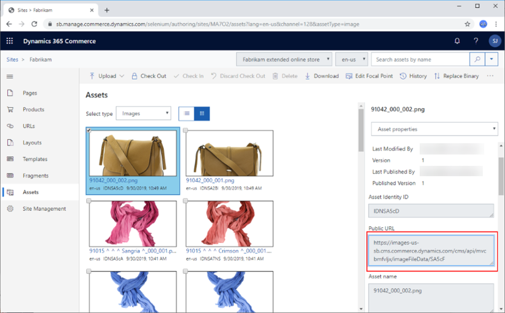

---
# required metadata

title: Configure a development environment (.env) file
description: This topic describes how to configure the development environment (.env) file used in Microsoft Dynamics 365 Commerce.
author: samjarawan
manager: annbe
ms.date: 10/01/2019
ms.topic: article
ms.prod: 
ms.service: dynamics-ax-retail
ms.technology: 

# optional metadata

# ms.search.form: 
audience: Developer
# ms.devlang: 
ms.reviewer: v-chgri
ms.search.scope: Retail, Core, Operations
# ms.tgt_pltfrm: 
ms.custom: 
ms.assetid: 
ms.search.region: Global
# ms.search.industry: 
ms.author: samjar
ms.search.validFrom: 2019-10-31
ms.dyn365.ops.version: Release 10.0.5

---
# Configure a development environment (.env) file

[!include [banner](../includes/preview-banner.md)]
[!include [banner](../includes/banner.md)]

This topic describes how to configure the development environment **.env** file used in Microsoft Dynamics 365 Commerce.

## Overview

The **.env** file provided as part of the Dynamics 365 Commerce online software development kit (SDK) is a simple configuration text file that defines a set of variables that are used by a Node app running within the development environment.

## Default .env file

The content of the default **.env** file that comes with the online SDK should look similar to the following example.

```
MSDyn365_APP_TYPE=partner
PORT=4000

### Partner Level Settings
# MSDyn365_HOST=<Partner Host Here>
# MSDyn365Commerce_BASEURL=<Retail Server Base URL Here>
# MSDyn365Commerce_CHANNELID=<Retail Server Channel ID Here>
# MSDyn365Commerce_CATALOGID=<Retail Server Catalog ID Here>
# MSDyn365Commerce_OUN=<Retail Server OUN Here>
# MSDyn365Commerce_BASEIMAGEURL=<Retail Server Base Image URL Here>
```
Two variables (**MSDyn365_APP_TYPE**, **PORT**) are required and have preset values, and the other variables are optional. The optional variables enable your development environment to get data from live environments that is then rendered within the local development Node server.

## MSDyn365_APP_TYPE
The **MSDyn365_APP_TYPE** variable is required and can only be set to the value **partner**.

## PORT
The **PORT** variable is required and defines the port number used to preview your Node application when the Node server is started with the **yarn start** command. The default value is 4000.

Syntax example: 
```PORT=4000```

The following is an example of a development environment URL.

```https://localhost:4000/version```

## MSDyn365_HOST
The **MSDyn365_HOST** variable is the domain name of your customer-facing e-Commerce site. When this variable is set, launching **https://localhost:4000/** on a development environment will render your e-Commerce site locally. If your site is protected with Azure Active Directory (AAD) credentials, a username and password prompt will appear.

Syntax example: 

```MSDyn365_HOST=demo.fabrikam.com```

## MSDyn365Commerce_BASEURL
The **MSDyn365Commerce_BASEURL** variable can be used to specify the Microsoft Dynamics 365 Retail server URL. This will allow local development and testing against Retail APIs. If used, you will also need to set the **MSDyn365Commerce_CHANNELID**, **MSDyn365Commerce_OUN**, and **MSDyn365Commerce_CATALOGID** variables.

Syntax example: 

```MSDyn365Commerce_BASEURL=https://fabrikamb1de06d29165320bret.cloud.retail.dynamics.com```

## MSDyn365Commerce_OUN
The **MSDyn365Commerce_OUN** variable is used to set the channel operating unit number. 

To find the channel operating unit number, follow these steps.

1. Go to the Dynamics 365 Retail website.
1. Enter **Online channels** in the top search bar, then select the channel you want to use. You should see a column for the **Operating unit number**, as in the example image below.


Syntax example: 


```MSDyn365Commerce_OUN=128```

## MSDyn365Commerce_CATALOGID

The **MSDyn365Commerce_CATALOGID** variable specifies the catalog ID for the online store you are connecting to. Only catalog ID **0** is currently supported.

## MSDyn365Commerce_CHANNELID

The **MSDyn365Commerce_CHANNELID** variable specifies the online channel you want to connect to. 

To find the channel ID, follow these steps.

1. Go to the Dynamics 365 Retail website.
1. Enter **Online channels** in the top search bar, tehn select the channel you want to use. 
1. Select the **Options** tab, then under **Page options** select **Record Info**. 
1. Copy the **Record-ID** value, which is the channel ID.

Syntax example: 

```MSDyn365Commerce_CHANNELID=68719478279```

The following image shows the location of the **Record-ID** on the Dynamics 365 Retail website.


## MSDyn365Commerce_BASEIMAGEURL
The **MSDyn365Commerce_BASEIMAGEURL** variable specifies the URL for a website's image assets. The URL follows a pattern and must be manually generated as follows.

For evaluations sites, the URL is in the following format: 

```https://images-us-sb.cms.commerce.dynamics.com/cms/api/{CMS_TENANT_ID}/imageFileData/search?fileName=/```

For production sites, the URL is in the following format: 

```https://img-prod-cms-mr-microsoft-com.akamaized.net/cms/api/{CMS_TENANT_ID}/imageFileData/search?fileName=/```

The **{CMS_TENANT_ID}** must be replaced by the assigned CMS tenant ID for your site.  

To obtain your CMS tenant ID in Commerce, follow these steps.

1. Under **Sites**, select your site.
1. In the navigation pane on the left, select **Assets**.
1. From the **Select type** drop-down menu, select **Images**. 
1. Select the first image. 
1. In the property pane on the right, locate the URL in the **Public URL** text box. Your CMS tenant ID is the string between **/cms/api/** and **/imageFileData**. For example, in **../cms/api/fabrikam/imageFileData/..**, **fabrikam** is the CMS tenant ID. 

The following image shows the **Public URL** text box with the URL that contains the CMS tenant ID.



Once changes are made to the **.env** file, restart the Node server with the ```yarn start``` command.
