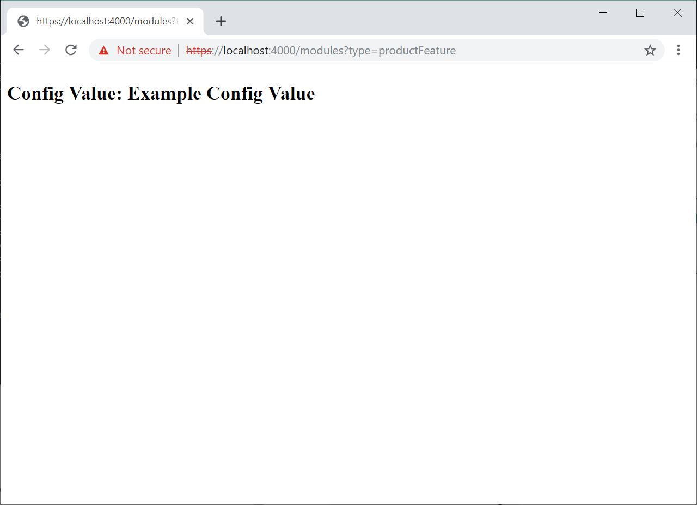

# Create a new module

[!include [banner](../includes/banner.md)]

This article describes how to create a new module in Dynamics 365 Commerce.

To create a new module in Commerce, the online software development kit (SDK) provides the [add-module](cli-command-reference.md#add-module) command-line interface (CLI) command. When you run the command as in the following example, you replace **MODULE\_NAME** with the name that you want to give to the new module. 

**yarn msdyn365 add-module MODULE\_NAME**

## Example

The following example shows how to create a module that is named **product-feature**.

```Console
yarn msdyn365 add-module product-feature
```

After the command has finished running, you can find the new module in the \\src\\modules\\ directory.

## Preview a module

To preview the new module in a local web browser, follow these steps.

1. At a command prompt, go to your root SDK folder, and run the **yarn start** command. Here is an example.

    ```Console
    c:\repos\Msdyn365.Commerce.Online\yarn start
    ```

2. In a web browser, open the following URL to view the module: `https://localhost:4000/modules?type=product-feature`. Notice the module name in the **type=MODULE\_NAME** query string parameter.



## Module naming conventions

Module names are case-insensitive. We recommended that you use whole words for module names whenever you can.

## Deferred module rendering

By default, all modules are rendered server-side, but deferred loading of some modules may be needed to improve page load performance. For more information, see [Page load data actions](page-load-data-action.md).

To help prevent unexpected rendering behavior, such as page flicker and Document Object Model (DOM) mismatch issues, any references to window or document objects that are available only in the context of a browser should be appropriately handled during server-side rendering. The **MsDyn365.isBrowser** SDK utility function can be used for this purpose, as shown in the following example.

```typescript
import MsDyn365 from '@msdyn365-commerce/core';

if (MsDyn365.isBrowser) {
    return new URL(window.location.href);
}
```

## Module error handling 

If a module encounters an error during server-side rendering, the failed module is then wrapped into an **ErrorModule** component to prevent any module-level render error from breaking the page. For example, a module using window or document objects during a server-side render would fail because these objects are non-existent on the server side. In this case, the module would then be wrapped in an error component. The module would then attempt to render again on the client. In development mode, to determine if a module failed on the server side, use a `?debug=true` query string parameter.

## Additional resources

[Page load data actions](page-load-data-action.md)

[CLI command reference](cli-command-reference.md)

[Clone a module library module](clone-starter-module.md)

[Add module configuration fields](add-module-config-fields.md)

[Preview and debug a module](test-module.md)

[Test modules by using module mocks](test-module-mock.md)

[Test modules by using page mocks](test-page-mock.md)

[Container modules](container-modules.md)

[Create a layout container module](create-layout-container.md)

[Create a page container module](create-page-containers.md)

[Localize a module](localize-module.md)


[!INCLUDE[footer-include](../../includes/footer-banner.md)]
