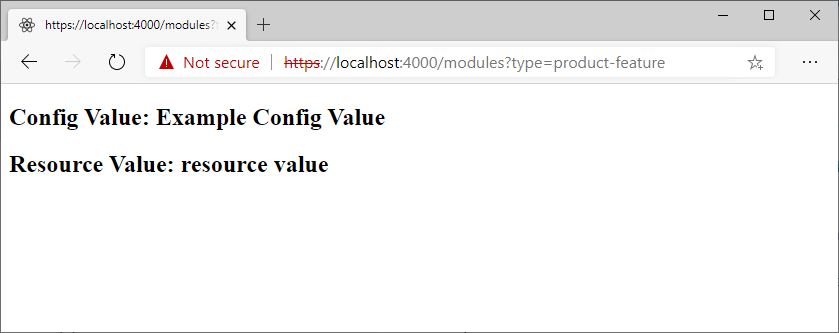

---
# required metadata

title: Create a new module
description: This topic describes how to create a new module in Dynamics 365 Commerce.
author: samjarawan
manager: annbe
ms.date: 02/20/2020
ms.topic: article
ms.prod: 
ms.service: dynamics-365-commerce
ms.technology: 

# optional metadata

# ms.search.form: 
audience: Developer
# ms.devlang: 
ms.reviewer: v-chgri
ms.search.scope: Retail, Core, Operations
# ms.tgt_pltfrm: 
ms.custom: 
ms.assetid: 
ms.search.region: Global
# ms.search.industry: 
ms.author: samjar
ms.search.validFrom: 2019-10-31
ms.dyn365.ops.version: Release 10.0.5

---
# Create a new module

[!include [banner](../includes/banner.md)]

This topic describes how to create a new module in Dynamics 365 Commerce.

## Overview

To create a new module in Commerce, the online Software Development Kit (SDK) provides the **add-module** command-line interface (CLI) command. When you run the command as in the following example, you replace **MODULE\_NAME** with the name that you want to give to the new module. 

**yarn msdyn365 add-module MODULE\_NAME**

## Example

The following example shows how to create a module that is named **product-feature**.

```Console
yarn msdyn365 add-module product-feature
```

It can take 20 to 30 seconds to create a module and generate all the template files for it. After the command has finished running, you can find the new module in the \\src\\modules\\ directory.

## Preview a module

To preview the new module in a local web browser, follow these steps.

1. At a command prompt, go to your root SDK folder, and run the **yarn start** command. Here is an example.

    ```Console
    c:\repos\Msdyn365.Commerce.Online\yarn start
    ```

2. In a web browser, open the following URL to view the module: `https://localhost:4000/modules?type=product-feature`. Notice the module name in the **type=MODULE\_NAME** query string parameter.



## Module naming conventions

Module names are case-insensitive. We recommended that you use whole words for module names whenever you can.

## Additional resources
[CLI command reference](cli-command-reference.md)

[Clone a starter kit module](clone-starter-module.md)

[Add module configuration fields](add-module-config-fields.md)

[Preview and debug a module](test-module.md)

[Test modules by using module mocks](test-module-mock.md)

[Test modules by using page mocks](test-page-mock.md)

[Container modules](container-modules.md)

[Create a layout container module](create-layout-container.md)

[Create a page container module](create-page-containers.md)

[Localize a module](localize-module.md)
