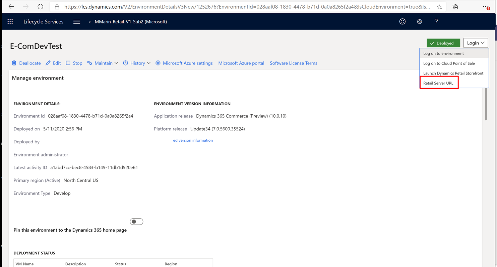

---
# required metadata

title: Debug against a Tier 1 Commerce development environmnent
description: This topic describes how to set up an e-Commerce online development environment to debug against a tier 1 Commerce development environment.
author: samjarawan
manager: annbe
ms.date: 06/12/2020
ms.topic: article
ms.prod: 
ms.service: dynamics-365-commerce
ms.technology: 

# optional metadata

# ms.search.form: 
audience: Developer
# ms.devlang: 
ms.reviewer: v-chgri
ms.search.scope: Retail, Core, Operations
# ms.tgt_pltfrm: 
ms.custom: 
ms.assetid: 
ms.search.region: Global
# ms.search.industry: 
ms.author: samjar
ms.search.validFrom: 2019-10-31
ms.dyn365.ops.version: Release 10.0.5

---
# Debug against a tier 1 Commerce development environmnent

[!include [banner](../includes/banner.md)]

This topic describes how to set up an e-Commerce online development environment to debug against a tier 1 Commerce development environment.

## Overview

Dynamics 365 Commerce tier 1 environments are generally deployed for Commerce runtime (CRT) and point of sale (POS) extension development. These are standalone environments that do not include e-Commerce components due to the software as a service (SaaS) nature of the e-Commerce architecture.

There may be scenarios where you want to test calling extensions on a tier 1 environment to allow extension debugging from e-Commerce components. This topic will describe how to set this such scenarios.

## Install Online SDK

The Dynamics 365 Commerce software development kit (SDK) can be installed on any environment including the tier 1 virtual machine (VM) itself. For setup instructions, see [Setup a development environment](setup-dev-environment.md).

## Configure the .env file

To hit the tier 1 environment from the local node server on the e-Commerce development environment, set the **MsDyn365Commerce_BASEURL** variable in the .env file to the tier 1 Retail Server URL. For details on setting up an .env file, see [Configure a development environment (.env) file](configure-env-file.md).

To obtain the Retail Server URL, open the Microsoft Lifecycle Services (LCS) web page and select the project and tier 1 environment. Next, select the **Login** at the top right and then select **Retail Server URL** as shown in the following illustration.



Selecting the **Retail Server URL** link should open a new tab with a URL similar to the following example URL: 

`https://e-comdevtestf1d01de665c744a7devret.cloud.retail.dynamics.com/Commerce`

Copy this URL except for the last part "Commerce" into the .env file as the value for the **MsDyn365Commerce_BASEURL** variable. The remaining variables should be configured to a desired online channel on the environment. The following example code shows configured variables using the URL above.  

```
…
MSDyn365Commerce_BASEURL=https://e-comdevtestf1d01de665c744a7devret.cloud.retail.dynamics.com/
MSDyn365Commerce_CHANNELID=68719478279
MSDyn365Commerce_CATALOGID=0
MSDyn365Commerce_OUN=128
…
```
Make sure to restart the Node.js server with "yarn start" command so that it picks up these new values. As you build modules and debug data actions, calls will now be made directly to the tier 1 Retail Server.

If you have the **MSDyn365_HOST** variable value set to your e-Commerce site, you can also navigate to https://localhost:4000 to view your online website rendered on the local Node.js server. All data action Retail Server calls will be routed to the tier 1 environment as specified in the .env file.

## Additional resources

[Setup a development environment](setup-dev-environment.md)

[Configure a development environment (.env) file](configure-env-file.md)


