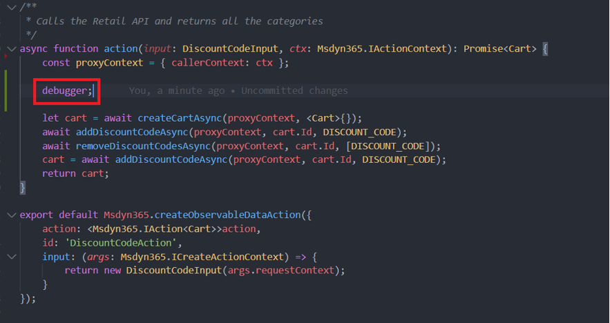
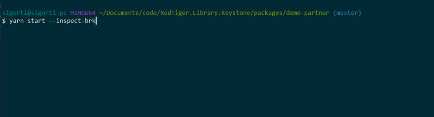
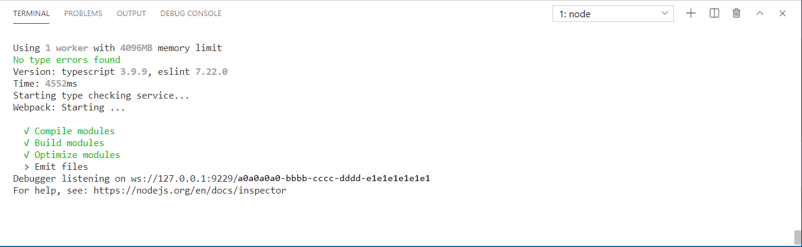
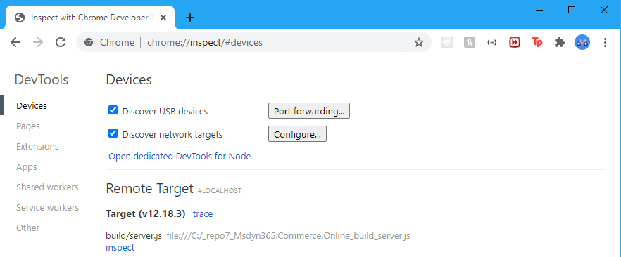
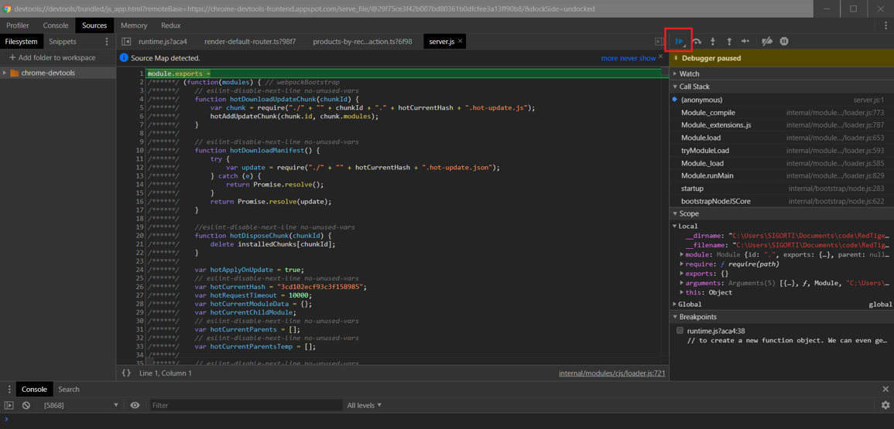
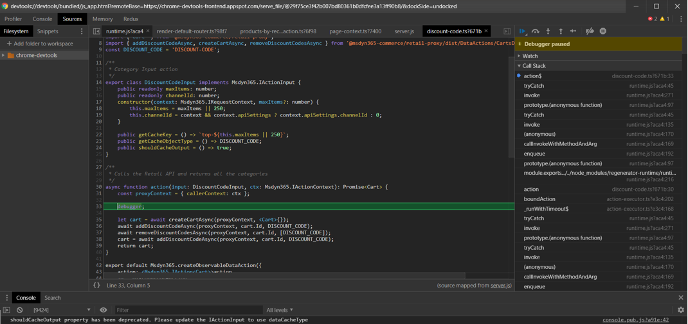
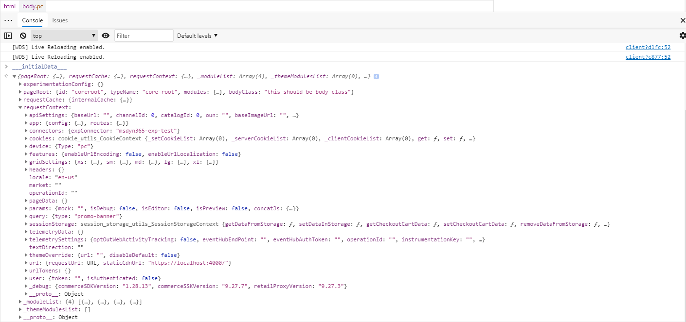

# Debugging best practices for Dynamics 365 Commerce development 

[!include [banner](../includes/banner.md)]

This article describes some best practices to follow when debugging Microsoft Dynamics 365 Commerce customizations. 

## Step through code in a modern browser on localhost

An easy way to debug code is to use a modern browser's debugger to step through code such as a module or data action that is typically run on the server side. You can debug this way if your local development environment is set up according to the steps in [Set up a development environment](setup-dev-environment.md), and you're using a Chromium-based browser such as Microsoft Edge or Google Chrome.

You should first identify the breakpoints in your code, or where you would like to start stepping through the code. To create a breakpoint in your code, add the **debugger** statement. 

For example, if you want to debug a data action that's running on the server side, you can create a breakpoint right before the API call that creates the cart by inserting the debugger statement, as shown in the following example.



The next step is to start the local Node server in debug mode using the **yarn start --inspect-brk** command, as shown in the following example.



After it's finished building and the Node server is running, you should see output that indicates that the debugger is listening, similar to the output shown in the following example.



At this point, the local browser development tools can be opened by navigating to ```edge://inspect``` or ```chrome://inspect```, depending on the browser that you're using. After a few seconds you should see a target similar to the one shown in the following example.



Select **inspect** to attach the browser development tools to your Node server and display a debugging window. By default, the debugger is paused before the Node server starts accepting requests. To resume script execution, select the resume script execution button as shown in the following example.



The local Node server is now ready to handle requests. Next, navigate to the page or module mock that calls the action and the triggers the breakpoint, as shown in the following example.



After the breakpoint is triggered, you can step through the code and debug as necessary. You can also add additional breakpoints in this file or in any other files by selecting the line numbers. These breakpoints get triggered on the next request.

## Use Fiddler to capture network requests

To enable Fiddler to capture network requests, start Fiddler before you start your Node server in local development mode. You must then enable Fiddler to [capture HTTPS traffic](https://docs.telerik.com/fiddler/configure-fiddler/tasks/decrypthttps). When that operation is complete, start your Node server using the **yarn start** command.
Next, navigate to any page on localhost and add the query string parameter `debug=true`. You'll see a pop-up window in Fiddler with an error stating that the certificate isn being validated. To proceed, select the **Ignore errors (unsafe) and proceed** option. You should now be able to intercept and inspect any network requests that the Node server is making.

## Access debug data through the browser console window

After a page loads in your browser, you can use the web debugger console tab to examine information about the page state that might be useful for debugging.

### The \_\_\_initialData\_\_\_ object

The **\_\_\_initialData\_\_\_** object provides information about the modules that were loaded, the request context, and cache information that was computed during the server-side render. 

To access this information, open the web debugger console tab and enter **\_\_\_initialData\_\_\_** to reveal this debug information. In the **requestContext** object, you can check your Commerce online software development kit (SDK) and module library versions (if installed) as shown in the following example.



### The \_msdyn365 object

The **\_msdyn365** object also provides additional debug information in the web debugger debug console. This object contains request details after the client render is completed. It can be useful to check if there are any differences between the **\_msdyn365** and **\___initialData___** objects to determine whether there's a mismatch between server and client-side renders.

## Useful query strings

The online SDK provides a few query strings that can be appended to any page to gather debugging information.

### Debug query string

Adding the query string ```?debug=true``` turns on debug mode and displays module errors. If this query string is added to a request that is hitting your local dev server, the server-side action calls appear in a network debugging tool such as Fiddler.

### Node service proxy query string

Adding the query string ```?item=nodeserviceproxy:true``` returns the raw page context provided by the platform in JSON format. Adding this query string can help determine which modules the page is rendering, and is also useful for checking request context properties. 

### Lazy load module query string

Adding the query string ```setswitch=node_lazyload_{module | all}``` forces a module (or all modules) to be loaded on the client side. When hitting a production URL, server-side actions are abstracted away from the browser, resulting in requests not appearing in the browser's networking tab. When the lazy load query string is applied, actions and modules are forced to load on the client side. You can then use a networking tool such as Fiddler or the Chrome network tab to track the data action requests a module is making. 

## Troubleshoot common issues

### My module isn't loading
If your module is loading, try the following steps to resolve this issue: 

1. Try loading the page with the ```debug=true``` query string parameter. If the module has any errors, it logs the errors there. If module displays errors, the most likely case is that the module is misconfigured. Contact the module author to debug further.
1. If the module doesn't display any errors, check that the module is in the page context by adding the ```item=nodeserviceproxy:true``` flag. If the module isn't present, update the page in tooling or your page mock.
1. If the module is present after checking if it's in the page context, verify that it's registered by checking your server for any build errors, or the versions page to confirm that the module is registered.

### My data action isn't firing
If your data action isn't firing, try the following steps to resolve this issue: 

1. Load the action on the client side so that you can check the API calls in your browser's network tab using the lazy load query string.
1. If the network call you expect isn't executing, put a breakpoint in your action using the JavaScript debugger. You should then be able to trace what is happening.
1. If the debugger is never triggered, verify that your module definition includes the expected action chain.

## Other tips and tricks

- You can use console.trace() statements to print debug information to the console. If the console.trace() statements are in server-side actions, these logs don't appear in the browser or console unless the debugger is attached to the running Node process.
- It can sometimes be helpful to run the **yarn –force** command to force yarn to fetch the latest packages, even if they've already been installed.
- To perform a clean install, remove the **yarn.lock** file from the **node_modules** directory, and then run **yarn cache clean** before running yarn.

## Additional resources

[Dynamics 365 Commerce architecture overview](../commerce-architecture.md)

[Online channel extensibility overview](overview.md)

[System requirements](system-requirements.md)

[Set up a development environment](setup-dev-environment.md)

[Best practices for Dynamics 365 Commerce development](best-practices-dev.md)

[Dynamics 365 Commerce online SDK FAQ](sdk-faq.md)

[!INCLUDE[footer-include](../../includes/footer-banner.md)]
