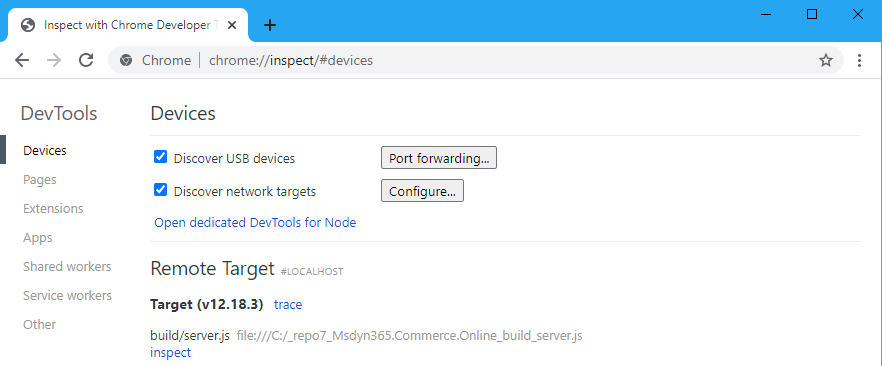

---
# required metadata

title: Debugging best practices for Dynamics 365 Commerce development 
description: This topic describes some best practices to follow when debugging Dynamics 365 Commerce customizations.  
author: samjarawan
manager: annbe
ms.date: 02/11/2021
ms.topic: article
ms.prod: 
ms.technology: 

# optional metadata

# ms.search.form: 
audience: Developer
# ms.devlang: 
ms.reviewer: v-chgri
# ms.tgt_pltfrm: 
ms.custom: 
ms.assetid: 
ms.search.region: Global
# ms.search.industry: 
ms.author: samjar
ms.search.validFrom: 2019-10-31
ms.dyn365.ops.version: Release 10.0.5

---
# Debugging best practices for Dynamics 365 Commerce development 

[!include [banner](../includes/banner.md)]

This topic describes some best practices to follow when debugging Dynamics 365 Commerce customizations. 


## Stepping through code in a modern browser on localhost using Chromium DevTools
An easy way to debug code is to use a modern browsers debugger and stepping through code such as a module or data action that is normally run on the server side.  This can be done if you have set up a local development environment as found in the [Set up a development environment](setup-dev-environment.md) article and are using a Chromium based browser such as Edge or Chrome.

First, you will want to identify the breakpoints in your code or where you would like to start stepping through the code. To create a breakpoint in your code, add the **debugger** statement. 

For example, if we want to debug a data action that is running server side and we want to insert a breakpoint right before we make an API call that creates the Cart. To do this we would insert the debugger statement before making this API call as shown in the following image:


The next step is to start the local Node server in debug mode using the **yarn start --inspect-brk** command.


Once it is finished building and the Node server is running you should see similar output to below indicating that the debugger is listening:


At this point the local Chrome DevTools can be opened up.  In the browser you can navigate to ```edge://inspect``` or ```chrome://inspect``` depending on the browser you are using.  After a few seconds you should see a **Target** listed similar to below:



Hitting the inspect link will attach the DevTools to your node server and bring up a debugging window. By default, the debugger will be paused before the node server starts accepting requests, so go ahead and resume script execution by clicking on ‘resume script execution’.


The local Node server is now ready to handle requests. Next navigate to the page or module mock that will call the action and the breakpoin withh be triggered.


The breakpoint has been triggered. From here we can step through the code and debug as necessary.
You may also add additional breakpoints in this file or in any other files by clicking on the line numbers. These breakpoints will get triggered on the next request.


## Additional resources

[Dynamics 365 Commerce architecture overview](../commerce-architecture.md)

[Online channel extensibility overview](overview.md)

[System requirements](system-requirements.md)

[Set up a development environment](setup-dev-environment.md)

[best-practices-dev](best-practices-dev.md)


[!INCLUDE[footer-include](../../includes/footer-banner.md)]
