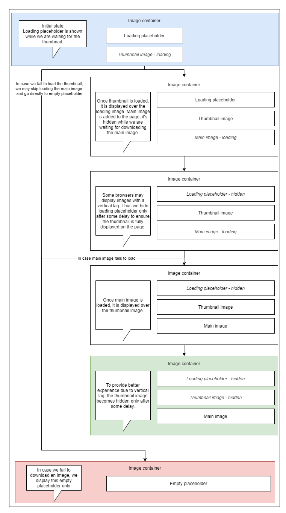

---
# required metadata

title: Image component
description: This topic describes how to use the Microsoft Dynamics 365 Commerce online SDK **Image** component to embed images into a module with advanced support including optimized image sizes from the Dynamics 365 image resizer service and support for fallback and thumbnail images.
author: samjarawan
ms.date: 11/30/2021
ms.topic: article
ms.prod: 
ms.technology: 

# optional metadata

# ms.search.form: 
audience: Developer
# ms.devlang: 
ms.reviewer: v-chgri
# ms.tgt_pltfrm: 
ms.custom: 
ms.assetid: 
ms.search.region: Global
# ms.search.industry: 
ms.author: samjar
ms.search.validFrom: 2019-10-31
ms.dyn365.ops.version: Release 10.0.5

---
# Image component

[!include [banner](../includes/banner.md)]

This topic describes how to use the Microsoft Dynamics 365 Commerce online SDK **Image** component to embed images into a module with advanced support including optimized image sizes from the Dynamics 365 image resizer service and support for fallback and thumbnail images.

## Image states
There are 4 image states available for each image.
1. Loading placeholder.
2. Thumbnail image (low resolution image).
3. Main image (full resolution image).
4. Empty image placeholder.

### Loading Placeholder
Loading placeholder is shown to the user while the main image is loading. The placeholder is represented as a single div element with the corresponding class msc-loading_image. Using the class name you can specify the background image for the html element. 

Using loading placeholder is recommended to reserve some specific space on the page for the image while it's loading to reduce 'jumping' elements on the page. Using loading placeholder is also recommended because it will point to specific places where the SCSS is specified incorrectly which may cause issues for empty placeholder (see empty placeholder below) as empty placeholder is shown only in some corner cases when there are some troubles with the images which is a rare case which can be easily missed, loading image, on the other hand, is always shown regardless, so it's easier to catch styling issues.

This component is available for single usage as LoadingPlaceholderImage in core-internal package.

The fabrikam theme, contains an svg placeholder image that looks like the following:


### Thumbnail image
Thumbnails are low resolution images with small dimensions (width/height). Thumbnails are used as intermediate images after loading the placeholder and before the main image loads. This helps to speed up image downloading as thumbnail images are much smaller thus they are much faster to be downloaded and rendered on the page. The advantage of the thumbnail images is for perceived performance, some users may not need high resolution image, because thumbnails can already give some information about the main image. Having very small image sizes (~10 times compression), thumbnails will be downloaded much faster without a noticable performance degradation and can improve perceived performance.

Thumbnails are standard image elements which are marked with **msc-thumbnail_image** class. Thumbnails do not use image settings specified for the original image (although the compressed size is calculated based on the image settings for original image). Since thumbnails are very compressed, they may loose some image information or produce artifacts. In order to hide these artifacts, it is recommended to apply a blur effect to the image.

This component is available for single usage as ThumbnailImage in core-internal package.

### Main image
Main image is the original / end image which is displayed to the user once the downloading has finished.

This component is available for single usage as MainImage in core-internal package.

Main image is marked with **msc-main_image** class.

### Empty placeholder
The empty placeholder image is shown to the user in case the image is not found or failed to be downloaded.
Similar to the loading placeholder, the empty placeholder is represented as a single div element with the corresponding **msc-empty_image** class. Using the class name you can specify the background image for the html element. 

This component is available for single usage as EmptyPlaceholderImage in core-internal package.

The fabrikam theme, contains an svg empty placeholder image that looks like the following:


## Enable image fallback support
To enable the image fallback support, ensure the "Enable image fallback" option is selected from within the site builder tool "Site settings" -> "Extensions" section.

## Image structure
The image component is wrapped in a div element with class **msc-image-container**. The image types are located inside this container element. Each image type is also marked with **msc_image** class name which you can also use for some css.

## Image types flow
Image flow can be represented using the next state diagram.



Note, hidden and loading states should be controlled by css, so make sure you have the required changes. By default, we don't want the images to be displayed until they are ready or in case we don't need them on the page. You may use these classes to provide custom styles for different image states e.g. showing a spinner.

```css
.msc-image-container {
    .msc-loading_image {
        &.hidden {
            visibility: hidden;
        }
    }

    .msc-thumbnail_image {
        &.loading {
            visibility: hidden;
        }

        &.hidden {
            visibility: hidden;
        }
    }

    .msc-main_image {
        &.loading {
            visibility: hidden;
        }

        &.hidden {
            visibility: hidden;
        }
    }
}
```

In order to display one element over the other element, we also need to have the corresponding changes in css. Having this style preset will allow to overlap the image components when new state is available, e.g. having this style preset will ensure the UI is not broken and thumbnails are not displayed together with the main image.

```
.msc-image-container {
    display: grid;
    overflow: hidden;
    position: relative;
    z-index: 0;

    > * {
        grid-area: 1 / 1;
        grid-row: 1;
    }

    >:nth-child(1) {
        z-index: 0;
    }

    >:nth-child(2) {
        z-index: 1;
    }

    >:nth-child(3) {
        z-index: 2;
    }
}
```

Once a thumbnail or main image is loaded, it is displayed on top of the previous layers. This is done to provide better seamless experience and fix the vertical lag which can be observed in some cases. This is the reason why the previous layer is not completely hidden right after the new layer is ready. The previous layer will be hidden only after some delay to ensure the new layer is fully displayed, this helps fixing this vertical lag.

To ensure the placeholders use the correct style ensure you add the following mixin **image** into your theme.  Passing new dimensions in the mixin will update all types of images (placeholders, thumbnails, main images). If you are using the "Fabrikam" reference theme, you will find this already defined in the themes "/styles/02-generic/image.scss" file.

```css
@mixin image($width, $height: $width) {
    .msc-image-container {
        width: $width;
        height: $height;
    }

    .msc_image {
        width: $width;
        height: $height;
    }

    .msc-loading_image {
        @include image-loading-placeholder($width, $height);
    }

    .msc-empty_image {
        @include image-empty-placeholder($width, $height);
    }

    .msc-thumbnail_image {
        filter: blur(min($width, $height) * 0.015);
    }
}
```
Usage:

```css
&__product-image {
    @include image($msv-details-sale-line-image-size);
}
```


## Using the Image component within a module
The **Image** component can be used within a module with a reference to **@msdyn365-commerce/core** as shown below:

```typescript
import { IImageData, IImageSettings, Image } from '@msdyn365-commerce/core';
```

## ImageSettings

The **Image** component takes in an **ImageSettings** class that defines the behavior of the image.  **ImageSettings** allows the configuration of the image dimension for various view port sizes, a lazyload flag, image quality and other various image features.  When using an image configuration within a module these values are set from within site builder and returned for use when rendering the image.  The interface is shown below.

```typescript
export interface IImageSettings {
    viewports: IViewPort;
    lazyload?: boolean;
    disableLazyLoad?: boolean;
    quality?: number;
    cropFocalRegion?: boolean;
    mode?: number;
    backgroundColor?: string;
}
export interface IViewPort {
    xs: IImageDimension;
    sm?: IImageDimension;
    md?: IImageDimension;
    lg?: IImageDimension;
    xl?: IImageDimension;
}
export interface IImagePlaceholderConfig {
    name: string;
    svgConfig?: ISVGConfig;
    imagePropertyName?: string;
    moduleType?: string;
    layout?: string;
    moduleId?: string;
}
export interface ISVGConfig {
    height: number;
    width: number;
    preserveAspectRatio?: string;
}
export interface IImageDimension {
    w: number;
    h: number;
    q?: string;
}
```

### ImageSettings viewport configuration
In general the ImageSettings will be automatically populated from the site builder image configuration, however if you are manually constructing the object it is useful to know the query string parameter values that the image resizer uses to render the images.  This is useful when you need to mock the data for testing purposes.  To ensure the image resizer service handles the image correctly the appropriate query string parameter "q" must be set on the **ImageDimension** using the format "w=WIDTH_NUMBER&h=HEIGHT_NUMBER&m=MODE_NUMBER", where WIDTH_NUMBER and HEIGHT_NUMBER are the width and height values in pixels (0-3000) and MODE_NUMBER is the image resizer mode to use.

The following modes are supported:
| Mode | Title | Description |
|----|----|----|
| 1 | letter-box | This scales an image from its’ original dimension to a requested dimension while maintaining the aspect ratio of the original image. If the aspect ratio of the requested dimension isn’t the same as that of the original image, a background color is used to fill in the remaining region. |
| 2 | scale | This scales an image from its original dimension to a requested dimension while maintaining the aspect ratio of the original image.  This is the default mode if none is set.|
| 3 | stretch | This scales an original image from its’ original dimension to a requested dimension while not maintaining the aspect ratio of the original image. |
| 4 | crop | This scales an image from its’ original dimension to a requested dimension while maintaining the aspect ratio of the original image. If the aspect ratio of the requested dimension isn’t the same as that of the original image, areas that fall within the boundaries of the requested dimension are clipped and retained. NOTE: if the original image layout is landscape, the clipped region is centered (horizontally and vertically) on the original image; if however it is portrait, it is centered horizontally and 30% from the top of the original image (to capture a face).|
| 5 | focal-crop | This is a variation of the standard crop where the area to crop is determined by a specified focal point. This scales an image from its original dimension to a requested dimension while maintaining the aspect ratio of the original image. If the aspect ratio of the requested dimension isn’t the same as that of the original image, areas that fall within the boundaries of the requested dimension are clipped and retained. NOTE: if the original image layout is landscape, the clipped region is centered (horizontally and vertically) on the original image; if however it is portrait, it is centered horizontally and 1/6 from the top of the original image (to capture a face). The location of the clipped region is configuration either via the web.config (thereby affecting all images) or via the url (thereby affecting only the requested image). |
| 6 | facial crop | This scales an image from its original dimension to a requested dimension while maintaining the aspect ratio of the original image. If the aspect ratio of the requested dimension is not the same as that of the original image, areas that fall within the boundaries of the requested dimension are clipped and retained. This is a variation of the focal crop (discussed above) where the area to crop is determined by a focal region centered on auto-detected faces. NOTE: the clipped region is centered within an automatically detected collection of faces. |
| 7 | TMX resize | |
| 8 | custom crop | In this mode the area to crop is determined by a region specified using query parameters. This mode first crops the image to a region specified in query parameters and then scales the cropped image to a requested dimension. Depending upon the other settings specified in query parameters e.g. scaling up enabled, scaling down enabled, letterboxing enabled etc. scaling and letterboxing actions will be performed. |


## Sample image component usage
The below sample shows how the **Image** component and **ImageSettings** can be used within a module.  Note that a "defaultImageSettings" variable is declared which sets the width, height and scaling mode if none is provided from site builder, which can occur when debugging in a dev environment and no values are provided in the module mocks.

```typescript
import * as React from 'react';
import { IImageSettings, Image } from '@msdyn365-commerce/core';
import { IProductFeatureViewProps } from './product-feature';
import { imageAlignment } from './product-feature.props.autogenerated';

const _renderImage = (props: IProductFeatureViewProps): JSX.Element => {
    // Constuct the default image settings if settings are not found in the theme settings file
    const defaultImageSettings: IImageSettings = {
        viewports: {
            xs: { q: 'w=100&h=100&m=8', w: 0, h: 0 },
            sm: { q: 'w=200&h=200&m=8', w: 0, h: 0 },
            md: { q: 'w=300&h=300&m=8', w: 0, h: 0 },
            lg: { q: 'w=400&h=400&m=8', w: 0, h: 0 }
        },
        lazyload: false
    };

    return (
        <Image
            requestContext={props.context.actionContext.requestContext}
            className='product-image'
            {...props.config.productImage}
            gridSettings={props.context.request.gridSettings!}
            imageSettings={props.config.productImage?.imageSettings || defaultImageSettings}
            loadFailureBehavior='hide'
            role='tabpanel'
            id='productImageTage'
            altText={props.config.productImage?.altText || ''}
        />
    );
};

const _renderInfo = (
    productName: string,
    productInfo: string,
    productPrice: string,
    buttonInfo: string,
    productTitleId: string
): JSX.Element => {
    return (
        <div className='container'>
            <h2 id={productTitleId}>{productName}</h2>
            <p>{productInfo}</p>
            <p>{productPrice}</p>
            <button type='button' className='btn btn-primary'>
                {buttonInfo}
            </button>
        </div>
    );
};

export default (props: IProductFeatureViewProps) => {
    const { productName, productInfo, productPrice, buttonInfo, alignment } = props;

    let left;
    let right;

    if (alignment === imageAlignment.left) {
        left = _renderImage(props);
        right = _renderInfo(productName, productInfo, productPrice, buttonInfo, 'product_Title_1');
    } else {
        right = _renderImage(props);
        left = _renderInfo(productName, productInfo, productPrice, buttonInfo, 'product_Title_2');
    }

    return (
        <div className='row align-items-center'>
            <div className='col-sm-6'>{left}</div>
            <div className='col-sm-6'>{right}</div>
        </div>
    );
};
```

In the above example, the module leverages a **productImage** module configuration which uses **"type": "image"** as shown in the module definition file below.  This allows the page author to configure an image for the module within the site builder.  The site builder also allows the configuration of a focal point for each module image and this data will be passed through to the image resizer service.

```json
{
    "$type": "contentModule",
    "friendlyName": "Product Feature",
    "name": "product-feature",
    "description": "Feature module used to highlight a product.",
    "categories": [
        "storytelling"
    ],
    "tags": [
        ""
    ],
    "dataActions": {
    },
    "config": {
        "imageAlignment": {
            "friendlyName": "Image Alignment",
            "description": "Sets the desired alignment of the image, either left or right on the text.",
            "type": "string",
            "enum": {
                "left": "Left",
                "right": "Right"
            },
            "default": "left",
            "scope": "module",
            "group": "Layout Properties"
        },
        "productTitle": {
            "type": "string",
            "friendlyName": "Product Title",
            "description": "Product placement title"
        },
        "productDetails": {
            "type": "richText",
            "friendlyName": "Product Details",
            "description": "Rich text representing the featured product details"
        },
        "productImage": {
            "type": "image",
            "friendlyName": "Product Image",
            "description": "Image representing the featured product"
        },
        "buttonText": {
            "type": "string",
            "friendlyName": "Button Text",
            "description": "Text to show on the call to action button"
        }
    }
}
```

### Supporting module layouts from within a theme
A site [theme](theming.md) contains a THEME_NAME.theme.settings.json file that can define different module **layouts** each with their own **ImageSettings**, see the [configure theme settings](configure-theme-settings.md) topic for more information.  The below sample shows a sample theme defining two module layouts 'vertical' and 'horizontal' with different image sizes for each viewport.  Each of the defined layouts for a theme will show up in the site builder module configuration for the page author to select.  When a module is rendered, the settings from the theme are passed through to the image resizer service to serve up the appropriately sized image based on the browser viewport and layout selected.

```json
{
    "modules": {
        "product-feature": {
            "properties": {
                "vertical": {
                    "friendlyName": "Vertical",
                    "description": "Vertical",
                    "type": "layout",
                    "properties": {
                        "productImage": {
                            "friendlyName": "Image Settings",
                            "description": "Image settings for the main image",
                            "type": "imageSizes",
                            "properties": {
                                "xs": {
                                    "width": 75,
                                    "height": 75
                                },
                                "sm": {
                                    "width": 250,
                                    "height": 250
                                },
                                "md": {
                                    "width": 350,
                                    "height": 350
                                },
                                "lg": {
                                    "width": 400,
                                    "height": 400
                                },
                                "xl": {
                                    "width": 500,
                                    "height": 500
                                }
                            }
                        }
                    }
                },
                "horizontal": {
                    "friendlyName": "Horizontal",
                    "description": "Horizontal",
                    "type": "layout",
                    "properties": {
                        "productImage": {
                            "friendlyName": "Image Settings",
                            "description": "Image settings for the main image",
                            "type": "imageSizes",
                            "properties": {
                                "xs": {
                                    "width": 155,
                                    "height": 155
                                },
                                "sm": {
                                    "width": 255,
                                    "height": 255
                                },
                                "md": {
                                    "width": 355,
                                    "height": 355
                                },
                                "lg": {
                                    "width": 455,
                                    "height": 455
                                },
                                "xl": {
                                    "width": 555,
                                    "height": 555
                                }
                            }
                        }
                    }
                }
            }
        }
    },
    "gridSettings": {
        "xs": 768,
        "sm": 991,
        "md": 1199,
        "lg": 1599,
        "xl": 1600
    }
}
```

## Mocking image data in a module mock
The below shows a sample module mock file to set the **imageSettings** mock data.

```json
{
  "id": "R1Module1",
  "platform": {
    "layout": "vertical"
  },
  "config": {
    "msdyn365__moduleLayout": "vertical",
    "imageAlignment": "left",
    "productTitle": "Retro Horn Rimmed Keyhole Nose Bridge Round Sunglasses",
    "productDetails": "High-quality and pioneered with the perfect blend of timeless classic and modern technology with hint of old school glamor.",
    "productImage": {
      "src": "https://images-us-ppe.cms.commerce.dynamics.com/cms/api/dbfztcmjrn/imageFileData/search?fileName=/Products%2F91005_000_001.png",
      "altText": "Retro Horn Rimmed Keyhole Nose Bridge Round Sunglasses",
      "quality": 80,
      "imageSettings": {
        "viewports": {
          "xs": {
            "q": "w=125&h=125&m=8",
            "w": 0,
            "h": 0
          },
          "sm": {
            "q": "w=225&h=225&m=8",
            "w": 0,
            "h": 0
          },
          "md": {
            "q": "w=325&h=325&m=8",
            "w": 0,
            "h": 0
          },
          "lg": {
            "q": "w=425&h=425&m=8",
            "w": 0,
            "h": 0
          }
        },
        "lazyload": false
      }
    },
    "buttonText": "Buy Now"
  },
  "typeName": "product-feature"
}
```

## Mocking image data in a page mock
The below shows a sample page mock file to set the **imageSettings** mock data.

```json
{
    "exception": null,
    "pageRoot": {
        "id": "core-root_0",
        "typeName": "core-root",
        "modules": {
            "body": [
                {
                    "id": "default-page_0",
                    "typeName": "default-page",
                    "modules": {
                        "primary": [
                            {
                                "id": "ProductFeature__0",
                                "typeName": "product-feature",
                                "platform": {
                                    "layout": "vertical"
                                },
                                "config": {
                                "msdyn365__moduleLayout": "vertical",
                                "imageAlignment": "left",
                                "productTitle": "Retro Horn Rimmed Keyhole Nose Bridge Round Sunglasses",
                                "productDetails": "High-quality and pioneered with the perfect blend of timeless classic and modern technology with hint of old school glamor.",
                                "productImage": {
                                    "src": "https://images-us-ppe.cms.commerce.dynamics.com/cms/api/dbfztcmjrn/imageFileData/search?fileName=/Products%2F91005_000_001.png",
                                    "altText": "Retro Horn Rimmed Keyhole Nose Bridge Round Sunglasses",
                                    "quality": 80,
                                    "imageSettings": {
                                        "viewports": {
                                            "xs": {
                                                "q": "w=60&h=60&m=8",
                                                "w": 0,
                                                "h": 0
                                            },
                                            "sm": {
                                                "q": "w=160&h=160&m=8",
                                                "w": 0,
                                                "h": 0
                                            },
                                            "md": {
                                                "q": "w=260&h=260&m=8",
                                                "w": 0,
                                                "h": 0
                                            },
                                            "lg": {
                                                "q": "w=360&h=360&m=8",
                                                "w": 0,
                                                "h": 0
                                            }
                                        },
                                        "lazyload": false
                                    }                                  
                                },
                                "buttonText": "Buy Now"
                                }
                            },
                            {
                                "id": "ProductFeature__1",
                                "typeName": "product-feature",
                                "platform": {
                                    "layout": "vertical"
                                },
                                "config": {
                                "msdyn365__moduleLayout": "vertical",
                                "imageAlignment": "right",
                                "productTitle": "Retro Horn Rimmed Keyhole Nose Bridge Round Sunglasses",
                                "productDetails": "High-quality and pioneered with the perfect blend of timeless classic and modern technology with hint of old school glamor.",
                                "productImage": {
                                    "src": "https://images-us-ppe.cms.commerce.dynamics.com/cms/api/dbfztcmjrn/imageFileData/search?fileName=/Products%2F91005_000_001.png",
                                    "altText": "Retro Horn Rimmed Keyhole Nose Bridge Round Sunglasses",
                                    "quality": 80,
                                    "imageSettings": {
                                        "viewports": {
                                            "xs": {
                                                "q": "w=70&h=70&m=8",
                                                "w": 0,
                                                "h": 0
                                            },
                                            "sm": {
                                                "q": "w=170&h=170&m=8",
                                                "w": 0,
                                                "h": 0
                                            },
                                            "md": {
                                                "q": "w=270&h=270&m=8",
                                                "w": 0,
                                                "h": 0
                                            },
                                            "lg": {
                                                "q": "w=370&h=370&m=8",
                                                "w": 0,
                                                "h": 0
                                            }
                                        },
                                        "lazyload": false
                                    }
                                },
                                "buttonText": "Buy Now"
                                }
                            }
                        ]
                    },
                    "config": {
                        "pageTheme": "spring"
                    }
                }
            ]
        }
    },
    "renderingContext": {
        "gridSettings": {
            "xs": {
                "w": 768
            },
            "sm": {
                "w": 991
            },
            "md": {
                "w": 1199
            },
            "lg": {
                "w": 1599
            },
            "xl": {
                "w": 1600
            }
        },
        "staticContext": {
            "staticCdnUrl": "/_scnr/"
        },
        "locale": "en-us",
        "siteTheme": "spring"
    },
    "statusCode": 200
}
```
