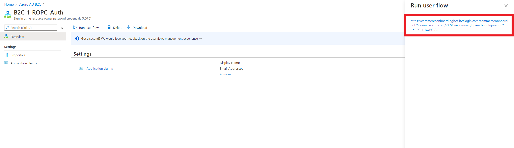
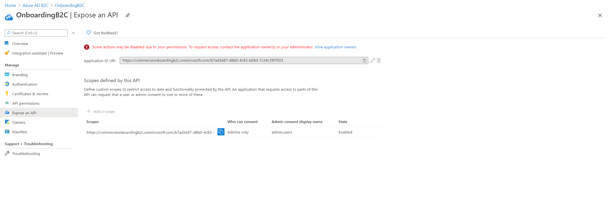
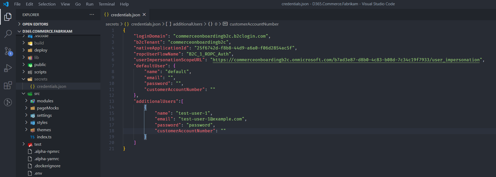

---
# required metadata

title: Mocking signed in state during local development
description: 
author: samjarawan
manager: annbe
ms.date: 09/15/2020
ms.topic: article
ms.prod: 
ms.service: dynamics-365-commerce
ms.technology: 

# optional metadata

# ms.search.form: 
audience: Developer
# ms.devlang: 
ms.reviewer: v-chgri
ms.search.scope: Retail, Core, Operations
# ms.tgt_pltfrm: 
ms.custom: 
ms.assetid: 
ms.search.region: Global
# ms.search.industry: 
ms.author: samjar
ms.search.validFrom: 2019-10-31
ms.dyn365.ops.version: Release 10.0.5

---
# Mocking signed in state during local development

[!include [banner](../includes/banner.md)]

This topic describes how to

## Overview

Over the course of developing your e-Commerce online site, it may become necessary to develop and test scenarios for signed in users. Rather then publishing these pages and testing against live pages you can instead mock the signed in state when running in developer mode.
 
To take advantage of this feature, you will need to perform a one time setup in your Azure AD B2C tenant to allow you to mock the signed in user status.

## Configuring your Azure B2C Tenant

### Create a new resource owner password credential (ROPC)
 
The first step is to create a new resource owner password credentials (ROPC) flow in your Azure AD B2C tenant. To proceed with the following steps, you will need to be signed in with user that has global administrator privileges.
 
1.	Sign in to the [Azure portal](https://ms.portal.azure.com/) as the global administrator of your Azure AD B2C tenant and select the **Azure AD B2C** service.
1.	Select **User flows** and **New user flow**.
1.	Select **Sign in using resource owner password credentials (ROPC)** and select **Create**.
1.	Provide a name for the user flow, such as "ROPC_Auth". Copy the full name and save it, as this information as it will later be used as `ropcUserFlowName`  in your credentials.json file.
1.	Under **Application claims**, click **Show more**.
1.	Select the application **"Display Name"**, **"Email Addresses"**,**"Given Name"**, **"Identity provider"**, **"SurName"**, **"User’s object ID"** claims.
1.	Select **OK** and then select **Create**.
1.	Select the new user flow and **Run user flow**. 

You should then see an endpoint URL similar to "https://**<B2C_TENANT>**.b2clogin.com **<LOGIN_DOMAIN>**/v2.0/.well-known/openid-configuration?p=B2C_1_ROPC_Auth```.
Make note of the **<B2C_TENANT>** and **<LOGIN_DOMAIN>** from the URL as it will be used in your credentials.json file later.



At the end of this step you will have created a new ROPC policy to enable local sign in and should have the following pieces of information, ` ropcUserFlowName`, `loginDomain` and `b2cTenant`. 

Looking at the example above we have the following:

| Property Name | Example Value |
| ----------- | ----------- |
| ropcFlowUserName | B2C_1_ROPC_Auth |
| loginDomain | login.fabrikam.com |
| b2cTenant | rushmoreb2c |


### Create a native application
Next, we will create a native application meant to represent the Node application you will run during local development.
 
1.	In the **Azure AD B2C** settings, select **App Registrations**, and then select **New registration**.
2.	Enter a name for the application, such as "Local_Node_App".
3.	For supported account types choose  **"Accounts in any identity provider or organizational directory (for authenticating users with user flows)"**
4.	For redirect URI, change the dropdown to **"Public client/native(mobile & desktop)"** and leave the URI as is.
5.	Leave all other values as there defaults and select **Register**.
6.	Select the new application, copy the **Application (client)) ID** and save it, as this ID as it will later be used as `nativeApplicationId` in your credentials.json file.


7.	In the left menu, under the **Manage** section, select **Authentication**.
8.	Select **Try out the new experience** (if shown).
9.	Under **Default client type**, select **Yes** to "treat the application as a public client". This setting is required for the ROPC flow.
10.	Select **Save**.
11.	7.	In the left menu, under the **Manage** section, select **Manifest**, to open the manifest editor.
12.	Set the **oauth2AllowImplicitFlow** attribute to **true** followed by the **Save** button.


At the end of this step you will have created a new native application used to represent your local Node application. 
Looking at the example above we now have the following information:

| Property Name | Example Value |
| ----------- | ----------- |
| ropcFlowUserName | B2C_1_ROPC_Auth |
| loginDomain | login.fabrikam.com |
| b2cTenant | rushmoreb2c |
| nativeApplicationId | 0fb41a53-fcae-45df-b4cb-ab78471ad919 |

### Configuring Scope and Registering the Native Application

1.	In the Azure AD B2C settings, go back to **App registrations**.
2.	Open the application created above which is currently being used by the e-Commerce rendering application.
3.	Go to **Expose an API** under the **Manage** section and verify a `user_impersonation` scope exists. If it does not, create one using the "Add a scope" link and set the **Scope name** to **user_impersonation** and provide a friendly **Admin consent display name** and **Admin consent description**.



4.	Copy the full scope value and save it, this information will later be used as `userImpersonationScopeURL` in your credentials.json file.
5.	Now go back to native application we just created and navigate to **API permissions** in the **Manage** section.
6.	Click on **Add a permission** and select the **APIs my organization uses** tab.
7.	Search for your e-Commerce rendering application we created above, select it and then add **user_impersonation** as a permission


8.	Click on **Add permissions**.
9.	Click on the **Grant admin consent for ...** link (note the name will contain your domain) and select **Yes** to apply the consent. You should now see a green checkmark in the **Status** for user_impersonation.
 
The Azure AD setup portion is now complete and you should have all the following pieces of information

| Property Name | Example Value |
| ----------- | ----------- |
| ropcFlowUserName | B2C_1_ROPC_Auth |
| loginDomain | login.fabrikam.com |
| b2cTenant | rushmoreb2c |
| nativeApplicationId | 0fb41a53-fcae-45df-b4cb-ab78471ad919 |
| userImpersonationScopeURL | https://login.fabrikam.com/B2CAPI/user_impersonation |

## Configuring your Node application

If you have not already completed the steps to configure you Azure AD B2C tenant to support this feature, please follow the above steps. Once those steps are completed you will need to create a credentials file in your online SDK Node application.
 
The credentials will live under the secrets/ directory in your Node application. Go ahead and create a `secrets/` directory in your application if you already haven’t created one and create a new file `credentials.json` similar to below using the data gathered above.

```json
{
    "loginDomain" : "login.fabrikam.com",
    "b2cTenant" : "rushmoreb2c",
    "nativeApplicationId": "0fb41a53-fcae-45df-b4cb-ab78471ad919",
    "ropcUserFlowName": "B2C_1_ROPC_Auth",
    "userImpersonationScopeURL": "https://login.fabrikam.com/B2CAPI/user_impersonation",
    "defaultUser": {
        "name": "default",
        "email": "",
        "password": ""
    },
    "additionalUser": [
        {
            "name": "test-user-1",
            "email": "",
            "password": ""
        }
    ]   
}
```



**Note: everything under secrets/ should be added to your gitignore file to help prevent credentials from being leaked online**


Use the information collected in the Azure setup steps to populate the above file and then add test accounts that you would like to use during local development. These accounts defined here should be valid accounts that have already been created in Dynamics 365 Commerce HQ.
•	`defaultUser`: The default user that will be used when mockUser is set to true. The name should be ‘default’
•	`additionalUsers`: An array of user objects that allows you to configure additional users to test with. Each entry in this array should be an object with name, email and password. To sign in as a user configured in `additionalUsers` use `mockUser=<name>`.

## Mocking sign-in status

Once all the above configuration is complete, start up your e-Commerce Node application in local dev mode using `yarn start`. Sign-in status is controlled using the `mockUser` query parameter and works to mock signed in state on mock-pages as well as against published pages e.g. (https://localhost:4000?mock=homepage&mockUser=true or https://localhost:4000?mockUser=true)
 
Use `mockUser=<true|false|name>` to control the signed in behavior. The behavior of each of the preceding values is described in the table below.

| mockUser value	| Example	| Sign In/Sign Out	| Description |
| ---------------| ------- | ---------------- | ----------- |
| true	| mockUser=true |	Sign In	| Signs in as the default user |
| name	| mockUser=test-user-1 |	Sign In	| Signs in as the user given in the query paramter |
| false |	mockUser=false	|Sign Out	| Signs out the currently signed in user |

You may use the mockUser query param to test pages as different users without signing out and signing back in for each different user. For example hitting https://localhost:4000?mock=homepage&mockUser=true and then https://localhost:4000?mock=homepage&mockUser=test-user-1 will allow you to test the homepage mock as different signed in users.
 
Once you hit a page with mockUser turned on and successfully sign in, the signed in state will persist across pages until you either sign in with a different user or sign out.
 
Lastly, you can also make use of the sign-in and sign-out buttons on the webpage itself to mock signed in user behavior. The sign-in button will sign you in as the default configured user while the sign-out button will sign out the currently signed in user.
