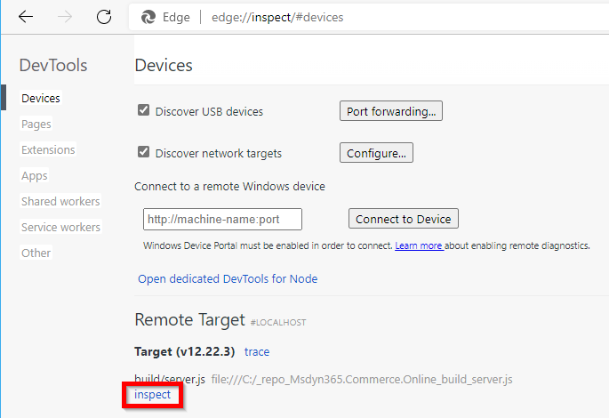
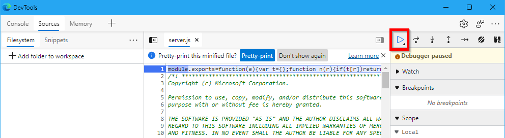
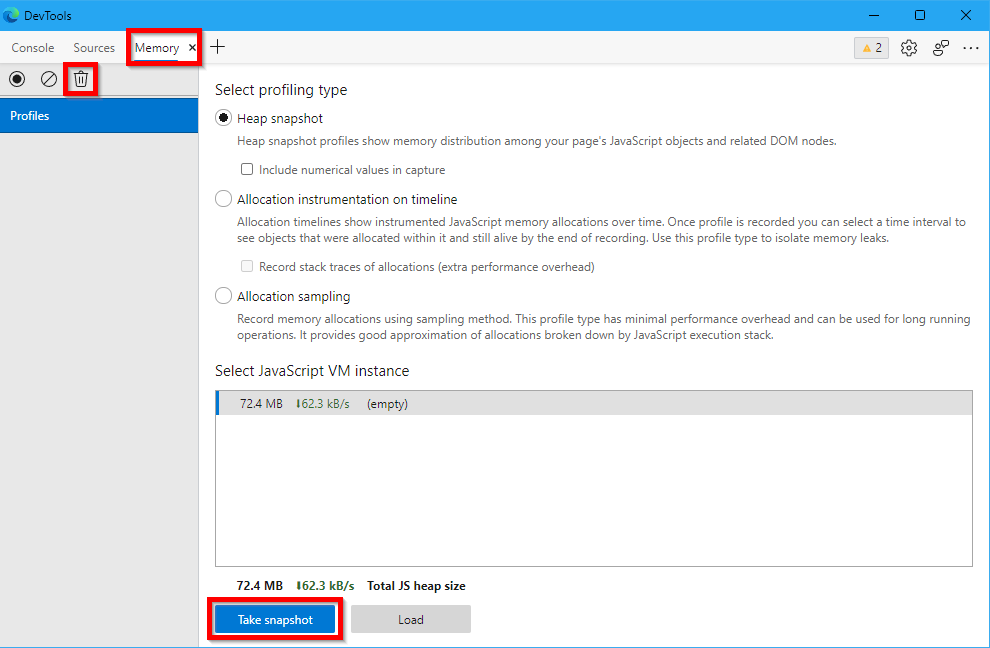

---
# required metadata

title: Test e-commerce pages for memory leaks
description: This topic describes how to test e-commerce pages for custom code memory leaks in Microsoft Dynamics 365 Commerce. 
author: samjarawan
ms.date: 11/15/2021
ms.topic: article
ms.prod: 
ms.technology: 

# optional metadata

# ms.search.form: 
audience: Developer
# ms.devlang: 
ms.reviewer: v-chgri
# ms.tgt_pltfrm: 
ms.custom: 
ms.assetid: 
ms.search.region: Global
# ms.search.industry: 
ms.author: samjar
ms.search.validFrom: 2019-10-31
ms.dyn365.ops.version: Release 10.0.5

---
# Test e-commerce pages for memory leaks

[!include [banner](../includes/banner.md)]

This topic describes how to test e-commerce pages for custom code memory leaks in Microsoft Dynamics 365 Commerce.

Memory leak tests can be done on a mock page to ensure that custom e-commerce module and data action code running on the page do not leak memory.

The following steps outline the approach to generate heap snapshots of an e-commerce page to detect memory leaks. The process includes establishing a baseline, adding a request load to the page, and then running the garbage collection and ensuring that all memory is freed up back to the baseline size.

### Create a page mock that represents the e-commerce page you want to test.  

For instructions on how to create a custom page mock that includes modules you want to test, or how to save a live e-commerce page as a page mock using the **?item=nodeserviceproxy:true** query string parameter, see [Test modules by using page mocks](test-page-mock.md).

### Build production code

To build production code in PROD mode within the online SDK root folder, run the following command:

```Console
yarn build:prod
```

### Run the Node server in debug mode

To run the Node server in debug mode, run the following command:

```Console
node --inspect-brk build/server.js
```

### Open browser inspect tool

Open a browser and navigate to the browser inspect tool. For example, to load the browser inspect tool in Microsoft Edge navigate to 'edge://inspect/#devices' then select the **inspect** link after the "build/server.js" path appears under the **Remote Target** section as shown in the following example image. This link can take up to 30 seconds to appear.



A **DevTools** windows should open up with the debugger in a paused state. To run the code, select **Resume script execution** as shown in the following example image.



### Establish a server startup heap memory baseline

To take a baseline heap memory snapshot after server startup, select the **Memory** tab, select the "Collect garbage" symbol to run the garbage collection, and then select **Take snapshot** as shown in the following example image.



### Take a memory snapshot for a page

To take a memory snapshot for a page, open a new browser window and navigate to the page mock you are testing. For example, for a page mock with the file name "my-test-page.json", you would use the following URL: `https://localhost:4000/page?mock=my-test-page`. Perform the garbage collection and then take another snapshot at this stage. This will be your baseline memory usage for the page being tested.

> [!NOTE]
> All page requests involve some level of caching, so it is expected that the memory usage will be increased slightly.

### Test for memory leaks

At this stage benchmarking load tools can be used to create more URL hits to the page being tested. Next, select the garbage collector and take another heap snapshot. Outside of some data load for caching, memory usage should come down to the baseline of the page obtained from the previous step. This testing can be repeated several times to ensure that memory usage is decreasing. If memory usage is not decreasing, it may be due to objects that cannot be garbage collected, and in this case you will see the heap grow after each run. Your custom code can then be examined for any memory leaks causing this issue.

