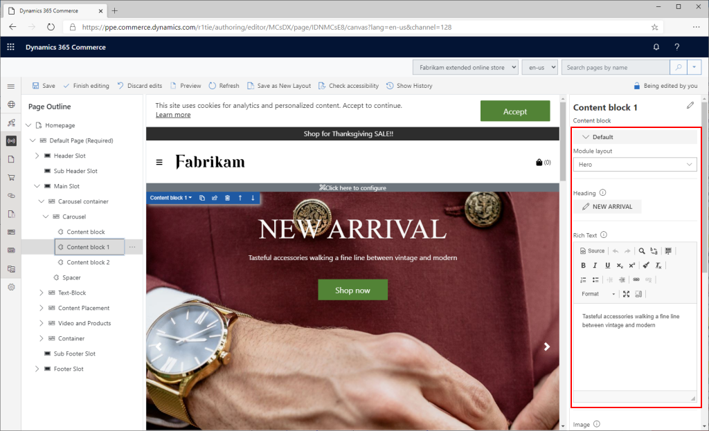

---
# required metadata

title: Module configuration fields
description: Configurations fields can be added to a module that will be presented to page authors giving them control of various module features.  
author: SamJarawan
manager: annbe
ms.date: 08/30/2019
ms.topic: article
ms.prod: 
ms.service: Dynamics365Operations
ms.technology: 

# optional metadata

# ms.search.form: 
audience: Developer
# ms.devlang: 
ms.reviewer: josaw
ms.search.scope: Retail, Core, Operations
# ms.tgt_pltfrm: 
ms.custom: 
ms.assetid: 
ms.search.region: Global
# ms.search.industry: 
ms.author: SamJar
ms.search.validFrom: 2019-08-30
ms.dyn365.ops.version: 

---
# Module configuration fields

Configurations fields can be added to a module that will be presented to page authors giving them control of various module features.  These features can be layout properties such as different views, alignment properties, boolean switches to turn features on or off, a module title or heading, rich text description, call to action link, image URLs or Dynamics 365 Retail product data.

Below is a screen shot of how these fields show up in the page authoring tools.



## Adding new module configuration fields
Adding configuration fields is done with an entry in the `config` section of the module definition file.

### Example
In the below module definition file `MODULE_NAME.definition.json` a configuration field **imageAlignment**  has been added to allow configuration of the image alignment inside a module. We’ll have two enum options: “Left” which will be the default and “Right”.

```
{
    "$type": "contentModule",
    "friendlyName": "Product Feature",
    "name": "productFeature",
    "description": "Feature module used to highlight a product.",
    "categories": ["marketing"],
    "tags": ["feature"],
    "module": {
        "view": "./productFeature"
    },
    "config": {
        "imageAlignment": {
            "friendlyName": "Image Alignment",
            "description": "Sets the desired alignment of the image, either left or right on the text.",
            "type": "string",
            "enum": {
                "left": "Left",
                "right": "Right"
            },
            "default": "left",
            "group": "Layout Properties"
        }
    }
}
```

## Module Config Schema
The module "config" section contains a list of all the modules exposed configuration fields that will be used in the authoring tool.
* config name:
    * Choose a name that will be used to access the config values from your react source code
* "friendlyName":
    * This name will show up in authoring tools as the configuration name
* "description":
    * This description will show up in authoring tools as the configuration description
* "type":
    * Type of the configuration.  Possible values “string”, “bool”, “number”, “integer”, “resource” , “richText”, “image”, “imageSettings”, “video” or “array”.  Type "resource" will not show up in authoring tool, but will allow the string to be localized.
* "enum":
    * For an enumerator type must be set to "string".
* "default":
    * Used to set the default value if none is set in the authoring tool.
* "scope":
    * Used to scope the config to the a module instance or all modules site on the site.  Possible values "module" or "site".  If set to the site, the module configuration will not show up and be configurable on a page, only at the site level settings. This will allow the value to be set once for your whole site.
* "group":
    * Groups are used to organize the configurations into organized groups in the authoring tools.
* "required":
    * This marks if a property must be set on the module.  The rendering of the module and tooling will show an error if this is not set.
* "resourceKey":
    * Used for localization resources. 
    
Below is an advanced sample that shows the usage of various supported data types:
```
{
  "$type": "contentModule",
  "friendlyName": "Sample Config",
  "name": "sample-config",
  "description": "Sample Config",
  "categories": ["sample-config"],
  "tags": ["samples"],
  "module": {
      "view": "./sample-config",
      "dataActions": {}
  },
  "config": {
      "showText": {
          "friendlyName": "showText",
          "description": "example config value",
          "type": "string",
          "default": "Example Config Value",
          "scope": "module",
          "group": "Layout Properties"
      },
      "subTitle": {
        "type": "richText",
        "friendlyName": "SubTitle",
        "description": "Sub title rich text field"
      },
      "bgImage": {
          "type": "image",
          "friendlyName": "Background image",
          "description": "Background image"
      },
      "images": {
          "type": "array",
          "friendlyName": "Images",
          "description": "Image Array",
          "items": {
              "type": "image"
          }
      },
      "backgroundImageSettings": {
          "friendlyName": "Background Image Settings",
          "description": "Image settings for background iamge settings",
          "type": "imageSettings"
      },
      "ambientVideo": {
          "friendlyName": "Ambient Video",
          "description": "Ambient Video",
          "type": "video"
      },
      "headingArray":{
          "type": "array",
          "friendlyName": "Heading Array",
          "description": "Heading Array",
          "items": {
              "$ref": "#/definitions/heading"
          }
      },
      "heading":{
          "$ref": "#/definitions/heading"
      },
      "heading2":{
          "type": "object",
          "friendlyName": "Heading2",
          "description": "Heading2 property with its own enum",
          "properties": {
              "style": {
                  "type": "string",
                  "enum": {
                      "bold": "Bold",
                      "underline": "Underline",
                      "italics": "Italics",
                      "strong": "Strong",
                      "emphasized": "Emphasized",
                      "none": "None"
                  },
                  "friendlyName": "Style",
                  "description": "Heading style"
              }
          }
      }
  },
  "definitions": {
      "heading": {
          "type": "object",
          "friendlyName": "Heading",
          "description": "Heading property",
          "properties": {
              "text": {
                  "type": "string",
                  "friendlyName": "Text",
                  "description": "Heading Text"
              },
              "style": {
                  "type": "string",
                  "enum": {
                      "bold": "Bold",
                      "underline": "Underline",
                      "none": "None"
                  },
                  "friendlyName": "Style",
                  "description": "Heading style"
              },
              "showImage":{
                  "type":"boolean",
                  "friendlyName": "Show Image?",
                  "description": "Should Show Image"
              },
              "bgImage": {
                  "type": "image",
                  "friendlyName": "Background image",
                  "description": "Background image"
              },
              "imageArray":{
                  "type": "array",
                  "friendlyName": "Images",
                  "description": "Image Array",
                  "items": {
                      "type": "image"
                  }
              }
          }
      }
  }
}
```

### Local testing configuration fields with mock data

The below example shows how to set a Mock value for the new configuration field in the `mocks/MODULE_NAME.json` file.  This will help when rendering the module in a local development environment.

```
{
  "id": "R1Module1",
  "config": {
    "imageAlignment": "left",
    "productTitle": "Men's Grand Wing Tip Shoe",
    "productDetails": "Full genuine leather with a classic design.",
    "buttonText": "Buy Now",
  },
  "typeName": "productFeature"
}
```

### Accessing the configuration fields within the module React component
To access configuration fields in the React component, use the `props.config` API.

Below sample code uses an **if** statement to check the new imageAlignment config field and renders the appropriate HTML.

```typescript
import * as React from 'react';

import { IProductFeatureData } from './productFeature.data';
import { imageAlignment, IProductFeatureProps } from './productFeature.props.autogenerated';

/**
 *
 * productFeature component
 * @extends {React.PureComponent<IProductFeatureProps<IProductFeatureData>>}
 */
class ProductFeature extends React.PureComponent <IProductFeatureProps<IProductFeatureData>> {

    public render(): JSX.Element {
        const { config } = this.props;

        // set default product info values from config values if available
        const productName = config.productTitle ? config.productTitle : 'No product name defined';
        const productInfo = config.productDetails ? config.productDetails.toString() : 'No product details defined';
        const productImageUrl = config.productImage ? config.productImage.src : '';
        const buttonInfo = config.buttonText ? config.buttonText : 'No button text defined';
        let left;
        let right;

        if (config.imageAlignment === imageAlignment.left) {
            left = this._renderImage(productImageUrl, productName);
            right = this._renderInfo(productName, productInfo, buttonInfo);
        } else {
            right = this._renderImage(productImageUrl, productName);
            left = this._renderInfo(productName, productInfo, buttonInfo);
        }

        return (
            <div className='row align-items-center'>
                <div className='col-sm-6'>
                    {left}
                </div>
                <div className='col-sm-6'>
                    {right}
                </div>
            </div>
        );
    }

    private _renderImage(productImageUrl: string, productName: string): JSX.Element {
        return ;
    }

    private _renderInfo(productName: string, productInfo: string, buttonInfo: string): JSX.Element {
        return (
            <div className='container'>
                <h2>{productName}</h2>
                <p>{productInfo}</p>
                <button type='button' className='btn btn-primary' onClick={this._buttonClick}>{buttonInfo}</button>
            </div>
        );
    }

    private _buttonClick = (): void => {
        window.location.href = 'https://www.bing.com';
    }
}

export default ProductFeature;
```
