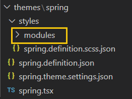
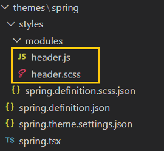
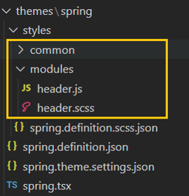
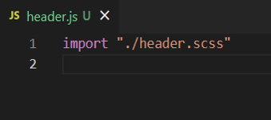
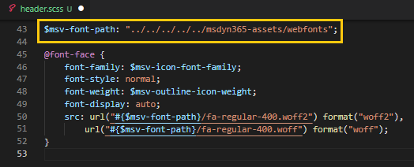

---
# required metadata

title: Module CSS optimization
description: This topic presents instructions on leveraging the module CSS optimization feature to help reduce the overall CSS bundle size of an e-commerce page, leading to improved page performance.
author: samjarawan
ms.date: 11/20/2020
ms.topic: overview
ms.prod: 
ms.technology: 

# optional metadata

# ms.search.form: 
audience: Developer
# ms.devlang: 
ms.reviewer: v-chgri
# ms.tgt_pltfrm: 

ms.assetid: 
ms.search.region: Global
# ms.search.industry: 
ms.author: samjar
ms.search.validFrom: 2019-10-31
ms.dyn365.ops.version: Release 10.0.5

---
# Module CSS optimization

[!include [banner](../includes/banner.md)]

This topic presents instructions on leveraging the module CSS optimization feature to help reduce the overall CSS bundle size of an e-commerce page, leading to improved page performance.

By default, a theme bundles all module CSS in a single file within the theme styles directory named THEME_NAME.theme.scss file, where THEME_NAME is the name of your theme. The online SDK injects the theme CSS static file from CDN on every rendered e-commerce page, since the single THEME_NAME.theme.scss file contains CSS from all modules, there can be a good amount of unused CSS on a page that only uses a subset of available modules. The module CSS optimization feature adds support to split CSS per module and only dynamically inject the module CSS relevant to the rendered e-commerce.
 
## Prerequisites
To enable module CSS optimization feature ensure the following pre requisites are met:

* Using Online SDK version 1.35.17 or newer.
* Webpack 5 is required for this feature to work, upgrade your SDK code to Webpack 5 using the **upgrade-webpack** CLI: ```yarn msdyn365 upgrade-webpack```.
* If you are using the Fabrikam reference theme (Fabrikam-design-kit), module CSS support will be added release 9.36 (10.0.26) or newer.
 
## Enable module CSS optimization
Module CSS optimization is an opt in feature and can be enabled by adding the **ModuleCssOptimization** property to the **src/settings/platform.setings.json** file as shown below:

```json
{
    "enableModuleCssOptimization": true
}
```

### Configure theme styles to enable module CSS optimization for individual modules
 
Each theme contains a **styles** folder where all of the theme CSS files reside.  Module specific styles need to be included in a new **modules** directory within the styles folder as shown below:



Note : For configuring `RTL` specific styles, you can add all RTL specific module styles in the styles/**modules-rtl** directory.
 
Each module that you would like to enable CSS optimization on will require two files added to the **modules** directory: MODULE_NAME.scss and MODULE_NAME.js, where MODULE_NAME matches the name property within the module definition file (MODULE_NAME.definition.json).  The below example shows the two files needed to enable CSS optimization on the "header" module:
 

 
The MODULE_NAME.scss file contains all styles needed for the individual module as shown in the below example:


The MODULE_NAME.js file is the entry file for creation of the module CSS chunks and contains a single line to import the CSS file as shown in the below example:

 
 
## Configuring assets in CSS for use with module CSS optimization:
 
By default, all the assets are stored in root level public directory as shown below.

  
 
To leverage assets within the module CSS optimization files they must be stored in the **public/msdyn365-assets** folder as shown below:

  
  
Assets should then be imported from msdyn365-assets folder within your SCSS files using a relative path **"../../../../../msdyn365-assets/"** folder as shown in the below example:

 

## CSS compilation errors:
Webpack is used to compile and build the module CSS chunks and only shows CSS compilation errors when building the project in production mode. The project can be built in production mode using the **yarn build:prod** command. CSS compliation errors can be found in a generated **stats-client-build-errors.json** file at the root SDK level.

## Best practices for configuring module CSS styles:
 
* Avoid Importing module-A styles into module-B styles as its an anti-pattern and it defeats the purpose of creating smaller CSS chunks. Rather, module-A should only have styles related to module-A and module-B styles should only have styles for module-B.
* Avoid importing index.scss file in the MODULE_NAME.scss, only import if all the styles imports from index.scss are used by your module.
* Component styles that are used by one or more modules can be imported in the MODULE_NAME.js.  For example if module-A and module-B use common button component styles, they can both import the component as shown in the below example:

module-A.js
```js
import "./module-A"
import "../common/03-components/button.scss"
```

module-B.js
```js
import "./module-B"
import "../common/03-components/button.scss"
``` 

With this approach, SDK will create common CSS chunks which will be help in keep individual module CSS chunks small.
 
