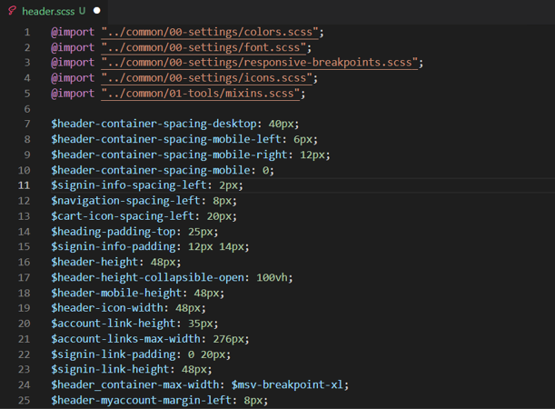

# Module CSS optimization

[!include [banner](../includes/banner.md)]

This article describes how to use the module Cascading Style Sheets (CSS) optimization feature in Microsoft Dynamics 365 Commerce to help reduce the overall CSS bundle size of an e-commerce page and improve page performance.

By default, a theme bundles all module CSS code into a single static file in the theme styles directory. This file is named **\<THEME\_NAME\>.theme.scss file**, where **\<THEME\_NAME\>** is the name of the theme. The online software development kit (SDK) then injects this single theme CSS file from the content delivery network (CDN) into every e-commerce page that is rendered.

Because the single **\<THEME\_NAME\>.theme.scss** file contains CSS code from all modules, a non-trivial amount of unused CSS code can be injected into pages that use only a subset of available modules. The module CSS optimization feature adds support for splitting CSS code per module and dynamically injecting only the module CSS code that is relevant to each rendered e-commerce page.

## Prerequisites

To enable the module CSS optimization feature, the following prerequisites must be met:

- Online SDK version 1.35.17 or later is required.
- Webpack 5 is required for the feature to work. Upgrade your SDK code to Webpack 5 by using the **upgrade-webpack** command-line interface (CLI) command: `yarn msdyn365 upgrade-webpack`.
- If you're using the Fabrikam reference theme (Fabrikam-design-kit), module CSS support will be added to release 9.36 (Commerce version 10.0.26 release) and later.

## Enable module CSS optimization

Module CSS optimization is an opt-in feature that you can enable by adding the **enableModuleCssOptimization** property to the **src/settings/platform.setings.json** file, as shown in the following example.

```json
{
    "enableModuleCssOptimization": true
}
```

### Configure theme styles to enable module CSS optimization for individual modules

Each theme contains a **styles** folder where all the theme CSS files reside. Module-specific styles must be included in a new **modules** directory inside the **styles** folder.

> [!NOTE]
> When you configure right-to-left (RTL) styles, add all RTL-specific module styles to the **styles/modules-rtl** directory.

For each module that you want to enable CSS optimization for, you must add two files to the **modules** directory: **\<MODULE\_NAME\>.scss** and **\<MODULE\_NAME\>.js**, where **\<MODULE\_NAME\>** matches the name property in the module definition file (**\<MODULE\_NAME\>.definition.json**). For example, for the header module, the two files will be named **header.js** and **header.scss**.

The **\<MODULE\_NAME\>.scss** file contains all styles that are required for the individual module, as shown in the following example for a header module.



The **\<MODULE\_NAME\>.js** file is the entry file for creating the module CSS chunks. It contains a single line to import the CSS file, as shown in the following example.

```javascript
import "./header.scss"
```

> [!NOTE]
> SDK Release 1.39 includes an [optimize-module-css CLI command](cli-command-reference.md#optimize-module-css) to help create the required file structure for an existing theme.

## Configure assets in CSS for use with module CSS optimization

By default, all the assets are stored in the root-level **public** directory (for example **public/images**). To be used in the module CSS optimization files, the assets must be stored in the **public/msdyn365-assets** directory (for example **public/msdyn365-assets/images**). The assets should then be imported from the **msdyn365-assets** directory into Sassy CSS (SCSS) files by using the relative path **../../../../../msdyn365-assets/**, as shown in the following example.

```SCSS
$msv-font-path: ../../../../../msdyn365-assets/webfonts
```

## CSS compilation errors

Webpack 5 is used to compile and build the module CSS chunks. It shows CSS compilation errors only when the project is built in production mode by using the **yarn build:prod** CLI command. CSS compilation errors can be found in a **stats-client-build-errors.json** file that is generated at the root SDK level.

## Best practices for configuring module CSS styles

The following best practices for configuring module CSS styles use module A and module B to represent two different modules.

- Avoid importing module A styles into module B styles, because this approach defeats the purpose of creating smaller CSS chunks. Instead, module A styles should have only styles that are related to module A, and module B styles should have only styles that are related to module B.
- Avoid importing the **index.scss** file into the **\<MODULE\_NAME\>.scss** file. Import the **index.scss** file only if the module uses all the styles that will be imported from the file.
- Component styles that are used by one or more modules can be imported into the **\<MODULE\_NAME\>.js** file. For example, if module A and module B use common button component styles, they can both import the component as shown in the following examples.

    **module-A.js**

    ```js
    import "./module-A"
    import "../common/03-components/button.scss"
    ```

    **module-B.js**

    ```js
    import "./module-B"
    import "../common/03-components/button.scss"
    ``` 

    When this approach is used, the SDK will create common CSS chunks that will help keep individual module CSS chunks small.
