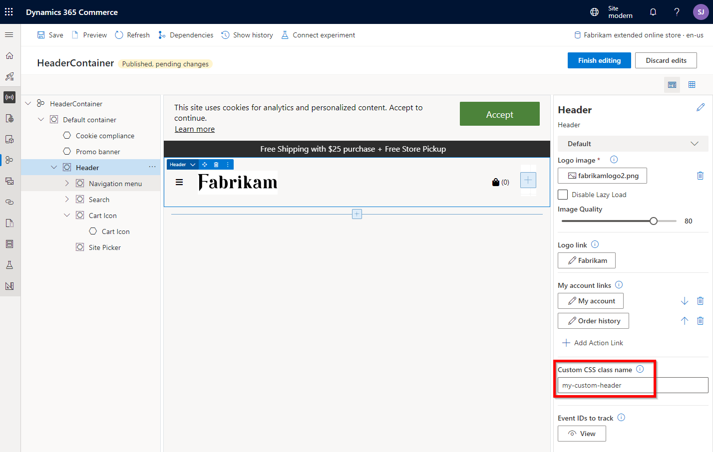

---
# required metadata

title: Modules overview
description: This topic provides an overview of module development including a best practices for when and how to extend a module's style and/or features.
author: samjarawan
manager: annbe
ms.date: 10/01/2019
ms.topic: article
ms.prod: 
ms.service: dynamics-365-commerce
ms.technology: 

# optional metadata

# ms.search.form: 
audience: Developer
# ms.devlang: 
ms.reviewer: v-chgri
ms.search.scope: Retail, Core, Operations
# ms.tgt_pltfrm: 
ms.custom: 
ms.assetid: 
ms.search.region: Global
# ms.search.industry: 
ms.author: samjar
ms.search.validFrom: 2019-10-31
ms.dyn365.ops.version: Release 10.0.5

---
# Modules overview

[!include [banner](../includes/banner.md)]

This topic provides an overview of module development including a best practices for when and how to extend a module's style and/or features.

## Modules

Modules represent the core building blocks that make up an online e-Commerce page. Here are some examples of modules:

* A content block module that is featured on a page, and that shows a product image and description, together with a "call-to-action" button that can be used to purchase the product or get more information about it
* A promo banner module that highlights a promotion as a banner on a page
* A header module that is made up of smaller module components, such as a search module, a sign-in module, and a navigation module
* A script module that injects JavaScript inside of the HTML on a page

## Anatomy of a module
Modules are built using React components and are made up of various files, see the below list for an overview of each file.
* [Module definition file](module-definition-file.md)
* [Module React component file](module-react-file.md)
* [Module view file](module-view-file.md)
* [Module data file](module-data-file.md)
* [Module mock file](module-mock-file.md)
* [Module test file](module-test-file.md)
* [Module props.autogenerated.ts file](module-props-autogenerated-ts-file.md)

## Store starter kit modules
Microsoft Dynamics 365 Commerce provides a [store starter kit](../starter-kit-overview.md) set of modules to use when building your online e-Commerce pages.  Some CSS for each module can be changed using [style presets](../style-presets.md) and/or [CSS overrides](../css-override-files.md) inside of the site builder without any code changes.  The online SDK can be used to make custom theme changes to change the CSS or even extend a module's view to change the rendered HTML layout. If deeper changes are needed to a module such as business logic then a starter kit module can also be cloned into a new custom module for deeper changes if needed.  More details are provided below as to which option is best for various requirements.

To see how a site builder page builder interacts with modules see the [Work with modules](../work-with-modules.md) document.

## Get started with module development
The store starter kit provides a broad set of modules for use on your online site, however you may have requirements that will require some module or theme customization. Module and theme customization requires the use of the Online SDK (software development kit) inside of a development environment.

To get started you will need to install a set of tools and the Dynamics 365 Commerce Online SDK (software development kit).  See the [Set up a development environment](setup-dev-environment.md) for step by step instructions to set up a dev environment and create your first custom module.

## Starter kit module customization options
There are several different levels of module customizations available from overriding module CSS in the site builder tool, extending a store starter kit module's view, cloning a store starter kit module or creating a new custom module. It's important to pick the right option for your needs.  For example if you choose to clone a module, you are making a brand new copy of the module and will no longer get updates to the code if the store starter kit module is updated.  You will have to update those modules manually if required.  So cloning should only be used if absolutely necessary.  The below reference should help in picking the right solution for your requirements.

### Style changes
If you have a scenario where a store starter kit module does everything you need but you want to change the module look and feel, this can usually be done with CSS changes.  CSS changes will even allow you to hide unwanted elements in a module if desired.  The site **theme** contains the CSS for all modules in SCSS files.  In some cases you can make CSS changes directly in the site builder tool which would not require any module or theme customizations at all.  The first two options below do not require the use of the Online SDK and are the easiest/fastest way to make CSS changes to a module.

#### Style presets
A [style preset](../style-presets.md) is a stored set of all authorable style values across a site's theme. It can be used to immediately change the look of a site from site builder. Style presets can be access from with the site builder tool by selecting the **Design** tab.  There are both global and module specific styles that can be modified.  The following image shows the style presets available on **Promo banner** module, notice an example is the modules **Background** color.  When changed the new color will be used for all instances of the module on the site.


When making CSS changes to a module the first thing to check is can it be done with using the custom [style preset](../style-presets.md) option in the site builder tool.  Each module has the ability to surface some style options that can be changed in the style preset UI in the site builder tool as shown above.  This allows simple changes for some CSS within a module including background color, text color and text size.  Note, this option is only available with version 10.0.12 release of the store starter kit and is limited to a specific set of options for each starter kit module.

A current limitation is that style changes are globally scoped, meaning that module changes made will be reflected on all pages that leverage the module.  So if you set a background color on a module, the color will be used on all pages that use that module.  If you have a need to only change the style of a module on a single page and not others, you may want to consider CSS overrides (covered below) or adding new custom configurations to an existing module using module definition extensions (covered below).

If you are building custom modules, you can expose style presets for site authors to use, see the [Configure theme style presets](theme-style-presets.md) document for more information. 

#### CSS override file
A [CSS override file](../css-override-files.md) can be uploaded inside of the site builder tool.  This file contains additional CSS to change any style on a page as needed.  When an e-Commerce page is rendered, after the theme module CSS is applied, the overrides file is then applied and will override the specific CSS for that module.  This is great for fast experimentation against the live site and can easily be removed if not needed.

In general, if you can use tools such as a modern browser's HTML/CSS debugging tools, and can modify the CSS to your liking, you can then copy those changes into a single CSS override file. 

For example, if you wanted to hide the wishlist icon in the **Header** module, first you may notice the module does not have a configuration setting to turn this on or off, but you can use CSS to hide the element.  By using the F12 web browser tools, you can find the CSS class name to use and play with CSS until you get what you desire. Below is a CSS example to hide wishlist link in the **Header** module.

```CSS
a.msc-wishlist-icon.ms-header__wishlist-desktop.msc-btn {
    visibility: hidden;
}
```

The above CSS can be saved in a text file and uploaded with the site builder tool, see the [CSS override file](../css-override-files.md) documentation for more information.

If you need to target a change to just a single (or a few but not all) instance(s) of module, you can add a custom CSS class name to the instance of the module from within the site builder.  In the below example after publishing the change, if you examine the HTML generated for the page instance you will see the new class name is added to the HTML on the page.



#### Theme changes
If your CSS changes are more involved or you want to make the changes permanent, the next level of customization is making changes to the site theme using the Online SDK.  The site theme contains all of the CSS the modules require using SCSS files.  By default the **fabrikam** starter theme is provided and can be used for your online site, however it is generally advisable to create a new custom theme.  Creating a custom theme is easy and you can even **clone** the fabrikam theme to make a copy as a start to your own theme.  See the [Theming overview](theming.md) document for more information.  

If you are hosting multiple sites in a single Dynamics 365 Commerce instance you can create as many themes as needed.  You can even create a base theme that other themes inherit from to minimize common changes across themes.  See the [Extend a theme from a base theme](extend-theme.md) document for more information.

Not only does a theme allow you to customize the module CSS, it also supports extending module views and definitions, see below for more information.

##### Create a new theme
To create a new theme see the [Create a new theme](create-theme.md) document for details.  Creating a theme this way will give you a boiler plate theme that is empty and has no SCSS files for the starter kit module.  See the next section if you want to create a new theme that has starter kit styles as a starter.

##### Clone the fabrikam theme
To clone the fabrikam theme as a starter to your own theme follow the below steps:

1. Use the [CLI clone](cli-command-reference.md) command to create a copy of the fabrikam theme.  Example ```yarn msdyn365 clone fabrikam MY_NEW_THEME``` where MY_NEW_THEME is the name of the new theme.
1. The clone command will make a copy of a module and put it under the **/src/modules** directory.  A theme is just a special module that is stored under the **/src/themes** directory.  You'll need to manually copy the new theme from the **src/modules** into the **src/themes** directory.  If no themes directory exists, you can manually create it first.
1. Within the theme directory you will find a file called MY_NEW_THEME.definition.json, where MY_NEW_THEME is the name provided with the clone command in step 1.  This file will list the metadata used in site builder such as the theme friendly name and description.

The last step will be to change the SCSS for any modules that you need.  Each starter kit module SCSS is stored under the themes **/styles/04-modules** directory. There are many other SCSS files that can also be changed if needed, for example under the **//styles/00-settings** you'll find a colors.scss file which contains the common color definitions.

Once a theme is created or modified using the Online SDK, the configuration package can be uploaded via LCS see the [Package configurations and deploy them to an online environment](package-deploy.md) for details.  Once themes are deployed, from within site builder you can change between available themes, see the [Select a site theme](../select-site-theme.md) document for more information.

### Extending a module's view
You may have a requirement that is more involved than CSS changes alone and you may need to change or alter the HTML on a starter kit module.  

An example is you would like to re-order the HTML on the **Buybox** module on the product details page to have the product details show up above the price.  While CSS changes alone might be able to achieve this, by extending the module view you can alter the HTML on the page which could have better performance and behave better across different page sizes. 

Extending a module view can be achieved by overriding a module's view inside of a theme.  Since these changes are scoped to a site theme, changing a sites theme can end up changing the complete look and feel of a module if desired.  An advantage of changing a module view (versus cloning a module) is that over time as the store starter kit modules are updated the updates are still applied.  For example, a starter kit module business logic could be improved over time and the view override will continue to work on the updated starter kit module code.

To extend a module see the [Extend a theme to add module extensions](theme-module-extensions.md) document.  You can find examples of module theme extensions in the starter **fabrikam** theme.  

#### Module definition extensions
Not only can you extend a modules view, but you can also extend a starter kit module definition to add or remove module configurations.  

For example if a store starter kit module has a configuration for a title string you could add an additional sub-title string configuration that can be set in the site builder.

You can also configure additional data actions, slots and resources on a starter kit module.  You can then access these new configurations from within a modules view extension, so in general when you add a theme definition extension you will also extend the module's view.  For more information see the [Theme definitions extensions](theme-module-extensions.md) document.

### Cloning a store starter kit module
If you cannot achieve the desired changes to a starter kit module but would like to use it as a starter you can [clone](clone-starter-module.md) a module.  This may be needed in scenarios where you need to change the business logic coded in the module that is not exposed in the module's view thus a view override won't do what you need.  Cloning will create a new module with a copy of the code from the starter kit module that was cloned and can then be changed as needed.  

Cloning should be a last resort since future updates to a starter kit module will not be picked up by the cloned module automatically.  In this case you will need to decide if any updates are needed in the cloned module and manually added.  To do this after a starter kit module is updated you can create a new clone then diff the code with your cloned module.  

See the [SDK and store starter kit updates](sdk-updates.md) for more information on getting starter kit updates.

### Create a custom module
If you need a feature that is not available in the starter kit set of modules, you can [create a custom module](create-new-module.md).  Creating a custom module is easy and can be done using the [add-module CLI command](cli-command-reference.md). Similar to starter kit modules, SCSS files can be added to the site theme and different themes can optionally change the modules view with a [module view extensions](theme-module-extensions.md) or the module definition can be extended as needed.
